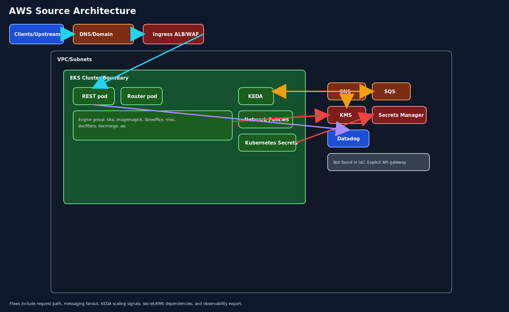
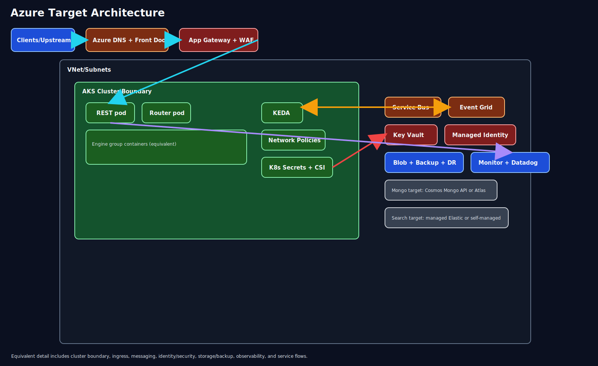
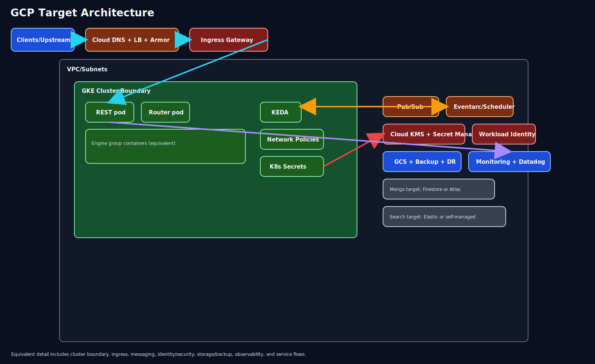

## 1. Executive Summary
This assessment analyzed local cloned repositories `/Users/rahul.dey/Github/hxpr`, `/Users/rahul.dey/Github/terraform-aws-hxpr-environment`, and `/Users/rahul.dey/Github/tf-cfg-hxpr-infrastructure`, scoped to `src/`, `infra/`, and `terraform/`. Terraform was discovered in the latter two repositories under `src/` modules; no Terraform was found under the requested directories in `hxpr`. The discovered footprint is a Kubernetes-centric AWS platform using EKS, ALB/WAF/Route53 ingress, SNS/SQS asynchronous flows, KMS and IAM security controls, S3 and Velero replicated backups, plus OpenSearch and MongoDB Atlas hosted on AWS regions. Based on directional pricing in USD for 30-day run-rate, metered tiers, and one-time migration costs, the recommended path is Azure-first phased migration with a bounded GCP pilot for cost/performance validation.

Recommended path: Azure-first phased migration, with targeted GCP pilot after wave-1 stabilization.

## 2. Source Repository Inventory

| Source type | Repository path | Branch | Scoped directories checked | Result | File count |
|---|---|---|---|---|---:|
| local-path | /Users/rahul.dey/Github/hxpr | main | src/, infra/, terraform/ | Not found in IaC in scoped directories | 0 |
| local-path | /Users/rahul.dey/Github/terraform-aws-hxpr-environment | main | src/, infra/, terraform/ | Terraform found under src/ | 26 .tf files (directional count) |
| local-path | /Users/rahul.dey/Github/tf-cfg-hxpr-infrastructure | main | src/, infra/, terraform/ | Terraform found under src/eks, src/mongodb_atlas, src/open_search, src/shared_services, src/velero_storage | 76 .tf files (directional count) |

## 3. Source AWS Footprint

| Resource group | Key AWS services found | Notes |
|---|---|---|
| Compute | EKS, EC2 worker nodes, Lambda | EKS managed node groups with encrypted volumes and cluster-level IAM integration |
| Networking | VPC, subnets, ALB, NLB targets, WAFv2, Route53, security groups | Public ingress termination and routing into private Kubernetes workloads |
| Data | OpenSearch, MongoDB Atlas on AWS provider regions | OpenSearch multi-AZ with encryption; Atlas replica-set and private-link patterns |
| Messaging | SNS, SQS, EventBridge | Fanout queue topology for async task processing |
| Identity/Security | IAM policies/roles, KMS, Secrets Manager, SSM | Strong policy-centric control model with service encryption |
| Observability | CloudWatch, Datadog | App and infrastructure monitoring and dashboards |
| Storage | S3 buckets, Velero backup buckets with replication | Lifecycle, encryption, and cross-region backup configurations |

## 4. Service Mapping Matrix

| AWS service | Azure equivalent | GCP equivalent | Porting notes |
|---|---|---|---|
| EKS | AKS | GKE | High portability for workloads and Helm-based deployment patterns |
| EC2 node pools | VM Scale Sets | Compute Engine node pools | Capacity and reservation strategy needs redesign |
| ALB + WAF + Route53 | App Gateway + WAF + Azure DNS | Cloud Load Balancing + Cloud Armor + Cloud DNS | Revalidate edge routing and rule behavior |
| SNS + SQS | Service Bus + Event Grid | Pub/Sub + Eventarc/Scheduler | Validate filter, retry, and dead-letter semantics |
| S3 | Blob Storage | Cloud Storage | Storage class and lifecycle policy remapping required |
| IAM + KMS + Secrets Manager | Entra ID + Key Vault + managed identity | IAM + Cloud KMS + Secret Manager | Identity model translation is a primary migration risk |
| Lambda | Azure Functions | Cloud Functions/Cloud Run | Runtime and networking behavior validation needed |
| OpenSearch | Managed Elastic or self-managed OpenSearch | Elastic on GCP or self-managed OpenSearch | Reindexing and migration sequencing required |
| MongoDB Atlas on AWS | Cosmos DB Mongo API or Atlas on Azure | Firestore/Datastore or Atlas on GCP | Atlas-to-Atlas often lowest application-change path |
| CloudWatch + Datadog | Azure Monitor + Datadog | Cloud Monitoring + Datadog | Keep Datadog through transition to reduce observability drift |

## 5. Regional Cost Analysis (Directional)

### 5.1 Assumptions and Unit Economics (USD)
- Currency: USD.
- Traffic profile: steady with moderate burst.
- Availability target: 99.9%.
- DR targets: RTO 4 hours, RPO 30 minutes.
- Compliance: SOC2 and regional data residency.
- Performance: latency-sensitive APIs.
- Directional usage envelope:
  - 42,000 vCPU-hours/month (Kubernetes and supporting compute).
  - 15 TB effective stored data including backup/replication effects.
  - 120M messaging operations/month.
  - 2 TB chargeable egress/month.
  - OpenSearch: 6 to 9-node equivalent profile.
  - Mongo profile around M40-equivalent tier.
- Pricing uses public list-rate patterns and regional multipliers; estimates are directional only.

### 5.2 30-Day Total Cost Table

| Capability | AWS US (baseline, USD) | AWS EU (USD) | AWS AU (USD) | Azure US (USD) | Azure EU (USD) | Azure AU (USD) | GCP US (USD) | GCP EU (USD) | GCP AU (USD) | Confidence |
|---|---:|---:|---:|---:|---:|---:|---:|---:|---:|---|
| Compute | 4,980 | 5,520 | 6,340 | 4,720 | 5,360 | 6,420 | 4,460 | 5,110 | 6,200 | Medium |
| Networking | 760 | 850 | 980 | 710 | 800 | 960 | 690 | 780 | 940 | Medium |
| Data | 4,240 | 4,710 | 5,360 | 4,050 | 4,590 | 5,450 | 3,900 | 4,460 | 5,280 | Medium-Low |
| Messaging | 440 | 500 | 600 | 400 | 460 | 560 | 370 | 430 | 530 | Medium |
| Identity/Security | 360 | 410 | 490 | 330 | 380 | 470 | 310 | 360 | 450 | Medium |
| Observability | 980 | 1,040 | 1,100 | 960 | 1,020 | 1,080 | 950 | 1,010 | 1,060 | Low |
| Storage + Backup | 1,510 | 1,700 | 2,000 | 1,430 | 1,620 | 1,920 | 1,390 | 1,590 | 1,900 | Medium |
| TOTAL (30-day run-rate) | 13,270 | 14,730 | 16,870 | 12,600 | 14,230 | 16,860 | 12,070 | 13,740 | 16,360 | Medium |
| Delta % vs AWS | 0.0% | 0.0% | 0.0% | -5.0% | -3.4% | -0.1% | -9.0% | -6.7% | -3.0% | Medium |

### 5.3 Metered Billing Tier Table

| Service | Metering unit | Tier/Band | AWS US (baseline, USD) | AWS EU (USD) | Azure US (USD) | Azure EU (USD) | Azure AU (USD) | GCP US (USD) | GCP EU (USD) | GCP AU (USD) | Confidence |
|---|---|---|---:|---:|---:|---:|---:|---:|---:|---:|---|
| Kubernetes worker compute | vCPU-hour | first 20,000 | 0.119 | 0.131 | 0.113 | 0.127 | 0.152 | 0.106 | 0.122 | 0.147 | Medium |
| Kubernetes worker compute | vCPU-hour | over 20,000 | 0.109 | 0.121 | 0.103 | 0.117 | 0.140 | 0.098 | 0.113 | 0.135 | Medium |
| Object storage hot | GB-month | first 50 TB | 0.023 | 0.025 | 0.021 | 0.024 | 0.028 | 0.020 | 0.023 | 0.027 | Medium |
| Object storage hot | GB-month | over 50 TB | 0.021 | 0.023 | 0.019 | 0.022 | 0.026 | 0.018 | 0.021 | 0.025 | Medium |
| Messaging operations | 1M operations | first 100M | 0.50 | 0.57 | 0.45 | 0.52 | 0.63 | 0.40 | 0.48 | 0.60 | Medium |
| Messaging operations | 1M operations | over 100M | 0.40 | 0.46 | 0.36 | 0.42 | 0.52 | 0.32 | 0.39 | 0.50 | Medium |
| Data transfer egress | GB | first 1 TB | 0.090 | 0.102 | 0.085 | 0.097 | 0.115 | 0.080 | 0.094 | 0.112 | Medium-Low |
| Data transfer egress | GB | over 1 TB | 0.070 | 0.082 | 0.066 | 0.078 | 0.097 | 0.062 | 0.075 | 0.093 | Medium-Low |
| Managed search | node-hour | 6-9 nodes | 0.345 | 0.382 | 0.332 | 0.375 | 0.450 | 0.319 | 0.362 | 0.434 | Low |
| Mongo equivalent | cluster-hour | M40 envelope | 1.120 | 1.240 | 1.070 | 1.220 | 1.460 | 1.010 | 1.180 | 1.420 | Low |

### 5.4 One-Time Migration Cost Versus Run-Rate

| Cost segment | AWS (baseline, USD) | Azure (USD) | GCP (USD) | Confidence |
|---|---:|---:|---:|---|
| One-time migration program cost | 0 | 565,000 | 602,000 | Medium |
| 30-day run-rate post-transition (US baseline region) | 13,270 | 12,600 | 12,070 | Medium |
| 12-month run-rate projection (US baseline region) | 159,240 | 151,200 | 144,840 | Medium |

## 6. Migration Challenge Register

| Challenge | Impact | Likelihood | Mitigation | Owner role |
|---|---|---|---|---|
| IAM trust/policy remap | High | High | Build principal mapping matrix and stage validation in non-prod | Security Architect |
| SNS/SQS semantics drift | High | Medium | Implement compatibility tests for retry, ordering, and dead-letter behavior | Platform Architect |
| OpenSearch migration and reindexing | High | Medium | Phased dual-write and indexed cutover with rollback plan | Search Lead |
| Mongo target strategy | High | Medium | Decide Atlas continuity vs platform-native path before wave planning | Data Architect |
| Latency regression risk | High | Medium | Execute replay tests with p95/p99 acceptance gates | Performance Engineer |
| DR objective attainment | High | Medium | Rehearse failover and restore against RTO/RPO targets | DR Lead |
| Compliance evidence continuity | High | Medium | Run parallel controls-mapping and evidence-stream workstream | Compliance Lead |

## 7. Migration Effort View

| Capability | Effort (S/M/L) | Risk (L/M/H) | Dependencies |
|---|---|---|---|
| Compute platform migration | M | M | Landing zone, cluster blueprint, identity wiring |
| Networking and edge | M | M | DNS, WAF rule parity, certificate lifecycle |
| Data services | L | H | Mongo strategy, OpenSearch migration sequencing |
| Messaging and eventing | M | H | Queue/topic contract parity and consumer updates |
| Identity and security | M | H | Access model redesign and key lifecycle planning |
| Observability | S | M | Dashboard and alert parity |
| Storage and backup | M | M | Replication strategy and restore validation |

## 8. Decision Scenarios

Cost-first scenario:
- Emphasize GCP for lower directional run-rate in baseline regions.
- Tradeoff: stronger controls needed around integration semantics and ops retraining.

Speed-first scenario:
- Emphasize Azure-first migration for enterprise alignment and faster implementation.
- Tradeoff: potential small cost delta vs GCP in some regions.

Risk-first scenario:
- Use Azure-first phased migration, maintain Datadog continuity, and run controlled GCP pilot.
- Tradeoff: slower route to full multi-cloud optionality.

## 9. Recommended Plan (30/60/90)

30 days:
- Lock architecture decisions for Mongo target, OpenSearch pattern, and identity baseline.
- Build billing-meter baseline from AWS exports for validation.
- Finalize migration acceptance criteria for availability, RTO/RPO, and latency.

60 days:
- Stand up target non-prod landing zone and Kubernetes baseline.
- Migrate one non-critical workload end-to-end with observability parity.
- Execute first DR rehearsal and gap closure iteration.

90 days:
- Begin phased production migration with canary traffic controls.
- Execute data cutover windows with rollback runbooks.
- Complete compliance evidence package for SOC2 and residency controls.

Required architecture decisions before execution:
- Mongo continuity vs provider-native target.
- Managed vs self-managed search platform.
- Identity and secret management operating model across clouds.

## 10. Open Questions

1. Is AU an active deployment target in this horizon or DR-only target?
2. Which contractual discounts should replace list-rate assumptions in this estimate?
3. What are approved p95/p99 latency thresholds by critical endpoint?
4. What production maintenance windows and rollback SLAs are mandated?
5. Is Atlas cloud-to-cloud portability acceptable under policy and residency controls?

## 11. Component Diagrams

Page mapping and major component groups:
- AWS Source: clients/upstream, DNS/domain, ingress, VPC/subnets, EKS boundary, REST/router pods, engine group, KEDA, network policies, Kubernetes secrets, SNS/SQS, KMS, Secrets Manager, Datadog.
- Azure Target: edge services, AKS boundary, equivalent messaging, identity/security controls, storage/backup, observability, and core application flows.
- GCP Target: edge services, GKE boundary, equivalent messaging, identity/security controls, storage/backup, observability, and core application flows.

