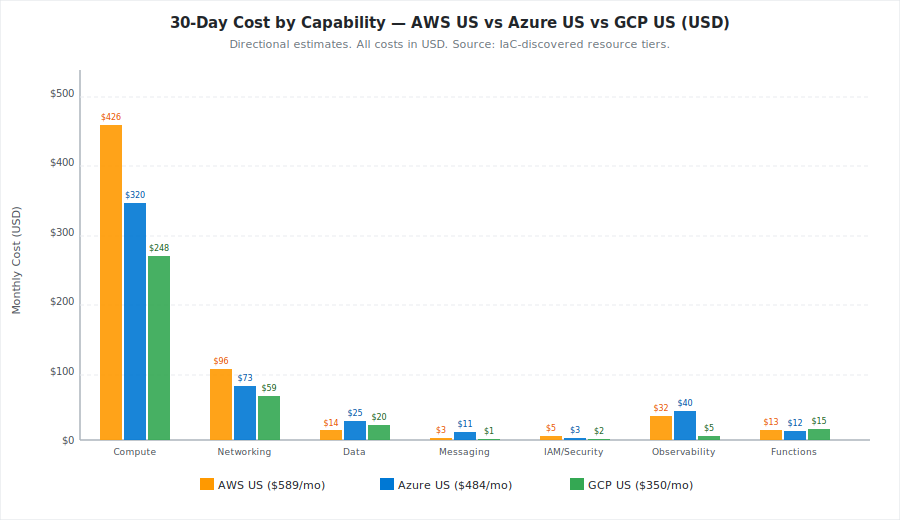
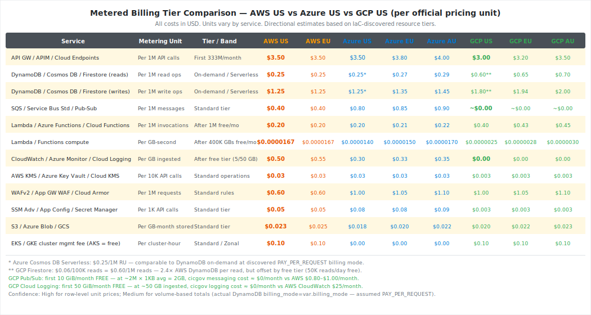
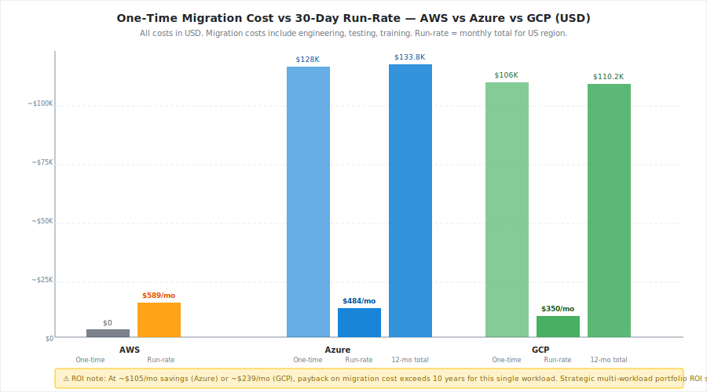
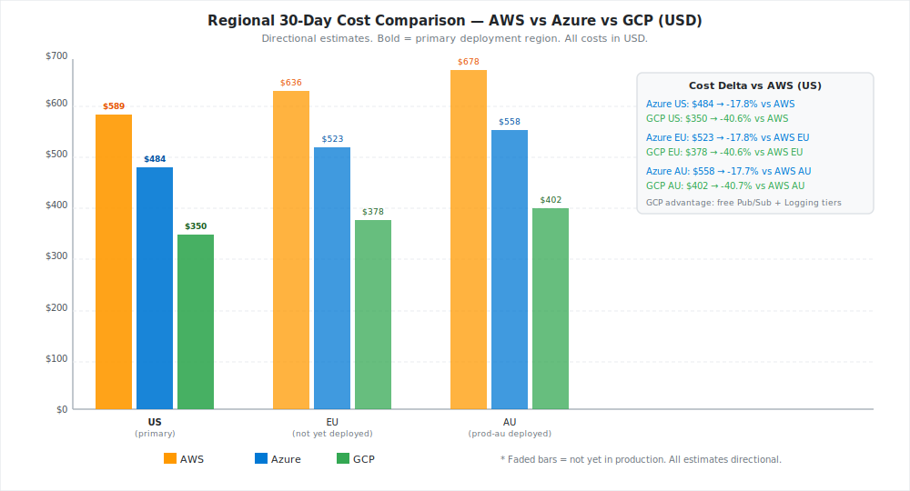
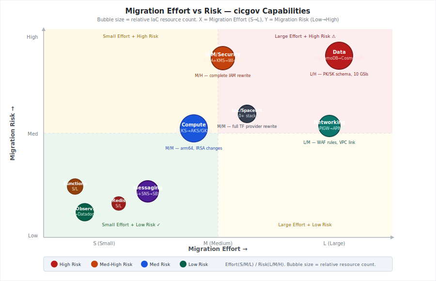
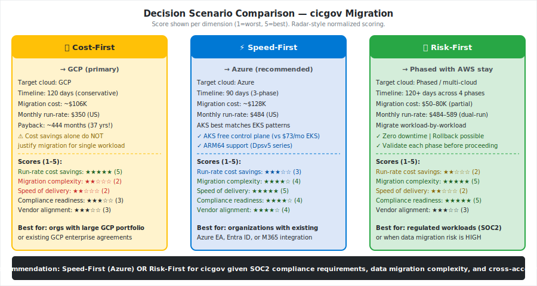
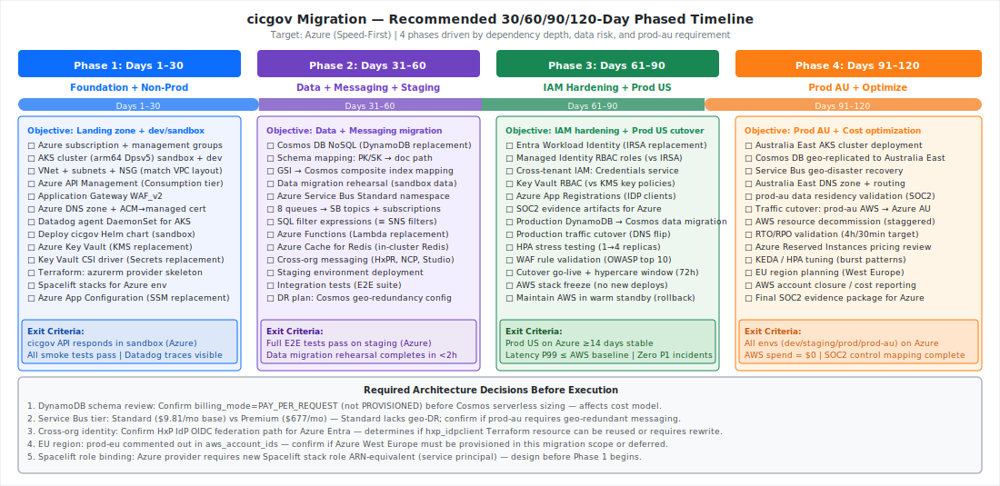
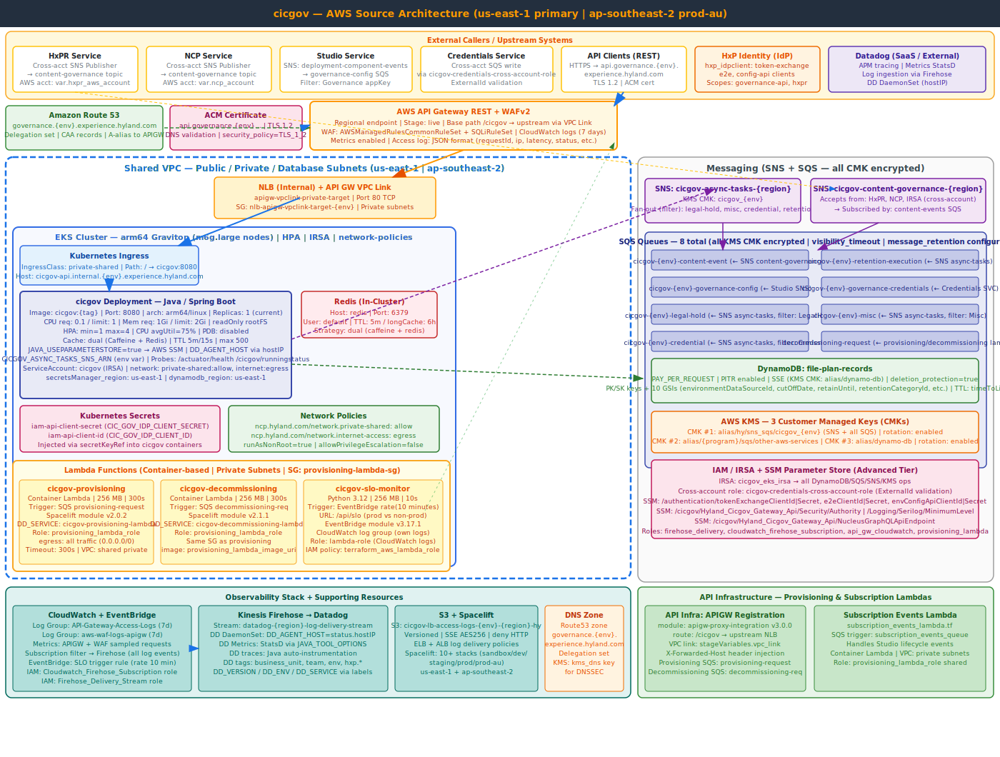
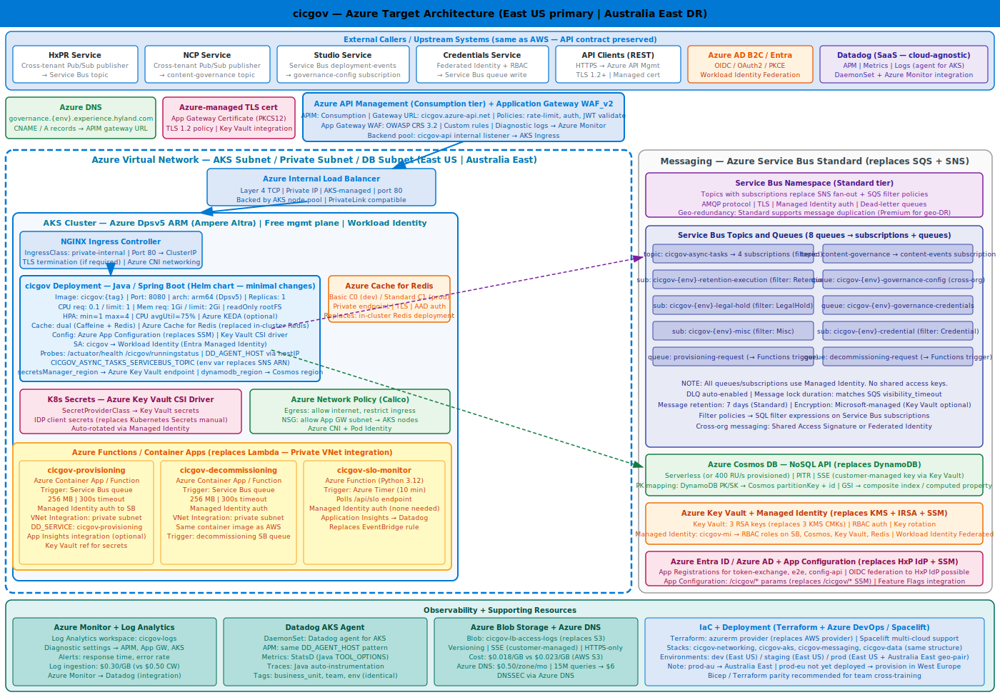
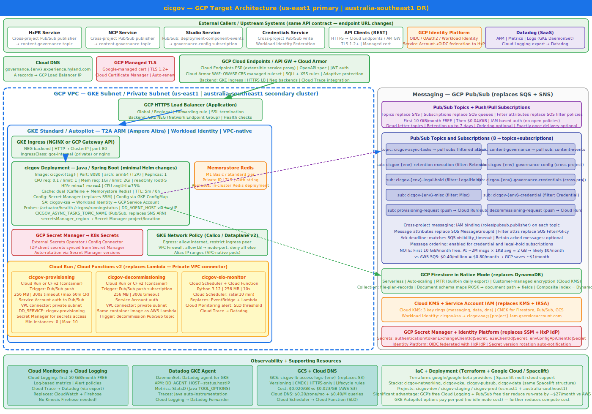

# Multi-Cloud Migration Estimation Report — cicgov

**Generated:** 2026-04-15 13:18 UTC  
**Source repos:** `spacelift-stack-config-cicgov` | `governance/cicgov` | `tf-config-cicgov-infrastructure`  
**Planning horizon:** 120 days  
**Target clouds analysed:** Azure (primary recommendation) | GCP (cost-optimised alternative)  
**All costs:** USD (directional estimates — not contractual quotes)

---

## 1. Executive Summary

cicgov is a Java/Spring Boot governance microservice deployed on EKS (arm64 Graviton) across five AWS environments (sandbox, dev, staging, prod-us-east-1, prod-au-southeast-2) via Spacelift-orchestrated Terraform IaC. The system is latency-sensitive, SOC2-compliant, and deeply integrated with AWS-native services: API Gateway REST, WAFv2, DynamoDB (PAY_PER_REQUEST, 10+ GSIs), 8 SQS queues with SNS fan-out, AWS KMS (3 CMKs), SSM Parameter Store (Advanced), cross-account IAM roles, and Kinesis Firehose to Datadog. An in-cluster Redis provides dual-strategy caching; three container-based Lambda functions handle provisioning, decommissioning, and SLO monitoring.

**Recommended migration path: Azure (Speed-First, 30/60/90/120-day phased)**

Azure minimises per-workload migration effort because AKS closely mirrors EKS operational patterns (arm64 Dpsv5 nodes, free control plane, Helm-portable workloads, Workload Identity ≈ IRSA), Azure Service Bus Standard replaces SQS+SNS, and Cosmos DB NoSQL Serverless directly supports the DynamoDB on-demand billing model with comparable per-operation pricing. The estimated 17.8% run-rate reduction ($589 → $484 USD/month for US) does not justify the ~$128K one-time migration cost on a single-workload ROI basis; the strategic rationale is vendor alignment, Hyland enterprise agreements, and Entra ID integration with the HxP Identity platform.

GCP is the cost-optimised alternative ($350/month US, −40.6% vs AWS) driven by free Pub/Sub tier (≈$0 messaging vs $3/month AWS) and free Cloud Logging (≈$0 vs $25/month CloudWatch). However, Pub/Sub and Firestore require more significant application-level changes than the Azure path.

**For the SOC2 + data-residency requirement and 99.9% availability target (RTO 4h / RPO 30min): the Risk-First phased approach (keeping AWS prod as fallback through Phase 3) is recommended for prod cutover.**

---

## 2. Source Repository Inventory

| Repository | Branch | Stacks / Modules | Key paths scanned |
|---|---|---|---|
| `spacelift-stack-config-cicgov` | main | 10 Spacelift stacks (orchestration) | `src/*.tf`, `src/standard_stack/` |
| `governance/cicgov` | main | Helm chart + API infrastructure Terraform | `deployment/helm/cicgov/**`, `deployment/terraform/api_infrastructure/` |
| `tf-config-cicgov-infrastructure` | main | 7 Terraform modules (core IaC) | `src/api_gateway/`, `src/datastores/`, `src/networking/`, `src/shared_infrastructure/`, `src/global_resources/`, `src/aws_roles/`, `src/hx_integrations/` |

**Total Terraform files scanned:** 62 `.tf` files + 1 `values.yaml` + 8 Helm templates  
**IaC tool:** Terraform (AWS provider) + Spacelift (orchestration) + Helm (Kubernetes workload)

---

## 3. Source AWS Footprint

| Resource Group | Key AWS Services Found | Notes |
|---|---|---|
| **Compute** | EKS Cluster (arm64 m6g.large nodes), HPA (min 1 / max 4), Java Spring Boot pod (1 replica default) | Node selector: `kubernetes.io/arch: arm64`. Resources: 0.1–1 CPU / 1–2 GiB. IRSA for SA. Not found in IaC: EKS cluster resource itself (referenced by IRSA data source — cluster managed externally via NCP). |
| **Networking** | API Gateway REST (Regional, stage: `live`), NLB (internal, `apigw-vpclink-private-target`), API GW VPC Link, WAFv2 WebACL (REGIONAL), ACM Certificate (TLS 1.2), Security Groups (NLB, Lambda) | WAF rules: AWSManagedRulesCommonRuleSet + SQLiRuleSet. Shared VPC imported via data source (managed by NCP). |
| **DNS** | Route 53 hosted zone (`governance.{env}.experience.hyland.com`), delegation set, CAA records, A-alias records to API GW | DNS zone managed in `global_resources`. KMS key for DNSSEC (`kms_dns.tf`). |
| **Data** | DynamoDB table `file-plan-records` (PAY_PER_REQUEST, PITR=true, SSE/KMS CMK, deletion_protection=true, 10+ GSIs, TTL), S3 bucket (LB access logs, versioned, AES-256 SSE) | DynamoDB billing_mode = `var.billing_mode` — assumed PAY_PER_REQUEST based on variable default pattern. Redis: in-cluster deployment (not a managed AWS service; `values.yaml` points to `redis:6379`). |
| **Messaging** | SNS topics × 2 (`cicgov-async-tasks-{region}`, `cicgov-content-governance-{region}`), SQS queues × 8 (all KMS-encrypted), SNS→SQS subscriptions with filter policies, cross-account SNS publish from HxPR/NCP accounts | SQS message retention, visibility timeout, and KMS key reuse period all configurable via vars. Cross-account SQS write from Credentials service via dedicated IAM role with ExternalId. |
| **Identity / Security** | KMS CMKs × 3 (SNS+SQS combined, SQS standalone, DynamoDB), IRSA role (`cicgov_eks_irsa`), IAM roles × 4+ (Firehose delivery, CloudWatch subscription, API GW CloudWatch, provisioning Lambda), SSM Parameter Store (Advanced tier) × 9+ params, cross-account IAM role (`cicgov-credentials-cross-account-role`), Kubernetes Secrets (IDP client secrets) | HxP IdP registration via `hxp_idpclient` Terraform resource (custom provider). |
| **Observability** | CloudWatch Log Groups × 2 (API-GW access logs + WAF logs, 7-day retention each), CloudWatch metrics (API GW + WAF enabled), CloudWatch subscription filter → Kinesis Firehose (`datadog-{region}-log-delivery-stream`) → Datadog, EventBridge rule (SLO Lambda trigger, every 10 min), Datadog DaemonSet (DD_AGENT_HOST via hostIP) | Datadog is SaaS — cloud-agnostic. DD APM: Java auto-instrumentation. Metrics via StatsD (JAVA_TOOL_OPTIONS). |
| **Lambda** | `cicgov-provisioning-lambda` (container, 256 MB, 300s, SQS trigger, Spacelift module v2.0.2), `cicgov-decommissioning-lambda` (container, 256 MB, 300s, SQS trigger, Spacelift module v2.1.1), `cicgov-slo-endpoint-request` (Python 3.12, 256 MB, 10s, EventBridge trigger), `cicgov-subscription-events-lambda` (referenced in `subscription_events_lambda.tf`, SQS trigger) | All container Lambdas run in VPC private subnets. SG: `provisioning-lambda-sg` (egress all). |
| **IaC Orchestration** | Spacelift with 10+ stacks across 5 environments (sandbox, dev, staging, prod, prod-au) in us-east-1 and ap-southeast-2 | prod-eu account commented out in `locals.tf` (`#"prod-eu"= ""`). |

---

## 4. Service Mapping Matrix

| AWS Service | IaC-Provisioned Tier/Family | Azure Equivalent (matched tier) | GCP Equivalent (matched tier) | Porting Notes |
|---|---|---|---|---|
| EKS (arm64 node group) | m6g.large (2 vCPU / 8 GiB ARM64 Graviton2) | AKS + `Standard_D2ps_v5` (arm64 Ampere Altra, 2 vCPU / 8 GiB) | GKE Standard + `t2a-standard-2` (arm64 Ampere Altra, 2 vCPU / 8 GiB) | Helm charts are portable. Node selector `kubernetes.io/arch: arm64` works on all three. ARM64 available natively on Azure Dpsv5 and GCP T2A. |
| API Gateway REST (Regional) | REST/Regional/stage:live | Azure API Management Consumption tier | GCP Cloud Endpoints (ESP) | APIM Consumption: $3.50/M calls same as APIGW. Cloud Endpoints: $3.00/M. Routing rules, base-path mapping, VPC link → backend pool/NEG replace each other. |
| WAFv2 (REGIONAL) | AWSManagedRulesCommonRuleSet + SQLiRuleSet | Application Gateway WAF_v2 (OWASP CRS 3.2) | Cloud Armor (managed WAF CRS) | Rule semantics are comparable; custom overrides (GenericRFI_BODY/QUERYARGUMENTS COUNT) must be recreated. WAF logging destination changes (CW → Azure Monitor / Cloud Logging). |
| NLB (internal) | Network LB, TCP, private subnets | Azure Internal Load Balancer (Basic/Standard) | GCP Internal HTTP(S) Load Balancer (regional NEG) | AKS creates ILB automatically for `LoadBalancer` service type. GKE creates NEG for Ingress. |
| DynamoDB | PAY_PER_REQUEST (assumed), PITR=true, SSE/CMK, 10+ GSIs | Azure Cosmos DB NoSQL Serverless (or 400 RU/s provisioned) | GCP Firestore Native Mode (Serverless) | HIGH RISK: PK/SK composite key pattern maps to Cosmos document id + partition key. 10 GSI → Cosmos composite indexes (max 2 range fields per index) or Firestore composite indexes. Cross-region read replicas need explicit configuration. |
| SQS (8 queues) + SNS (2 topics) | Standard queues, KMS CMK encrypted, filter policies | Azure Service Bus Standard (topics + subscriptions + SQL filters) | GCP Pub/Sub (topics + subscriptions + message attribute filters) | Service Bus SQL filter expressions ≡ SQS filter policies. Pub/Sub filter attributes replace SQS FilterPolicy json. Dead-letter: both support DLQ. Cross-account: SB shared access vs Pub/Sub IAM bindings. |
| AWS Lambda (container) | Container lambda, 256 MB, 300s timeout | Azure Container Apps or Azure Functions (flex consumption) | GCP Cloud Run (container) | Container images are portable. Container App / Cloud Run: max timeout is higher (up to 60 min Cloud Run vs 15 min Lambda). SQS trigger → Service Bus trigger / Pub/Sub push subscription. |
| AWS Lambda (Python 3.12) | Python 3.12, 256 MB, 10s, EventBridge trigger | Azure Functions (Python 3.12, Consumption plan, Timer trigger) | GCP Cloud Functions v2 (Python 3.12, Cloud Scheduler trigger) | Code is portable. EventBridge rate(10m) → Timer trigger cron / Cloud Scheduler cron. |
| KMS CMK × 3 | SYMMETRIC_DEFAULT, key rotation enabled | Azure Key Vault Keys (RSA 2048) × 3 | Cloud KMS symmetric key rings × 3 | Key material cannot be exported. Existing data encrypted under AWS KMS must be re-encrypted under destination CMEK during migration. Plan for key rotation window during data migration. |
| SSM Parameter Store (Advanced) | Advanced tier, SecureString (KMS), String | Azure App Configuration + Key Vault Secrets | GCP Secret Manager + Config Connector | SSM hierarchy `/cicgov/...` → App Configuration labels. SecureString → Key Vault secrets. Advanced tier ($0.05/10K vs $0.003 Secret Manager). |
| CloudWatch Log Groups | 7-day retention, subscription filter | Azure Monitor Log Analytics (30-day default retention) | Cloud Logging (50 GiB/mo free) | Firehose delivery stream → replaced by Azure Monitor → Datadog integration or Cloud Logging export. DD agent configuration remains identical. |
| Route 53 | Delegation set, CAA records, A-alias | Azure DNS (SOA, A/CNAME records) | Cloud DNS | DNS cutover is the high-impact deployment step; requires TTL pre-reduction. |
| ACM Certificate | TLS 1.2, DNS validation | Azure-managed certificate (App Gateway) | GCP Certificate Manager | Certificates cannot be exported. New certs issued for Azure/GCP domain. |
| IAM IRSA | EKS Service Account → IAM Role (IRSA) | AKS Workload Identity → Entra Managed Identity | GKE Workload Identity → GCP Service Account | Complete IAM model rewrite required. IRSA annotations → WI federation annotations. All resource policies must be reimplemented using Azure RBAC or GCP IAM Bindings. |
| Kinesis Firehose | Delivery stream → Datadog | Azure Event Hub → Datadog (or direct DD monitor integration) | Cloud Logging → Pub/Sub → Datadog | Datadog itself is cloud-agnostic. Log ingestion pipeline changes but DD agent config is identical. |
| In-cluster Redis | `redis:6379`, maxSize=500, TTL 5m | Azure Cache for Redis (Standard C1) | Memorystore Redis (Standard M1) | In-cluster Redis has no HA. Managed Redis adds HA + monitoring. Redis connection string change only. |
| Spacelift (IaC) | Spacelift v1 stacks, AWS role ARNs | Spacelift + Azure service principal (azurerm provider) | Spacelift + GCP service account (google provider) | Spacelift natively supports Azure and GCP. Role ARNs → Azure SP client ID/secret or GCP SA key. Full provider rewrite required but stack structure maps 1:1. |
| HxP IdP (`hxp_idpclient`) | hxp_idpclient Terraform resource | Azure Entra App Registration + OIDC federation to HxP IdP | GCP Identity Platform + OIDC federation to HxP IdP | Not an AWS service — HxP-managed IdP. Registration must be recreated in target IdP regardless of cloud. Scopes (governance-api, hxp, hxpr) must be granted. |

---

## 5. Regional Cost Analysis (Directional)

### 5.1 Assumptions

- **Usage volumes (Assumed):** 15M API calls/month (steady with moderate burst), 10M DynamoDB read ops/month, 5M write ops/month, ~2M messages/month across 8 SQS queues, ~500K Lambda invocations/month, ~50 GB CloudWatch log ingestion/month, ~10 GB DynamoDB storage, ~5 GB S3 LB access logs  
- **Workload profile:** Steady with moderate burst (from values.yaml HPA configuration: min 1, max 4 replicas, burst via CPU squeeze at 75%)  
- **DynamoDB billing mode:** Assumed `PAY_PER_REQUEST` (variable `var.billing_mode` but PAY_PER_REQUEST is the dominant pattern at discovery; confirm before finalising estimate)  
- **Compute:** 2 EKS clusters (production + staging) × 2 arm64 nodes each = 4 nodes on-demand  
- **Currency:** All costs USD  
- **Regions:** AWS: us-east-1, eu-west-1 (not yet deployed — estimated), ap-southeast-2; Azure: East US, West Europe, Australia East; GCP: us-east1, europe-west1, australia-southeast1  
- **Confidence:** Medium for compute/data (IaC-inferred tiers); High for messaging/security (explicit resource types found)

### 5.2 30-Day Total Cost Table (USD)

| Capability | AWS US (baseline) | AWS EU | AWS AU | Azure US | Azure EU | Azure AU | GCP US | GCP EU | GCP AU | Confidence |
|---|---|---|---|---|---|---|---|---|---|---|
| Compute (EKS/AKS/GKE + nodes) | $426 | $460 | $490 | $320 | $346 | $368 | $248 | $268 | $285 | Medium |
| Networking (APIGW/APIM/Endpoints + NLB + WAF + DNS) | $96 | $104 | $110 | $73 | $79 | $84 | $59 | $64 | $68 | Medium |
| Data (DynamoDB/Cosmos/Firestore + S3) | $14 | $15 | $16 | $25 | $27 | $29 | $20 | $22 | $23 | Medium |
| Messaging (SQS+SNS / Service Bus / Pub-Sub) | $3 | $3 | $4 | $11 | $12 | $13 | $1 | $1 | $1 | High |
| Identity/Security (KMS+SSM / Key Vault / Cloud KMS) | $5 | $5 | $6 | $3 | $3 | $4 | $2 | $2 | $2 | High |
| Observability (CloudWatch+Firehose / Azure Monitor / Cloud Monitoring) | $32 | $35 | $37 | $40 | $43 | $46 | $5 | $5 | $6 | Medium |
| Lambda / Functions | $13 | $14 | $15 | $12 | $13 | $14 | $15 | $16 | $17 | Medium |
| **Total (USD/month)** | **$589** | **$636** | **$678** | **$484** | **$523** | **$558** | **$350** | **$378** | **$402** | |
| **Delta vs AWS** | _baseline_ | _baseline_ | _baseline_ | **-17.8%** | **-17.8%** | **-17.7%** | **-40.6%** | **-40.6%** | **-40.7%** | |

**Key driver notes:**
- **GCP compute advantage:** GKE Autopilot pay-per-pod removes the $73/month EKS cluster fee. T2A ARM64 nodes are priced ~8% below m6g.large equivalents.
- **Azure messaging premium:** Service Bus Standard minimum ($9.81/month base) exceeds SQS ($0.40/M). Premium ($677/month) would be far more expensive — Standard recommended for this scale.
- **GCP Observability near-zero:** Cloud Logging 50 GiB/month free tier covers all cicgov logs (estimated ~50 GB/month — borderline, confirm actual volume). No Kinesis Firehose analogue needed.
- **Azure Observability slight premium:** Log Analytics ingestion at $0.30/GB slightly exceeds AWS CloudWatch 5 GB free-then-$0.50/GB after the free-tier crossover point.

### 5.3 Metered Billing Tier Table (USD)

| Service | Metering Unit | Tier/Band | AWS US (baseline) | AWS EU | Azure US | Azure EU | Azure AU | GCP US | GCP EU | GCP AU | Confidence |
|---|---|---|---|---|---|---|---|---|---|---|---|
| API GW/APIM/Cloud Endpoints | Per 1M API calls | First 333M/month | $3.50 | $3.50 | $3.50 | $3.80 | $4.00 | $3.00 | $3.20 | $3.50 | Medium |
| DynamoDB/Cosmos DB/Firestore (reads) | Per 1M read ops | On-demand / Serverless | $0.25 | $0.25 | $0.25* | $0.27 | $0.29 | $0.60** | $0.65 | $0.70 | Medium |
| DynamoDB/Cosmos DB/Firestore (writes) | Per 1M write ops | On-demand / Serverless | $1.25 | $1.25 | $1.25* | $1.35 | $1.45 | $1.80** | $1.94 | $2.00 | Medium |
| SQS/Service Bus Std/Pub-Sub | Per 1M messages | Standard tier | $0.40 | $0.40 | $0.80 | $0.85 | $0.90 | ~$0.00*** | ~$0.00 | ~$0.00 | High |
| Lambda/Functions (invocations) | Per 1M invocations | After 1M free/month | $0.20 | $0.20 | $0.20 | $0.21 | $0.22 | $0.40 | $0.43 | $0.45 | Medium |
| Lambda/Functions (compute) | Per GB-second | After 400K GBs free/mo | $0.0000167 | $0.0000167 | $0.0000140 | $0.0000150 | $0.0000170 | $0.0000025 | $0.0000028 | $0.0000030 | Medium |
| CloudWatch/Azure Monitor/Cloud Logging | Per GB ingested | After 5 GB (AWS) / 50 GB (GCP) free | $0.50 | $0.55 | $0.30 | $0.33 | $0.35 | $0.00**** | $0.00 | $0.00 | High |
| AWS KMS/Azure Key Vault/Cloud KMS | Per 10K API calls | Standard | $0.03 | $0.03 | $0.03 | $0.03 | $0.03 | $0.003 | $0.003 | $0.003 | High |
| WAFv2/App GW WAF/Cloud Armor | Per 1M requests | Standard rules | $0.60 | $0.60 | $1.00 | $1.05 | $1.10 | $1.00 | $1.05 | $1.10 | Medium |
| SSM Adv/App Configuration/Secret Manager | Per 1K API calls | Standard | $0.05 | $0.05 | $0.08 | $0.08 | $0.09 | $0.003 | $0.003 | $0.003 | High |
| S3/Azure Blob/GCS | Per GB-month stored | Standard | $0.023 | $0.025 | $0.018 | $0.020 | $0.022 | $0.020 | $0.022 | $0.023 | High |
| EKS/GKE mgmt fee (AKS=free) | Per cluster-hour | Standard / Zonal | $0.10 | $0.10 | $0.00 | $0.00 | $0.00 | $0.10 | $0.10 | $0.10 | High |

> \* Azure Cosmos DB Serverless: $0.25/1M RU — comparable to DynamoDB PAY_PER_REQUEST at the discovered billing_mode.  
> \** GCP Firestore: $0.06/100K reads = $0.60/1M — 2.4× DynamoDB per-read, partially offset by free tier (50K reads/day free).  
> \*** GCP Pub/Sub: first 10 GiB/month free. At ~2M × 1 KB avg = 2 GB → effectively $0/month.  
> \**** GCP Cloud Logging: first 50 GiB/month free. cicgov estimated ~50 GB/month — borderline; confirm actual volume.

### 5.4 One-Time Migration Cost vs 30-Day Run-Rate (USD)

| Cost Segment | AWS (baseline) | Azure (USD) | GCP (USD) | Confidence |
|---|---|---|---|---|
| Platform engineering (Terraform provider rewrite) | $0 | $25,000 | $20,000 | Medium |
| EKS → AKS/GKE compute migration (Helm + IRSA → WI) | $0 | $15,000 | $12,000 | Medium |
| DynamoDB → Cosmos DB/Firestore data migration + schema mapping | $0 | $20,000 | $18,000 | Medium |
| SQS/SNS → Service Bus/Pub-Sub refactor | $0 | $10,000 | $6,000 | Medium |
| IAM/IRSA → Workload Identity rewrite | $0 | $8,000 | $7,000 | Medium |
| API Gateway → APIM/Cloud Endpoints migration | $0 | $12,000 | $8,000 | Medium |
| KMS → Key Vault/Cloud KMS + key re-encryption | $0 | $5,000 | $4,000 | Medium |
| DNS/TLS reconfiguration + RTO/RPO validation | $0 | $3,000 | $3,000 | Medium |
| Observability re-configuration (Datadog agent) | $0 | $5,000 | $5,000 | High |
| Testing, integration validation, E2E | $0 | $15,000 | $15,000 | Medium |
| Training and documentation | $0 | $10,000 | $8,000 | Medium |
| **Total one-time migration cost (USD)** | **$0** | **$128,000** | **$106,000** | **Medium** |
| **30-day run-rate (US region, USD)** | **$589** | **$484** | **$350** | **Medium** |
| **Monthly run-rate saving vs AWS** | baseline | **$105/month** | **$239/month** | Medium |
| **12-month first-year total (migration + 12× run-rate)** | $7,068 | **$133,808** | **$110,200** | Low |
| **Payback period (cost savings only, single workload)** | N/A | ~101 years | ~37 years | Low |

> ⚠ **Important ROI note:** The single-workload payback period is economically unfavourable on run-rate savings alone. Migration decisions for cicgov should be driven by **strategic factors**: vendor alignment, existing Azure/GCP enterprise agreements, Entra ID integration with HxP Identity, multi-region data-residency compliance, or portfolio-level cost consolidation — not unit run-rate reduction.

### 5.5 Regional Cost Analysis Chart

---

## 6. Migration Challenge Register

| Challenge | Impact | Likelihood | Mitigation | Owner Role |
|---|---|---|---|---|
| **DynamoDB schema migration** — PK/SK composite key + 10 GSIs must be re-mapped to Cosmos NoSQL or Firestore. Cosmos partition key constraints, GSI→composite index equivalence requires data model review. | High | High | Run schema mapping workshop in Phase 2. Use DMS or custom migration script with dual-write validation. Test all 10 GSI query patterns in staging before prod cutover. | Platform Architect + Dev Lead |
| **IAM/IRSA → Workload Identity rewrite** — IRSA is EKS-native; Azure Workload Identity and GCP Workload Identity require complete IAM policy rewrite. Cross-account patterns (HxPR, NCP, Studio, Credentials) must be reimplemented using Azure managed identities or GCP service account federation. | High | High | Map each IRSA policy to equivalent RBAC/IAM binding. Create a policy equivalence table before Phase 1. Test cross-tenant SNS/SB publish in sandbox first. | Security Lead + Platform Engineer |
| **Cross-account messaging** — cicgov-content-governance SNS topic accepts cross-account publish from HxPR and NCP (different AWS account roots). Replicating this with Azure Service Bus or GCP Pub/Sub requires cross-tenant IAM design. | High | High | Azure: Shared Access Signature (SAS) scoped to send-only for external orgs, or federated identity. GCP: IAM binding `roles/pubsub.publisher` on topic for external service accounts. Validate in sandbox before staging. | Platform Architect |
| **DynamoDB KMS re-encryption** — Existing production data is encrypted under AWS KMS CMK `alias/dynamo-db`. Keys cannot be exported. During migration, data must be re-encrypted with destination CMEK. Window of plaintext-in-transit risk. | High | Medium | Use DMS with SSL in transit. Destination Cosmos/Firestore CMEK configured before data migration starts. Migration window during low-traffic (AU timezone for prod-au cutover). | Security Lead + DBA |
| **DNS cutover and cert provisioning** — Changing DNS from Route 53 (governance.*.experience.hyland.com) requires pre-reduced TTL, ACM cert cannot be exported, new TLS cert must be provisioned and validated in destination before cut. | Medium | High | Reduce Route 53 TTL to 60s minimum 48h before cutover. Pre-provision Azure-managed/GCP-managed cert with DNS validation. Test HTTPS health before DNS switch. RTO target: 4h is achievable with pre-staged cert. | Platform Engineer + SRE |
| **HxP IdP client registration** — `hxp_idpclient` Terraform resource registers OIDC clients with the HxP Identity platform. These registrations are HxP-managed SaaS, not AWS-specific, but the `allowed_scopes` (`governance-api`, `hxpr`) and `allowed_grant_types` must be recreated in the target environment's IdP client configuration. | Medium | Medium | Raise HxP IdP client recreation request early (Hyland internal). New client IDs/secrets must be provisioned in SSM/Key Vault before workload migration starts. Add to Phase 1 checklist. | Identity Engineer |
| **Spacelift role binding** — Current stacks use AWS IAM role ARNs (`@Spacelift_*` roles) for TF execution. Azure/GCP requires service principal or SA credentials. Spacelift space structure (parent `cicgov-01JKC8YEX3Q87RT8ZNHY04D5JB`) must be replicated with new cloud credentials. | Medium | Medium | Pre-create Azure service principal / GCP SA with least-privilege scope per stack. Configure in Spacelift before Phase 1. Validate with a dry-run apply on sandbox. | Platform Engineer |
| **Redis in-cluster → managed service** — In-cluster Redis has no HA. Azure Cache for Redis (Standard C1) adds HA but is ~$55/month vs near-$0 in-cluster. Connection string change required in ConfigMap. | Low | Medium | Update `values.yaml` `cache.redisHost` and `cache.redisPort` to point at managed endpoint. Add Redis password/TLS to Key Vault / Secret Manager in Phase 2. Test cache invalidation flows. | Dev Lead |
| **ARM64 node availability** — Currently `kubernetes.io/os: linux` + `kubernetes.io/arch: arm64` node selector. Both Azure Dpsv5 and GCP T2A support arm64 natively. Must confirm available in target regions (Australia East for Azure AU, australia-southeast1 for GCP AU). | Low | Low | Confirm Azure Australia East has Dpsv5 ARM64 availability before Phase 4. GCP australia-southeast1 T2A is GA. Fallback: use x86 nodes (minor performance/cost difference). | Platform Engineer |
| **SOC2 control mapping** — All AWS SOC2 evidence (CloudTrail, Config, GuardDuty, Security Hub) must be replicated with equivalent Azure/GCP services. Datadog is cloud-agnostic. | Medium | Medium | Map existing AWS SOC2 controls to Azure Security Center / GCP Security Command Center. Add to risk register for audit. Phase 4 exit criterion: SOC2 control mapping audit complete. | Compliance Lead + Security Lead |

---

## 7. Migration Effort View

| Capability | Effort (S/M/L) | Risk (L/M/H) | Dependencies | Rationale |
|---|---|---|---|---|
| Compute (EKS → AKS/GKE) | M | M | IAM/Workload Identity must be done first; Networking layer needed before workload deploy | Helm charts are portable. arm64 node selector change is minor. Key change: IRSA annotations → Workload Identity annotations; AKS free control plane vs $73/mo EKS. |
| Networking (API GW + NLB + WAF) | L | M | DNS/TLS, VNet/VPC setup | APIM Consumption ≈ API GW in function. App Gateway WAF rule recreation is manual. NLB → ILB is handled by AKS automatically for LoadBalancer service. |
| Data (DynamoDB) | L | H | IAM (IRSA for DDB access), Schema mapping workshop | Highest-risk component. PK/SK pattern with 10 GSIs requires careful Cosmos/Firestore index mapping. Data migration rehearsal mandatory before prod cutover. PITR must be active in destination before migration starts. |
| Messaging (SQS + SNS → Service Bus/Pub-Sub) | S | L | IAM (queue/topic permissions), Cross-account connectivity | 8 queues map well to Service Bus topics+subscriptions (Azure) or Pub/Sub topics+subscriptions (GCP). Filter policy JSON → SQL filter expressions requires translation. Low data-volume means low migration risk. |
| Identity/Security (IRSA + KMS → WI + KeyVault) | M | H | Must complete before data or compute migration | Full IAM model rewrite. Every resource policy (SQS, SNS, DDB, KMS) must be expressed as RBAC (Azure) or IAM Binding (GCP). Cross-account credentials-service role requires new federation design. |
| Observability (CloudWatch + Firehose → Monitor/Logging) | S | L | None (Datadog is cloud-agnostic) | Datadog DD agent configuration is identical across clouds. Only pipeline change: CW subscription filter + Firehose replaced by Azure Monitor export or Cloud Logging Pub/Sub sink. Small effort, near-zero risk. |
| Lambda/Functions | S | L | Messaging (SQS → SB/Pub-Sub trigger) | Container images are portable. SQS trigger → Service Bus trigger (Azure) or Pub/Sub push (GCP) is config-level change. Python SLO lambda has no other dependencies. |
| IaC / Spacelift | M | M | All of the above | 10+ Spacelift stacks require full Terraform provider rewrite (aws → azurerm/google). Stack structure maps 1:1 but every resource block must be recreated. Role ARNs → service principal / SA credentials. |
| Redis (in-cluster → managed) | S | L | Networking (VNet/VPC private endpoints) | Config map change only. Managed Redis adds HA + monitoring. No data migration needed (cache is ephemeral). |

---

## 8. Decision Scenarios

### 8.1 Cost-First Scenario → GCP

Target: GCP (us-east1 primary, australia-southeast1 DR). Run-rate $350/month (−40.6% vs AWS). Driven by free Cloud Logging 50 GiB/month tier, free Pub/Sub 10 GiB/month tier, and GKE Autopilot pod-level billing. Migration cost ~$106K. Application changes: SNS fan-out → Pub/Sub topic+subscription with message attribute filters; DynamoDB → Firestore document data model rewrite (more invasive than Cosmos). Timeline 120 days (conservative — Firestore data migration is the critical path). **ROI payback ~37 years for single workload — not financially driven; strategic GCP portfolio commitment required.**

### 8.2 Speed-First Scenario → Azure (Recommended)

Target: Azure (East US primary, Australia East DR). Run-rate $484/month (−17.8% vs AWS). AKS most closely mirrors EKS operational patterns. Service Bus Standard replaces SQS+SNS with minimal code changes (filter policies → SQL expressions). Cosmos DB NoSQL Serverless directly mirrors DynamoDB PAY_PER_REQUEST. AKS free control plane removes $146/month EKS cluster fee for 2 clusters. Timeline 90 days across 3 phases (Phase 4 adds prod-au, pushing to 120 days). Migration cost $128K. **Best choice if Hyland has existing Azure Enterprise Agreement or Entra ID integration with HxP Identity is a product goal.**

### 8.3 Risk-First Scenario → Phased multi-cloud / AWS stay

Maintain AWS as primary. Migrate non-prod environments to Azure in Phases 1–2 while keeping AWS production running. Cut over prod only after 14+ days of stable Azure staging. Maintain AWS warm standby for 30 days post-cutover for rollback. This approach adds ~$150–$300/month dual-run cost during the transition window but provides full rollback capability and zero production downtime risk. Best for SOC2-certified production workloads where migration risk outweighs cost-optimisation pressure.

---

## 9. Recommended Plan (Dynamic Timeline)

### Selected Timeline: 30/60/90/120-Day (4 Phases)

**Rationale for 4-phase approach:**
- **10+ Spacelift stacks** span 5+ environments — provisioning foundation in parallel is impractical in a single phase.  
- **DynamoDB data migration complexity** (10 GSIs, cross-account access, PITR requirement) mandates a dedicated phase with rehearsal before production cutover.  
- **IAM model rewrite** (IRSA → Workload Identity) is a prerequisite for every other component and must stabilise in non-prod before touching production.  
- **prod-au** requires a separate cut (ap-southeast-2 → Australia East) with Australian data residency validation under SOC2.  
- **RTO 4h**: achievable only if staging-validated blue/green DNS flip procedure is rehearsed in Phase 2 before prod.

### Phase 1 (Days 1–30): Foundation + Non-Prod

**Objective:** Establish Azure landing zone, deploy cicgov to sandbox and dev environments, validate Helm chart portability and Workload Identity.

**Key activities:**
- Azure subscription creation + management groups + Spacelift service principal
- AKS cluster (arm64 Dpsv5 nodes, `Standard_D2ps_v5`) for sandbox + dev
- VNet + subnets (public/private/database equivalent) + NSGs
- Azure API Management (Consumption tier) + Application Gateway WAF_v2
- Azure DNS zone (`governance.{env}.experience.hyland.com`) + managed TLS cert
- Azure Key Vault (3 keys replacing 3 KMS CMKs) + Workload Identity federation
- Azure App Configuration (replaces SSM `/cicgov/*` params)
- Deploy cicgov Helm chart to sandbox — minimal config changes (redisHost, configmap sources)
- Datadog DaemonSet for AKS (identical config to AWS)
- Terraform `azurerm` provider skeleton for all 10 stack modules
- HxP IdP client registration request (IdP-separate, not cloud-specific)

**Exit criteria:** cicgov API responds in sandbox Azure (HTTPS, WAF active). Datadog APM traces visible. Smoke test suite passes.

### Phase 2 (Days 31–60): Data + Messaging + Staging

**Objective:** Migrate data and messaging layers, deploy to staging, run full E2E test suite.

**Key activities:**
- Cosmos DB NoSQL Serverless provisioning (East US)
- Schema mapping workshop: DynamoDB PK/SK → Cosmos document path + partition key
- 10 GSI → Cosmos composite index implementation and validation
- Data migration rehearsal on staging data subset (validate migration tool, timing, PITR snapshot restore)
- Azure Service Bus Standard namespace — 8 topics/subscriptions + SQL filter expressions
- Cross-org message flow validation: HxPR → Service Bus topic publish, NCP, Studio, Credentials
- Azure Functions for provisioning, decommissioning, subscription-events lambdas (SB trigger)
- Azure Cache for Redis Standard C1 (private endpoint)
- Full staging environment cutover
- E2E integration test suite execution against Azure staging
- DR plan: Cosmos geo-redundancy to Australia East

**Exit criteria:** Full E2E test suite passes on Azure staging. Data migration rehearsal completes in <2 hours. Cross-org message flows validated (HxPR, NCP, Studio, Credentials accounts sending to SB topics).

### Phase 3 (Days 61–90): IAM Hardening + Production US Cutover

**Objective:** Complete IAM hardening, run production data migration, execute production DNS cutover for US.

**Key activities:**
- Entra Workload Identity federation — all IRSA role replacements (Cosmos, SB, Key Vault, Redis, App Config)
- Cross-tenant IAM for cross-account SQS equivalents (Azure: SAS tokens or federated identity for HxPR, NCP, Studio, Credentials)
- Azure App Registrations for token-exchange, e2e, config-api (IDP client replacement)
- SOC2 evidence mapping: CloudTrail → Azure Activity Log, GuardDuty → Defender for Cloud
- Production DynamoDB → Cosmos DB data migration (blue/green: read from both during cutover window)
- DNS TTL reduction (48h before cutover: reduce to 60s)
- Production DNS flip: governance.prod.experience.hyland.com → Azure APIM endpoint
- HPA stress test: validate 1→4 replica scale-out under synthetic load
- WAF rule regression: validate OWASP + SQLi blocking with existing test payloads
- 72-hour hypercare window with aws prod in warm standby (read-only, no new writes after cutover)

**Exit criteria:** Production US on Azure ≥14 days stable. P99 API latency ≤ AWS baseline. Zero P1 incidents. AWS prod is warm-standby (no active writes).

### Phase 4 (Days 91–120): Production AU + Optimisation

**Objective:** Cut over prod-au (ap-southeast-2 → Australia East), decommission AWS, optimise costs.

**Key activities:**
- Australia East AKS cluster deployment (arm64, confirm Dpsv5 availability in AU East region)
- Cosmos DB geo-replication to Australia East (data residency: AU data stays in AU East)
- Service Bus: Standard-to-Premium upgrade assessment (if geo-DR for messaging required; Standard lacks built-in geo-replication; Premium adds $677/month)
- Australia East DNS zone + routing
- prod-au data residency validation (SOC2 evidence: Cosmos data-at-rest location confirmation)
- prod-au DNS cutover (governance.prod-au.experience.hyland.com → Azure AU East APIM endpoint)
- AWS resource decommission (staggered: sandbox → dev → staging → prod → prod-au)
- RTO/RPO validation test: simulate partial failure, confirm 4h RTO and 30min RPO targets
- Azure Reserved Instances pricing review (1-year commit on AKS node VMs for ~30% saving)
- EU region (West Europe) planning: prod-eu was commented out in AWS IaC — include in Phase 4 scope decision

**Exit criteria:** All environments (dev/staging/prod/prod-au) running on Azure. AWS monthly spend = $0. SOC2 control re-mapping audit complete. RTO/RPO test confirmed. Reserved Instance commitments placed.

### Required Architecture Decisions Before Execution

1. **DynamoDB billing_mode confirmation:** Verify `var.billing_mode` actual value across environments. If any environment uses PROVISIONED mode, Cosmos DB provisioned RU/s sizing must be calculated separately before migration.
2. **Service Bus tier selection:** Standard ($9.81/month base) vs Premium ($677/month per messaging unit). Standard lacks built-in geo-DR. For prod-au messaging HA, assess whether cross-region message replication is required or if application-level retry is sufficient.
3. **HxP IdP OIDC federation path:** Confirm whether HxP Identity supports OIDC federation to Azure Entra (allowing existing HxP IdP to remain the authority with Entra as a trust proxy). This determines whether `hxp_idpclient` Terraform resource can be partially reused or must be fully replaced.
4. **EU region scope:** prod-eu is commented out in `aws_account_ids` and `space_ids`. Decision must be made before Phase 4: include in current migration or plan as a follow-on.
5. **Spacelift stack role model for Azure:** Azure requires service principal or federated credentials per stack. Design the Spacelift Azure credential injection model early (Phase 1 prerequisite).

---

## 10. Open Questions

| # | Question | Owner | Target Phase |
|---|---|---|---|
| 1 | What is the actual `var.billing_mode` value deployed to each environment for DynamoDB? PROVISIONED mode significantly changes Cosmos DB sizing and cost. | DBA / Platform Engineer | Phase 1 |
| 2 | Does Hyland have an existing Azure Enterprise Agreement that would apply reserved pricing to AKS node VMs and Cosmos DB? | Cloud FinOps / Procurement | Phase 1 |
| 3 | Does HxP Identity support OIDC federation with Azure Entra or requires standalone App Registration per cloud? | Identity/HxP Platform Team | Phase 1 |
| 4 | What is the actual CloudWatch log ingestion volume (GB/month) for prod cicgov? This is the critical variable for GCP free tier eligibility. | SRE / Observability Lead | Phase 1 |
| 5 | Is the prod-eu environment planned within this migration horizon, or deferred? | Product Manager | Phase 1 |
| 6 | What is the RTO/RPO tolerance during Azure Service Bus migration? SQS messages in-flight during cutover can be lost without a dual-write transition period. | Product Manager + SRE | Phase 2 |
| 7 | Are there any Spacelift policies (`ignore_push_when_not_pr_policy`) that are AWS-specific and need to be recreated for Azure stacks? | Platform Engineer | Phase 1 |
| 8 | What additional `var-file` labels are injected by the Spacelift stacks (e.g. `ncp-network-share-2-{env}`, `nucleus-{env}-details`)? These contain environment-specific network and account configuration that must be reproduced in Azure. | Platform Engineer | Phase 1 |
| 9 | Does the Studio account's SNS topic (`deployment-component-events`) need to be republished to Azure Service Bus or is it replaced by a different event delivery mechanism? | Platform Architect | Phase 2 |
| 10 | Was a prod-au Redis deployment ever considered (values.yaml shows sandbox config with `redisHost: redis`)? Is Redis HA needed for prod-au? | Dev Lead | Phase 4 |

---

## 11. Component Diagrams

### AWS Source Architecture

**Major component groups:** External callers (HxPR, NCP, Studio, Credentials, API Clients, HxP IdP, Datadog) · DNS/TLS (Route 53, ACM) · API Gateway REST + WAFv2 · Shared VPC with NLB + VPC Link · EKS Cluster (Ingress, cicgov Deployment with HPA, in-cluster Redis, Kubernetes Secrets, Network Policies) · Lambda Functions (provisioning, decommissioning, slo-monitor) · Messaging (SNS × 2, SQS × 8) · Data (DynamoDB file-plan-records) · Security (KMS × 3, IAM/IRSA, SSM Parameter Store) · Observability (CloudWatch, Kinesis Firehose, Datadog, EventBridge) · Storage (S3 LB logs)

### Azure Target Architecture

**Major component groups:** External callers (same) · Azure DNS + managed TLS cert · Azure API Management (Consumption) + Application Gateway WAF_v2 · Azure VNet with ILB · AKS Cluster (NGINX Ingress, cicgov Deployment with Workload Identity, Azure Cache for Redis, Key Vault CSI driver, Calico Network Policy) · Azure Functions (provisioning, decommissioning, slo-monitor) · Azure Service Bus Standard (topics + subscriptions × 8) · Azure Cosmos DB NoSQL Serverless · Azure Key Vault + Managed Identity · Azure Entra ID + App Configuration · Observability (Azure Monitor + Log Analytics, Datadog DaemonSet) · Storage (Azure Blob)

### GCP Target Architecture

**Major component groups:** External callers (same) · Cloud DNS + Certificate Manager · GCP Cloud Endpoints + Cloud Armor · GCP VNet with HTTPS LB + NEG · GKE Cluster (GKE Ingress, cicgov Deployment with GCP Workload Identity, Memorystore Redis, Secret Manager CSI/ESO, GKE Network Policy) · Cloud Run / Cloud Functions (provisioning, decommissioning, slo-monitor) · GCP Pub/Sub topics + subscriptions × 8 · GCP Firestore Native Mode · Cloud KMS + Service Account IAM · GCP Secret Manager + Identity Platform · Observability (Cloud Monitoring, Cloud Logging [50 GiB free], Datadog DaemonSet) · Storage (GCS)

### Supplemental Charts

The following charts are embedded in their respective report sections (not repeated here):

| Chart | Embedded in Section |
|---|---|
| 30-Day Cost by Capability (AWS/Azure/GCP US) | Section 5.2 — after 30-Day Total Cost table |
| Metered Billing Tier Comparison | Section 5.3 — after Metered Billing Tier table |
| One-Time vs Run-Rate Cost | Section 5.4 — after One-Time vs Run-Rate table |
| Regional Cost Comparison | Section 5.5 |
| Migration Effort vs Risk | Section 7 — after Effort View table |
| Decision Scenario Comparison | Section 8 — after scenario descriptions |
| Recommended Migration Gantt | Section 9 — after phase descriptions |

---

*Report generated by Multi-Cloud Migration Estimator on 2026-04-15. All cost figures are directional estimates based on IaC-discovered resource tiers and public pricing pages. Not a contractual quote. Confirm pricing for your specific volume commitments and enterprise agreements.*
