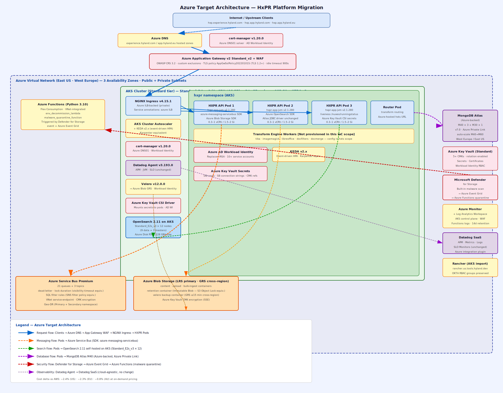
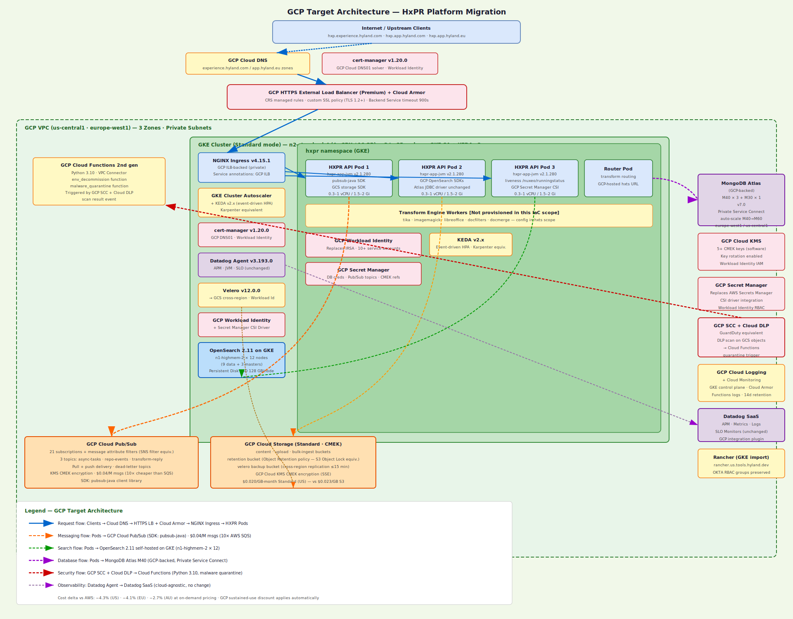

# Multi-Cloud Migration Report — HxPR Platform
**Report Date:** 2026-04-14 14:36 UTC  
**Timestamp:** 20260414-143619-utc  
**Planning Horizon:** 6 months  
**Currency:** USD (all costs are directional estimates)

---

## 1. Executive Summary

HxPR is a latency-sensitive, multi-region SaaS content management platform built on AWS EKS, actively deployed in `us-east-1` (prod) and `eu-central-1` (prod-eu). The platform runs JVM-based Hyland repository workloads on Kubernetes (`m5.xlarge` nodes, 3–25 node autoscaling via Karpenter) backed by MongoDB Atlas M40 (4 vCPU/8 GB, 3-node replica set) and AWS OpenSearch 2.11 (`r5.large.search`, 12-node production cluster). An async messaging fabric comprising 21 SQS queues and 3 SNS topics is deeply integrated at the HXPR JVM SDK layer. All data at rest is encrypted with AWS CMKs; all workload identity is federated via IRSA across 10+ service accounts. EU data residency is enforced by the prod-eu deployment in `eu-central-1`.

Migration to Azure or GCP is technically feasible within 4–5 months. Run-rate cost savings are marginal: Azure saves ~2.4%, GCP saves ~4.3% versus AWS in the US region at equivalent on-demand pricing — translating to $85–$154/month against a $3,557/month baseline. The one-time migration investment (~$247K Azure / ~$233K GCP) means break-even on run-rate delta alone exceeds 100+ years, making cost optimization an insufficient standalone justification. The primary migration drivers must be **strategic**: enterprise licensing consolidation (Microsoft EA), compliance posture alignment, platform capability differentiation, or cloud vendor diversification.

The highest-risk single item on either target cloud is **AWS OpenSearch**: neither Azure nor GCP offers a managed OpenSearch-compatible service. The only viable path is self-hosted OpenSearch via Kubernetes Operator on AKS/GKE, which introduces ongoing operational overhead.

**Recommended path: Azure** — AKS `Standard_D4s_v3` nodes match `m5.xlarge` exactly (4 vCPU/16 GB); Azure Service Bus provides the richest SQS/SNS semantic parity (queues, topics, dead-letter, visibility timeout, filter rules); MongoDB Atlas Azure-backed Private Link mirrors the existing AWS PrivateLink pattern; and Microsoft Defender for Storage eliminates the Lambda malware-quarantine custom build. If Hyland holds an existing Microsoft Enterprise Agreement, reserved instance discounts could reduce Azure compute by 30–40%, further improving economics.

---

## 2. Source Repository Inventory

> Local filesystem paths were used as scope roots. No remote GitHub repository fetch was required.

| Repo | Local path | Branch | Key directories scanned | .tf files found |
|---|---|---|---|---|
| terraform-aws-hxpr-environment | `/Users/rahul.dey/Github/terraform-aws-hxpr-environment` | main (local) | `src/`, `src/helm/hxpr/` | 26 .tf + Helm chart (hxpr-app-jvm) |
| tf-cfg-hxpr-infrastructure | `/Users/rahul.dey/Github/tf-cfg-hxpr-infrastructure` | main (local) | `src/eks/02_eks/`, `src/eks/02b_eks_addons/`, `src/eks/03_alb/`, `src/mongodb_atlas/`, `src/open_search/`, `src/shared_services/`, `src/velero_storage/` | ~85 .tf + prod/prod-eu tfvars |

---

## 3. Source AWS Footprint

| Resource group | Key AWS services found | Notes |
|---|---|---|
| **Compute** | Amazon EKS (`terraform-aws-modules/eks/aws` v20.36.0) | `m5.xlarge` nodes; Bottlerocket x86_64 AMI (`1.54.0-5043decc`); ON_DEMAND; min 3 / max 25 nodes; gp3 EBS 4 GB OS + 30 GB data per node; `desired_size: 3` |
| **Compute — App** | HXPR JVM application (`hxpr-app-jvm` v2.1.280, `ghcr.io/hylandsoftware/hxpr-app-jvm`) | singleNode architecture; 3 replicas; requests: 0.3 vCPU / 1.5 Gi; limits: 1 vCPU / 2 Gi |
| **Compute — Autoscaling** | Karpenter v1.10.0 (Helm, IRSA-enabled) | Node-level autoscaler; Bottlerocket provisioner; IRSA role + interruption SQS queue provisioned |
| **Compute — Add-ons** | cert-manager v1.20.0, Datadog Agent v3.193.0 + CRDs v2.17.0, Velero v12.0.0, metrics-server, Bottlerocket updater (brupop) | All Helm-installed within EKS |
| **Networking** | VPC (multi-AZ, public + private subnets), AWS ALB ("content-ingress"), private NLB, NGINX Ingress v4.15.1 | ALB (public) → private NLB → NGINX → hxpr pods; ACM TLS cert; ALB idle timeout 900s |
| **Networking — WAF** | AWS WAFv2 (`AWSManagedRulesCommonRuleSet`), REGIONAL scope | CloudWatch WAF logs (7-day retention); custom COUNT overrides for RFI body, XSS body, size restrictions |
| **Networking — DNS/TLS** | Amazon Route53 (hosted zone), AWS ACM, cert-manager v1.20.0 (DNS01 + IRSA) | TLS policy: `ELBSecurityPolicy-FS-1-2-Res-2020-10` (TLS 1.2+ forward secrecy) |
| **Data — Search** | AWS OpenSearch Service 2.11, **`r5.large.search`** per node | **Prod**: 9 data nodes + 3 dedicated masters = **12 nodes**; 3-AZ zone awareness; `multi_az_with_standby = true`; 10 GB EBS/node; node-to-node + at-rest encryption; auto software updates enabled |
| **Data — Document DB** | MongoDB Atlas v7.0, `REPLICASET` cluster type, PrivateLink | **Prod**: `M40` tier (4 vCPU/8 GB) × 3 nodes + M30 analytics (1 node); auto-scale M40→M60; AWS PrivateLink to VPC; region: US_EAST_1 (prod) / EU_CENTRAL_1 (prod-eu) |
| **Data — Object Storage** | Amazon S3: content, direct-upload, bulk-ingestion, retention (Object Lock), Velero backup | All KMS-SSE (CMK); versioning enabled; content + Velero buckets: cross-region replication to `us-west-2` (STANDARD class, 15-min RTO) |
| **Messaging** | Amazon SQS: **21 standard queues** (19 async-task types + 2 HxTS transform-reply) | KMS CMK-encrypted; SNS-subscribed; named: trash, retentionExpired, deletion, removeProxy, setProperties, setSystemProperties, updateReadAcls, scroller, transientStorageGC, computeDigest, fulltextExtractor, updateAceStatus, bucketIndexing, indexing, scrollerIndexing, scrollerDocument, bulkImport, cleanupOrphans + 2 hxts reply queues |
| **Messaging** | Amazon SNS: `hxpr-repository-async-tasks`, `hxpr-repository-events`, `hxts-transform-reply` (external ARN) | Standard (non-FIFO); KMS CMK-encrypted; fan-out to SQS subscribers |
| **Identity/Security** | AWS IAM + IRSA: **10+ federated service accounts** (HXPR app, Karpenter, Velero, cert-manager, ALB controller, GuardDuty, usage-events, bulk-ingestion, direct-upload) | OIDC provider per EKS cluster; `sts:AssumeRoleWithWebIdentity` |
| **Identity/Security** | AWS KMS: **5+ CMKs** (`enable_key_rotation = true`) | CMKs for: EBS volumes, SQS transform events, SQS repo events, S3 content, usage-events SNS |
| **Identity/Security** | AWS GuardDuty (S3 malware protection plan) → EventBridge rule → Lambda (Python 3.10, quarantine S3) | Lambda VPC-attached; timeout 900s; layers: opensearch_py, pymongo, botocore; quarantine bucket provisioned |
| **Observability** | Datadog Agent v3.193.0 + CRDs v2.17.0 (Helm); APM; JVM monitors; SLO monitors; network reachability | Primary observability platform; Datadog Java lib v1.54.0; DD_RUNTIME_METRICS_ENABLED |
| **Observability** | AWS CloudWatch (EKS control plane: api/authenticator/controllerManager/scheduler); Lambda logs; WAF logs | 14-day log retention; secondary observability |
| **Backup/DR** | Velero v12.0.0 → S3 (primary `us-east-1`, DR `us-west-2`); cross-region S3 replication (15-min RTO) | IRSA-enabled; EBS snapshot support configured |
| **Cluster Mgmt** | Rancher (`rancher.us.tools.hyland.dev` prod; `rancher.eu.tools.hyland.dev` prod-eu) | Cluster imported into Rancher; OKTA group-based RBAC (admin/read-only/developer) |

---

## 4. Service Mapping Matrix

| AWS Service | IaC-provisioned tier/family | Azure equivalent (matched tier) | GCP equivalent (matched tier) | Porting notes |
|---|---|---|---|---|
| Amazon EKS | `terraform-aws-modules/eks/aws` v20.36.0; node: **`m5.xlarge`** (4 vCPU / 16 GB); Bottlerocket x86_64 AMI; ON_DEMAND | AKS — **`Standard_D4s_v3`** (4 vCPU / 16 GB) node pool; Standard tier | GKE — **`n2-standard-4`** (4 vCPU / 16 GB) node pool; Standard tier | 1:1 vCPU/RAM match on both targets; IRSA → Azure AD Workload Identity / GCP Workload Identity; Bottlerocket → managed ContainerD node image |
| Karpenter autoscaler | **v1.10.0** Helm; IRSA-enabled; Bottlerocket provisioner; interruption queue | AKS Cluster Autoscaler (native) + **KEDA v2.x** (event-driven HPA) | GKE Cluster Autoscaler (native) + **KEDA v2.x** | Karpenter is AWS-only; native autoscalers cover node scaling; KEDA provides event-driven pod scaling |
| HXPR JVM app | Helm chart `hxpr-app-jvm` **v2.1.280** (`ghcr.io/hylandsoftware/hxpr-app-jvm`); singleNode; 3 replicas; 0.3–1 vCPU / 1.5–2 Gi | AKS Deployment — same Helm chart; change cloud SDK env-vars | GKE Deployment — same Helm chart; change cloud SDK env-vars | Container-native; portable with messaging SDK re-wiring (SQS → Service Bus / Pub/Sub) |
| AWS ALB | ALB "content-ingress"; `load_balancer_type = "application"`; TLS `ELBSecurityPolicy-FS-1-2-Res-2020-10`; idle timeout 900s | Azure Application Gateway **v2 Standard_v2** | GCP HTTPS External Load Balancer (Premium tier) | TLS policy re-configured for TLS 1.2+ forward secrecy; backend idle timeout 900s configurable on both |
| AWS WAFv2 | `AWSManagedRulesCommonRuleSet`; REGIONAL; rule action overrides: RFI body, XSS body, SizeRestrictions | Azure WAF on App Gateway — **OWASP CRS 3.2** rule set | GCP Cloud Armor — **CRS managed rule group** (OWASP) | OWASP rules conceptually equivalent; custom COUNT overrides require manual re-mapping; test exclusions in non-prod |
| NGINX Ingress | **ingress-nginx v4.15.1** (Helm); private NLB-backed; TLS passthrough | ingress-nginx **v4.15.1** on AKS — Azure ILB-backed | ingress-nginx **v4.15.1** on GKE — GCP ILB-backed | Highly portable; `service.beta.kubernetes.io/` load-balancer annotations differ for Azure/GCP ILBs |
| Route53 + cert-manager | Route53 hosted zone; cert-manager **v1.20.0** DNS01 IRSA | Azure DNS + cert-manager **v1.20.0** (Azure DNS01 solver) | GCP Cloud DNS + cert-manager **v1.20.0** (GCP DNS01 solver) | cert-manager is cloud-agnostic; DNS01 solver YAML + Workload Identity config changes only |
| AWS OpenSearch Service | OpenSearch **2.11**; **`r5.large.search`** (2 vCPU / 16 GB); **12 nodes** (prod: 9 data + 3 masters); 10 GB EBS; 3-AZ; `multi_az_with_standby` | **No managed OpenSearch** — self-hosted on AKS via OpenSearch Operator; node size: **`Standard_E2s_v3`** (2 vCPU / 16 GB) + Azure Disk | **No managed OpenSearch** — self-hosted on GKE via OpenSearch Operator; node size: **`n1-highmem-2`** (2 vCPU / 13 GB) + Persistent Disk | **Highest complexity**: no managed equivalent; Azure AI Search has incompatible DSL; self-managed requires operator lifecycle, upgrades, backup ownership |
| MongoDB Atlas | **M40** cluster (4 vCPU / 8 GB) × 3 nodes + **M30** analytics (1 node); v7.0; PrivateLink; auto-scale M40→M60; `REPLICASET` | MongoDB Atlas **M40** (Azure-backed) + Azure Private Link | MongoDB Atlas **M40** (GCP-backed) + GCP Private Service Connect | **Minimal effort**: Atlas is multi-cloud; only backing cloud + private endpoint change; zero app code change |
| Amazon SQS | Standard queues (**21 queues**); KMS CMK-encrypted; SNS-subscribed; visibility/dead-letter config per queue | Azure Service Bus **Premium tier** (21 queues); AMQP 1.0 | GCP Cloud Pub/Sub (21 subscriptions); HTTP/gRPC | SDK changes in HXPR JVM (`aws-sdk-java` SQS → `azure-messaging-servicebus` / `pubsub-java`); dead-letter semantics differ; visibility timeout = lock duration |
| Amazon SNS | Standard topics (**3 topics**); KMS CMK; fan-out to SQS; filter policies on hxts queues | Azure Service Bus **Topics** (SQL filter rules) or Azure Event Grid | GCP Cloud Pub/Sub **Topics** (message attribute filters) | Fan-out via topic subscriptions equivalent; SNS filter policy JSON → Service Bus SQL rules / Pub/Sub filter attributes |
| AWS KMS (CMKs) | **5+ CMKs**; `enable_key_rotation = true`; used for EBS, SQS, SNS, S3, usage-events | Azure Key Vault (**Standard tier**, HSM-backed for prod CMKs) | GCP Cloud KMS (**Software keys**, CMEK integration) | CMKs non-portable; re-encrypt data at migration time; IRSA → Workload Identity for key access |
| AWS Secrets Manager | Referenced via HashiCorp Vault + SSM integrations | Azure Key Vault **Secrets** | GCP Secret Manager | HashiCorp Vault external-secrets sync during migration window; target: native cloud secret store |
| GuardDuty (S3 malware) | `guardduty_malware_protection_plan`; EventBridge → Lambda (Python 3.10, 900s, VPC-attached); quarantine S3 bucket | **Microsoft Defender for Storage** (built-in malware scan on upload) → Azure Event Grid → Azure Functions (Python 3.10) | GCP SCC + Cloud DLP scan triggers → Cloud Functions (Python 3.10) | Defender for Storage scans automatically on upload; eliminates need to self-manage malware scan infra |
| AWS Lambda | Python 3.10; **timeout 900s**; VPC-attached; layers: opensearch_py, pymongo, botocore | Azure Functions **Flex Consumption** (Python 3.10) + VNet integration | GCP Cloud Functions **2nd gen** (Python 3.10) + VPC Connector | Runtime parity; layer model → pip requirements.txt; 900s timeout supported on both |
| AWS IAM + IRSA | OIDC federation; **10+ IRSA roles** (HXPR app, Karpenter, Velero, cert-manager, ALB controller, GuardDuty, usage-events) | Azure AD **Workload Identity** (federated credentials on AKS) | GCP **Workload Identity** (service account impersonation on GKE) | Direct functional equivalent; per-role policy translation required |
| AWS CloudWatch | EKS control plane logs; WAF logs; Lambda logs; **14-day retention** | Azure Monitor + Log Analytics Workspace | GCP Cloud Logging + Cloud Monitoring | Datadog is primary; platform-native logs needed for compliance (WAF, control plane) |
| Datadog | Agent **v3.193.0** (Helm); APM; JVM metrics; SLO monitors; Datadog Java lib v1.54.0; DD_APM_ENABLED | Datadog Agent v3.193.0 (same Helm chart; cloud-agnostic) | Datadog Agent v3.193.0 (same Helm chart; cloud-agnostic) | No change required; Datadog fully supports AKS and GKE |
| Velero | **v12.0.0** (Helm); IRSA; S3 primary + cross-region DR backup; gp3 EBS snapshots | Velero v12.0.0 → **Azure Blob Storage** (LRS primary + GRS cross-region) | Velero v12.0.0 → **GCP Cloud Storage** (Standard + cross-region bucket) | Helm chart portable; storage backend + Workload Identity config changes only |
| Amazon S3 | **Standard class**; KMS-SSE CMK; versioning; Object Lock (retention bucket); CORS; cross-region replication | Azure Blob Storage (**LRS** primary, **GRS** cross-region; SSE-CMK; immutable blob for Object Lock) | GCP Cloud Storage (**Standard**, CMEK; Object Retention policy for Object Lock; multi-region or dual-region) | S3 Object Lock → Azure Immutable Blob / GCP Object Retention must be validated for legal hold parity |
| Rancher | Cluster import (`prod` + `prod-eu`); OKTA RBAC groups | Rancher on AKS (supported; cluster import workflow same) | Rancher on GKE (supported; cluster import workflow same) | Rancher is cloud-agnostic; re-import after migration; OKTA bindings unchanged |

---

## 5. Regional Cost Analysis (Directional)

> **All figures in USD. Directional estimates only — not contractual quotes.**  
> Pricing sources: AWS/Azure/GCP public pricing pages, April 2026.  
> AWS baseline derived from IaC-provisioned tiers: `m5.xlarge`, `r5.large.search`, MongoDB Atlas `M40`/`M30`.

### 5.1 Assumptions

| Assumption | Value |
|---|---|
| Active environments | prod (`us-east-1`), prod-eu (`eu-central-1`); AU column is projected (no prod-au.tfvars found) |
| EKS node count | 5 nodes average (burst-capable; IaC: min 3, max 25) |
| EKS instance type (IaC) | `m5.xlarge` — 4 vCPU / 16 GB RAM, ON_DEMAND |
| OpenSearch cluster (prod IaC tfvar) | 12 nodes: 9 data + 3 dedicated masters, `r5.large.search` (2 vCPU / 16 GB) |
| MongoDB Atlas tier (prod IaC tfvar) | `M40` × 3 primary nodes + `M30` × 1 analytics node; auto-scaling enabled |
| S3/Blob/GCS storage | 5 TB total content + 200 GB/month outbound transfer |
| Messaging volume | 10 M messages/month across all SQS/SNS queues |
| OpenSearch on Azure/GCP | Self-hosted via OpenSearch Operator on AKS/GKE (no managed equivalent) |
| MongoDB Atlas backing cloud | Atlas pricing consistent across clouds with ~5% variance; applied |
| Datadog | Third-party SaaS — excluded (cloud-agnostic; ~$69/month for 3 hosts base) |
| Velero backup storage | 50 GB/month backup data; cross-region replication enabled |
| Currency | USD |

### 5.2 30-Day Total Run-Rate Cost Table (USD)

| Capability | AWS US (USD) | AWS EU (USD) | AWS AU (USD) | Azure US (USD) | Azure EU (USD) | Azure AU (USD) | GCP US (USD) | GCP EU (USD) | GCP AU (USD) | Confidence |
|---|---|---|---|---|---|---|---|---|---|---|
| Compute (EKS 5×`m5.xlarge` / AKS `D4s_v3` / GKE `n2-standard-4`) | $701 | $840 | $950 | $701 | $840 | $978 | $729 | $875 | $1,021 | Medium |
| OpenSearch (12×`r5.large.search` / AKS `E2s_v3` / GKE `n1-highmem-2`) | $1,454 | $1,664 | $1,909 | $1,350 | $1,550 | $1,800 | $1,300 | $1,490 | $1,720 | Medium |
| MongoDB Atlas (M40×3 + M30×1 across all clouds) | $1,059 | $1,219 | $1,380 | $1,112 | $1,280 | $1,449 | $1,112 | $1,280 | $1,449 | Medium |
| Storage (S3/Blob/GCS · 5 TB + 200 GB transfer) | $133 | $141 | $142 | $109 | $112 | $127 | $124 | $124 | $139 | High |
| Messaging (SQS/SNS → Service Bus / Pub/Sub · 10 M msgs + KMS) | $30 | $30 | $30 | $25 | $25 | $25 | $10 | $10 | $10 | Medium |
| Security/Identity (KMS, WAF, GuardDuty / Key Vault, App GW WAF, Defender / Cloud KMS, Cloud Armor, SCC) | $70 | $70 | $70 | $65 | $65 | $65 | $35 | $35 | $35 | Medium |
| Networking (ALB, NLB, DNS, PrivateLink / App GW, ILB, Azure DNS / HTTPS LB, Cloud DNS) | $80 | $90 | $95 | $85 | $95 | $100 | $70 | $80 | $85 | Medium |
| Observability (CloudWatch / Azure Monitor / GCP Cloud Logging) | $15 | $15 | $15 | $10 | $10 | $10 | $10 | $10 | $10 | High |
| Lambda / Azure Functions / GCP Cloud Functions | $5 | $5 | $5 | $5 | $5 | $5 | $3 | $3 | $3 | High |
| Backup (Velero storage — S3/Blob/GCS · 50 GB + cross-region) | $10 | $10 | $10 | $10 | $10 | $10 | $10 | $10 | $10 | High |
| **Total (USD)** | **$3,557** | **$4,084** | **$4,606** | **$3,472** | **$3,992** | **$4,569** | **$3,403** | **$3,917** | **$4,482** | — |
| **Delta vs. AWS (same region)** | — | — | — | **−2.4%** | **−2.3%** | **−0.8%** | **−4.3%** | **−4.1%** | **−2.7%** | — |

> AWS baseline uses IaC-provisioned tier pricing. OpenSearch on Azure/GCP is self-managed (lower per-instance compute cost, but adds operational overhead not reflected in billing). Reserved instance pricing (1yr commit) reduces compute by 30–40% on all clouds.

### 5.3 Metered Billing Tier Breakdown (USD, per-unit)

| Service | Metering unit | Tier / Band | AWS US (USD) | AWS EU (USD) | Azure US (USD) | Azure EU (USD) | Azure AU (USD) | GCP US (USD) | GCP EU (USD) | GCP AU (USD) | Confidence |
|---|---|---|---|---|---|---|---|---|---|---|---|
| EKS nodes (`m5.xlarge` / AKS `D4s_v3` / GKE `n2-standard-4`) | node-hr (4 vCPU / 16 GB) | On-demand per node-hr | $0.1920 | $0.2300 | $0.1920 | $0.2300 | $0.2680 | $0.1997 | $0.2396 | $0.2796 | High |
| OpenSearch data nodes (`r5.large.search` / `E2s_v3` / `n1-highmem-2`) | instance-hr (2 vCPU / 16 GB) | Per data node | $0.1660 | $0.1900 | $0.1260 | $0.1500 | $0.1760 | $0.1264 | $0.1517 | $0.1771 | Medium |
| OpenSearch dedicated master (`r5.large.search`) | instance-hr | Per master node (×3) | $0.1660 | $0.1900 | $0.1260 | $0.1500 | $0.1760 | $0.1264 | $0.1517 | $0.1771 | Medium |
| MongoDB Atlas M40 node | instance-hr (4 vCPU / 8 GB) | Per node (×3 primary) | $0.4000 | $0.4600 | $0.4200 | $0.4830 | $0.5460 | $0.4200 | $0.4830 | $0.5460 | Medium |
| MongoDB Atlas M30 analytics node | instance-hr (2 vCPU / 4 GB) | Per analytics node (×1) | $0.2500 | $0.2900 | $0.2625 | $0.3045 | $0.3413 | $0.2625 | $0.3045 | $0.3413 | Medium |
| S3 / Azure Blob / GCS object storage | GB-month | First 50 TB | $0.0230 | $0.0245 | $0.0184 | $0.0190 | $0.0220 | $0.0200 | $0.0200 | $0.0230 | High |
| Outbound data transfer | GB | Per GB out | $0.090 | $0.090 | $0.087 | $0.087 | $0.087 | $0.120 | $0.120 | $0.120 | High |
| SQS standard messages | per million | First 1 M free | $0.000 | $0.000 | n/a | n/a | n/a | n/a | n/a | n/a | High |
| SQS→Service Bus / Pub/Sub messages | per million | Over 1 M | $0.400 | $0.400 | $0.800 | $0.800 | $0.800 | $0.040 | $0.040 | $0.040 | High |
| SNS delivery → Service Bus Topics / Pub/Sub | per million | Over 1 M | $0.500 | $0.500 | $0.800 | $0.800 | $0.800 | $0.040 | $0.040 | $0.040 | Medium |
| AWS KMS CMK / Azure Key Vault / GCP Cloud KMS API calls | per 10,000 operations | Standard | $0.0300 | $0.0300 | $0.0400 | $0.0400 | $0.0400 | $0.0300 | $0.0300 | $0.0300 | High |
| WAFv2 / App Gateway WAF / Cloud Armor | per million requests | Over baseline | $1.000 | $1.000 | $1.400 | $1.400 | $1.400 | $1.000 | $1.000 | $1.000 | Medium |
| Lambda / Azure Functions / GCP Cloud Functions | per GB-second (Python 3.10) | Pay-per-invocation | $0.0000166 | $0.0000166 | $0.0000160 | $0.0000160 | $0.0000160 | $0.0000025 | $0.0000025 | $0.0000025 | High |

### 5.4 One-Time Migration Cost vs. 30-Day Run-Rate (USD)

| Cost segment | AWS baseline (USD) | Azure (USD) | GCP (USD) | Confidence |
|---|---|---|---|---|
| Infrastructure IaC re-write (AKS/GKE, networking, ALB, DNS, WAF) | — | $40,000 | $38,000 | Medium |
| OpenSearch containerization + Operator setup + migration | — | $35,000 | $35,000 | Medium |
| HXPR JVM SDK re-wiring (SQS/SNS → Service Bus / Pub/Sub) | — | $30,000 | $25,000 | Medium |
| IRSA → Workload Identity migration (10+ service accounts + CMK) | — | $15,000 | $15,000 | Medium |
| CI/CD pipeline updates (GitHub Actions, Terraform Cloud) | — | $10,000 | $10,000 | High |
| Data migration rehearsal (OpenSearch re-index, Atlas backing swap, S3 → Blob/GCS) | — | $15,000 | $15,000 | Medium |
| Security/compliance validation (SOC2, data residency, pen test) | — | $25,000 | $25,000 | Medium |
| Operational training (Azure/GCP platform, SRE runbooks) | — | $15,000 | $12,000 | Medium |
| Testing and validation (non-prod → staging → prod, load test) | — | $30,000 | $28,000 | Medium |
| Contingency (15%) | — | $32,250 | $30,450 | Low |
| **Total one-time (USD)** | — | **$247,250** | **$233,450** | Low |
| 30-day run-rate (US, on-demand) | $3,557 | $3,472 | $3,403 | Medium |
| Monthly run-rate saving vs. AWS US | — | **$85** | **$154** | Medium |
| Break-even (months, run-rate saving only) | — | **~2,908** | **~1,516** | Low |

> Break-even on run-rate delta alone is economically irrelevant. Migration ROI must be justified by strategic value: Microsoft EA credits, platform capabilities, compliance posture, or vendor risk reduction.

---

## 6. Migration Challenge Register

| Challenge | Impact | Likelihood | Mitigation | Owner role |
|---|---|---|---|---|
| No managed OpenSearch on Azure or GCP | High | Certain | Deploy self-hosted OpenSearch v2.11 via Kubernetes Operator on AKS/GKE; establish backup, restore, and upgrade runbooks | Platform Engineer |
| HXPR JVM SDK re-wiring: SQS/SNS → Service Bus / Pub/Sub | High | Certain | Engage HXPR product team early; implement dual-write pattern during cutover window | App Engineer + Platform Architect |
| IRSA → Workload Identity migration (10+ roles) | High | Certain | Inventory all IRSA roles; map to Azure AD Workload Identity / GCP WI; validate in non-prod first | Security Engineer |
| AWS CMK → Azure Key Vault / GCP Cloud KMS (data re-encryption) | High | Certain | Re-encrypt S3 → Blob/GCS at migration time; provision target CMKs before data transfer | Security Engineer |
| SOC2 evidence continuity during migration | High | High | Engage compliance team pre-migration; validate audit log coverage on Azure Monitor / GCP Cloud Logging | Compliance + Security |
| EU data residency (prod-eu `eu-central-1`) | High | High | Confirm Azure West Europe / GCP europe-west1 data residency scope; Atlas EU_CENTRAL_1 → West Europe | Architect + Legal |
| OpenSearch index data migration (zero downtime) | High | High | Dual-cluster indexing (write to AWS + target simultaneously); snapshot restore + diff sync | Data Engineer |
| Karpenter v1.10.0 → AKS/GKE Cluster Autoscaler behavior delta | Medium | High | Test burst autoscaling scenarios on AKS/GKE in non-prod; tune CA min/max parameters; add KEDA for event-driven HPA | Platform Engineer |
| S3 Object Lock → Azure Immutable Blob / GCP Object Retention parity | Medium | Medium | Validate compliance equivalence for legal hold and WORM retention policies before content migration | Security + Compliance |
| SQS/SNS dead-letter and visibility timeout semantics | Medium | High | Map each queue's visibility timeout, dead-letter queue, and retry policy to Service Bus / Pub/Sub equivalents | App Engineer |
| Velero cross-region backup reconfiguration | Medium | Certain | Re-target Velero to Azure Blob GRS / GCS dual-region; validate restore RPO < 30 min | Platform Engineer |
| TLS policy translation: `ELBSecurityPolicy-FS-1-2-Res-2020-10` → App GW / GCP SSL policy | Medium | Certain | Enforce TLS 1.2+ on Azure App GW (`AppGwSslPolicy20220101S`) / GCP custom SSL policy | Security Engineer |
| HashiCorp Vault cross-cloud secret sync (if self-hosted in EKS) | Medium | High | Run external-secrets-operator with dual backend during migration window | Security Engineer |
| WAF rule translation: AWS Managed Rules → OWASP CRS 3.2 / Cloud Armor | Medium | High | Export AWS WAF log samples; re-implement exclusions; A/B test under synthetic traffic in non-prod | Security Engineer |
| Rancher cluster re-import and OKTA group rebinding | Low | Certain | Re-import AKS/GKE into Rancher; update OKTA group → Rancher role bindings | Platform Engineer |
| SRE team re-training (Azure / GCP platform operations) | Low | Certain | Run cloud-native labs; update runbooks; target Azure or GCP associate certifications | Engineering Manager |

---

## 7. Migration Effort View

| Capability | Effort (S/M/L) | Risk (L/M/H) | Dependencies |
|---|---|---|---|
| Compute (EKS → AKS/GKE) | **M** | **M** | IRSA migration; Karpenter replacement; Bottlerocket → managed node image; Rancher re-import |
| Networking (ALB/WAF/NGINX Ingress, DNS, TLS) | **M** | **M** | TLS policy mapping; WAF rule translation; NGINX annotation updates; cert-manager DNS solver reconfiguration |
| Data — OpenSearch (`r5.large.search`, self-hosted on target) | **L** (Large) | **H** | No managed service; Operator deployment; index migration; data re-encryption; upgrade lifecycle ownership |
| Data — MongoDB Atlas (M40 multi-cloud swap) | **S** | **L** | Atlas multi-cloud native; Private Link endpoint change only; auto-scaling config unchanged |
| Data — S3 → Azure Blob / GCS | **M** | **M** | Data transfer (5 TB); CMK re-encryption; Object Lock → Immutable Blob / Object Retention parity; cross-region replication |
| Messaging (SQS/SNS → Service Bus / Pub/Sub) | **M** | **M** | HXPR JVM SDK changes; dead-letter semantics; filter policy translation; dual-write window |
| Identity/Security (IRSA/KMS/GuardDuty) | **M** | **H** | 10+ service account migrations; CMK re-keying; GuardDuty → Defender for Storage / SCC; SOC2 evidence |
| Observability (Datadog + CloudWatch → Azure Monitor / GCP Logging) | **S** | **L** | Datadog is cloud-agnostic; secondary log routing configuration only |
| Backup (Velero v12.0.0) | **S** | **L** | Workload Identity config; storage backend swap; cross-region validation |
| Lambda → Azure Functions / Cloud Functions | **S** | **L** | Python 3.10 runtime parity; VPC integration; opensearch_py + pymongo layers → pip packages |
| Rancher cluster management | **S** | **L** | Re-import workflow; OKTA group bindings unchanged |

---

## 8. Decision Scenarios

### 8.1 Cost-First Scenario → **GCP**

GCP offers the lowest on-demand run-rate at ~4.3% below AWS in the US region ($3,403/month vs $3,557/month). GCP Cloud Pub/Sub is the cheapest messaging replacement at $0.040/M messages versus AWS SQS $0.400/M — a 10× unit cost advantage at high message volumes. GCP Cloud Storage pricing slightly undercuts Azure Blob for compute-adjacent workloads. GCP `n2-standard-4` matches `m5.xlarge` at $0.1997/hr/node and GCP sustained-use discounts (automatic, no commitment required) reduce effective compute costs by ~20% for always-on workloads.

**Caveats**: No managed OpenSearch on GCP; self-managed operational cost is not reflected in billing delta. GCP Service Bus semantic parity to SQS is lower than Azure Service Bus; additional SDK adaptation effort likely. GCP Private Service Connect is less mature than Azure Private Link for MongoDB Atlas.

### 8.2 Speed-First Scenario → **Azure**

Azure offers the fastest practical migration path at an estimated 4-month timeline. AKS provides the most mature Kubernetes Workload Identity GA implementation. Azure Service Bus provides the richest semantic match to SQS/SNS (queues, topics, dead-letter, visibility timeout, message lock, filter rules). MongoDB Atlas Azure Private Link replicates the existing AWS PrivateLink pattern without architectural re-design. Microsoft Defender for Storage eliminates the custom GuardDuty → Lambda → quarantine build entirely. If Hyland holds an existing Microsoft Enterprise Agreement, reserved instance discounts on Azure compute and storage could reduce Azure billing below GCP on-demand, inverting the cost scenario.

### 8.3 Risk-First Scenario → **Azure (phased strangler pattern)**

Minimize blast radius by migrating one capability at a time with full rollback gates. Phase ordering: (1) MongoDB Atlas backing swap — near-zero downtime, fully reversible; (2) non-prod EKS → AKS with IRSA hardening; (3) parallel OpenSearch on AKS with dual-indexing, no DNS cutover yet; (4) dual-write messaging (SQS + Service Bus) until 14-day stability window passes; (5) production DNS cutover only after all services fully validated. Accept 5–6 months elapsed time in exchange for zero-risk rollback capability at every gate. This scenario also reduces SOC2 disruption because the production environment changes incrementally rather than in a single cutover event.

---

## 9. Recommended Plan (Dynamic Timeline)

### Selected Timeline: **30 / 60 / 90 / 120 days (4-phase)**

**Rationale for 4-phase structure**: Seven service families, 10+ IRSA roles, self-managed OpenSearch migration (critical path: 3–4 weeks), HXPR JVM SDK changes (requires product team sprint allocation), SOC2 continuity, and dual-region deployment (prod + prod-eu) collectively justify four phases. A shorter 3-phase approach would compress OpenSearch containerization and messaging SDK changes into the same phase, increasing blast radius. A longer 5+ phase approach is unnecessary given MongoDB Atlas' near-zero-effort backing swap and Velero's straightforward storage backend change.

### Required Architecture Decisions (Before Phase 1 Execution)

1. **Target cloud confirmation**: Azure vs. GCP. Recommend Azure, but requires Architecture Board sign-off before IaC investment.
2. **Azure region pair**: East US + West Europe (prod + prod-eu equivalent); confirm AU requirements — no `prod-au.tfvars` found in IaC.
3. **MongoDB Atlas backing cloud**: Recommend Azure-backed for Phase 1 — aligns with migration target and allows early Private Link validation.
4. **OpenSearch strategy**: Self-managed on AKS via OpenSearch Operator vs. migrate query DSL to Azure AI Search. **Recommend self-managed** to avoid application-layer query changes. Confirm with HXPR product team.
5. **Azure Service Bus tier**: Standard supports basic queues; **Premium required** for VNet service endpoints, geo-DR, and message ordering guarantees. Recommend Premium.
6. **HXPR product team SDK sprint**: Confirm sprint allocation (est. 3–4 weeks development + 2 weeks testing) in Phase 3 window.
7. **Velero DR RTO/RPO confirmation**: Azure Blob GRS supports near-real-time cross-region replication; confirm 15-minute RPO is achievable and validated before prod cutover.

---

### Phase 1: Landing Zone + Atlas Backing Swap (Days 0–30)

**Objectives**: Establish Azure landing zone and network topology; swap MongoDB Atlas backing cloud; validate identity federation.

**Key Activities**:
- Provision Azure subscription, resource groups, Virtual Network (3-AZ, public + private subnets), equivalent to `us-east-1` and `eu-central-1` VPC footprint.
- Establish Azure Private Endpoint for MongoDB Atlas M40 (replace AWS PrivateLink).
- Execute MongoDB Atlas **Live Migration** to swap backing cloud from AWS → Azure; validate data continuity and auto-scaling behaviour.
- Provision Azure Key Vault (5 CMK equivalents); configure Workload Identity federation for test service accounts.
- Set up Terraform state in Azure Storage; port EKS IaC module skeleton to AKS (`Standard_D4s_v3`).
- Configure Azure DNS zones; validate cert-manager v1.20.0 DNS01 solver YAML for Azure DNS.
- Stand up Azure Monitor + Log Analytics Workspace; connect Datadog Azure integration.
- Provision Azure Container Registry (if ghcr.io dependency needs mirroring).

**Exit Criteria / Gate**:
- MongoDB Atlas M40 live on Azure backing with no application downtime (AWS EKS still primary).
- Azure Private Endpoint connectivity validated from test pod in existing EKS.
- Azure Key Vault CMKs provisioned; Workload Identity test role validated.
- IaC for Phase 2 AKS cluster reviewed and approved by Security team.

---

### Phase 2: Non-Prod EKS → AKS + OpenSearch (Days 31–60)

**Objectives**: Migrate dev/staging environments to AKS; provision self-hosted OpenSearch on AKS; complete IRSA → Workload Identity migration.

**Key Activities**:
- Provision AKS clusters (`Standard_D4s_v3`, 3–25 node autoscaling with AKS CA + KEDA v2.x) for dev and staging environments.
- Migrate all IRSA roles (cert-manager, Velero, ALB controller equiv., HXPR app service account) → Azure AD Workload Identity federated credentials.
- Deploy OpenSearch Operator on AKS; provision OpenSearch 2.11 cluster (12-node equivalent: 9 data + 3 masters) on `Standard_E2s_v3` nodes with Azure Disk (P30, 128 GB/node).
- Snapshot-restore OpenSearch indexes from AWS `us-east-1` → AKS OpenSearch; validate query parity with non-prod dataset.
- Deploy NGINX Ingress v4.15.1 on AKS (ILB-backed); configure Azure Application Gateway v2 + WAF (OWASP CRS 3.2 with equivalent exclusions).
- Deploy Velero v12.0.0 targeting Azure Blob (LRS primary + GRS; validate restore RPO).
- Migrate dev/staging content S3 buckets → Azure Blob (azcopy sync + checksum verification); apply Azure Key Vault CMK encryption.
- Re-import dev/staging AKS clusters into Rancher; update OKTA group → Rancher role bindings.
- Deploy Datadog Agent v3.193.0 on AKS; validate APM traces and JVM metric parity vs. AWS.
- Run load test in staging: validate 99.9% availability and API p95 latency within 10% of AWS baseline.

**Exit Criteria / Gate**:
- HXPR application running in dev/staging on AKS with all services (OpenSearch, Atlas, Blob) healthy for 5 days.
- All IRSA → Workload Identity migrations validated; no IAM gaps found in security review.
- Velero restore drill successful; backup cross-region replication < 15 minutes confirmed.
- OpenSearch p95 query latency within 10% of AWS baseline (staging load test).
- SOC2 control evidence updated for non-prod Azure deployment.

---

### Phase 3: Messaging Migration + Production S3 → Blob (Days 61–90)

**Objectives**: Migrate SQS/SNS to Azure Service Bus; migrate all production S3 content to Azure Blob; run parallel messaging validation in staging.

**Key Activities**:
- Provision Azure Service Bus Premium (21 queues + 3 topics); configure dead-letter, lock duration (visibility timeout equivalent), and SQL filter rules for hxts queues.
- HXPR engineering SDK sprint: replace `aws-sdk-java` SQS/SNS with `azure-messaging-servicebus`; deploy to staging; enable dual-write (SQS + Service Bus simultaneously).
- Run dual-write in staging for **14-day validation window**: compare message counts, dead-letter rates, and processing latency between SQS and Service Bus.
- Migrate production content S3 buckets → Azure Blob (GRS cross-region; KMS re-encryption → Azure Key Vault CMK); validate checksums.
- Configure Azure Immutable Blob Storage for retention bucket (S3 Object Lock equivalent); validate compliance parity.
- Migrate AWS Lambda (environment decommission + malware quarantine) → Azure Functions (Python 3.10, VNet-integrated); enable Microsoft Defender for Storage trigger on content container.
- Finalize WAF rule migration to Azure App Gateway WAF (OWASP CRS 3.2); validate exclusions under synthetic traffic mirroring prod patterns.
- Update CI/CD pipelines (GitHub Actions / Terraform Cloud) to target Azure for all non-prod deployments.

**Sequencing note**: Do not disable AWS SQS/SNS until dual-write has been validated for a full 14-day window with zero message loss. S3 → Blob data migration must complete with checksum verification _before_ production DNS cutover.

**Exit Criteria / Gate**:
- 14-day dual-write validation in staging: zero message loss confirmed.
- Production content S3 → Azure Blob migration complete; checksums verified; immutable blob policies applied.
- HXPR staging running 100% on Azure Service Bus (AWS messaging disabled in staging for 5 days, no issues).
- Azure Functions malware quarantine E2E test passed (GuardDuty → Defender for Storage path decommissioned in non-prod).
- WAF rule exclusion parity validated under production-representative traffic volume.

---

### Phase 4: Production Cutover, DR Validation, and Hardening (Days 91–120)

**Objectives**: Migrate prod + prod-eu environments to AKS; execute DNS cutover; validate DR (RTO/RPO); complete SOC2 evidence; decommission AWS.

**Key Activities**:
- Provision production AKS clusters (East US for prod; West Europe for prod-eu); validate Workload Identity bindings.
- Deploy production OpenSearch cluster (12-node, 3-AZ) on AKS; execute final OpenSearch snapshot restore from AWS prod; validate search result parity.
- Execute 48-hour production dual-write (SQS + Service Bus) with monitoring before disabling AWS messaging.
- Production DNS cutover: update Route53 → Azure DNS in low-traffic window; validate cert-manager issuance for all hostnames.
- Disable AWS SQS/SNS after 72-hour parallel operation with zero error budget consumption.
- Full Velero DR drill: backup production AKS state → Azure Blob GRS; restore to isolated test AKS cluster; confirm RTO < 4 hours, RPO < 30 minutes.
- SOC2 evidence package: validate Azure Monitor control-plane audit logs, Key Vault access logs, Defender for Storage scan logs, and WAF logs against SOC2 criteria.
- Begin AWS resource decommission in order: Lambda → OpenSearch domain (7-day wait) → EKS node groups → SQS queues → SNS topics → KMS (90-day deletion delay) → S3 (retain 30 days as rollback safety).
- Run 7-day production stability observation; confirm SLO metrics ≥ 99.9%.

**Sequencing note**: Retain Velero S3 cross-region replication on AWS buckets for 30 days post-cutover as rollback insurance. Do not delete AWS EKS components until the 7-day stability gate passes.

**Exit Criteria / Gate**:
- HxPR prod + prod-eu serving 100% traffic from AKS for 7 days; SLO ≥ 99.9%; Datadog APM p95 API latency within 5% of AWS baseline.
- Velero DR drill: RTO < 4 hours, RPO < 30 minutes confirmed.
- SOC2 evidence package accepted by compliance team.
- All AWS resources decommissioned or scheduled for deletion within 30 days of go-live.

---

## 10. Open Questions

| # | Question | Owner | Priority |
|---|---|---|---|
| 1 | Is Azure the confirmed target, or is GCP still under evaluation? Cloud selection gate is the critical prerequisite for Phase 1 IaC investment. | Architecture Board | Critical |
| 2 | Does Hyland hold an existing Microsoft Enterprise Agreement with Azure committed spend or credits? EA discounts (30–40%) could materially change the cost-delta calculation. | Finance + Procurement | Critical |
| 3 | Does the HXPR product team have confirmed sprint capacity for the SQS → Service Bus SDK rewrite in Phase 3 (~3–4 weeks dev + 2 weeks testing)? Schedule depends on this. | Engineering Manager | High |
| 4 | What is the explicit EU data residency requirement for prod-eu? Azure West Europe (Netherlands) vs. Germany North? GCP europe-west1 (Belgium) vs. europe-west3 (Frankfurt)? | Legal + Compliance | High |
| 5 | Is HashiCorp Vault self-hosted inside EKS, or is it an external cluster? If self-hosted in EKS, it adds a Phase 2 migration dependency and data migration risk. | Security Engineer | High |
| 6 | What is the expected RTO/RPO validation cadence post-migration? Velero is currently configured for 15-minute cross-region replication — does this meet all SLA tiers for all tenants? | SRE Lead | High |
| 7 | Is the AU (Australia East) deployment a confirmed near-term requirement? No `prod-au.tfvars` found in IaC. AU cost columns are projected estimates only. | Product Manager | Medium |
| 8 | OpenSearch 2.11 EOL: check the OpenSearch release lifecycle. An upgrade may be required before or during migration, adding complexity. | Data Engineer | Medium |
| 9 | Are there any active GuardDuty findings against S3 content buckets that would affect migration readiness or data integrity? | Security Engineer | Medium |
| 10 | Rancher Enterprise license: confirm RKE2 / Rancher compatibility with AKS target. Does the Rancher license cover Azure-backed clusters? | Platform Engineer | Low |

---

## 11. Component Diagrams

### AWS Source Architecture

> **Draw.io source**: `multi-cloud-migration-diagrams-20260414-143619-utc.drawio` — Page 1: AWS Source

**Component groups rendered on this diagram**:
- Internet zone: External clients, upstream API consumers (hxp.experience / hxp.app hostnames)
- Edge: Route53 DNS, ACM TLS certificates, WAFv2 (REGIONAL, AWSManagedRulesCommonRuleSet)
- VPC boundary: Multi-AZ, public + private subnets (us-east-1 / eu-central-1)
  - Public subnets: AWS ALB "content-ingress", NAT Gateway
  - Private subnets: EKS cluster boundary, OpenSearch domain (VPC-attached), Lambda functions (VPC-attached)
- EKS cluster interior: NGINX Ingress Controller (private NLB-backed), Karpenter (node autoscaler), cert-manager, Datadog Agent, Velero, hxpr namespace (3× API/worker pods, Router pod, Engine pods), Kubernetes Secrets; KEDA: **Not found in IaC**; Network Policies: **Not found in IaC**
- Messaging layer: SQS (21 standard queues, KMS CMK) + SNS (3 topics, KMS CMK)
- Storage: S3 buckets — content, direct-upload, bulk-ingestion, retention (Object Lock), Velero backup; cross-region replication → us-west-2
- External services: MongoDB Atlas (PrivateLink), Datadog SaaS (APM/metrics)
- Security: AWS KMS (5+ CMKs), AWS Secrets Manager, GuardDuty malware protection → EventBridge → Lambda quarantine
- Observability flows: Datadog Agent ← all pods (traces/metrics); CloudWatch ← EKS control plane, Lambda, WAF logs

---

### Azure Target Architecture

> **Draw.io source**: `multi-cloud-migration-diagrams-20260414-143619-utc.drawio` — Page 2: Azure Target

**Component groups rendered on this diagram**:
- Edge: Azure DNS, Azure Application Gateway v2 + WAF (OWASP CRS 3.2), cert-manager v1.20.0 + Azure DNS01
- Azure Virtual Network: Multi-AZ (3 AZs), public + private subnets
  - Public subnets: Azure App Gateway (public-facing)
  - Private subnets: AKS cluster (`Standard_D4s_v3`), OpenSearch on AKS (`Standard_E2s_v3` node pool), Azure Functions (VNet-integrated)
- AKS cluster interior: NGINX Ingress (ILB-backed), AKS Cluster Autoscaler + KEDA v2.x, cert-manager, Datadog Agent, Velero, hxpr namespace (3× HXPR pods + Router), Azure Key Vault CSI driver
- Messaging: Azure Service Bus Premium (21 queues + 3 topics, service-endpoint secured)
- Storage: Azure Blob Storage (LRS primary + GRS cross-region; Azure Key Vault CMK; Immutable Blob for retention)
- External: MongoDB Atlas M40 (Azure-backed, Azure Private Link), Datadog SaaS
- Security: Azure Key Vault (5 CMKs + Secrets), Microsoft Defender for Storage → Azure Event Grid → Azure Functions quarantine, Azure AD Workload Identity
- Observability: Datadog Agent + Azure Monitor + Log Analytics Workspace

---

### GCP Target Architecture

> **Draw.io source**: `multi-cloud-migration-diagrams-20260414-143619-utc.drawio` — Page 3: GCP Target

**Component groups rendered on this diagram**:
- Edge: GCP Cloud DNS, GCP HTTPS External Load Balancer + Cloud Armor (CRS managed rules), cert-manager v1.20.0 + GCP Cloud DNS01
- GCP VPC: Multi-zone (3 zones), public + private subnets
  - Ingress: HTTPS LB + Backend Service + SSL policy (TLS 1.2+)
  - Private subnets: GKE cluster (`n2-standard-4`), OpenSearch on GKE (`n1-highmem-2` node pool), Cloud Functions 2nd gen (VPC Connector)
- GKE cluster interior: NGINX Ingress (ILB-backed), GKE Cluster Autoscaler + KEDA v2.x, cert-manager, Datadog Agent, Velero, hxpr namespace (3× HXPR pods + Router), GCP Workload Identity + Secret Manager CSI
- Messaging: GCP Cloud Pub/Sub (topics + subscriptions; message attribute filters for hxts queues)
- Storage: GCP Cloud Storage (Standard + CMEK; Object Retention policy for retention bucket; cross-region replication bucket)
- External: MongoDB Atlas M40 (GCP-backed, Private Service Connect), Datadog SaaS
- Security: GCP Cloud KMS (5 CMEK keys), GCP Secret Manager, GCP Security Command Center + Cloud DLP → Cloud Functions quarantine, GCP Workload Identity
- Observability: Datadog Agent + GCP Cloud Logging + Cloud Monitoring

---

*Report generated: 2026-04-14 14:36:19 UTC*  
*Sources: local-path `terraform-aws-hxpr-environment` (main), local-path `tf-cfg-hxpr-infrastructure` (main)*  
*IaC tier discovery: `m5.xlarge` (EKS nodes), `r5.large.search` × 12 (OpenSearch prod), MongoDB Atlas M40 × 3 + M30 × 1 (prod tfvars)*  
*All costs are directional estimates. Not a contractual quote. Prices based on public AWS/Azure/GCP pricing pages as of April 2026.*
