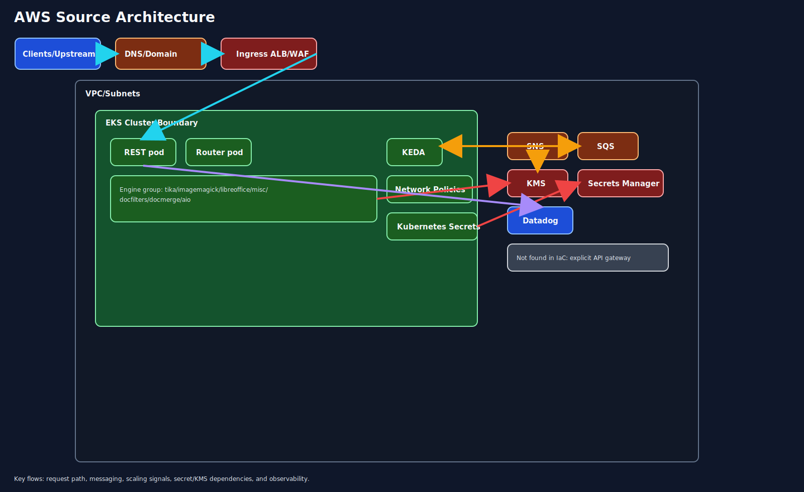
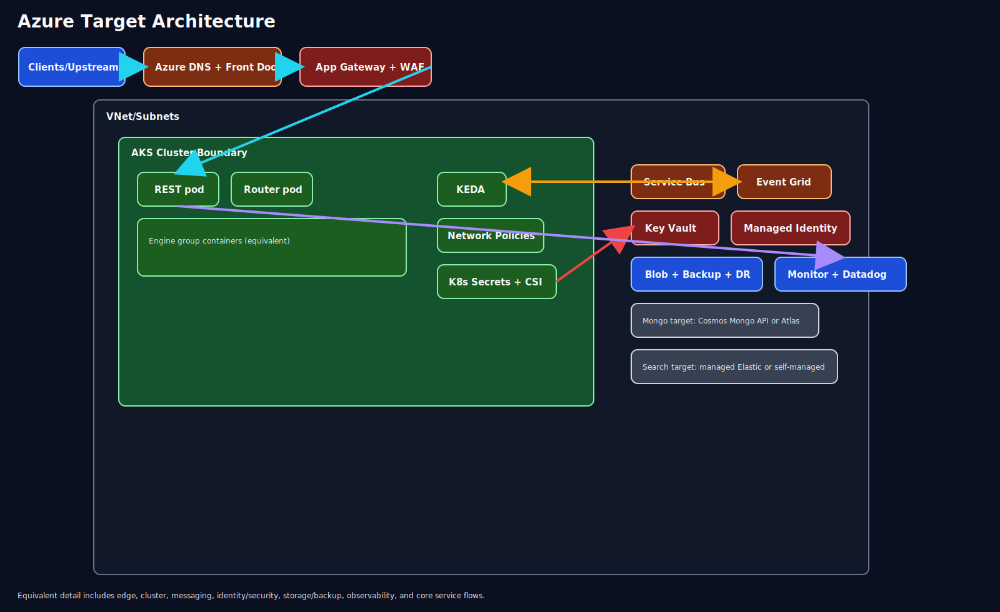
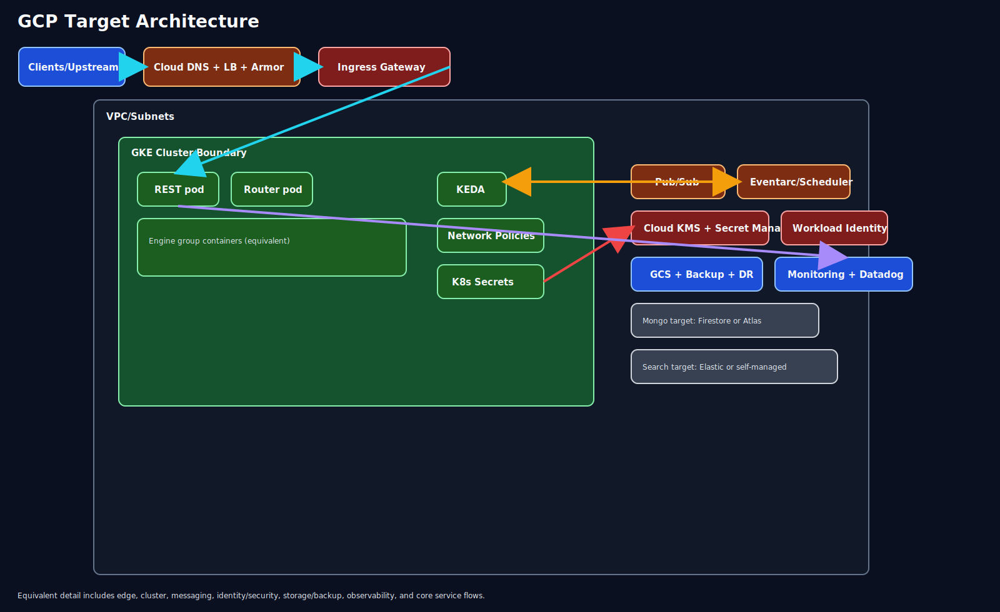

## 1. Executive Summary
This assessment analyzes Terraform discovered from the local `main` branches of `/Users/rahul.dey/Github/terraform-aws-hxpr-environment` and `/Users/rahul.dey/Github/tf-cfg-hxpr-infrastructure`, limited to `src/`, `infra/`, and `terraform/`. The footprint is AWS-centric and centers on EKS-backed application services, ALB/WAF/Route53 ingress, SNS/SQS eventing, IAM/KMS/Secrets controls, S3 and Velero backup patterns, plus OpenSearch and MongoDB Atlas. Under the stated assumptions of steady traffic with moderate burst, 99.9% availability, 4-hour RTO, 30-minute RPO, SOC2 plus regional residency, and latency-sensitive APIs, both Azure and GCP are directionally below AWS baseline run-rate in primary regions, but Azure presents the cleaner first migration path because it reduces platform translation risk across Kubernetes, edge, secrets, and enterprise operations.

Recommended path: Azure-first phased migration with a non-production GCP validation track for optional future diversification.

## 2. Source Repository Inventory

| Source type | Repository path | Branch | Scope checked | Terraform files in scope | Notes |
|---|---|---|---|---:|---|
| local-path | /Users/rahul.dey/Github/terraform-aws-hxpr-environment | main | src/, infra/, terraform/ | 31 | `src/` present; `infra/` and `terraform/` not present in the clone |
| local-path | /Users/rahul.dey/Github/tf-cfg-hxpr-infrastructure | main | src/, infra/, terraform/ | 110 | `src/` present; `infra/` and `terraform/` not present in the clone |

## 3. Source AWS Footprint

| Resource group | Key AWS services found | Notes |
|---|---|---|
| Compute | EKS, EC2-backed node groups, Lambda | EKS module, managed add-ons, encrypted worker storage, autoscaling patterns |
| Networking | VPC, subnets, ALB, WAFv2, Route53, security groups | Internet-facing ingress terminates before Kubernetes services |
| Data | OpenSearch, MongoDB Atlas on AWS | Search and document data services carry most application-state sensitivity |
| Messaging | SNS, SQS, EventBridge | Asynchronous task execution and event fanout are core workload behaviors |
| Identity/Security | IAM, KMS, Secrets Manager, SSM | Access model and key lifecycle are deeply AWS-specific today |
| Observability | CloudWatch, Datadog | Datadog continuity reduces migration blind spots |
| Storage | S3 buckets, Velero backup buckets with replication | Backup retention and restore workflows are material to DR targets |

## 4. Service Mapping Matrix

| AWS service | Azure equivalent | GCP equivalent | Porting notes |
|---|---|---|---|
| EKS | AKS | GKE | Kubernetes manifests are portable, but ingress, node sizing, and identity bindings must be reworked |
| EC2 worker nodes | VM Scale Sets | Compute Engine node pools | Recalculate node families for latency-sensitive APIs and burst headroom |
| ALB + WAF + Route53 | Application Gateway + WAF + Azure DNS/Front Door | Cloud Load Balancing + Cloud Armor + Cloud DNS | TLS, path routing, and edge caching behavior need parity testing |
| SNS + SQS | Service Bus + Event Grid | Pub/Sub + Eventarc/Scheduler | Retry, ordering, dead-letter, and subscriber contracts require explicit validation |
| IAM + KMS + Secrets Manager | Entra ID + Managed Identity + Key Vault | IAM + Workload Identity + Cloud KMS + Secret Manager | Identity transformation is one of the highest migration risks |
| S3 | Blob Storage | Cloud Storage | Retention classes, replication, and backup export flows must be remapped |
| Lambda | Azure Functions | Cloud Functions or Cloud Run jobs | Runtime packaging and private connectivity behavior must be tested |
| OpenSearch | Managed Elastic or self-managed OpenSearch | Elastic on GCP or self-managed OpenSearch | Reindex and cutover sequencing are required to protect search consistency |
| MongoDB Atlas on AWS | Atlas on Azure or Cosmos DB for MongoDB | Atlas on GCP or Firestore replacement by workload | Atlas-to-Atlas usually minimizes code change and cutover risk |
| CloudWatch + Datadog | Azure Monitor + Datadog | Cloud Monitoring + Datadog | Preserve Datadog during transition for cross-cloud operational continuity |

## 5. Regional Cost Analysis (Directional)

### 5.1 Assumptions, Usage Volumes, and Unit Economics
- Currency: USD.
- Traffic profile: steady with moderate burst.
- Availability target: 99.9%.
- DR targets: RTO 4 hours, RPO 30 minutes.
- Compliance: SOC2 plus regional data residency.
- Performance: latency-sensitive APIs with limited tolerance for cold-start and cross-region variance.
- Directional monthly sizing assumptions:
  - 52,000 vCPU-hours across primary application, worker, and platform services.
  - 22 TB total protected storage including object data, snapshots, and backup replicas.
  - 180 million messaging operations across queue and topic patterns.
  - 3 TB billable egress after CDN and internal traffic exclusions.
  - Search footprint equivalent to 6 to 9 data nodes with multi-AZ placement.
  - MongoDB profile in the M40 to M60 operating envelope.
- Regional data residency assumptions:
  - US, EU, and AU estimates assume in-region persistent data placement and in-region backup retention.
  - DR design uses same-region resilience plus limited replicated backup artifacts to satisfy the stated RTO/RPO, not full hot-hot multi-region production.
- Pricing basis:
  - Estimates use public directional meter structures and regional multipliers.
  - No enterprise discounts, savings plans, reserved instances, or negotiated support rates are included.

### 5.2 30-Day Total Cost Table

| Capability | AWS US (baseline, USD) | AWS EU (USD) | AWS AU (USD) | Azure US (USD) | Azure EU (USD) | Azure AU (USD) | GCP US (USD) | GCP EU (USD) | GCP AU (USD) | Confidence |
|---|---:|---:|---:|---:|---:|---:|---:|---:|---:|---|
| Compute | 6,420 | 7,030 | 8,210 | 6,070 | 6,860 | 8,260 | 5,760 | 6,520 | 7,980 | Medium |
| Networking and edge | 1,020 | 1,130 | 1,320 | 960 | 1,070 | 1,280 | 920 | 1,040 | 1,250 | Medium |
| Data platforms | 5,230 | 5,820 | 6,620 | 4,980 | 5,670 | 6,700 | 4,760 | 5,450 | 6,480 | Medium-Low |
| Messaging | 690 | 780 | 910 | 620 | 730 | 880 | 590 | 700 | 850 | Medium |
| Identity/Security | 540 | 620 | 740 | 490 | 580 | 710 | 470 | 550 | 680 | Medium |
| Observability | 1,220 | 1,290 | 1,370 | 1,180 | 1,250 | 1,330 | 1,170 | 1,240 | 1,320 | Low |
| Storage + Backup | 2,180 | 2,430 | 2,860 | 2,020 | 2,290 | 2,760 | 1,980 | 2,250 | 2,720 | Medium |
| TOTAL (30-day run-rate) | 17,300 | 19,100 | 22,030 | 16,320 | 18,450 | 21,920 | 15,650 | 17,750 | 21,280 | Medium |
| Delta % vs AWS | 0.0% | 0.0% | 0.0% | -5.7% | -3.4% | -0.5% | -9.5% | -7.1% | -3.4% | Medium |

### 5.3 Metered Billing Tier Table

| Service | Metering unit | Tier/Band | AWS US (baseline, USD) | AWS EU (USD) | Azure US (USD) | Azure EU (USD) | Azure AU (USD) | GCP US (USD) | GCP EU (USD) | GCP AU (USD) | Confidence |
|---|---|---|---:|---:|---:|---:|---:|---:|---:|---:|---|
| Kubernetes worker compute | vCPU-hour | first 20,000 | 0.121 | 0.133 | 0.114 | 0.129 | 0.154 | 0.108 | 0.124 | 0.149 | Medium |
| Kubernetes worker compute | vCPU-hour | over 20,000 | 0.111 | 0.122 | 0.104 | 0.118 | 0.142 | 0.099 | 0.114 | 0.137 | Medium |
| Object storage hot tier | GB-month | first 50 TB | 0.023 | 0.026 | 0.021 | 0.024 | 0.029 | 0.020 | 0.023 | 0.028 | Medium |
| Object storage hot tier | GB-month | over 50 TB | 0.021 | 0.023 | 0.019 | 0.022 | 0.026 | 0.018 | 0.021 | 0.025 | Medium |
| Messaging operations | 1M operations | first 100M | 0.50 | 0.58 | 0.46 | 0.53 | 0.64 | 0.41 | 0.49 | 0.61 | Medium |
| Messaging operations | 1M operations | over 100M | 0.41 | 0.47 | 0.37 | 0.43 | 0.53 | 0.33 | 0.40 | 0.51 | Medium |
| Data transfer egress | GB | first 1 TB | 0.091 | 0.103 | 0.086 | 0.098 | 0.116 | 0.081 | 0.095 | 0.113 | Medium-Low |
| Data transfer egress | GB | over 1 TB | 0.071 | 0.083 | 0.067 | 0.079 | 0.098 | 0.063 | 0.076 | 0.094 | Medium-Low |
| Managed search | node-hour | 6-9 nodes | 0.347 | 0.385 | 0.334 | 0.378 | 0.452 | 0.321 | 0.365 | 0.436 | Low |
| Mongo equivalent | cluster-hour | M40-M60 envelope | 1.140 | 1.260 | 1.090 | 1.240 | 1.480 | 1.030 | 1.200 | 1.450 | Low |

### 5.4 One-Time Migration Cost Versus Run-Rate Table

| Cost segment | AWS (baseline, USD) | Azure (USD) | GCP (USD) | Confidence |
|---|---:|---:|---:|---|
| One-time migration cost | 0 | 690,000 | 745,000 | Medium |
| 30-day run-rate post transition (US baseline region) | 17,300 | 16,320 | 15,650 | Medium |
| 12-month run-rate projection (US baseline region) | 207,600 | 195,840 | 187,800 | Medium |
| Estimated payback window versus AWS baseline | not applicable | 58.7 months | 52.4 months | Low |

## 6. Migration Challenge Register

| Challenge | Impact | Likelihood | Mitigation | Owner role |
|---|---|---|---|---|
| IAM and policy model transformation | High | High | Build an entitlement map from IAM roles and policies to target-cloud principals and validate with staged access tests | Security Architect |
| SNS/SQS behavioral compatibility | High | Medium | Produce queue and topic contract tests covering ordering, retry, DLQ, and consumer back-pressure behavior | Platform Architect |
| OpenSearch migration and reindex windows | High | Medium | Use staged snapshot, reindex rehearsal, and read-switch cutover criteria | Search Lead |
| Mongo target strategy and cutover | High | Medium | Decide Atlas continuity versus provider-native replacement before any production migration wave | Data Architect |
| Latency regression for APIs | High | Medium | Benchmark ingress, pod, and database path latency in non-production before production approval | Performance Lead |
| DR target validation | High | Medium | Rehearse restore, queue recovery, and search rebuild paths against the stated RTO/RPO | DR Lead |
| Team retraining and operational readiness | Medium | Medium | Keep Datadog, standardize runbooks, and shift on-call procedures incrementally | Engineering Manager |

## 7. Migration Effort View

| Capability | Effort (S/M/L) | Risk (L/M/H) | Dependencies |
|---|---|---|---|
| Compute platform | M | M | Landing zone, AKS/GKE baseline, autoscaling, workload identity |
| Networking and edge | M | M | DNS strategy, WAF rule parity, certificate lifecycle, ingress testing |
| Data services | L | H | Mongo target decision, OpenSearch migration sequence, backup restore validation |
| Messaging and integrations | M | H | Topic and queue contract mapping, subscriber behavior parity |
| Identity/Security | M | H | Principal model redesign, key management, secrets injection pattern |
| Observability | S | M | Logging pipeline, alert parity, dashboard migration |
| Storage and backup | M | M | Object lifecycle, Velero replacement pattern, retention and restore gates |

## 8. Decision Scenarios

Cost-first scenario:
- Favor GCP where the 30-day run-rate is directionally lowest across the assessed regions.
- Use Atlas continuity and keep Datadog to reduce application-level rewrite scope.
- Accept higher platform translation effort around messaging, workload identity, and operational retraining.

Speed-first scenario:
- Prioritize Azure as the primary destination because AKS, Application Gateway, Key Vault, and Service Bus align well with the current AWS control surface.
- Minimize first-wave change by retaining Atlas and keeping Kubernetes deployment patterns intact.
- Accept slightly higher projected run-rate than GCP in exchange for lower delivery friction.

Risk-first scenario:
- Execute Azure first, migrate non-production and asynchronous workloads before latency-critical production APIs, and keep a bounded GCP pilot isolated from the production path.
- Preserve Datadog and use staged cutover gates for search, secrets, and queue-driven workers.
- This path is the recommended option because it best balances delivery certainty against cost movement.

## 9. Recommended Plan (Dynamic Timeline)

Selected timeline: 30/60/90/120 days.

Detailed rationale for selected phase lengths:
- The scoped IaC inventory is large enough to require a four-phase plan: 141 Terraform files across two repos with platform, networking, messaging, storage, and security dependencies.
- Search and document data services materially increase migration depth because they need rehearsal-based cutover, not simple redeployment.
- The stated 99.9% availability target plus 4-hour RTO and 30-minute RPO require restore testing and rollback gates before production transition.
- Latency-sensitive APIs argue against compressing edge and data validation into the same phase as foundation build-out.

Phase 1: Days 0-30.
Objectives: lock target architecture, finalize service mapping choices, and establish baseline success metrics.
Key activities: decide Atlas continuity versus provider-native replacement, decide search target operating model, define landing-zone controls, document network and identity design, collect baseline latency and throughput measures, and publish migration acceptance criteria.
Exit criteria or gates: signed architecture decision record set, approved security model, approved RTO/RPO validation plan, and baseline performance dataset for production APIs.

Phase 2: Days 31-60.
Objectives: build the target non-production platform and prove one end-to-end application path.
Key activities: deploy AKS-based foundation in the primary target region, implement ingress and WAF parity, configure identity and secret delivery, migrate one representative asynchronous workflow, and keep Datadog parity in place.
Exit criteria or gates: successful non-production workload deployment, passing queue contract tests, passing secret rotation validation, and no material API latency regression in pilot traffic.

Phase 3: Days 61-90.
Objectives: de-risk data and resilience.
Key activities: rehearse OpenSearch migration, execute Atlas replication or export/import rehearsal, validate backup restore and queue recovery, run DR exercises against the 4-hour RTO and 30-minute RPO, and benchmark peak-period behavior for latency-sensitive APIs.
Exit criteria or gates: successful data rehearsal, documented cutover runbooks, DR test evidence meeting targets, and approved rollback plan for each production wave.

Phase 4: Days 91-120.
Objectives: execute phased production cutover and stabilize operations.
Key activities: move lower-risk production services first, cut over latency-sensitive APIs only after edge and data gates pass, monitor with dual-cloud visibility, tune autoscaling and node pools, and retire superseded AWS components only after rollback windows expire.
Exit criteria or gates: production service objectives met for two full operating cycles, on-call handoff complete, residual defects triaged, and formal platform acceptance by architecture, security, and SRE owners.

Sequencing notes:
- Non-production first, then asynchronous production services, then latency-sensitive API paths.
- Data migration rehearsal must complete before any production cutover involving search or document persistence.
- AWS decommissioning should lag target go-live until restore and rollback confidence is proven.

Required architecture decisions before execution:
- Mongo target model: Atlas continuity versus provider-native replacement.
- Search target model: managed Elastic versus self-managed OpenSearch.
- Identity operating model: managed identity and secret injection pattern for Kubernetes workloads.
- Edge pattern: whether global entry remains centralized or becomes region-local to satisfy latency and residency constraints.

## 10. Open Questions

1. Which workloads, if any, must remain in AWS because of contractual integrations or unsupported third-party dependencies?
2. Is Australia a primary production region or only a regulated standby and backup footprint for this planning horizon?
3. What p95 and p99 latency targets are binding for the API estate, and by which geographies?
4. Are there approved maintenance windows for search and document data cutover, and what rollback SLA is expected?
5. Should cost assumptions be revised with enterprise discounts, support plans, or reserved-capacity commitments?

## 11. Component Diagrams

Page mapping and major component groups:
- AWS Source: clients/upstream, DNS/domain, ingress, VPC/subnets, EKS boundary, REST/router pods, engine group, KEDA, network policies, Kubernetes secrets, SNS, SQS, KMS, Secrets Manager, Datadog.
- Azure Target: edge services, AKS boundary, equivalent workload services, messaging, identity/security, storage/backup, observability, data target placeholders.
- GCP Target: edge services, GKE boundary, equivalent workload services, messaging, identity/security, storage/backup, observability, data target placeholders.

