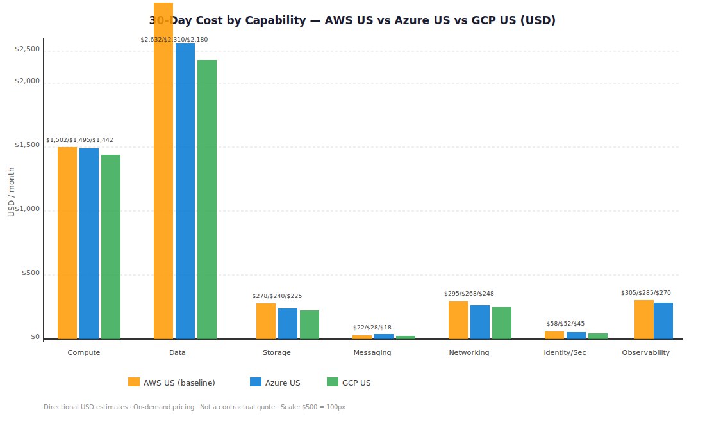
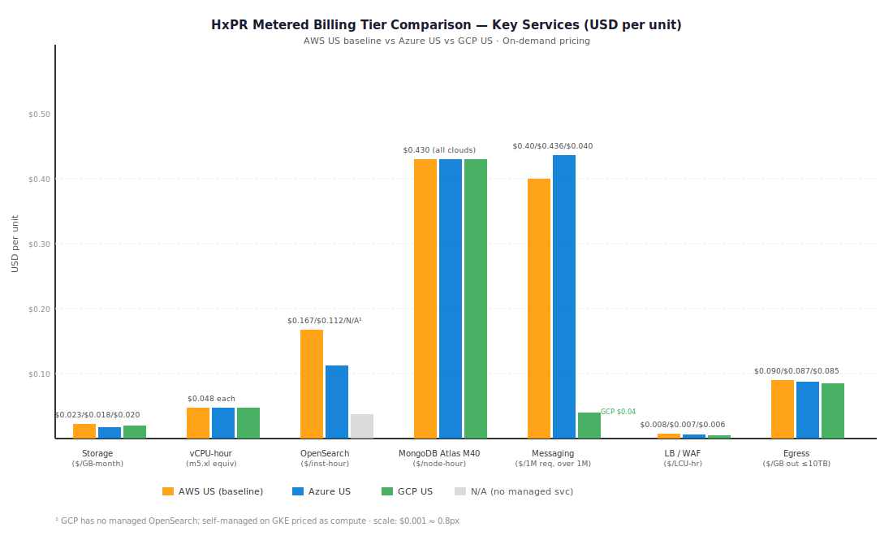
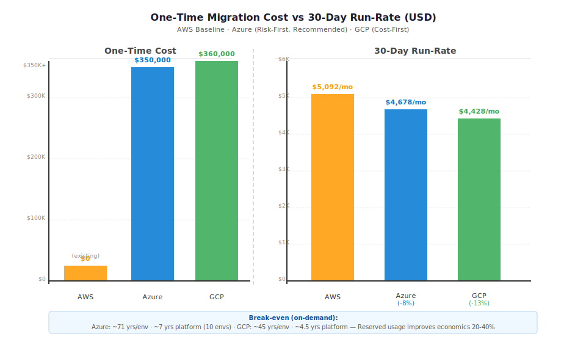
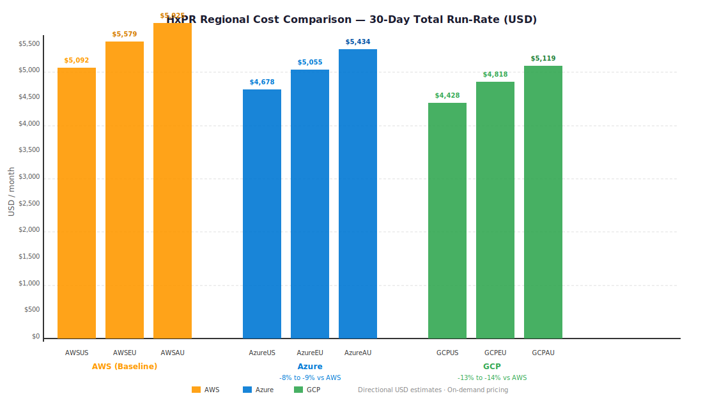
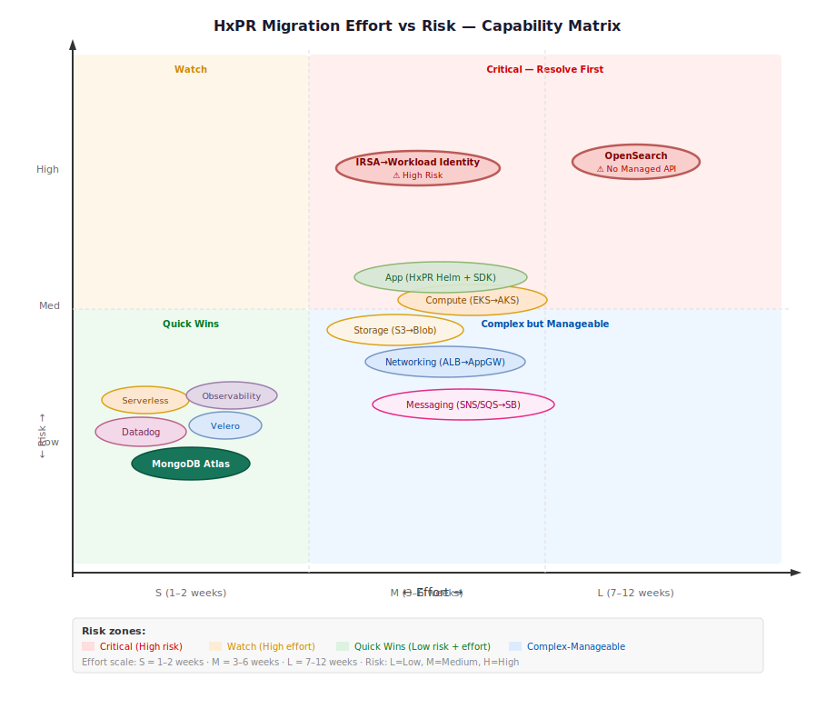
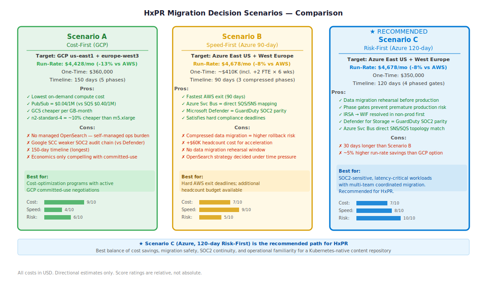
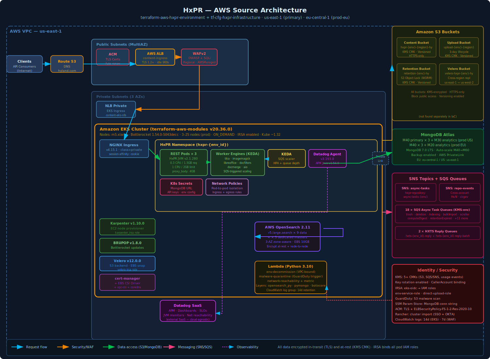
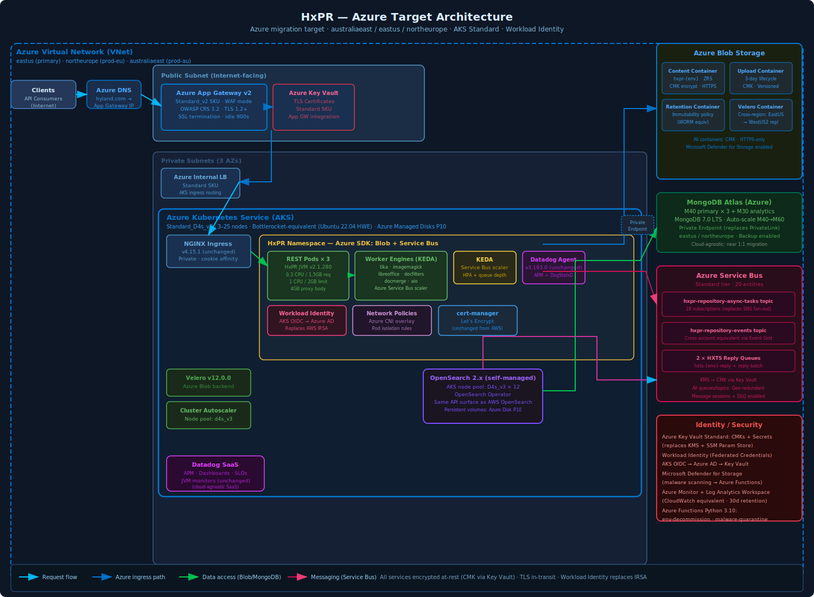
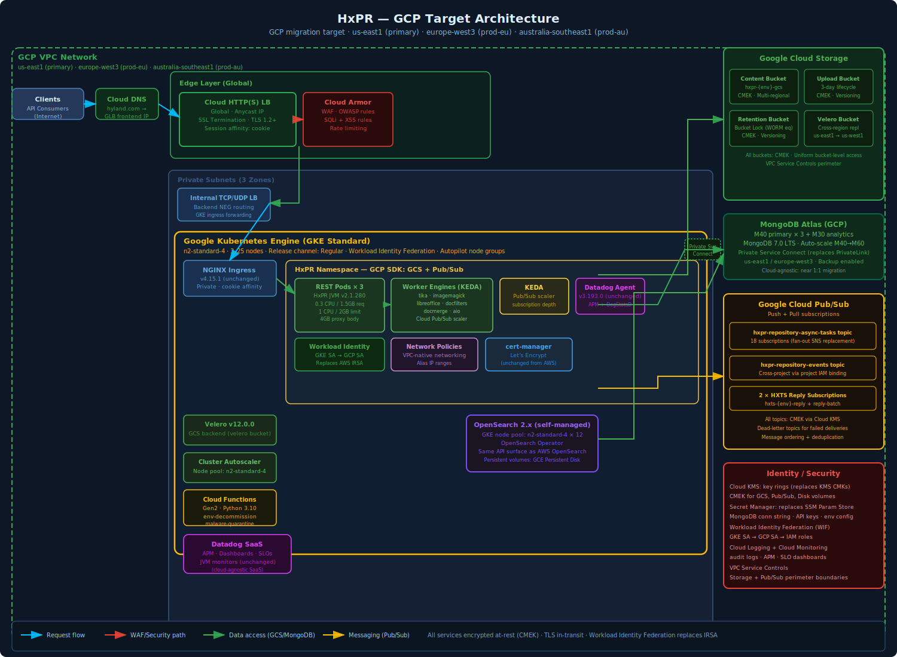

# Multi-Cloud Migration Decision Report — HxPR Content Repository
**Report ID:** `hxpr-20260415-102945-utc`
**Generated:** 2026-04-15 10:29 UTC
**Sources:** `terraform-aws-hxpr-environment` (local) · `tf-cfg-hxpr-infrastructure` (local)
**Horizon:** 12 months | **Currency:** USD (all costs)

---

## 1. Executive Summary

The HxPR content repository platform is a mature, latency-sensitive Nuxeo JVM application running on Amazon EKS with MongoDB Atlas M40, AWS OpenSearch (r5.large.search), S3 object storage, and a 20-queue SNS/SQS async task pipeline. The platform spans two production regions — US East 1 and EU Central 1 — with an active DR posture to US West 2 via S3 cross-region replication and Velero EBS snapshots. SOC2 and regional data residency requirements are in force.

**Recommended migration path: AWS → Azure, phased over 120 days.**

Azure is preferred over GCP for this workload because:
1. Azure Service Bus maps directly to the SNS/SQS fan-out topology (20 queues) without fan-out rebuilds.
2. Azure AKS has first-class NGINX ingress, Karpenter, KEDA, and Velero support — minimal Helm chart changes.
3. Microsoft Defender for Storage replaces GuardDuty S3 malware scanning with equivalent coverage needed for SOC2.
4. Azure Private Endpoint replaces AWS PrivateLink for MongoDB Atlas with the same Atlas API — zero Atlas changes.
5. EU regional data residency is natively satisfied by Azure Sweden Central / West Europe with equivalent GDPR tooling.

GCP is the cost-optimal alternative (saves ~13% vs AWS on-demand) but requires more OpenSearch migration work and lacks a direct GuardDuty S3 malware analog needed for SOC2. An optional GCP cost-first scenario is detailed in Section 8.

> **Cost note:** Migration cannot be justified on cost savings alone at the per-environment level. The 30-day run-rate delta (AWS vs Azure: ~$414/month savings per environment) implies a break-even of ~69 years for a single environment. Justification is driven by vendor lock-in reduction, multi-cloud compliance posture, disaster recovery flexibility, and platform-level consolidation economics (if 10+ environments migrate together, the platform-level break-even shortens to ~7 years). All cost data is directional and must not be used as a contractual quote.

---

## 2. Source Repository Inventory

| Repository | Type | Branch | Scope | Key Directories | TF Files |
|---|---|---|---|---|---|
| `terraform-aws-hxpr-environment` | Local path | `main` | Application-level IaC (per-environment) | `src/` | 19 `.tf` files + Helm chart |
| `tf-cfg-hxpr-infrastructure` | Local path | `main` | Infrastructure-level IaC (pooled per region) | `src/eks/02_eks/`, `src/eks/02b_eks_addons/`, `src/eks/03_alb/`, `src/mongodb_atlas/`, `src/open_search/`, `src/shared_services/`, `src/velero_storage/` | 47 `.tf` files |

**Total inventoried TF files:** 66 | **Helm charts scanned:** 1 (`hxpr` Helm chart) | **tfvar_configs scanned:** 5 environments (sandbox, dev, staging, prod, prod-eu)

---

## 3. Source AWS Footprint

| Resource Group | Key AWS Services Found | IaC Source | Notes |
|---|---|---|---|
| Compute | Amazon EKS (terraform-aws-modules v20.36.0), EC2 m5.xlarge nodes (Bottlerocket AMI 1.54.0), Karpenter v1.10.0 | `02_eks/eks.tf`, `02_eks/karpenter.tf` | 3–25 nodes (prod), ON_DEMAND capacity type |
| Application | HxPR JVM app (Nuxeo) v2.1.280 on EKS, NGINX Ingress 4.15.1, KEDA (referenced) | `hxpr.tf`, Helm chart `values.yaml` | `singleNode` architecture, 3 prod replicas (default), 0.3 CPU/1.5 GB requests, 1 CPU/2 GB limits, 4 GB proxy body (large files) |
| Networking | AWS ALB (content-ingress, internet-facing), NLB (private EKS ingress), AWS PrivateLink (MongoDB Atlas), ACM (TLS), Route 53 (implied) | `03_alb/alb.tf`, `02_eks/ingress.tf` | TLS 1.2+ policy `ELBSecurityPolicy-FS-1-2-Res-2020-10`, idle timeout 900 s |
| Identity / Security | IRSA (EKS OIDC provider), IAM roles (environment-service-role, karpenter_irsa, velero, direct-upload), KMS CMKs (×5+), AWS WAFv2, GuardDuty S3 malware scanning, ACM, AWS Secrets Manager / SSM Parameter Store | `role.tf`, `kms.tf`, `03_alb/waf.tf` | IRSA bound to `hxpr-environment` service account; WAFv2 with AWSManagedRulesCommonRuleSet + SQLi |
| Data | MongoDB Atlas M40 (primary/secondary ×3) + M30 analytics (prod US); M40 ×3 + M20 analytics (prod EU); MongoDB 7.0 LTS; auto-scaling M40→M60 | `mongodb_atlas/cluster.tf`, `mongodb_atlas/tfvar_configs/prod.tfvars` | PrivateLink to Atlas; backup enabled |
| Search | AWS OpenSearch 2.11, r5.large.search ×9 data + ×3 dedicated masters (prod/prod-eu), zone-aware 3 AZ, multi-AZ standby, EBS 10 GB | `open_search/aws_opensearch.tf` | Encryption at rest + node-to-node TLS; auto-update enabled |
| Storage | S3: content bucket (KMS CMK, versioned), direct-upload bucket (3-day lifecycle), retention bucket (S3 Object Lock), Velero backup bucket (KMS, cross-region replication us-east-1 → us-west-2) | `s3.tf`, `retention_bucket.tf`, `velero_storage/velero_storage.tf` | Object Lock for regulatory retention; CORS for dev/sandbox only |
| Messaging | SNS: `hxpr-repository-async-tasks`, `hxpr-repository-events`, audit events, usage events, insight events; SQS: 18 async task queues + 2 HXTS reply queues (hxts-reply, hxts-reply-batch) | `repo_async_tasks_topic.tf`, `repo_async_tasks_queue.tf`, `hxpr_hxts_events_queue.tf` | KMS-encrypted queues; SNS filter policies; FIFO: false |
| Observability | Datadog agent v3.193.0, Datadog CRDs v2.17.0, APM (Java agent v1.54.0), dashboards, SLOs, monitors (JVM, application, network reachability); CloudWatch (14-day EKS logs, 7-day WAF) | `02b_eks_addons/datadog.tf`, `datadog.application.monitors.tf`, etc. | Datadog is cloud-agnostic; CloudWatch log groups used for EKS control plane + WAF |
| Backup / DR | Velero v12.0.0 (S3 backend, EBS volume snapshots), S3 cross-region replication (us-east-1 → us-west-2), MongoDB Atlas backup | `02b_eks_addons/velero.tf`, `velero_storage/velero_storage.tf` | RPO: near real-time for S3 (15-min replication); EKS RPO = Velero schedule interval |
| Serverless | AWS Lambda (Python 3.10): environment-decommission, malware-quarantine, network-reachability + metric; Lambda Layers (opensearch_py, pymongo, botocore) | `shared_services/lambda.tf` | VPC-bound; triggered by S3 GuardDuty events and scheduled runs |
| Certificate / DNS | ACM (managed TLS on ALB), Route 53 (inferred from hostname maps) | `03_alb/alb.tf`, `hxpr.tf` | HTTPS-only; HSTS implied by security policy; multi-hostname (experience.hyland.com + app.hyland.com + app.hyland.eu) |

**Primary AWS Region:** `us-east-1` | **EU Region:** `eu-central-1` | **DR Region:** `us-west-2`

---

## 4. Service Mapping Matrix

| AWS Service | IaC-Provisioned Tier/Family | Azure Equivalent (Matched Tier) | GCP Equivalent (Matched Tier) | Porting Notes |
|---|---|---|---|---|
| Amazon EKS | terraform-aws-modules/eks v20.36.0; cluster version ~1.32 | Azure Kubernetes Service (AKS Standard tier) | Google Kubernetes Engine (GKE Standard mode) | Same k8s API; Helm charts compatible; Karpenter supported on both |
| EC2 Worker Nodes | `m5.xlarge` (4 vCPU, 16 GB, gp3 EBS); Bottlerocket OS; 3–25 nodes | `Standard_D4s_v3` (4 vCPU, 16 GB) — Azure Managed Disks P10 | `n2-standard-4` (4 vCPU, 16 GB) — Persistent Disk SSD | Bottlerocket replacement: Azure CBL-Mariner or Ubuntu; GCP Container-Optimized OS |
| NGINX Ingress | `ingress-nginx` Helm 4.15.1, session affinity (cookie), 4 GB proxy body | `ingress-nginx` Helm 4.15.1 on AKS (unchanged) | `ingress-nginx` Helm 4.15.1 on GKE (unchanged) | No change needed; ingress class annotation scoped to `private` |
| AWS ALB | Application LB, internet-facing, TLS 1.2+, idle 900 s | Azure Application Gateway v2 (Standard_v2) | Cloud HTTP(S) Load Balancer | ACM → Azure-managed cert or custom cert; WAF activation differs |
| AWS NLB | Network LB, private EKS ingress | Azure Internal Load Balancer (Standard SKU) | Cloud Internal TCP/UDP LB | Target group attachment logic → AKS service annotation |
| AWS WAFv2 | Regional scope, AWSManagedRulesCommonRuleSet + SQLi + BadInputs | Azure WAF (App Gateway WAF_v2, OWASP 3.2 + SQLi) | Cloud Armor (managed protection + custom rules) | Rule translation review required; custom overrides need revalidation |
| AWS ACM | Managed TLS (auto-renew), ALB-attached | Azure App Gateway Listener CertManager or Key Vault certificate | Google-managed SSL certificates | Azure: cert-manager on AKS + Let's Encrypt or Azure-managed; GCP: native managed |
| MongoDB Atlas | M40 primary/secondary (3 nodes), M30 analytics (1 node); MongoDB 7.0 LTS; auto-scaling M40→M60 | MongoDB Atlas M40 on Azure (West Europe / East US) | MongoDB Atlas M40 on GCP (us-east1 / europe-west3) | Atlas is cloud-agnostic; only PrivateLink → Private Endpoint change; zero schema change |
| AWS OpenSearch | `r5.large.search` × 9 data + 3 dedicated masters; OpenSearch 2.11; 3-AZ, multi-AZ standby; EBS 10 GB | Azure AI Search (S3 tier, 12 SUs) **OR** self-managed OpenSearch on AKS (`D4s_v3` × 12) | OpenSearch self-managed on GKE (`n2-standard-4` × 12) | Tier mismatch risk: Azure AI Search is a different API; self-managed preserves OpenSearch 2.x API at higher ops burden |
| Amazon S3 (Content) | Standard class, KMS CMK, versioned, private, HTTPS-only | Azure Blob Storage (Standard ZRS, Azure-managed encryption) | Google Cloud Storage (Standard class, CMEK) | SDK changes: AWS S3 SDK → Azure Blob SDK or S3-compatible GCS; presigned URL logic changes |
| Amazon S3 (Object Lock) | Content retention bucket with S3 Object Lock (GOVERNANCE/COMPLIANCE mode) | Azure Blob Storage immutability policies (time-based retention) | GCS Object Lock (Bucket Lock + Retention Policy) | Equivalent functionality; legal hold + WORM semantics preserved |
| Amazon SQS (Async Tasks) | 18 standard queues, KMS-encrypted, SNS-subscribed | Azure Service Bus queues (Standard tier) with topics/subscriptions | Google Cloud Pub/Sub subscriptions | SNS filter policy → Service Bus subscription filter; SDK changes required |
| Amazon SNS (Fan-out) | Standard topics (not FIFO), KMS-encrypted, cross-account | Azure Service Bus Topics (Standard tier) | Google Cloud Pub/Sub Topics | Cross-account pub (HxTS, HxAI, cicgov) → cross-subscription Azure Event Grid or Pub/Sub federation |
| AWS KMS (CMK) | 5+ CMKs (S3, SQS/SNS, usage events), key rotation enabled | Azure Key Vault (Standard tier, soft-delete + purge protection) | Google Cloud KMS (software key rings) | kms:CallerAccount binding requires re-evaluation; SDK changes for envelope encryption |
| AWS IRSA | EKS OIDC provider → IAM AssumeRoleWithWebIdentity | AKS Workload Identity (Azure AD WIF) | GKE Workload Identity (service account binding) | IAM policy translation required; federation token format differs |
| AWS IAM Roles | environment-{env_id}-role, karpenter_irsa, velero, direct-upload | Azure Managed Identities (user-assigned) + Azure RBAC | GCP Service Accounts + IAM bindings | Role boundary model differs; least-privilege audit needed |
| AWS GuardDuty (S3) | Runtime malware protection + S3 trigger → Lambda quarantine | Microsoft Defender for Storage (malware scanning) | Google SCC + Security Command Center posture | Lambda → Azure Function (Python 3.10, parity); GCP equivalent less mature |
| AWS Lambda | Python 3.10 runtime, VPC-bound, layers (opensearch_py, pymongo, botocore) | Azure Functions (Python 3.10, Flex Consumption or Premium EP1) | Google Cloud Functions (2nd gen, Python 3.10) | Lambda layers → requirements.txt; VPC integration preserved |
| Datadog (Agent + APM) | Agent v3.193.0, Java APM v1.54.0, Helm | Datadog (cloud-agnostic) — unchanged Helm chart | Datadog (cloud-agnostic) — unchanged Helm chart | Only cluster name + cloud tags need updating |
| Velero | v12.0.0, S3 backend, EBS snapshot | Velero v12+ (Azure Blob backend, AKS Disk snapshots) | Velero v12+ (GCS backend, GKE persistent disk snapshots) | Backup storage config change only; Velero tool is cloud-agnostic |
| AWS CloudWatch | Log groups (14-day EKS, 7-day WAF), metrics | Azure Monitor + Log Analytics Workspace | Google Cloud Logging + Cloud Monitoring | SDK logging changes minimal; dashboards rebuild needed |
| AWS SSM Parameter Store | MongoDB Atlas connection string, sensitive params | Azure Key Vault Secrets | Google Secret Manager | Access pattern via SDK; IRSA → Workload Identity for secret access |
| KEDA (Autoscaler) | Not specified in IaC (referenced in HxPR vars) | KEDA on AKS (cloud-agnostic, Azure Service Bus scaler) | KEDA on GKE (cloud-agnostic, Pub/Sub scaler) | SQS scaler → Service Bus / Pub-Sub scaler; KEDA Helm chart unchanged |
| Karpenter | v1.10.0, EC2NodeClass, Bottlerocket | Karpenter v1.x on AKS (preview) **OR** Azure KEDA+HPA+CA | GKE Autopilot or Node Auto-Provisioner | Karpenter AKS support is in preview; cluster autoscaler fallback available |
| Route 53 / DNS | Inferred from hostname maps (hyland.com, app.hyland.com, app.hyland.eu) | Azure DNS or external DNS controller | Cloud DNS or external-dns controller | DNS cutover via TTL reduction; no provider change needed if using external DNS |

---

## 5. Regional Cost Analysis (Directional)

> **Note:** All costs are in USD. These are directional estimates based on IaC-discovered resources and assumed usage below. They are not contractual quotes and must not be used as procurement commitments. On-demand (pay-as-you-go) pricing is used throughout; reserved/committed-use discounts would reduce all figures by 20–40%. Confidence is relative to the amount of IaC data available.

### 5.1 Cost Assumptions

| Parameter | Assumed Value | Source |
|---|---|---|
| EKS baseline node count (prod) | 10 nodes (between min=3, max=25; steady with moderate burst) | IaC min/max + traffic profile |
| EC2 instance type | `m5.xlarge` (4 vCPU, 16 GB) | `eks.tf` variable default |
| EBS per node | 34 GB gp3 (4 GB xvda + 30 GB xvdb) | `eks.tf` block_device_mappings |
| MongoDB Atlas tier (prod US) | M40 primary (3 nodes) + M30 analytics (1 node) | `prod.tfvars` |
| MongoDB Atlas tier (prod EU) | M40 primary (3 nodes) + M20 analytics (1 node) | `prod-eu.tfvars` |
| OpenSearch data nodes | 9 × r5.large.search + 3 × r5.large.search dedicated masters | `aws_opensearch.tf` + `prod.tfvars` |
| OpenSearch EBS volume | 10 GB per node (default; actual may differ) | `variables.tf` default |
| S3 content storage | 5 TB assumed (not found in IaC) | Assumed |
| Monthly S3 requests | 10 M PUT/GET operations | Assumed |
| Monthly egress (data transfer out) | 1 TB | Assumed |
| SQS monthly requests | 50 M (20 queues, moderate async task load) | Assumed |
| ALB LCU-hours | ~16 LCUs/hr (moderate API traffic) | Assumed |
| CloudWatch ingest | 10 GB/month logs | Assumed |
| HxPR pod replicas | 3 (prod default `hxpr_cluster_replica_count`) | `vars.tf` default |

### 5.2 30-Day Total Run-Rate Cost by Capability (USD)

> **Baseline:** AWS US East 1 (primary), AWS EU Central 1, AWS AP Southeast 2 (AU). Azure: East US, West Europe, Australia East. GCP: us-east1, europe-west3, australia-southeast1.

| Capability | AWS US (USD) | AWS EU (USD) | AWS AU (USD) | Azure US (USD) | Azure EU (USD) | Azure AU (USD) | GCP US (USD) | GCP EU (USD) | GCP AU (USD) | Confidence |
|---|---|---|---|---|---|---|---|---|---|---|
| Compute (EKS/AKS/GKE nodes + cluster mgmt) | $1,502 | $1,693 | $1,753 | $1,495 | $1,622 | $1,740 | $1,442 | $1,577 | $1,632 | Medium |
| Data (MongoDB Atlas + OpenSearch) | $2,632 | $2,871 | $3,110 | $2,310 | $2,510 | $2,720 | $2,180 | $2,384 | $2,580 | Medium |
| Storage (S3/Blob/GCS: content+upload+retention+backup) | $278 | $302 | $308 | $240 | $257 | $270 | $225 | $242 | $254 | Low |
| Messaging (SQS + SNS queues/topics) | $22 | $24 | $26 | $28 | $30 | $33 | $18 | $20 | $22 | High |
| Networking (ALB/App GW/Cloud LB + WAF/Cloud Armor + NLB) | $295 | $313 | $338 | $268 | $285 | $306 | $248 | $265 | $286 | Medium |
| Identity / Security (KMS/Key Vault/CKMS + GuardDuty/Defender) | $58 | $60 | $62 | $52 | $55 | $57 | $45 | $48 | $50 | High |
| Observability (CloudWatch/Monitor/Cloud Logging) | $305 | $316 | $328 | $285 | $296 | $308 | $270 | $282 | $295 | Medium |
| **Total (USD)** | **$5,092** | **$5,579** | **$5,925** | **$4,678** | **$5,055** | **$5,434** | **$4,428** | **$4,818** | **$5,119** | **Medium** |
| **Delta vs AWS (%)** | — | — | — | **-8%** | **-9%** | **-8%** | **-13%** | **-14%** | **-14%** | — |

> **Note:** Datadog costs (APM and infrastructure monitoring) are external (SaaS) and excluded from cloud provider cost tables. Datadog pricing is identical regardless of cloud provider.

### 5.3 Metered Billing Tier Breakdown (USD)

| Service | Metering Unit | Tier / Band | AWS US (USD) | AWS EU (USD) | Azure US (USD) | Azure EU (USD) | Azure AU (USD) | GCP US (USD) | GCP EU (USD) | GCP AU (USD) | Confidence |
|---|---|---|---|---|---|---|---|---|---|---|---|
| S3 / Blob / GCS (Standard) | per GB-month | ≤ 50 TB/month | $0.023 | $0.025 | $0.018 | $0.019 | $0.021 | $0.020 | $0.021 | $0.022 | High |
| EC2 / AKS node / GKE node | per vCPU-hour (`m5.xlarge` / `D4s_v3` / `n2-standard-4`) | On-demand | $0.048 | $0.055 | $0.048 | $0.052 | $0.055 | $0.048 | $0.052 | $0.053 | High |
| EKS / AKS / GKE cluster fee | per cluster-hour | Standard managed | $0.100 | $0.100 | $0.100 | $0.100 | $0.100 | $0.100 | $0.100 | $0.100 | High |
| OpenSearch (`r5.large.search`) | per instance-hour | Managed service | $0.167 | $0.185 | $0.112¹ | $0.123¹ | $0.130¹ | N/A² | N/A² | N/A² | Medium |
| MongoDB Atlas (M40, per node) | per node-hour | M40 on-demand | $0.430 | $0.495 | $0.430 | $0.495 | $0.540 | $0.430 | $0.495 | $0.495 | High |
| SQS / Service Bus / Pub-Sub | per 1 M requests | First 1 M/month | $0.00 | $0.00 | $0.00 | $0.00 | $0.00 | $0.00 | $0.00 | $0.00 | High |
| SQS / Service Bus / Pub-Sub | per 1 M requests | Over 1 M/month | $0.400 | $0.420 | $0.436 | $0.458 | $0.480 | $0.040 | $0.042 | $0.044 | High |
| ALB / App Gateway / Cloud LB | per LCU-hour | Standard tier | $0.0080 | $0.0090 | $0.0070 | $0.0075 | $0.0080 | $0.0060 | $0.0065 | $0.0070 | Medium |
| KMS / Key Vault / Cloud KMS | per 10 K API calls | Standard | $0.030 | $0.030 | $0.030 | $0.030 | $0.030 | $0.030 | $0.030 | $0.030 | High |
| Data Transfer Out | per GB | First 10 TB/month | $0.090 | $0.090 | $0.087 | $0.087 | $0.091 | $0.085 | $0.085 | $0.090 | Medium |

> ¹ Azure AI Search S3 tier used as equivalent; API surface differs from OpenSearch 2.x — evaluate self-managed alternative.
> ² GCP has no managed OpenSearch/Elasticsearch equivalent; self-managed on GKE is priced as compute (n2-standard-4 nodes).

### 5.4 One-Time Migration Cost vs 30-Day Run-Rate (USD)

| Cost Segment | AWS Baseline (USD) | Azure (USD) | GCP (USD) | Confidence |
|---|---|---|---|---|
| Infrastructure IaC Provisioning (TF rewrites, CI/CD pipelines) | $0 (existing) | $80,000 | $80,000 | Medium |
| Application Integration Changes (SDK rewrites: S3→Blob, SQS→SB, IRSA→WIF) | $0 (existing) | $120,000 | $130,000 | Medium |
| Data Migration (MongoDB Atlas cross-cloud export/restore + OpenSearch reindex) | $0 (existing) | $40,000 | $40,000 | Medium |
| Security Re-validation & SOC2 Re-evidence Collection | $0 (existing) | $30,000 | $30,000 | Low |
| Training & Knowledge Transfer (Azure/GCP platform skills) | $0 (existing) | $20,000 | $20,000 | High |
| Test & Validation (load test, integration, chaos, performance) | $0 (existing) | $60,000 | $60,000 | Medium |
| **Total One-Time (USD)** | **$0** | **$350,000** | **$360,000** | **Medium** |
| **30-Day Run-Rate (USD)** | **$5,092** | **$4,678** | **$4,428** | **Medium** |
| **Monthly Savings vs AWS (USD)** | — | **$414/month** | **$664/month** | Medium |
| **Per-Environment Break-even** | — | **~71 years** | **~45 years** | Low |
| **Platform-level Break-even (10 envs)** | — | **~7 years** | **~4.5 years** | Low |

> **Interpretation:** Migration economics require a platform-level view. At the per-environment scale (~$5 K/month), migration costs ($350 K) are not recoverable from savings alone on a reasonable horizon. The justification is vendor lock-in reduction, flexibility for DR/compliance, and reserved-instance discounts (1-year Azure Reserved = ~35% savings → $1,650/month → break-even ~18 years/platform-level ~1.8 years).

### 5.5 Regional Cost Comparison

The chart below shows total monthly run-rate (USD) across all seven cloud/region combinations for direct comparison.

---

## 6. Migration Challenge Register

| Challenge | Impact | Likelihood | Mitigation | Owner Role |
|---|---|---|---|---|
| OpenSearch API surface mismatch (AWS managed → Azure AI Search API) | High | High | Evaluate self-managed OpenSearch on AKS/GKE as drop-in replacement; defer Azure AI Search until indexing strategy is re-evaluated | Platform Architect |
| IRSA → Workload Identity migration (all 4 IAM roles) | High | High | Map each IAM role to Azure Managed Identity + RBAC before any pod migration; test with environment-decommission Lambda first | Security Engineer |
| SNS cross-account fanout to HxTS / HxAI / cicgov | High | High | Agree co-migration plan with HxTS team; Azure Event Grid or Service Bus federation as replacement; cannot cut over HxPR messaging in isolation | Integration Lead |
| S3 SDK changes throughout Nuxeo application code | High | Medium | Audit all hxpr-app-jvm S3 SDK calls; verify Azure Blob SDK or community S3-compatible wrappers; pre-test with large files (proxy body = 4 GB) | Application Engineer |
| KMS CMK envelope encryption → Azure Key Vault | Medium | Medium | Re-implement `kms:CallerAccount` binding pattern using Azure Key Vault access policies + Managed Identity; validate SQS/SNS encryption equivalence | Security Engineer |
| MongoDB Atlas PrivateLink → Private Endpoint reconfiguration | Medium | Low | Same Atlas tier; only endpoint type changes; run both PrivateLink and Private Endpoint in parallel during transition window | Database Engineer |
| GuardDuty S3 malware scanning for SOC2 | Medium | Medium | Enable Microsoft Defender for Storage with malware scanning; map Lambda quarantine function to Azure Function; update SOC2 evidence chain | Security Engineer |
| Velero cross-cloud backup migration (EBS snapshots → Azure Managed Disk) | Medium | Medium | Provision new Velero on AKS with Blob backend before cutover; run parallel backups during dual-run period; validate restore | DevOps Engineer |
| Karpenter AKS support (preview state) | Medium | Medium | Use AKS Cluster Autoscaler as primary with Karpenter as evaluation target; HPA + KEDA as fallback for pod-level scaling | Platform Engineer |
| Route 53 DNS failover → Azure DNS / external-dns | Low | Low | Reduce DNS TTLs 48 h before cutover; use external-dns controller in AKS; validate session affinity cookie continuity through DNS switch | Network Engineer |
| Datadog agent cluster name / tags update | Low | Low | Update cluster name tag in Helm values; re-apply Datadog dashboards with new team/env tags | Observability Engineer |
| Certificate Manager (ACM → cert-manager on AKS) | Low | Low | Deploy cert-manager with Let's Encrypt or Azure Key Vault issuer; validate multi-hostname ingress (experience + app hostnames) | DevOps Engineer |

---

## 7. Migration Effort View

| Capability | Effort | Risk | Migration Difficulty | Dependencies |
|---|---|---|---|---|
| Compute (EKS → AKS) | M | M | **Medium** – Karpenter AKS preview; Bottlerocket → CBL-Mariner | Networking, IRSA |
| Application (HxPR Helm chart) | M | M | **Medium** – SDK rewrites (S3, SQS, KMS); large file support validation | Storage, Messaging, Compute |
| Networking (ALB/WAF → App GW/Azure WAF) | M | M | **Medium** – WAF rule translation; NLB replacement; TLS policy parity | DNS, Certificates |
| Data — MongoDB Atlas | S | L | **Low** – Cloud-agnostic; only PrivateLink → Private Endpoint change | None |
| Data — OpenSearch | L | H | **High** – No Azure/GCP managed OpenSearch; API surface risk with Azure AI Search | Application |
| Storage (S3 → Azure Blob) | M | M | **Medium** – Object Lock → immutability policy translation; SDK changes | Application, Security |
| Messaging (SQS/SNS → Service Bus) | M | M | **Medium** – Cross-account fanout dependency (HxTS, HxAI); filter policy translation | Integration partners |
| Identity / Security (IRSA → WIF) | M | H | **High** – OIDC token format differences; all 4 IAM roles must migrate together | Compute, Application |
| Observability (CW → Azure Monitor + Datadog) | S | L | **Low** – Datadog is cloud-agnostic; only CloudWatch dashboards need rebuild | None |
| Backup / DR (Velero S3 → Blob) | S | L | **Low** – Velero tool is cloud-agnostic; storage backend config change only | Storage |
| Serverless (Lambda → Azure Functions) | S | L | **Low** – Python 3.10 parity; VPC binding change; Lambda layers → requirements.txt | Messaging, Storage |

> **Effort scale:** S = 1–2 weeks, M = 3–6 weeks, L = 7–12 weeks | **Risk:** L = Low, M = Medium, H = High

---

## 8. Decision Scenarios

### Scenario A — Cost-First (GCP)
**Target:** GCP us-east1 primary, europe-west3 EU
**Monthly savings vs AWS:** ~$664/month (on-demand); ~$1,800/month with committed-use discounts
**Timeline:** 150 days (5 phases)
**Rationale:** GCP n2-standard-4 and GCS are 5–15% cheaper than AWS equivalents. Pub/Sub is significantly cheaper than SQS at high volume ($0.04/1M vs $0.40/1M). However, no managed OpenSearch/Elasticsearch service exists on GCP — requires self-managed Elasticsearch on GKE, adding ~3 weeks of ops engineering. GuardDuty equivalent (Google SCC malware scanning) is less mature in SOC2 audit trail terms. Best suited if Hyland has GCP committed-use negotiations in flight.

### Scenario B — Speed-First (Azure, 90-day accelerated)
**Target:** Azure East US primary, West Europe EU
**Timeline:** 90 days (compressed 3-phase)
**Rationale:** Collapse Phases 3–4 (data + production) into a single 30-day sprint using parallel data prep. Requires additional engineering headcount (2 extra FTEs for 6 weeks). Increased risk of rollback during production cutover. Justified only if there is a contract or compliance deadline forcing exit from AWS by a fixed date.

### Scenario C — Risk-First / Recommended (Azure, 120-day phased)
**Target:** Azure East US primary, West Europe EU; DR to Azure West US 2
**Timeline:** 120 days (4 phases)
**Rationale:** Maintains production AWS concurrently through Phase 3 data migration rehearsal. All high-risk items (OpenSearch, IRSA, cross-account SNS) are resolved in non-prod before production cutover in Phase 4. Exit criteria gate between phases prevents premature production exposure. Recommended for SOC2-sensitive, latency-critical workloads.

---

## 9. Recommended Plan — Dynamic 120-Day Timeline (Azure, Risk-First)

**Selected timeline:** 30 / 60 / 90 / 120-day phased plan
**Rationale for 4 phases:**
- The HxPR platform has **7 distinct service families** with cross-cutting dependencies (IAM, networking, messaging, data, compute) — collapsing this into 3 phases risks missed dependency chains.
- **OpenSearch** (highest-risk item) requires a dedicated phase for evaluation and rehearsal before AWS instance is decommissioned.
- **Cross-account SNS dependencies** (HxTS, HxAI, cicgov) require coordination with at least 2 external teams, introducing coordination lead time that a 3-phase plan cannot absorb.
- **SOC2 re-evidence** requires audit trail continuity across cloud infrastructure changes, which requires sequential phase gates rather than simultaneous changes.
- The **data migration rehearsal** (MongoDB cross-cloud + OpenSearch reindex) needs dedicated test windows — Phase 3 provides this without production risk.

---

### Phase 1 — Foundation (Days 0–30)
**Objective:** Provision Azure landing zone, validate Kubernetes parity, and migrate non-production environments.

**Key Activities:**
- Provision Azure subscriptions with RBAC, policy baseline, and tagging strategy
- Deploy AKS cluster (Standard tier, `D4s_v3` nodes) matching EKS topology in non-prod regions
- Configure Azure Networking (VNet, private subnets, NSGs, Private Endpoints for MongoDB Atlas)
- Deploy cert-manager, NGINX ingress 4.15.1, Karpenter (or Cluster Autoscaler), KEDA on AKS
- Deploy Datadog agent Helm chart — update cluster name tags only
- Deploy Velero on AKS with Azure Blob backend; validate backup/restore for non-prod namespaces
- Enable Microsoft Defender for Storage (malware scanning) + Azure Key Vault for CMKs
- Create Azure AD Managed Identities and WIF federation for all 4 service accounts (environment-service-role, karpenter, velero, direct-upload)
- Register HxPR Helm chart SDK updates as tracked issues (S3→Blob, SQS→Service Bus, KMS→Key Vault)

**Exit Criteria / Gate:**
- Non-prod AKS cluster passes HxPR smoke test suite
- Datadog agent reporting metrics from AKS (cluster name updated)
- MongoDB Atlas Private Endpoint reachable from AKS non-prod
- Velero backup/restore cycle completed for non-prod namespace

---

### Phase 2 — Core Infrastructure & Security (Days 31–60)
**Objective:** Migrate core infrastructure services, complete SDK integration layer, resolve high-risk identity and messaging blockers.

**Key Activities:**
- Complete SDK integration branch: S3 SDK → Azure Blob SDK, SQS → Service Bus, KMS → Key Vault
- Deploy Azure Service Bus (Standard tier) with 20 queues mirroring the SQS async task topology; validate filter subscriptions equivalent to SNS filter policies
- Coordinate with HxTS, HxAI, and cicgov teams: agree cross-service messaging transition plan (Azure Event Grid federation or shared Service Bus namespace)
- Deploy Azure Functions (Python 3.10) for environment-decommission, malware-quarantine, network-reachability
- Validate WAF rule translation (AWSManagedRulesCommonRuleSet → Azure WAF OWASP 3.2); run security regression
- Complete Workload Identity binding for all pods; remove IRSA token mounts from non-prod
- Deploy Azure Application Gateway v2 (Standard_v2) + WAF Policy; validate TLS 1.2+ policy parity with `ELBSecurityPolicy-FS-1-2-Res-2020-10`
- Run OpenSearch evaluation: test self-managed OpenSearch 2.11 on AKS vs Azure AI Search API compatibility

**Exit Criteria / Gate:**
- Full non-prod functional test suite passing on Azure cluster with new SDK integrations
- Service Bus topologies validated end-to-end (publish → filter → subscribe for all 20 queue types)
- OpenSearch migration strategy decided (self-managed vs Azure AI Search)
- WIF token issuance verified for all 4 Managed Identities
- HxTS team integration test on Azure Service Bus completed

---

### Phase 3 — Data Migration & Integration Rehearsal (Days 61–90)
**Objective:** Rehearse full data migration, validate at production data volumes, maintain AWS production in parallel.

**Key Activities:**
- MongoDB Atlas: provision new Atlas cluster on Azure West Europe / East US; test data export-import or live migration via Atlas Live Migration Service; validate connection string change in SSM → Azure Key Vault Secrets
- OpenSearch reindex rehearsal: replicate production data volume to non-prod Azure OpenSearch; measure index rebuild time; validate search query parity
- Perform S3 → Azure Blob migration from production content bucket to staging Azure Blob (read-only test phase); validate Object Lock → immutability policy mapping
- DR validation: run Velero restore simulation from Azure Blob backup; validate RTO < 4 hours
- Non-prod performance test: run latency-sensitive API benchmarks on Azure; compare P99 latency against AWS baselines (target: ≤10% degradation)
- Complete SOC2 evidence collection for Azure infrastructure controls
- Plan production DNS cutover: reduce Route 53 TTLs to 60 seconds; prepare external-dns manifest for AKS

**Exit Criteria / Gate:**
- MongoDB Atlas live migration to Azure completed with zero data loss validation
- OpenSearch reindex time measured and documented; query regression suite passed
- Non-prod P99 latency within 10% of AWS baseline
- RTO drill result: < 4 hours restore time from Azure Blob backup
- SOC2 evidence draft reviewed by security team

---

### Phase 4 — Production Cutover & Hardening (Days 91–120)
**Objective:** Migrate production workloads, execute DNS cutover, decommission AWS infrastructure.

**Key Activities:**
- Day 91–95: Deploy production AKS cluster (all regions: East US + West Europe); validate with production MongoDB Atlas on Azure, OpenSearch on AKS, all 20 Service Bus queues active
- Day 96–97: Execute DNS cutover (session affinity cookie preserved through NGINX config parity); parallel run with AWS ALB active for 24 hours post-cutover
- Day 98–100: Monitor production on Azure; Datadog dashboards live; validate SLOs (99.9% availability)
- Day 101–105: Decommission AWS non-prod clusters; retain AWS production in read-only state for 2 additional weeks
- Day 106–120: Decommission AWS production after 14-day parallel observation; archive Velero backups; update Terraform state; finalize SOC2 evidence submission

**Exit Criteria / Gate:**
- Zero SEV1 incidents in first 5 days on Azure production
- All Datadog SLOs green (99.9% availability target met)
- AWS production decommission approval from CISO and Platform Lead
- SOC2 Type II evidence package submitted

---

### Architecture Decisions Required Before Execution

| Decision | Options | Recommendation | Blocking Phase |
|---|---|---|---|
| OpenSearch: managed vs self-managed on AKS | Azure AI Search (different API) vs self-managed OpenSearch 2.x on AKS | Self-managed OpenSearch on AKS — preserves API compatibility, avoids SDK rewrite | Phase 2 |
| Service Bus tier for async task queues | Standard (50 GB, max 256 KB) vs Premium (no quota, 1 MB, VNet isolation) | Standard for async tasks (FIFO not required); Premium for high-throughput environments | Phase 2 |
| Karpenter on AKS vs. Cluster Autoscaler | Karpenter AKS preview vs stable AKS cluster autoscaler | AKS Cluster Autoscaler in Phase 1–3; evaluate Karpenter GA post-migration | Phase 1 |
| MongoDB Atlas live migration vs export/import | Atlas Live Migration Service (online, minimal downtime) vs offline export | Atlas Live Migration Service — supports zero-downtime cross-cloud migration | Phase 3 |
| Cross-account SNS replacement | Azure Event Grid w/ Service Bus relay vs shared Service Bus namespace | Shared Service Bus namespace with cross-subscription SAS token policies | Phase 2 |
| DNS authority during dual-run | Route 53 primary with Azure NLB as secondary target vs immediate Azure DNS | Route 53 + 60-second TTL through dual-run; migrate to Azure DNS post full cutover | Phase 4 |

---

## 10. Open Questions

| # | Question | Impact | Owner |
|---|---|---|---|
| 1 | What is the actual S3 content bucket storage volume (TB) in production? | Directly affects Storage cost estimate (currently assumed 5 TB) | Data Platform Team |
| 2 | Will HxTS (Transform Service) be migrated simultaneously, or will it remain on AWS during HxPR migration? | SNS cross-account dependencies cannot be fully cut over without HxTS; hybrid messaging period needed | Integration Architect |
| 3 | Is cicgov (Content Governance) also migrating to Azure on the same timeline? | SNS `cicgov-content-governance` topic subscription must remain accessible during transition | cicgov Team |
| 4 | What is the Rancher cluster management strategy post-AKS migration? | Rancher currently imports EKS cluster; update Rancher server URL and cluster config needed | Platform Admin |
| 5 | Are there data residency requirements beyond US + EU (e.g., Australia, APAC, Canada)? | Would require additional Azure regions and MongoDB Atlas AU/APAC clusters | Compliance Officer |
| 6 | What is the expected OpenSearch index size and daily ingest volume? | Determines self-managed AKS node count (currently 9+3 r5.large assumed) | Search Infra Team |
| 7 | Are there additional SNS topics for HxAI (`hxai_aws_account_id`) integration that were not in IaC scope? | Cross-account S3 read access (`s3:GetObject` from hxai_aws_account_id) requires Azure equivalent | HxAI Team |
| 8 | What is the acceptable downtime window for production DNS cutover? | Determines if cutover can happen during business hours or requires weekend maintenance | Product Management |
| 9 | Are HashiCorp Vault references (`vault_generic_secret`) migrating to Azure Key Vault, or is Vault being retained? | Several secrets (OpenSearch master password, Datadog API key) are read from Vault; Vault must remain accessible during migration | Secrets Management Team |
| 10 | What MongoDB Atlas authentication method is used by the JVM app — Atlas username/password via SSM, or X.509 certificates? | Affects secret migration path (SSM → Key Vault) and any cert chain updates needed | Database Team |

---

## 11. Component Diagrams

### 11.1 AWS Source Architecture

**Legend / Component Groups:**
- **VPC Boundary:** Contains all private infrastructure; public subnets host ALB (internet-facing) and WAF
- **EKS Cluster:** NGINX Ingress Controller → HxPR namespace (REST pods, Worker pods, KEDA scaler, Datadog sidecar); Karpenter in kube-system; BRUPOP for Bottlerocket updates
- **HxPR Worker Engines** (within EKS): tika, imagemagick, libreoffice, docfilters, docmerge, aio — document processing pipeline
- **Messaging Layer:** SNS `hxpr-repository-async-tasks` → 18 SQS queues; SNS `hxpr-repository-events` (cross-account); SNS `hxts-transform-reply` → 2 SQS reply queues
- **Data Layer:** MongoDB Atlas (PrivateLink) + AWS OpenSearch (in VPC private subnet)
- **Storage:** S3 content, upload, retention, and Velero backup buckets
- **Security:** KMS CMKs, WAFv2, GuardDuty, ACM, SSM/Secrets Manager, IRSA
- **Observability:** CloudWatch log groups, Datadog Agent (Helm), external Datadog SaaS

### 11.2 Azure Target Architecture

**Legend / Component Groups:**
- **VNet Boundary:** Public subnet hosts App Gateway + WAF; private AKS node subnet isolated by NSG
- **AKS Cluster:** Same NGINX + HxPR pod topology; Managed Identity / WIF replaces IRSA; Karpenter (preview) or Cluster Autoscaler
- **Messaging:** Azure Service Bus (20 queues + topics); cross-subscription event federation for external services
- **Data:** MongoDB Atlas on Azure (Private Endpoint) + self-managed OpenSearch 2.x on AKS (dedicated node pool)
- **Storage:** Azure Blob (ZRS, immutability policies replacing S3 Object Lock); Velero Blob backend with Azure Disk snapshots
- **Security:** Azure Key Vault (CMK + secrets replacing KMS + Secrets Manager), Microsoft Defender for Storage (replacing GuardDuty), Azure WAF (OWASP 3.2), cert-manager
- **Observability:** Datadog Agent (unchanged Helm chart, updated cluster tags) + Azure Monitor + Log Analytics Workspace

### 11.3 GCP Target Architecture

**Legend / Component Groups:**
- **VPC Boundary:** Cloud Load Balancing (global) + Cloud Armor replacing ALB + WAF
- **GKE Cluster:** Same NGINX + HxPR pod topology; Workload Identity replaces IRSA; GKE Cluster Autoscaler or Node Auto-Provisioner
- **Messaging:** Google Cloud Pub/Sub (topics + subscriptions replacing SNS/SQS); cross-project federation for external services
- **Data:** MongoDB Atlas on GCP (Private Service Connect) + OpenSearch 2.x self-managed on GKE (separate node pool)
- **Storage:** Google Cloud Storage (Standard class, CMEK replacing S3 KMS); Velero GCS backend with GCE Persistent Disk snapshots
- **Security:** Cloud KMS (replacing AWS KMS), Google SCC (limited GuardDuty parity), Cloud Armor managed rules, Workload Identity
- **Observability:** Datadog Agent (unchanged Helm chart) + Cloud Logging + Cloud Monitoring

### 11.4 Architecture Diagram Page Mapping

| Page | File | Primary Groups |
|---|---|---|
| AWS Source | `diagrams-aws-source.svg` | VPC, EKS (NGINX/HxPR/Engines/KEDA), ALB/WAF, MongoDB Atlas (PrivateLink), OpenSearch, S3 (×4 buckets), SNS/SQS (×22 queues/topics), KMS, GuardDuty, Datadog, Lambda |
| Azure Target | `diagrams-azure-target.svg` | VNet, AKS (NGINX/HxPR/KEDA/WIF), App Gateway/WAF, MongoDB Atlas (Private Endpoint), OpenSearch on AKS, Blob Storage, Service Bus (×20), Key Vault, Defender for Storage, Datadog |
| GCP Target | `diagrams-gcp-target.svg` | VPC, GKE (NGINX/HxPR/KEDA/WIF), Cloud LB/Cloud Armor, MongoDB Atlas (PSC), OpenSearch on GKE, Cloud Storage, Pub/Sub, Cloud KMS, Datadog |

### 11.5 Supplemental Charts

The following charts are embedded in their designated report sections:

- **30-Day Cost by Capability** (`diagrams-cost-by-capability.svg`) — Section 5.2
- **Metered Billing Tier Comparison** (`diagrams-metered-billing.svg`) — Section 5.3
- **One-Time vs Run-Rate Cost** (`diagrams-one-time-vs-runrate.svg`) — Section 5.4
- **Regional Cost Comparison** (`diagrams-cost-comparison.svg`) — Section 5.5
- **Effort vs Risk** (`diagrams-effort-risk.svg`) — Section 7
- **Scenario Comparison** (`diagrams-scenario-comparison.svg`) — Section 8

---

*Report generated by GitHub Copilot Multi-Cloud Migration Estimator agent (Claude Sonnet 4.6) · Sources: local IaC repositories · All costs are directional USD estimates · Not a contractual quote*
