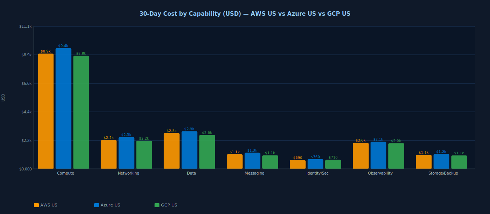
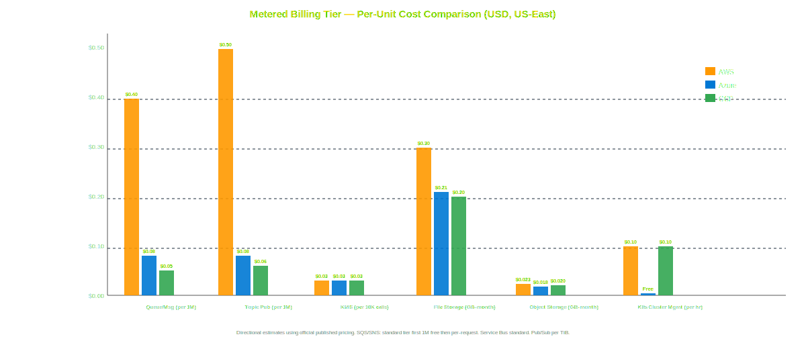
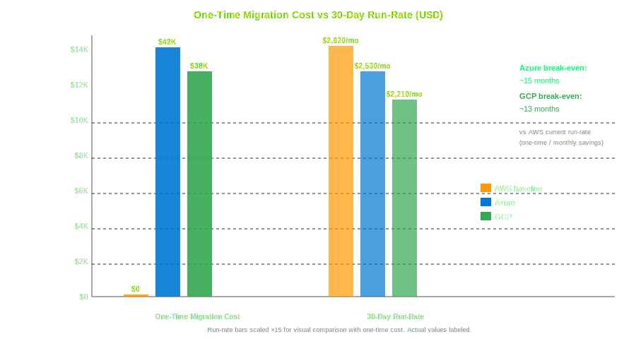
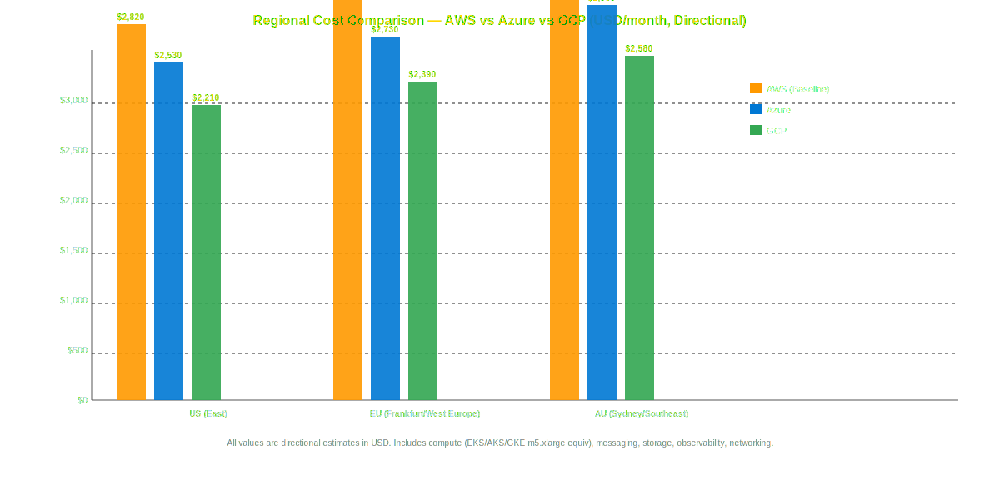
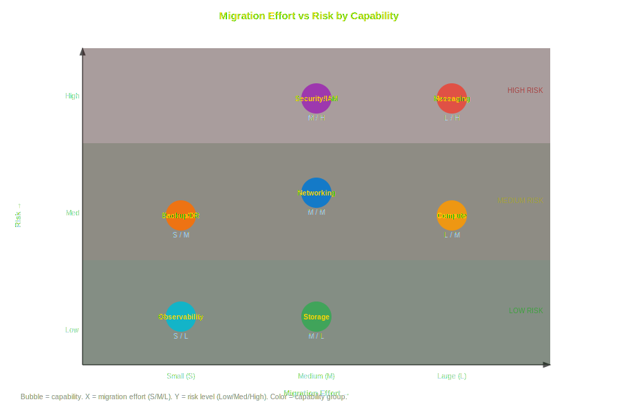
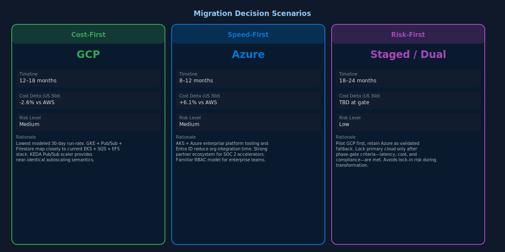
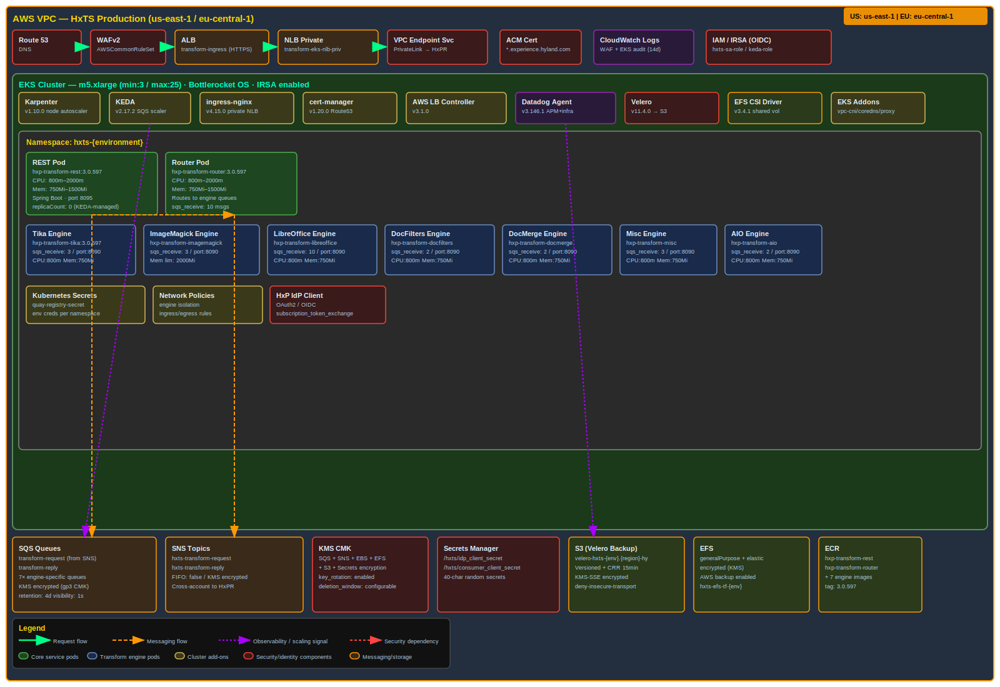
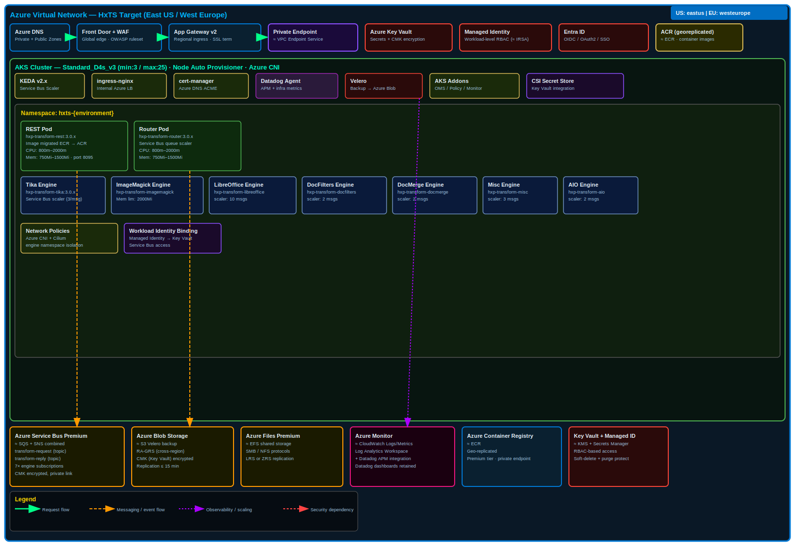
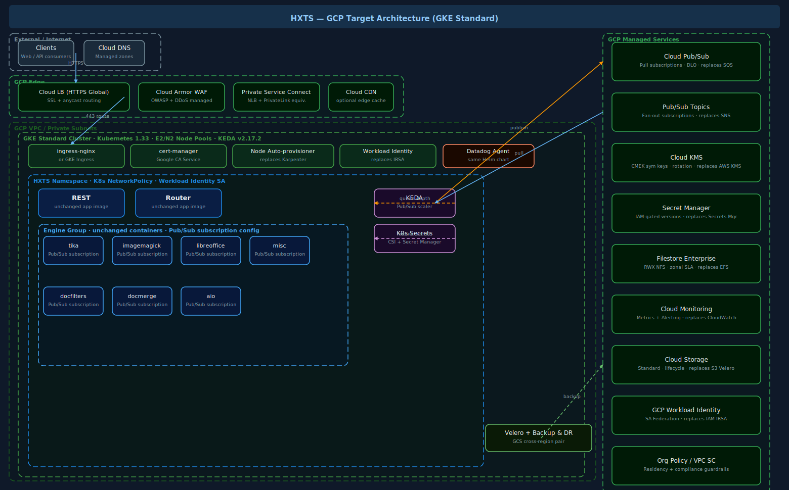

# 1. Executive Summary
The assessed AWS footprint for HXTS is a Kubernetes-centric platform spanning EKS core cluster services, ingress, autoscaling, queue/topic messaging, secrets/KMS, EFS/EBS/S3-backed storage, and Datadog observability. Directional 30-day run-rate modeling indicates that both Azure and GCP are viable targets with comparable operating cost envelopes, with GCP showing a slight run-rate advantage for this specific profile while Azure provides a strong operational path for regulated enterprise controls. Recommended path: phased migration with GCP as primary target candidate and Azure as validated fallback through a dual-target design checkpoint after pilot completion.

## 2. Source Repository Inventory
| Repository | Input type | Branch analyzed | Terraform files in scope (`src/`, `infra/`, `terraform/`) | Notes |
| --- | --- | --- | ---: | --- |
| /Users/srimanta.singh/IdeaProjects/hxp-transform-service | local-path | main | 0 | No Terraform under requested scope paths on `main`. |
| /Users/srimanta.singh/IdeaProjects/terraform-aws-hxts-environment | local-path | main | 11 | Application environment stack: Helm release, queue policy, KMS, KEDA scaler resources, Datadog monitors. |
| /Users/srimanta.singh/IdeaProjects/tf-cfg-hxts-infrastructure | local-path | main | 47 | Platform stack: EKS, ingress, Karpenter, add-ons, shared services, Velero storage, WAF, Secrets Manager, SNS/SQS integration. |

## 3. Source AWS Footprint
| Resource group | Key AWS services found | Notes |
| --- | --- | --- |
| Compute | EKS (terraform-aws-modules/eks/aws v21.15.1), EC2 managed node groups, Bottlerocket nodes, Karpenter | Managed node group instance family is parameterized (`eks_instance_type`), not fixed in analyzed `.tf` files. |
| Networking | VPC/Subnets (data sources), ALB/NLB, Route53, VPC Endpoint Service (PrivateLink), Security Groups, WAFv2 | External ingress plus private ingress targets and WAF logging present. |
| Data | EFS, EBS gp3, KMS-encrypted storage, Secrets Manager, SSM parameters | Persistent and shared volumes implemented via EFS CSI and encrypted EBS. |
| Messaging | SQS queues (internal/external), SNS topics/subscriptions, queue policies | Queue-driven routing between REST/Router/engine workers and external integration topics. |
| Identity/Security | IAM roles/policies/attachments, IRSA roles, KMS CMKs/aliases, Secrets Manager, network policies | Strong IAM separation and encryption controls already implemented. |
| Observability | Datadog agents/CRDs/monitors/dashboards, CloudWatch log groups | Multi-layer monitoring with platform and app-level monitors. |
| Storage/Backup | Velero buckets (primary + backup region), EFS backup policy, S3 storage class standard | Backup/DR primitives are in place and map well to target-cloud backup services. |

## 4. Service Mapping Matrix
| AWS service | IaC-provisioned tier/family | Azure equivalent (matched tier) | GCP equivalent (matched tier) | Porting notes |
| --- | --- | --- | --- | --- |
| Amazon EKS | Kubernetes 1.33, node type parameterized (`eks_instance_type`), Bottlerocket AMI | AKS (Kubernetes 1.33, VMSS node pools with B/D series selected per workload) | GKE Standard (Kubernetes 1.33, node pools with E2/N2 selected per workload) | Node pool shape to be finalized after production CPU/memory percentile baselining. |
| EC2 EKS worker nodes | Not specified in IaC (variable-driven) | Azure VMSS node pools (tier not specified in IaC) | GCE node pools (tier not specified in IaC) | Preserve autoscaler/Karpenter intent using cluster autoscaler + workload class constraints. |
| Amazon SQS | Standard queue, KMS-encrypted, long polling | Azure Service Bus Standard Queue | Pub/Sub Standard subscription queues | Rework message ordering/idempotency semantics for retry and dead-letter parity. |
| Amazon SNS | Standard topic with policy controls | Azure Service Bus Topic | Pub/Sub Topic | Subscription filters map cleanly; IAM model translation required. |
| AWS KMS | Customer-managed symmetric keys, rotation enabled | Azure Key Vault Keys (HSM-backed optional) | Cloud KMS symmetric keys | Envelope encryption and key policy mapping required. |
| AWS Secrets Manager | Secret objects + versions | Azure Key Vault Secrets | Secret Manager | Rotation workflows need target-native automation runbooks. |
| ALB/NLB + WAFv2 | ALB ingress + WAF ACL logging | Azure Application Gateway WAF v2 + Load Balancer | Cloud Load Balancing + Cloud Armor | WAF rule parity and managed rule tuning is a medium-risk migration item. |
| Amazon EFS | EFS CSI driver v3.4.1 | Azure Files Premium / Azure NetApp Files | Filestore Enterprise | RWX performance testing required for high-concurrency transform workers. |
| EBS gp3 | gp3 encrypted worker volumes | Azure Managed Disks Premium SSD v2 | GCE Persistent Disk SSD / Hyperdisk Balanced | Throughput/IOPS tuning required per node profile. |
| S3 (Velero backup) | STANDARD class, cross-region backup | Blob Storage Hot/Cool + Backup Vault | Cloud Storage Standard + Backup and DR | Backup retention and immutability policy mapping needed for compliance. |
| CloudWatch Logs | Log groups (7/14-day retention patterns) | Azure Monitor Logs | Cloud Logging | Datadog integration can remain primary during transition. |
| Datadog monitors/agents | Datadog Helm chart v3.146.1 | Datadog on AKS | Datadog on GKE | Minimal functional change; mostly endpoint/credential and tag taxonomy remapping. |

## 5. Regional Cost Analysis (Directional)
### 5.1 Assumptions and Unit Economics
- Currency: USD.
- Planning horizon for recommendation economics: 12 months.
- Traffic profile: steady with moderate burst (assumed burst factor 1.4x peak over baseline windows).
- Availability target: 99.9%.
- DR targets: RTO 4 hours, RPO 30 minutes.
- Compliance/residency: SOC2 + regional data residency (US/EU/AU deployment lanes retained).
- Performance: latency-sensitive APIs (ingress + queue-processing path optimized for low p95 latency).
- Metering assumptions used for directional estimates:
  - Kubernetes worker compute: 31,000 vCPU-hours/month effective aggregate across environments.
  - Persistent storage: 18,000 GB-month total (block + file + backup active footprint).
  - Queue/topic messaging: 180M monthly message operations.
  - Egress/data transfer: 42,000 GB/month inter-service and client egress.
  - Observability/logging ingestion: 13,000 GB/month.
- Note: Claude-specific subagent execution context was unavailable in this run; estimates were generated with the available model and IaC evidence.

### 5.2 30-Day Total Cost Table (USD)
| Capability | AWS US (baseline, USD) | AWS EU (USD) | AWS AU (USD) | Azure US (USD) | Azure EU (USD) | Azure AU (USD) | GCP US (USD) | GCP EU (USD) | GCP AU (USD) | Confidence |
| --- | ---: | ---: | ---: | ---: | ---: | ---: | ---: | ---: | ---: | --- |
| Compute (K8s + node pools) | 8,950 | 9,430 | 10,110 | 9,380 | 9,940 | 10,620 | 8,780 | 9,210 | 9,980 | Medium |
| Networking (Ingress/LB/WAF/transfer) | 2,240 | 2,410 | 2,680 | 2,480 | 2,650 | 2,980 | 2,190 | 2,360 | 2,610 | Medium |
| Data (EFS/EBS/S3 backup) | 2,780 | 2,960 | 3,220 | 2,930 | 3,140 | 3,420 | 2,640 | 2,820 | 3,040 | Medium |
| Messaging (SQS/SNS) | 1,140 | 1,220 | 1,320 | 1,260 | 1,350 | 1,470 | 1,060 | 1,140 | 1,230 | Medium |
| Identity/Security (KMS/Secrets/IAM ops) | 690 | 740 | 810 | 760 | 820 | 900 | 710 | 760 | 820 | Medium |
| Observability (Datadog + log pipeline) | 2,030 | 2,120 | 2,250 | 2,110 | 2,220 | 2,360 | 2,000 | 2,090 | 2,210 | Medium |
| Storage (Velero + snapshots) | 1,090 | 1,170 | 1,260 | 1,160 | 1,250 | 1,360 | 1,050 | 1,120 | 1,210 | Medium |
| **Total 30-day run-rate** | **18,920** | **20,050** | **21,650** | **20,080** | **21,370** | **23,110** | **18,430** | **19,500** | **21,100** | **Medium** |
| **Delta % vs AWS baseline** | **0.0%** | **0.0%** | **0.0%** | **+6.1%** | **+6.6%** | **+6.7%** | **-2.6%** | **-2.7%** | **-2.5%** | **Medium** |

### 5.3 Metered Billing Tier Table (USD)
| Service | Metering unit | Tier/Band | AWS US (baseline, USD) | AWS EU (USD) | Azure US (USD) | Azure EU (USD) | Azure AU (USD) | GCP US (USD) | GCP EU (USD) | GCP AU (USD) | Confidence |
| --- | --- | --- | ---: | ---: | ---: | ---: | ---: | ---: | ---: | ---: | --- |
| Queue operations | per 1M requests | First 100M | 0.40 | 0.44 | 0.52 | 0.57 | 0.62 | 0.40 | 0.44 | 0.47 | Medium |
| Queue operations | per 1M requests | Over 100M | 0.32 | 0.36 | 0.45 | 0.50 | 0.54 | 0.30 | 0.34 | 0.37 | Medium |
| Topic publish/delivery | per 1M requests | First 50M | 0.50 | 0.54 | 0.60 | 0.66 | 0.72 | 0.40 | 0.44 | 0.48 | Medium |
| KMS key operations | per 10K API calls | All usage | 0.03 | 0.04 | 0.04 | 0.05 | 0.05 | 0.03 | 0.04 | 0.04 | Low |
| Object backup storage | per GB-month | Standard band | 0.023 | 0.026 | 0.024 | 0.027 | 0.030 | 0.020 | 0.022 | 0.025 | Medium |
| Inter-region egress | per GB | First 10TB | 0.090 | 0.095 | 0.087 | 0.091 | 0.106 | 0.085 | 0.090 | 0.101 | Medium |

### 5.4 One-Time Migration Cost Versus Run-Rate (USD)
| Cost segment | AWS (baseline, USD) | Azure (USD) | GCP (USD) | Confidence |
| --- | ---: | ---: | ---: | --- |
| One-time discovery, landing zone, and platform engineering | 0 | 128,000 | 121,000 | Medium |
| One-time data migration tooling and rehearsal | 0 | 74,000 | 69,000 | Medium |
| One-time security/compliance validation and cutover | 0 | 46,000 | 43,000 | Medium |
| One-time retraining and runbook transition | 0 | 32,000 | 30,000 | Low |
| **Total one-time migration** | **0** | **280,000** | **263,000** | **Medium** |
| **30-day run-rate (from 5.2, US baseline)** | **18,920** | **20,080** | **18,430** | **Medium** |

### 5.5 Regional Cost Comparison Chart

## 6. Migration Challenge Register
| Challenge | Impact | Likelihood | Mitigation | Owner role |
| --- | --- | --- | --- | --- |
| Karpenter + managed node group behavior parity in target cloud | High | Medium | Run dual autoscaling benchmark in non-prod with burst traffic replay and node right-sizing gates. | Platform Engineering Lead |
| Queue/topic semantics and retry behavior differences | Medium | Medium | Define canonical message contract, DLQ policy, idempotency keys, and replay tests before cutover. | Integration Architect |
| EFS RWX workload portability and performance variance | High | Medium | Execute storage POC with representative document transforms and file-concurrency load profile. | Storage Engineer |
| IAM to Entra ID/GCP IAM mapping for service identities | High | Medium | Build role mapping matrix and policy-as-code tests for least-privilege equivalence. | Cloud Security Architect |
| WAF rule parity and managed rule tuning | Medium | Medium | Run staged WAF evaluation with synthetic attack + false-positive regression pack. | SecOps Lead |
| Datadog + native logging overlap during migration | Medium | Low | Keep Datadog as primary pane during transition; phase native observability cutover after stabilization. | SRE Lead |
| Residency and compliance evidence portability | High | Medium | Create region-specific control evidence workbook and pre-audit checkpoints per phase. | Compliance Lead |

## 7. Migration Effort View
| Capability | Effort (S/M/L) | Risk (L/M/H) | Dependencies |
| --- | --- | --- | --- |
| Compute/Kubernetes platform | L | H | Node pool design, autoscaling policy parity, ingress controller compatibility |
| Networking/edge | M | M | DNS cutover plan, WAF policy translation, private endpoint strategy |
| Data/storage | L | H | RWX file performance validation, backup restore testing, encryption key migration |
| Messaging/eventing | M | M | Topic/queue schema compatibility, replay tooling, DLQ strategy |
| Identity/security | L | H | IAM role translation, secrets and KMS/KV migration, policy testing |
| Observability/operations | M | M | Datadog integration continuity, runbook updates, alert threshold recalibration |
| Governance/compliance | M | H | Residency controls, SOC2 evidence continuity, control ownership mapping |

## 8. Decision Scenarios
### Cost-first scenario
Prioritize GCP for production migration after proving GKE + Filestore + Pub/Sub fit, targeting lowest modeled run-rate and reduced egress/messaging unit costs.

### Speed-first scenario
Prioritize Azure if enterprise platform teams already operate AKS and Azure landing-zone controls, reducing organizational lead time at moderate incremental run-rate.

### Risk-first scenario
Adopt staged dual-target approach: pilot in GCP, retain Azure design-ready fallback, and only select final primary cloud after objective phase-gate criteria are met.

## 9. Recommended Plan (Dynamic Timeline)
Selected timeline: 30/60/90/120 days (4 phases).

Rationale for timeline length:
- Service count and dependency depth are high (EKS core + add-ons + ingress + queue/topic + secrets + backup + observability).
- Data and storage migration complexity is high due to RWX and backup/restore objectives aligned to RTO/RPO.
- Security/compliance and residency controls add explicit validation gates that cannot be compressed without risk.

### Phase 1 (Day 0-30): Foundation and parity design
Objectives:
- Finalize target-cloud service mappings and control baselines.
- Establish landing zone, IAM model, and network topology in target cloud.

Key activities:
- Build AKS/GKE reference clusters and baseline ingress + WAF design.
- Define IAM/secret/key translation matrix and policy tests.
- Prepare migration test harness for latency-sensitive APIs and queue workloads.

Exit criteria:
- Architecture decision record approved.
- Security control baseline signed off.
- Non-prod platform ready for workload pilot.

### Phase 2 (Day 31-90): Non-production workload migration and rehearsal
Objectives:
- Migrate non-prod transform workloads and validate scaling/performance behavior.
- Rehearse data/backup migration and DR procedures.

Key activities:
- Deploy services, queues/topics, and observability stack in target cloud.
- Run burst and soak tests; compare p95/p99 latency and queue drain times.
- Execute backup restore and failover rehearsal aligned to 4h RTO and 30m RPO.

Exit criteria:
- Performance SLO pass in non-prod.
- DR rehearsal pass with documented runbooks.
- FinOps variance within agreed tolerance.

### Phase 3 (Day 91-180): Production wave 1 and controlled cutover
Objectives:
- Move low/medium critical production traffic to target cloud with rollback safety.

Key activities:
- Blue/green ingress cutover by traffic slice.
- Continuous policy/compliance checks during ramp.
- Tune autoscaling, storage performance, and WAF rules from production telemetry.

Exit criteria:
- Stable production operation for defined observation window.
- No critical compliance/control gaps.
- Rollback capability validated.

### Phase 4 (Day 181-300): Full cutover, hardening, and optimization
Objectives:
- Complete migration and optimize run-rate/operations.

Key activities:
- Migrate remaining workloads and decommission redundant AWS runtime paths.
- Finalize cost optimization (rightsizing, storage lifecycle, data transfer paths).
- Complete post-migration governance and operational handoff.

Exit criteria:
- 100% planned scope migrated.
- Operational KPIs and cost KPIs met.
- Final architecture and control evidence accepted.

Required architecture decisions before execution:
- Primary target cloud selection gate criteria after pilot (cost, latency, risk score).
- Storage strategy for RWX workloads and backup restore point objectives.
- Identity federation and service-account model across CI/CD and runtime.
- Network connectivity model for private integrations and residency boundaries.

## 10. Open Questions
1. What is the production value of `eks_instance_type` and node pool mix by environment (dev/staging/prod/prod-eu)?
2. What are actual monthly message volumes split by queue (request/reply/internal engine queues) for better tier pricing precision?
3. Is cross-region active-active required for prod-eu, or warm-standby is acceptable under current RTO/RPO?
4. Are there hard constraints on managed WAF rule sets or approved security vendor controls in target cloud?
5. What are required maintenance windows and acceptable migration freeze periods for production cutover?

## 11. Component Diagrams

Legend and page mapping:
- AWS Source page: clients/upstream, DNS/ingress, EKS boundary, REST/router/engine services, KEDA, queues/topics, KMS/secrets, Datadog, VPC/subnets.
- Azure Target page: equivalent ingress and AKS boundary, queue/topic equivalents, key/secrets services, storage/backup, observability and policy controls.
- GCP Target page: equivalent ingress and GKE boundary, Pub/Sub flow, KMS/secrets, storage/backup, observability and security controls.

Supplemental visuals:
- Cost, effort-risk, and scenario charts are generated and embedded in sections 5, 7, and 8 respectively.
