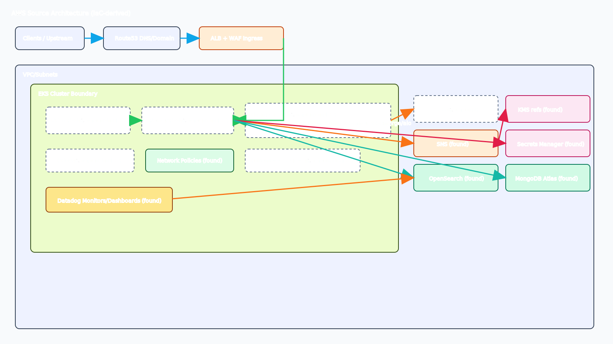
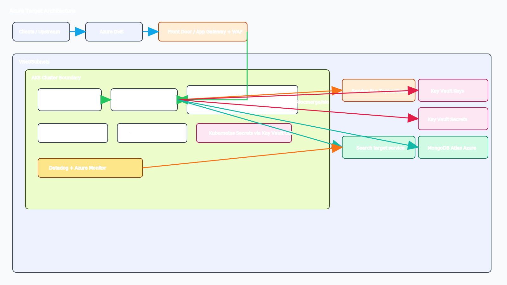
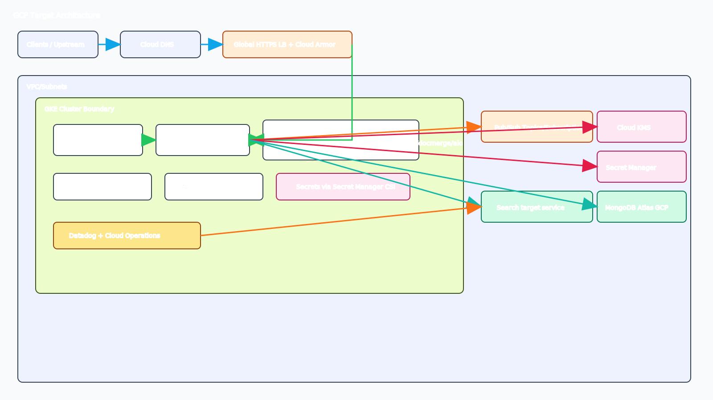

# Multi-Cloud Migration Decision Report

## 1. Executive Summary
Terraform evidence from the local main branch at /home/glefevre/sources/tf-cfg-hxpr-infrastructure (75 Terraform files under src/, infra/, terraform/) shows an AWS-centric platform built around EKS, ALB/WAF ingress, OpenSearch, MongoDB Atlas (AWS-backed), SNS integration, IAM-heavy controls, Secrets Manager, and Datadog observability. Given steady traffic with moderate burst, 99.9% availability, RTO 4 hours, RPO 30 minutes, SOC2 plus regional residency, and latency-sensitive APIs, the recommended path is a phased Azure-first migration with a controlled GCP validation lane before broad multi-cloud expansion.

## 2. Source Repository Inventory
| Repository/Path | Branch | Source type | Scope searched | Files found |
|---|---|---|---|---:|
| /home/glefevre/sources/tf-cfg-hxpr-infrastructure | main | local-path | src/**/*.tf, infra/**/*.tf, terraform/**/*.tf | 75 |

## 3. Source AWS Footprint
| Resource group | Key AWS services found | Notes |
|---|---|---|
| Compute | EKS add-ons, EKS module wiring, Lambda | Worker autoscaling inputs exist via variables; cluster capacity set through module inputs |
| Networking | ALB, target groups, Route53, VPC endpoints, security groups, WAFv2 | Internet ingress and private service routing patterns are explicit |
| Data | OpenSearch domain, MongoDB Atlas on AWS, SSM parameters | Data layer includes managed search and managed document DB |
| Messaging | SNS topic and topic policy | SQS is not found in this repository IaC |
| Identity/Security | IAM policies/roles/attachments, Secrets Manager, KMS permissions references | Heavy policy-driven controls and secret storage are present |
| Observability | Datadog provider/monitors/dashboards, CloudWatch logs/events | Strong monitoring footprint with alerting artifacts |
| Storage | EBS CSI add-on, Velero storage modules, S3 backup-related IAM | Backup and restore intent is visible via Velero resources/modules |

## 4. Service Mapping Matrix
| AWS service | Azure equivalent | GCP equivalent | Porting notes |
|---|---|---|---|
| EKS | AKS | GKE | Kubernetes manifests are mostly portable; identity, ingress, and autoscaling controllers require cloud-specific adaptation |
| ALB | Application Gateway | External Application Load Balancer | Listener/rule and health probe behavior must be revalidated |
| WAFv2 | Azure WAF | Cloud Armor | Managed rule parity differs; plan tuning windows |
| Route53 | Azure DNS | Cloud DNS | DNS records are straightforward to migrate |
| SNS | Service Bus Topics | Pub/Sub Topics | Subscription filtering and delivery semantics need validation |
| OpenSearch Service | Azure AI Search or Elastic on Azure | Elastic on GCP or OpenSearch self-managed on GKE | Feature parity depends on index/query features and plugin use |
| MongoDB Atlas on AWS | MongoDB Atlas on Azure | MongoDB Atlas on GCP | Lowest-friction path is cross-cloud Atlas target with phased cutover |
| Secrets Manager | Key Vault | Secret Manager | Secret path conventions and rotation policy need migration |
| IAM + IRSA patterns | Managed Identity + Workload Identity | IAM + Workload Identity Federation | Principal mapping is a top migration risk |
| KMS usage patterns | Key Vault Keys | Cloud KMS | Key policy and envelope encryption integration must be remapped |
| CloudWatch logs/events | Azure Monitor + Event Grid | Cloud Logging + Eventarc | Alert routing and retention controls need re-baselining |
| Datadog | Datadog on Azure | Datadog on GCP | Keep Datadog as a continuity layer during transition |

## 5. Regional Cost Analysis (Directional)

### 5.1 Assumptions, Usage Volumes, and Unit Economics
All costs are directional estimates in USD using public list pricing models and IaC-derived architecture shape.

- Currency: USD
- Traffic profile: steady with moderate burst
- Availability/DR: 99.9% target, RTO 4h, RPO 30m
- Compliance/residency: SOC2 with regional data residency boundaries per deployment region
- Performance: latency-sensitive APIs, overprovisioning buffer included in compute assumptions
- Workload behavior classification: mostly steady with periodic burst windows

Assumed monthly usage volumes (because detailed meter inputs were not fully provided):
- Kubernetes compute: 14,400 vCPU-hours and 57,600 GiB-hours per region-equivalent footprint
- Managed search compute/storage: 9 search nodes equivalent, 2,500 GB-month storage, 3.0 TB inter-service transfer
- Messaging: 120 million topic publish/delivery operations
- Edge/network egress: 35 TB internet egress
- Secrets/KMS operations: 25 million API operations
- Monitoring/logging ingest: 3.5 TB logs and metrics combined
- Backup/DR storage: 12 TB-month hot + 20 TB-month backup tier

### 5.2 30-Day Total Cost Table (Directional, USD)
| Capability | AWS US (baseline, USD) | AWS EU (USD) | AWS AU (USD) | Azure US (USD) | Azure EU (USD) | Azure AU (USD) | GCP US (USD) | GCP EU (USD) | GCP AU (USD) | Confidence |
|---|---:|---:|---:|---:|---:|---:|---:|---:|---:|---|
| Compute and orchestration | 34,800 | 38,300 | 41,900 | 35,600 | 39,500 | 43,200 | 33,900 | 37,400 | 41,000 | Medium |
| Networking and edge security | 12,100 | 13,200 | 14,600 | 12,700 | 14,000 | 15,400 | 11,900 | 13,100 | 14,500 | Low |
| Data services (OpenSearch + Mongo path) | 23,900 | 26,400 | 29,500 | 24,800 | 27,700 | 30,800 | 22,900 | 25,500 | 28,700 | Medium |
| Messaging and integration | 3,900 | 4,300 | 4,900 | 4,100 | 4,600 | 5,200 | 3,700 | 4,100 | 4,700 | Medium |
| Identity, security, and secrets | 2,700 | 3,000 | 3,400 | 2,900 | 3,200 | 3,600 | 2,600 | 2,900 | 3,300 | Medium |
| Observability and operations | 9,200 | 10,100 | 11,300 | 9,600 | 10,700 | 11,900 | 8,900 | 9,800 | 10,900 | Medium |
| Storage, backup, and DR | 8,600 | 9,500 | 10,700 | 9,100 | 10,100 | 11,300 | 8,400 | 9,200 | 10,400 | Medium |
| Total 30-day run-rate | 95,200 | 104,800 | 116,300 | 98,800 | 109,800 | 121,400 | 92,300 | 102,000 | 113,500 | Medium |
| Delta vs AWS baseline | 0.0% | 0.0% | 0.0% | +3.8% | +4.8% | +4.4% | -3.0% | -2.7% | -2.4% | Medium |

### 5.3 Metered Billing Tier Table (Directional, USD)
| Service | Metering unit | Tier/Band | AWS US (baseline, USD) | AWS EU (USD) | Azure US (USD) | Azure EU (USD) | Azure AU (USD) | GCP US (USD) | GCP EU (USD) | GCP AU (USD) | Confidence |
|---|---|---|---:|---:|---:|---:|---:|---:|---:|---:|---|
| Managed messaging operations | per 1M operations | first 100M ops | 50 | 55 | 58 | 64 | 72 | 45 | 50 | 57 | Medium |
| Managed messaging operations | per 1M operations | over 100M ops | 40 | 44 | 46 | 51 | 58 | 36 | 40 | 46 | Medium |
| Internet data transfer out | per GB | first 10 TB | 0.09 | 0.10 | 0.095 | 0.105 | 0.120 | 0.085 | 0.095 | 0.110 | Low |
| Internet data transfer out | per GB | next 40 TB | 0.085 | 0.095 | 0.090 | 0.100 | 0.115 | 0.080 | 0.090 | 0.105 | Low |
| Kubernetes worker compute | per vCPU-hour | standard on-demand tier | 0.048 | 0.053 | 0.051 | 0.056 | 0.061 | 0.046 | 0.051 | 0.057 | Medium |
| Block/object backup storage | per GB-month | hot/standard tier | 0.023 | 0.026 | 0.024 | 0.027 | 0.031 | 0.021 | 0.024 | 0.028 | Medium |
| Secrets and key operations | per 10K API calls | standard tier | 0.03 | 0.03 | 0.03 | 0.04 | 0.04 | 0.03 | 0.03 | 0.04 | Medium |

### 5.4 One-Time Migration Cost Versus Run-Rate Table (Directional, USD)
| Cost segment | AWS (baseline, USD) | Azure (USD) | GCP (USD) | Confidence |
|---|---:|---:|---:|---|
| One-time platform migration (engineering + validation + cutover) | 0 | 1,450,000 | 1,520,000 | Medium |
| One-time data migration and dual-run overhead | 0 | 420,000 | 470,000 | Medium |
| One-time security/compliance control remapping | 0 | 180,000 | 210,000 | Medium |
| 30-day run-rate (US baseline comparison) | 95,200 | 98,800 | 92,300 | Medium |

## 6. Migration Challenge Register
| Challenge | Impact | Likelihood | Mitigation | Owner role |
|---|---|---|---|---|
| Identity model migration from IAM/IRSA patterns | High | High | Build principal mapping matrix and pilot workload identity before broad rollout | Security architect |
| OpenSearch capability parity and query performance | High | Medium | Run benchmark corpus and compare index/query latency before final target decision | Data platform lead |
| SNS eventing contract parity | Medium | Medium | Define canonical event schema and replay tests for target message fabric | Integration lead |
| Data residency enforcement across regions | High | Medium | Enforce region-scoped deployment policies and residency checks in CI | Compliance lead |
| Latency-sensitive API behavior under new ingress stack | High | Medium | Canary route with SLO guardrails and automatic rollback | SRE lead |
| DR objective validation (RTO 4h, RPO 30m) | High | Medium | Execute game days with restore evidence and timing audit | DR owner |
| Operational retraining and handoff risk | Medium | Medium | Keep Datadog and GitOps workflows stable during migration waves | Platform manager |

## 7. Migration Effort View
| Capability | Effort (S/M/L) | Risk (L/M/H) | Dependencies |
|---|---|---|---|
| Compute platform (EKS to AKS/GKE) | M | M | Landing zone, node policy model, autoscaling baseline |
| Networking and edge (ALB/WAF/DNS) | M | H | Ingress policy translation, WAF tuning, DNS cutover |
| Data services (OpenSearch + Mongo path) | L | H | Benchmarking, migration tooling, rollback strategy |
| Messaging and integration | M | M | Topic model parity, delivery guarantees, replay harness |
| Identity and security | M | H | Workload identity, key custody, secret rotation process |
| Observability and operations | S | M | Alert remapping, dashboard parity, runbook updates |
| Backup and DR | M | M | Snapshot policy equivalence and cross-region recovery validation |

Difficulty rationale by capability:
- Compute: Medium due to Kubernetes portability, but cloud identity and ingress coupling add effort.
- Networking: High risk due to latency sensitivity and edge policy translation.
- Data: High risk from search and document database migration complexity.
- Messaging: Medium risk because SNS semantics require integration testing.
- Identity/Security: High risk because policy and trust models materially change.
- Observability: Medium risk as Datadog continuity lowers transition friction.
- DR: Medium risk, mainly validation and process rigor rather than raw platform limits.

## 8. Decision Scenarios
Cost-first scenario:
- Prioritize GCP-first for lower directional 30-day run-rate.
- Sequence data service proof first to avoid rework.
- Accept longer enablement runway for platform teams.

Speed-first scenario:
- Prioritize Azure-first with a narrower first wave.
- Keep MongoDB Atlas managed path and Datadog tooling stable.
- Accelerate production cutover by limiting initial service substitutions.

Risk-first scenario:
- Use phased Azure-first execution with GCP parallel benchmark lane.
- Gate each wave on latency SLOs and DR drill evidence.
- Preserve rollback options with controlled dual-run windows.

## 9. Recommended Plan (30/60/90)
30 days:
- Confirm architecture decisions for identity, messaging, ingress, and data target services.
- Stand up target-cloud foundation and deploy one non-critical service path.
- Establish migration scorecard for latency, availability, and DR metrics.

60 days:
- Execute integration replay tests and event contract validation.
- Complete first DR game day against target environment.
- Finalize residency controls and SOC2 evidence mapping.

90 days:
- Begin progressive production cutover with canary and rollback automation.
- Migrate remaining service groups in ordered waves.
- Lock post-migration hardening backlog and ownership model.

Required architecture decisions before execution:
- OpenSearch target pattern (managed equivalent versus self-managed).
- Messaging fabric contract (topic model, retries, DLQ handling).
- Workload identity and key management ownership boundaries.
- Residency policy enforcement and cross-region data flow controls.

## 10. Open Questions
- Which exact US, EU, and AU regions are mandatory for production and DR?
- Is active-active required for any latency-sensitive API tiers?
- What are the required P95/P99 latency thresholds by API category?
- Are there contractual constraints that force specific managed services?
- What is the acceptable dual-run duration during cutover?

## 11. Component Diagrams
Page mapping:
- AWS Source page: current-state AWS infrastructure from IaC.
- Azure Target page: proposed Azure target architecture with equivalent controls.
- GCP Target page: proposed GCP target architecture with equivalent controls.

Legend and auditable component groups:
- AWS Source includes Clients/Upstream, DNS/Domain, Ingress, EKS cluster boundary, REST pod (Not found in IaC), Router pod (Not found in IaC), Engine group (Not found in IaC), KEDA (Not found in IaC), Network Policies, Kubernetes Secrets (Not found in IaC), SQS (Not found in IaC), SNS, KMS (policy references), Secrets Manager, Datadog, and VPC/Subnets.
- Azure Target includes Front Door/Application Gateway, Azure DNS, AKS boundary, service pods, Service Bus Topics/Queues, Key Vault, Managed Identity/Workload Identity, Monitor/Datadog, storage/backup components, and explicit Not found in IaC placeholders for app-level pods absent from Terraform evidence.
- GCP Target includes Global HTTPS Load Balancer, Cloud DNS, GKE boundary, service pods, Pub/Sub, Cloud KMS, Secret Manager, Workload Identity, Cloud Operations/Datadog, storage/backup components, and explicit Not found in IaC placeholders for app-level pods absent from Terraform evidence.
