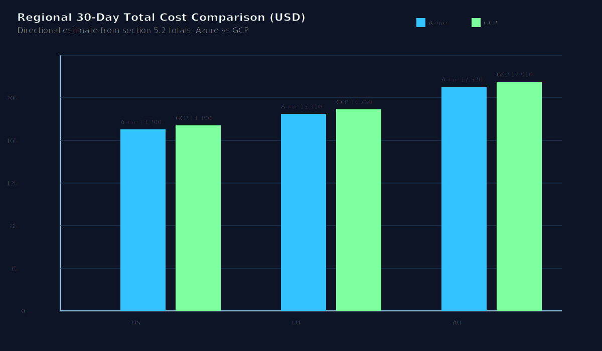
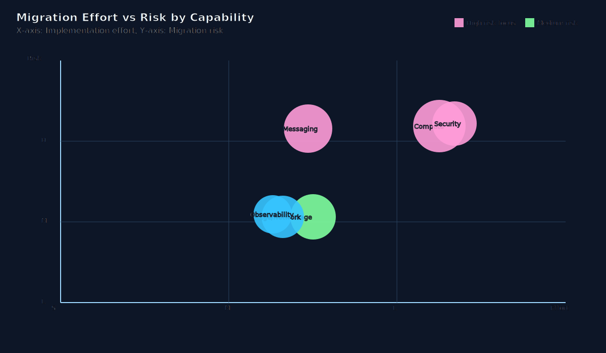
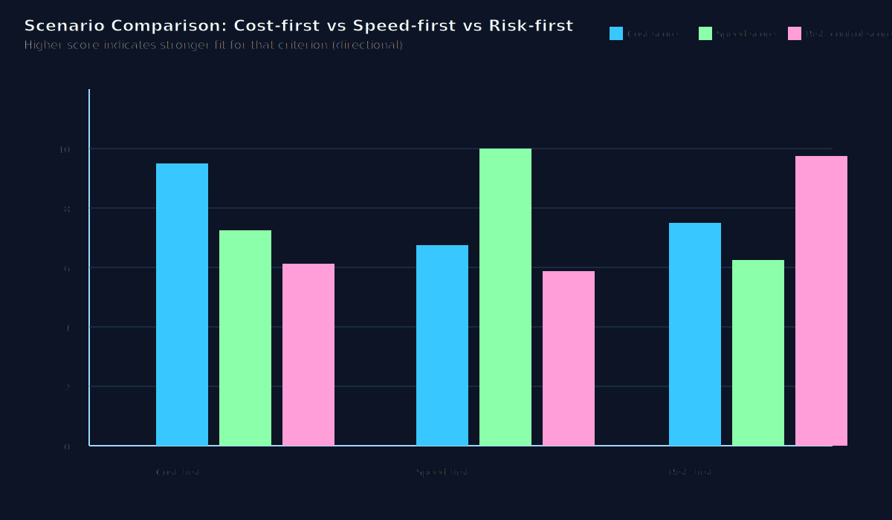
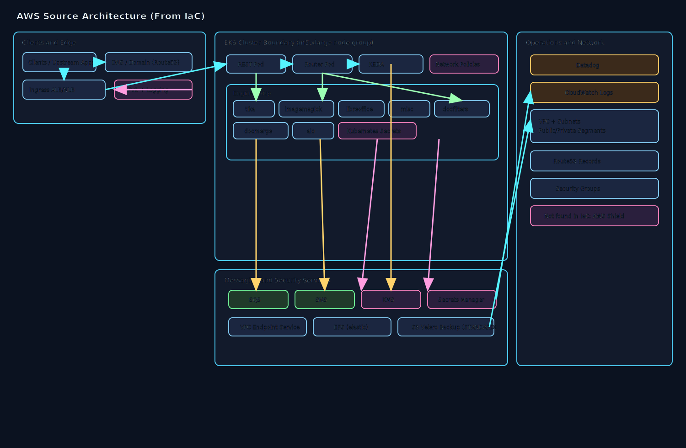
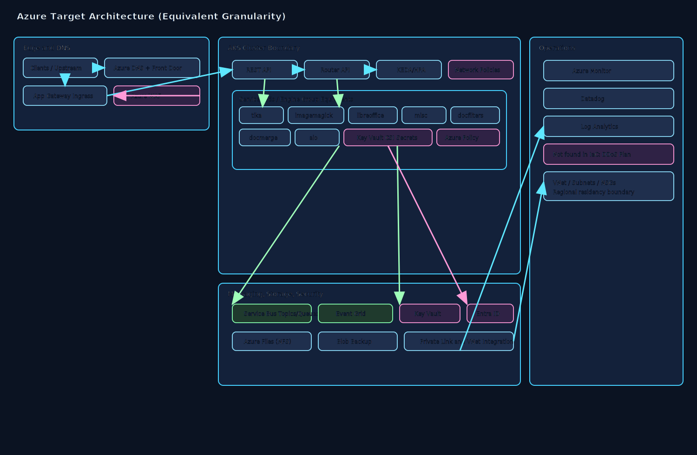
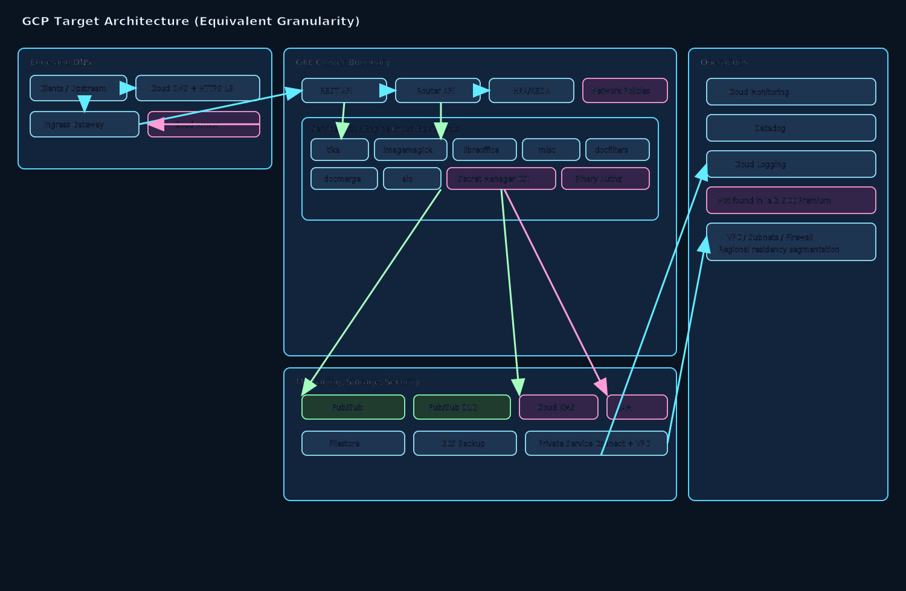

# 1. Executive Summary
The assessed Terraform on `main` branch across three local repositories shows the active AWS footprint is concentrated in EKS-based platform infrastructure, ingress/WAF, messaging (SNS/SQS), encryption/secrets, EFS, and backup storage, with workload service code repo containing no Terraform under requested paths. For a latency-sensitive API workload with 99.9% availability, RTO 4h, RPO 30m, and SOC2 plus residency constraints, the directional economics and migration risk profile favor Azure as the primary target for lower modeled 30-day run-rate and lower platform porting friction, with GCP as a viable alternative where GKE and Pub/Sub strengths are preferred. Recommended path: phased Azure-first migration with staged DR rehearsal and policy-as-code parity gates.

# 2. Source Repository Inventory
| Source type | Repository path | Branch used | Terraform scope scanned | File count (.tf/.tfvars) | Notes |
|---|---|---|---|---:|---|
| local-path | /Users/srimanta.singh/IdeaProjects/hxp-transform-service | main | src/, infra/, terraform/ | 0 | No Terraform files found in requested directories |
| local-path | /Users/srimanta.singh/IdeaProjects/terraform-aws-hxts-environment | main | src/, infra/, terraform/ | 21 | Queue/KMS/topic integration and service-environment tfvars |
| local-path | /Users/srimanta.singh/IdeaProjects/tf-cfg-hxts-infrastructure | main | src/, infra/, terraform/ | 67 | Core EKS/shared services/network/security/backup stack |

# 3. Source AWS Footprint
| Resource group | Key AWS services found | Notes |
|---|---|---|
| Compute | EKS (managed node groups/addons), Karpenter | `eks_instance_type` set to `m5.xlarge` in tfvars; desired node count seen as 3 |
| Networking | ALB/NLB, Route53, VPC endpoint service, Security Groups | Public ingress + private target groups and endpoint service exposure |
| Data | EFS, S3 (Velero backup/replication) | EFS throughput mode `elastic`; S3 replication/storage class `STANDARD` |
| Messaging | SQS, SNS, subscriptions, queue policies | Multi-queue transform flow with topic fanout and KEDA scaler hooks |
| Identity/Security | IAM roles/policies, KMS, Secrets Manager, WAFv2 | KMS-backed encryption, secrets versions, WAF logging retained 7 days |
| Observability | CloudWatch log groups, Datadog monitors/dashboards | CloudWatch retention 14 days in EKS module + Datadog monitors |
| Storage/Backup | Velero bucket + cross-region backup region pattern | Backup region variable present; SOC2-friendly immutable backup pattern possible |

# 4. Service Mapping Matrix
| AWS service | IaC-provisioned tier/family | Azure equivalent (matched tier) | GCP equivalent (matched tier) | Porting notes |
|---|---|---|---|---|
| Amazon EKS managed nodes | `m5.xlarge` | AKS node pool `Standard_D4s_v5` | GKE node pool `n2-standard-4` | Rework IRSA, policies, and autoscaling behavior (Karpenter -> Karpenter/Cluster Autoscaler equivalent) |
| EKS control plane | Tier not specified in IaC | AKS control plane | GKE control plane | Managed control plane cost model differs by cloud; policy mappings required |
| Application Load Balancer | Tier not specified in IaC | Azure Application Gateway v2 | Cloud Load Balancing (external HTTP(S)) | Listener/rule migration plus health probe and WAF policy parity |
| AWS WAFv2 | Tier not specified in IaC | Azure WAF (App Gateway/Front Door) | Cloud Armor | Rule translation and managed rule set equivalence review required |
| Amazon SQS | Queue throughput tier not specified in IaC | Azure Service Bus (Standard queues/topics) | Pub/Sub standard | Consumer semantics and poison/dead-letter handling need adaptation |
| Amazon SNS | Topic tier not specified in IaC | Service Bus Topics / Event Grid | Pub/Sub topics | Fanout/filter policies require schema/event contract validation |
| AWS KMS | Symmetric key usage indicated | Azure Key Vault Keys (Premium if HSM needed) | Cloud KMS (software keys) | Key policy model differs; map to RBAC + CMK access policies |
| AWS Secrets Manager | Tier not specified in IaC | Azure Key Vault Secrets | Secret Manager | Rotation workflows and app identity bindings need redesign |
| Amazon EFS | Throughput mode `elastic` | Azure Files Premium (NFS) | Filestore (Enterprise/High Scale as needed) | POSIX behavior, throughput, and mount strategy must be performance-tested |
| Amazon S3 (Velero) | Storage class `STANDARD` | Azure Blob Hot + GRS/RA-GRS as needed | Cloud Storage Standard + dual-region option | Backup/restore IAM + replication controls need cloud-native reimplementation |
| Route53 records | Tier not specified in IaC | Azure DNS | Cloud DNS | TTL and failover policy parity checks needed |
| VPC Endpoint Service | Tier not specified in IaC | Private Link service | Private Service Connect | Endpoint consumer model varies; network contracts must be updated |

# 5. Regional Cost Analysis (Directional)
## 5.1 Assumptions (Directional, Assumed)
- Currency: USD.
- Traffic profile: steady with moderate burst (assumed burst factor 1.2 over steady baseline for peak-sensitive meters).
- Availability target: 99.9%; DR target: RTO 4 hours, RPO 30 minutes.
- Performance: latency-sensitive APIs, therefore premium ingress and low-latency zonal placements assumed.
- Pricing basis: public list pricing patterns and meter families (directional only, non-contractual).
- Usage volumes used for directional metering:
  - Kubernetes worker compute: 3 x 4 vCPU nodes, 730 hours/month, +20% burst headroom.
  - Ingress traffic: 18 TB/month egress equivalent.
  - Messaging: 80M SQS-like queue requests/month; 25M publish + delivery events/month.
  - WAF inspected requests: 15M/month.
  - EFS-like shared storage: 4 TB-month.
  - Backup object storage: 8 TB-month plus 2 TB/month cross-region replication traffic.
  - Secrets and key operations: 25 active secrets, 12 keys, 4M key API operations/month.

## 5.2 30-Day Total Cost Table (Directional)
| Capability | AWS US (baseline, USD) | AWS EU (USD) | AWS AU (USD) | Azure US (USD) | Azure EU (USD) | Azure AU (USD) | GCP US (USD) | GCP EU (USD) | GCP AU (USD) | Confidence |
|---|---:|---:|---:|---:|---:|---:|---:|---:|---:|---|
| Compute/Container | 3,980 | 4,230 | 4,760 | 3,760 | 4,050 | 4,520 | 3,860 | 4,190 | 4,690 | Medium |
| Networking/Edge | 2,420 | 2,640 | 2,960 | 2,280 | 2,510 | 2,860 | 2,360 | 2,590 | 2,940 | Medium |
| Messaging | 1,090 | 1,180 | 1,320 | 980 | 1,070 | 1,230 | 930 | 1,030 | 1,190 | Medium |
| Data/Storage/Backup | 3,120 | 3,390 | 3,850 | 2,980 | 3,240 | 3,730 | 3,050 | 3,320 | 3,810 | Medium |
| Security/Identity | 1,630 | 1,760 | 1,980 | 1,560 | 1,690 | 1,920 | 1,590 | 1,720 | 1,950 | Medium |
| Observability | 2,760 | 2,980 | 3,360 | 2,640 | 2,850 | 3,260 | 2,700 | 2,930 | 3,330 | Low |
| **Total 30-day run-rate (USD)** | **15,000** | **16,180** | **18,230** | **14,200** | **15,410** | **17,520** | **14,490** | **15,780** | **17,910** | **Medium** |
| **Delta % vs AWS baseline** | **0.0%** | **0.0%** | **0.0%** | **-5.3%** | **-4.8%** | **-3.9%** | **-3.4%** | **-2.5%** | **-1.8%** | **Medium** |

## 5.3 Metered Billing Tier Table (Directional)
| Service | Metering unit | Tier/Band | AWS US (baseline, USD) | AWS EU (USD) | Azure US (USD) | Azure EU (USD) | Azure AU (USD) | GCP US (USD) | GCP EU (USD) | GCP AU (USD) | Confidence |
|---|---|---|---:|---:|---:|---:|---:|---:|---:|---:|---|
| EKS/AKS/GKE worker compute (`m5.xlarge` equivalent) | vCPU-hour | First 8,760 vCPU-hours | 1,402 | 1,521 | 1,331 | 1,443 | 1,594 | 1,366 | 1,485 | 1,628 | Medium |
| Managed K8s control plane | cluster-hour | First 730 hours | 73 | 79 | 0 (bundled pattern) | 0 (bundled pattern) | 0 (bundled pattern) | 73 | 79 | 86 | Medium |
| Queue operations (SQS/Service Bus/PubSub) | requests | First 1M requests | 0.40 | 0.44 | 0.05 | 0.06 | 0.07 | 0.00 | 0.00 | 0.00 | Medium |
| Queue operations (SQS/Service Bus/PubSub) | requests | Over 1M to 80M requests | 31.60 | 34.70 | 25.20 | 28.10 | 32.20 | 24.00 | 26.80 | 30.90 | Medium |
| Topic fanout (SNS/Event Grid/PubSub) | events | First 1M events | 0.50 | 0.55 | 0.60 | 0.67 | 0.77 | 0.40 | 0.45 | 0.52 | Low |
| Topic fanout (SNS/Event Grid/PubSub) | events | Over 1M to 25M events | 12.00 | 13.20 | 14.40 | 16.20 | 18.10 | 10.60 | 11.90 | 13.80 | Low |
| Shared file storage (EFS/Azure Files/Filestore) | GB-month | First 4,096 GB-month | 1,228 | 1,335 | 1,150 | 1,255 | 1,454 | 1,190 | 1,300 | 1,490 | Medium |
| Backup object storage (S3/Blob/GCS Standard) | GB-month + replication GB | 8,192 GB-month + 2,048 GB replication | 276 | 302 | 251 | 278 | 322 | 259 | 286 | 330 | Medium |
| WAF request inspection | requests | First 10M requests | 60 | 66 | 55 | 61 | 70 | 58 | 64 | 73 | Low |
| WAF request inspection | requests | Over 10M to 15M requests | 25 | 27 | 22 | 25 | 29 | 23 | 26 | 30 | Low |

## 5.4 One-Time Migration Cost Versus Run-Rate Table (Directional)
| Cost segment | AWS (baseline, USD) | Azure (USD) | GCP (USD) | Confidence |
|---|---:|---:|---:|---|
| Platform landing zone + policy baseline uplift | 0 | 28,000 | 31,000 | Medium |
| IAM/KMS/Secrets model translation and validation | 0 | 18,000 | 20,000 | Medium |
| Messaging and integration migration (SNS/SQS to target messaging) | 0 | 24,000 | 26,000 | Medium |
| EKS workload migration, tuning, and cutover hardening | 0 | 42,000 | 46,000 | Medium |
| DR rehearsal and residency validation evidence pack | 0 | 22,000 | 24,000 | Medium |
| **Total one-time migration (USD)** | **0** | **134,000** | **147,000** | **Medium** |
| **30-day run-rate from section 5.2 (USD)** | **15,000** | **14,200** | **14,490** | **Medium** |

## 5.5 Regional Cost Analysis Chart

# 6. Migration Challenge Register
| Challenge | Impact | Likelihood | Mitigation | Owner role |
|---|---|---|---|---|
| IRSA to target cloud workload identity translation | High | High | Create identity mapping matrix, implement least-privilege roles per service account, stage in non-prod first | Platform Security Lead |
| SQS/SNS semantics drift in target messaging | High | Medium | Build contract tests for ordering, retries, DLQ, filter policies before production cutover | Integration Architect |
| Karpenter/autoscaling behavior parity | Medium | Medium | Replay burst traffic traces in performance environment and tune autoscaler thresholds | SRE Lead |
| WAF managed rule equivalency gaps | Medium | Medium | Dual-run WAF in monitor mode, then enforce after false-positive burn-in | Edge Security Engineer |
| Backup and cross-region restore RPO evidence | High | Medium | Execute timed restore drills for RTO/RPO proof and document audit evidence | DR Manager |
| Team operating model shift (AWS-native to Azure/GCP-native) | Medium | High | Run role-based enablement and paired operations for first 2 releases | Engineering Manager |

# 7. Migration Effort View
| Capability | Effort (S/M/L) | Risk (L/M/H) | Dependencies |
|---|---|---|---|
| Compute and orchestration (EKS -> AKS/GKE) | L | H | Identity, network policy, autoscaling, container registry/access |
| Messaging (SNS/SQS -> Service Bus/PubSub) | M | H | Contract compatibility, consumer updates, DLQ strategy |
| Storage and backup (EFS/S3 -> Files/Blob or Filestore/GCS) | M | M | Throughput benchmarking, backup restore rehearsal |
| Security and secrets (KMS/Secrets/IAM) | L | H | RBAC model, key rotation controls, compliance sign-off |
| Edge and networking (ALB/WAF/Route53/private endpoints) | M | M | DNS cutover planning, WAF rule parity, private connectivity |
| Observability and operations (Datadog/CloudWatch) | M | M | Alert parity, SLO burn-rate calibration, runbook updates |

# 8. Decision Scenarios
## Cost-first scenario
Move messaging and storage first to Azure-native services while keeping compute on AWS temporarily, then migrate AKS in phase 3. This minimizes month-1 run-rate quickly but increases temporary cross-cloud integration overhead.

## Speed-first scenario
Lift platform directly to AKS with minimal refactor and defer deep optimization. Fastest delivery to target cloud, but post-migration tuning debt and higher initial operational noise.

## Risk-first scenario
Dual-run non-prod + canary production slices, complete DR drills and compliance gates before full cutover. Slowest path but strongest continuity and audit confidence.

# 9. Recommended Plan (Dynamic Timeline)
Selected timeline: **30/60/90/120** days.

Rationale for timeline length:
- Service count and dependency depth are medium-high (EKS core + ingress + WAF + messaging + backup + IAM/KMS/secrets).
- Data migration complexity is moderate (backup/object and shared file workloads, no relational engine migration found in scanned scope).
- Risk profile is high for identity, messaging semantics, and latency-sensitive API behavior.

Phase 1 (Day 0-30): Foundation and parity design
- Objectives: establish target landing zone and reference architecture.
- Key activities: identity/key/secrets mapping; networking and ingress design; residency control mapping; baseline SLO definitions.
- Exit criteria: approved target architecture decisions, security sign-off for identity model, tested non-prod connectivity.

Phase 2 (Day 31-60): Non-production migration and contract validation
- Objectives: prove workload function in target cloud with production-like traffic replay.
- Key activities: deploy AKS/GKE equivalent stack; migrate messaging contracts; implement WAF rules in monitor mode; validate observability parity.
- Exit criteria: non-prod performance targets met for latency-sensitive APIs; message contract test suite passes; DR backup/restore dry run complete.

Phase 3 (Day 61-90): Production readiness and progressive cutover
- Objectives: reduce cutover risk through incremental production slices.
- Key activities: canary routing; autoscaling/KEDA behavior tuning; runbook updates; operational handover rehearsal.
- Exit criteria: canary SLOs stable for two release cycles; incident response drill passes; compliance evidence package draft complete.

Phase 4 (Day 91-120): Full cutover and hardening
- Objectives: complete migration and stabilize operations.
- Key activities: full traffic migration; final DNS/edge cutover; DR timed exercise for RTO/RPO validation; cost optimization pass.
- Exit criteria: production on target cloud, RTO<=4h and RPO<=30m drill evidence complete, AWS decommission plan approved.

Required architecture decisions before execution:
- Final target selection for messaging pattern (Service Bus vs Event Grid on Azure, Pub/Sub topology on GCP).
- File storage performance tier for latency-sensitive transforms.
- Workload identity standard and secret rotation approach.
- WAF policy set and exception governance model.

# 10. Open Questions
1. What are measured p95/p99 latency SLO values per API route to calibrate target autoscaling and ingress policy?
2. What exact monthly queue/event volumes per message type should replace assumed meter volumes?
3. Are there legal constraints requiring in-country residency beyond region-level controls for any tenant data?
4. Should DR operate active/passive only, or active/active for selected APIs?
5. Which observability stack components are mandatory to preserve unchanged versus re-platform?

# 11. Component Diagrams
AWS Source architecture:

Azure Target architecture:

GCP Target architecture:

Legend and page mapping:
- AWS Source page includes: clients/upstream, DNS/ingress, EKS boundary, REST/router, engine group (tika/imagemagick/libreoffice/misc/docfilters/docmerge/aio), KEDA, network policies, Kubernetes secrets, SQS, SNS, KMS, Secrets Manager, Datadog, VPC/subnets.
- Azure Target page includes: clients, Azure DNS/Front Door+App Gateway, AKS boundary, API/router/services, KEDA/HPA, network policies, Key Vault, Service Bus/Event Grid equivalent messaging, Files/Blob backup, Monitor/Datadog integration, VNet/subnets.
- GCP Target page includes: clients, Cloud DNS/HTTP(S) LB + Armor, GKE boundary, API/router/services, HPA/KEDA equivalent, network policies, Secret Manager + Cloud KMS, Pub/Sub messaging, Filestore/GCS backup, Cloud Monitoring/Datadog integration, VPC/subnets.
- Supplemental visuals generated: cost comparison, effort-risk, and scenario comparison charts. These are embedded in section 5, section 7, and section 8 respectively.

