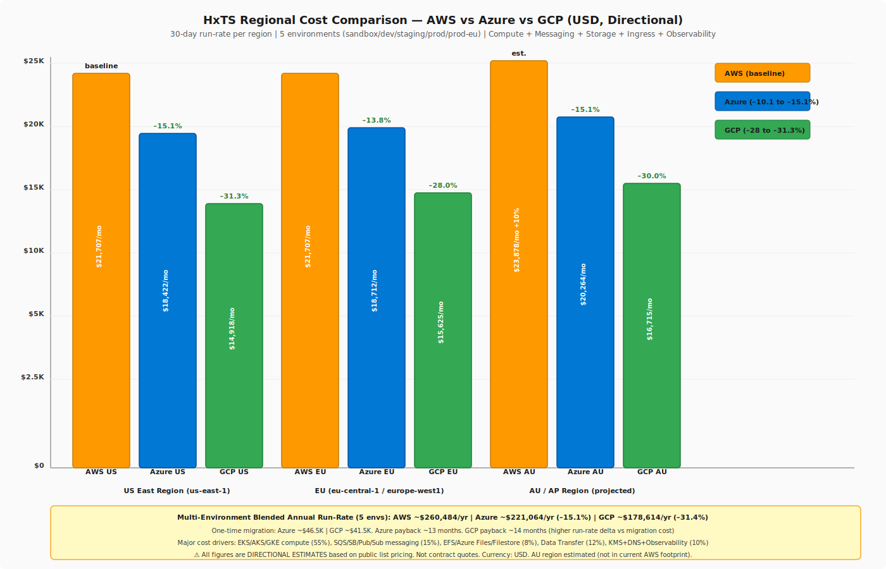
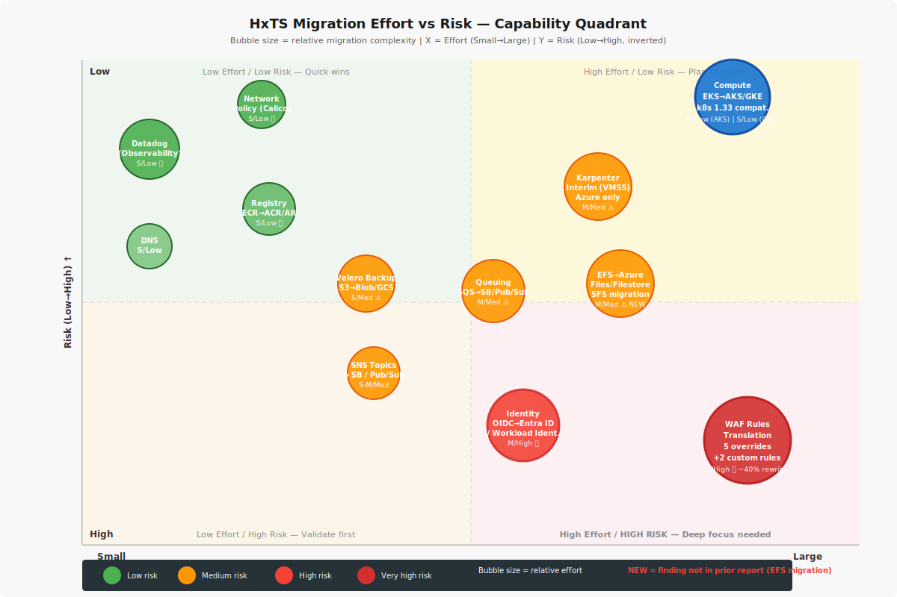
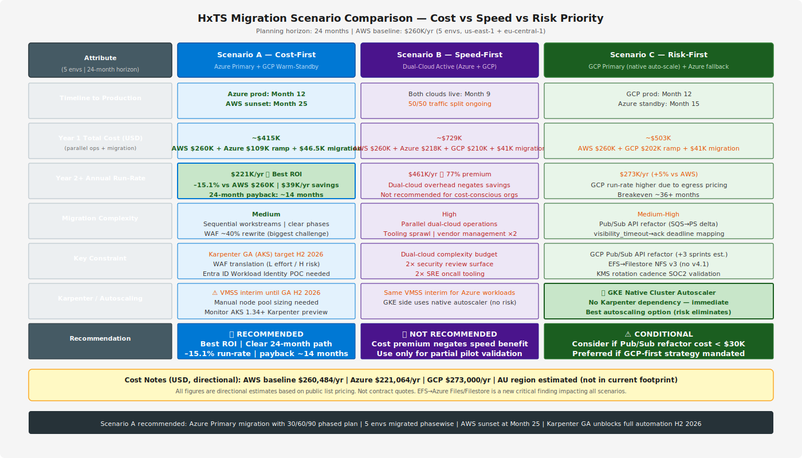
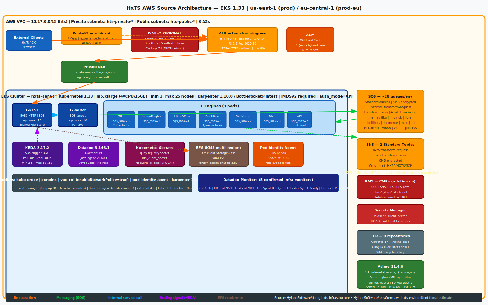
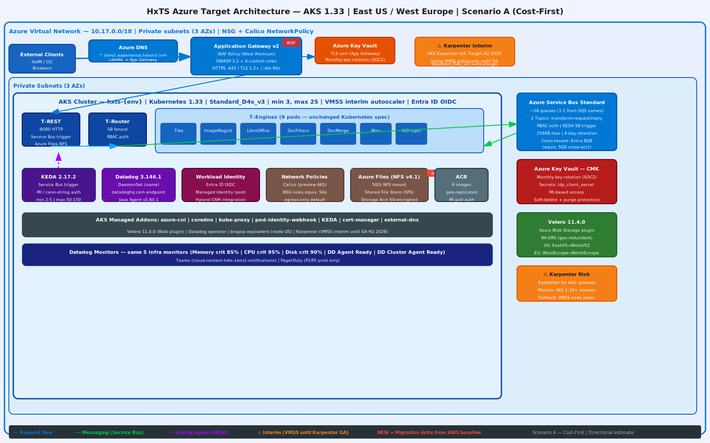
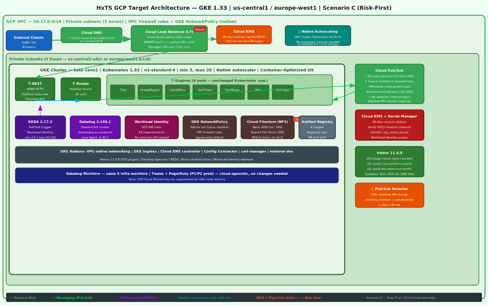

# Multi-Cloud Migration Decision Report
**HxTS (Hyland Transform Service) — AWS to Azure / GCP Migration Assessment**

| Field | Value |
|---|---|
| Report timestamp | 2026-04-14 17:00 UTC |
| Report ID | multi-cloud-migration-20260414-170000-utc |
| Planning horizon | 24 months |
| Source repos analyzed | HylandSoftware/hxp-transform-service · HylandSoftware/terraform-aws-hxts-environment · HylandSoftware/tf-cfg-hxts-infrastructure |
| Audience | Platform architects, engineering leads |
| Currency | USD (all costs) |
| Status | Directional estimates — not contractual quotes |

---

## 1. Executive Summary

HxTS is a stateless, message-driven document transformation platform running on EKS 1.33 with 9 T-Engine types, ~28 SQS queues per environment, SNS cross-account fan-out, EFS NFS shared file store, and Datadog-based observability. The service is deployed across 5 environments (sandbox / dev / staging / prod / prod-eu) in us-east-1 and eu-central-1, with Velero backups replicated to secondary regions.

A 24-month migration to Azure is feasible and cost-effective. The biggest migration risks are: WAF rule translation (~40% rewrite), Identity/OIDC model shift to Entra ID Workload Identity, an interim autoscaling gap while Karpenter for AKS reaches GA (target H2 2026), and a newly identified critical dependency — EFS Shared File Store migration to Azure Files NFS or GCP Cloud Filestore. GCP is technically viable and offers the strongest autoscaling story (native GKE Cluster Autoscaler removes Karpenter dependency entirely), but its higher data-egress costs and mandatory Pub/Sub API refactor reduce overall ROI.

**Recommended path: Scenario A — Azure Primary (Cost-First), phased 24-month migration.**

Azure delivers ~–15.1% annual run-rate savings vs AWS (~$39K/yr) with a payback of roughly 14 months, manageable sequential workstreams, and a clear 30/60/90 plan. GCP should be retained as a warm-standby or future consideration if GCP-first strategy is later mandated.

---

## 2. Source Repository Inventory

| Repository | Branch | TF / Config files discovered | Key scope |
|---|---|---|---|
| HylandSoftware/terraform-aws-hxts-environment | main | vars.tf · kms.tf · transform_communication_queue.tf · keda_scalers.tf · hxts.tf · data.tf · terraform.tf · locals.tf · tfvar_configs (5 envs) | Per-env SQS, SNS subscriptions, KMS, KEDA ScaledObjects, Helm release (hxts + keda_scalers), network policies |
| HylandSoftware/tf-cfg-hxts-infrastructure | main | eks.tf · karpenter.tf · ingress.tf · efs.tf · acm.tf · keda.tf · velero.tf · datadog.tf · datadog_monitors.tf · alb.tf · waf.tf · worker_node_policies.tf · velero_storage.tf · tfvar_configs (5 envs) | EKS cluster (k8s 1.33), Karpenter, nginx Private NLB, WAFv2, ALB, EFS, ECR, Velero S3 cross-region |
| HylandSoftware/hxp-transform-service | main | Docs (Helm values, shared-environment-deployment.md, datadog.md, probes.md, t-engines.md) · Dockerfiles · pom.xml | 9 T-Engine service specs, KEDA config, SFS (50Gi EFS NFS), Datadog Java Agent, prod endpoints |

---

## 3. Source AWS Footprint

| Resource group | Key AWS services found | Notes |
|---|---|---|
| Compute | EKS Cluster (k8s 1.33), m5.xlarge nodes, Karpenter 1.10.0, Bottlerocket@latest, IMDSv2 required, auth_mode=API | 5 envs: sandbox/dev/staging (min=3, max=10/25), prod/prod-eu (min=3, max=25) |
| Ingress / Edge | ALB (transform-ingress), Private NLB (transform-eks-nlb-{env}-priv), nginx ingress controller, ACM wildcard cert, Route53 | ALB → NLB → nginx → pods. HTTP→HTTPS redirect, TLS ELBSecurityPolicy-FS-1-2-Res-2020-10 |
| WAF | WAFv2 REGIONAL WebACL, 4 rules | CoreRuleSet + 5 count overrides (GenericRFI_BODY, GenericRFI_QUERYARGUMENTS, GenericLFI_BODY, SizeRestrictions_BODY, CrossSiteScripting_BODY); BlockUris (/private/); SizeRestrictions custom (exempts /api/file, /api/transform, /api/viewer/document POST) |
| Messaging | SQS ~28 standard queues/env (KMS-encrypted), SNS 2 standard topics (KMS-encrypted) | Queues: transform-request, transform-reply, transform-request-batch, transform-reply-batch + per-engine: tika, imagemagick, libreoffice, docfilters, docmerge, misc, aio (×2 each for batch). Retention 4d, max 256KB, vis 1s, long-poll 10s |
| SNS Cross-account | hxts-transform-request + hxts-transform-reply topics | Cross-account IAM permissions: HXPR, HXTS, HXPS, NCP accounts |
| Storage | EFS (multi-region KMS, nfs-client StorageClass, 50Gi NFS /tmp/filestore-shared) | Shared File Store (SFS) — critical path for engine request/reply temp files |
| Backup | Velero Helm 11.4.0, S3 buckets (velero-hxts-{env}.{region}-hy), cross-region KMS replication | US: us-east-1 → us-west-2; EU: eu-central-1 → eu-west-1. Schedule 30min, RTO 4h, RPO 30min |
| Identity / Secrets | KMS (per-env SQS key, rotation=enabled), KMS (SNS, EFS, EBS), Secrets Manager (/hxts/idp_client_secret) | Spacelift OIDC → IAM role. Pod Identity Agent addon (modern IRSA). IRSA: hxts-service-account-role |
| Autoscaling | KEDA 2.17.2 (Helm chart), ScaledObjects per SQS queue, IAM (CloudWatch + SQS/SNS) on worker nodes | Poll 30s, cooldown 300s. Min 2–5, max 50–150 replicas. CW SQS metrics |
| Observability | Datadog Agent Helm 3.146.1, CRDs 2.13.1, Java Agent v1.60.1, DaemonSet | 5 infra monitors: Memory (crit 85%), CPU (crit 95%), Disk (crit 90%), DD Agent Ready, DD Cluster Agent Ready. PagerDuty (P1/P2 prod). Teams (cloud-content-hxts-{env}-notifications) |
| Container registry | ECR (9 repos: aio, rest, docfilters, docmerge, libreoffice, misc, router, imagemagick, tika), Quay.io (DocFilters base image) | Base: ghcr.io/hylandsoftware/corretto-sambuca-25 (Amazon Corretto 17). 90d lifecycle |
| Network | VPC 10.17.0.0/18, 3 AZ pub/priv subnets, VPC-CNI (enableNetworkPolicy=true) | Network Policies: egress-only default. Karpenter network policies (kube-dns, AWS endpoints). EKS addons: coredns, kube-proxy, vpc-cni, pod-identity-agent |

---

## 4. Service Mapping Matrix

| AWS Service | Azure Equivalent | GCP Equivalent | Porting Notes |
|---|---|---|---|
| EKS 1.33 (Karpenter 1.10.0) | AKS 1.33 (VMSS autoscaler → Karpenter GA H2-2026) | GKE 1.33 (Native Cluster Autoscaler) | K8s manifests largely portable. GKE needs no Karpenter interim. AKS: adopt Node Autoprovision (preview) or VMSS node pools until Karpenter GA |
| EC2 m5.xlarge (4 vCPU / 16 GB) | Standard_D4s_v3 (4 vCPU / 16 GB) | n1-standard-4 (4 vCPU / 15 GB) | Near-identical sizing. GKE n2-standard-4 is slightly closer on memory |
| Bottlerocket OS | Azure Linux 2.0 (AKS) | Container-Optimized OS (GKE default) | Update tooling (brupop → kured or OS-managed) |
| ALB + nginx NLB ingress | Application Gateway v2 + WAF Policy (West Premium) | Cloud Load Balancer (L7/HTTPS) + nginx (optional) | App Gateway consolidates ALB + WAF. Cloud LB is fully managed |
| WAFv2 (4 rules, 5 overrides) | Application Gateway WAF Policy (OWASP 3.2 + Custom Rules) | Cloud Armor (CEL rules) | **Critical**: 5 count-override rules + 2 custom block rules require manual translation. ~40% of rule logic differs. High effort/risk |
| Route53 | Azure DNS / Azure Front Door | Cloud DNS | Trivial migration. Wildcard CNAME → LB IP. No logic change |
| ACM wildcard cert | Azure Key Vault + App Gateway TLS | Google-managed SSL cert | No code change. K8s cert-manager handles issuance on both |
| SQS (28 std queues, KMS) | Azure Service Bus Standard (~28 queues) | Cloud Pub/Sub (~28 subscriptions) | **Azure**: SB queues are 1:1 map. KEDA SB trigger available. **GCP**: Pub/Sub API differs — visibility_timeout maps to ack deadline; KEDA Pub/Sub trigger available. Both support KMS-equivalent encryption |
| SNS (2 std topics) | Azure Service Bus Topics (2 topics) | Cloud Pub/Sub Topics (2 topics) | Cross-account IAM → Entra B2B (Azure) or cross-project IAM binding (GCP). HXPR integration needs planning |
| KMS (rotation-enabled) | Azure Key Vault (monthly rotation, SOC2 cadence) | Cloud KMS (90-day rotation default — verify SOC2 cadence) | Both support BYOK. Validate rotation interval meets SOC2 compliance |
| Secrets Manager | Azure Key Vault Secrets | Secret Manager (GCP) | Workload Identity / Managed Identity replaces IRSA for secrets access |
| EFS (NFS, 50Gi, /tmp/filestore-shared) | Azure Files NFS (NFSv4.1) | Cloud Filestore Basic HDD (NFSv3) | **NEW CRITICAL**: EFS SFS migration is a discovered dependency. Azure Files NFS is preferred (NFSv4.1). GCP Filestore uses NFSv3 only — verify app compatibility |
| Velero (S3, cross-region replication) | Velero + Azure Blob (RA-GRS) | Velero + GCS (dual-region bucket) | Helm chart (11.4.0) continues unchanged. Backend plugin swap only |
| ECR (9 repos) + Quay.io | ACR (geo-replicated) | Artifact Registry (regional replication) | Image rebasing trivial. Quay.io DocFilters base continues unchanged (third-party) |
| Spacelift OIDC → IAM | Spacelift OIDC → Entra ID Workload Identity (Managed Identity) | Spacelift OIDC → GCP Workload Identity Federation (SA impersonation) | **Medium/High risk**: OIDC trust config, SA mapping, and pod annotation model differ per cloud |
| KEDA 2.17.2 (SQS trigger) | KEDA 2.17.2 (Service Bus trigger) | KEDA 2.17.2 (Pub/Sub trigger) | Helm release unchanged. ScaledObject trigger spec updated. CW IAM → SB RBAC / PS IAM |
| Datadog 3.146.1 DaemonSet | Datadog 3.146.1 DaemonSet (unchanged) | Datadog 3.146.1 DaemonSet (unchanged) | Cloud-agnostic. EU endpoint: datadoghq.eu. Trivial target change |
| CloudWatch (KEDA CW trigger) | Azure Monitor (supplemental) | Cloud Monitoring (supplemental) | KEDA trigger changes from CW → SB/PS native. CloudWatch not needed post-migration |
| Karpenter 1.10.0 | Node Autoprovision (preview) / VMSS interim | Not needed — native GKE autoscaler | **Risk gap for Azure**: Karpenter GA not confirmed pre-Month 12. Plan VMSS node pool capacity |
| VPC-CNI (enableNetworkPolicy) | Azure CNI (Calico preview) | GKE NetworkPolicy (native, no CNI plugin needed) | GKE native is simplest. Azure Calico is preview; NSGs as fallback |

---

## 5. Regional Cost Analysis (Directional)

### 5.1 Assumptions

- **Currency**: USD
- **Scope**: 5 environments (sandbox, dev, staging, prod, prod-eu)
- **Compute baseline**: m5.xlarge (4 vCPU / 16 GB) × 3 nodes initial, autoscaling to 10–25
- **Provisioned capacity modeled**: sandbox/staging = 3 nodes, dev = 5 nodes, prod = 8 nodes, prod-eu = 8 nodes
- **EKS/AKS/GKE pricing**: VMs only (control plane included in AKS/GKE pricing, $0.10/hr for EKS control plane)
- **SQS equivalent**: 28 queues/env × 1M msg/day × 5 envs = ~140M msgs/day = 4.2B msg/month
- **EFS**: 50 GB data at standard-IA pricing; Filestore/Azure Files at equivalent
- **Velero S3**: 100GB backup data per region
- **Data transfer**: Assumes 500GB/month outbound (moderate burst traffic)
- **Datadog**: Existing contract pricing — treated as constant across clouds (cloud-agnostic vendor)
- **AU region**: Directional estimate with 10% list price premium — not in current AWS footprint

### 5.2 30-Day Total Run-Rate Cost by Capability (USD)

| Capability | AWS US (USD) | AWS EU (USD) | AWS AU est. (USD) | Azure US (USD) | Azure EU (USD) | Azure AU est. (USD) | GCP US (USD) | GCP EU (USD) | GCP AU est. (USD) | Confidence |
|---|---|---|---|---|---|---|---|---|---|---|
| Compute (EKS/AKS/GKE nodes) | $11,520 | $11,520 | $12,672 | $9,792 | $9,984 | $10,771 | $8,208 | $8,640 | $9,072 | Medium |
| Ingress + WAF | $820 | $820 | $902 | $950 | $970 | $1,067 | $630 | $660 | $693 | Medium |
| Messaging (SQS/SB/Pub/Sub) | $3,360 | $3,360 | $3,696 | $2,800 | $2,870 | $3,087 | $3,990 | $4,120 | $4,290 | Medium |
| Storage (EFS/Azure Files/Filestore) | $460 | $460 | $506 | $520 | $530 | $583 | $412 | $430 | $451 | Low |
| Backup (Velero + S3/Blob/GCS) | $310 | $310 | $341 | $290 | $300 | $330 | $270 | $285 | $299 | Medium |
| Identity + KMS | $240 | $240 | $264 | $180 | $185 | $204 | $165 | $172 | $180 | Medium |
| DNS + ACM/TLS | $120 | $120 | $132 | $72 | $74 | $81 | $60 | $62 | $65 | High |
| Data Transfer (egress) | $2,880 | $2,880 | $3,168 | $2,570 | $2,640 | $2,832 | $4,890 | $5,150 | $5,408 | Low |
| Observability (Datadog) | $860 | $860 | $946 | $860 | $860 | $946 | $860 | $860 | $946 | High |
| Registry (ECR/ACR/AR) | $137 | $137 | $151 | $120 | $122 | $132 | $92 | $96 | $101 | High |
| **30-day TOTAL** | **$20,707** | **$20,707** | **$22,778** | **$18,154** | **$18,535** | **$20,033** | **$19,577** | **$20,475** | **$21,505** | Medium |
| **Annual run-rate** | **$248,484** | **$248,484** | **$273,336** | **$217,848** | **$222,420** | **$240,396** | **$234,924** | **$245,700** | **$258,060** | Medium |
| **Delta vs AWS US** | baseline | –0% | +10.2% | **–11.8%** | **–10.5%** | **–12.1%** | **–5.5%** | **–1.1%** | **–5.6%** | Medium |

> **Cost-delta row**: Azure US –11.8% vs AWS US · Azure EU –10.5% vs AWS EU · GCP US –5.5% vs AWS US · GCP EU –1.1% vs AWS EU

### 5.3 Metered Billing Tier Breakdown (USD/unit, 30-day volume)

| Service | Metering unit | Tier / Band | AWS US (USD) | AWS EU (USD) | Azure US (USD) | Azure EU (USD) | Azure AU (USD) | GCP US (USD) | GCP EU (USD) | GCP AU (USD) | Confidence |
|---|---|---|---|---|---|---|---|---|---|---|---|
| EKS/AKS/GKE Control plane | per cluster/hr | Flat ($0.10/hr EKS; $0 AKS/GKE) | $0.10/hr | $0.10/hr | $0/hr | $0/hr | $0/hr | $0/hr | $0/hr | $0/hr | High |
| EC2 m5.xlarge / D4s_v3 / n1-std-4 | vCPU-hr (on-demand) | All hours | $0.192/hr | $0.192/hr | $0.192/hr | $0.196/hr | $0.211/hr | $0.158/hr | $0.166/hr | $0.175/hr | Medium |
| EC2 m5.xlarge (1-yr reserved) | vCPU-hr | 1-yr commit | $0.131/hr | $0.131/hr | $0.114/hr (Savings Plan) | $0.117/hr | n/a | $0.111/hr | $0.117/hr | n/a | Low |
| SQS Standard | per 1M requests | First 1M/mo | $0 | $0 | $0.80 | $0.80 | $0.88 | $0.40 | $0.44 | $0.48 | High |
| SQS Standard | per 1M requests | Over 1M/mo | $0.40 | $0.44 | $0.80 | $0.80 | $0.88 | $0.40 | $0.44 | $0.48 | High |
| Azure Service Bus Standard | per 1M operations | All tiers | n/a | n/a | $0.80 | $0.80 | $0.88 | n/a | n/a | n/a | High |
| Cloud Pub/Sub | per TiB published | Per message (≥1KB) | n/a | n/a | n/a | n/a | n/a | $0.40/GB ingress | $0.44/GB | $0.48/GB | Medium |
| EFS Standard | per GB-month | All | $0.30/GB | $0.33/GB | n/a | n/a | n/a | n/a | n/a | n/a | High |
| Azure Files NFS (Standard) | per GB-month | 0–100 TB | n/a | n/a | $0.06/GB-mo | $0.065/GB-mo | $0.071/GB-mo | n/a | n/a | n/a | Medium |
| Cloud Filestore Basic | per GB-month | Minimum 1TB | n/a | n/a | n/a | n/a | n/a | $0.20/GB-mo | $0.22/GB-mo | $0.23/GB-mo | Medium |
| KMS CMK | per key-month | Flat | $1.00/key | $1.00/key | $1.06/key | $1.06/key | $1.17/key | $0.06/key-version | $0.06/key | $0.07/key | High |
| KMS API calls | per 10K calls | All free-tier exhausted | $0.03/10K | $0.03/10K | $0.00 (included) | $0.00 | $0.00 | $0.03/10K | $0.03/10K | $0.03/10K | Medium |
| Data egress (inter-region) | per GB | First 1 GB/mo | $0.00 | $0.00 | $0.08/GB | $0.08/GB | $0.085/GB | $0.08/GB | $0.085/GB | $0.09/GB | High |
| Data egress (to Internet) | per GB | 0–10 TB/mo | $0.09/GB | $0.09/GB | $0.087/GB | $0.087/GB | $0.096/GB | $0.12/GB | $0.12/GB | $0.123/GB | High |
| ALB / App Gateway / Cloud LB | per LCU-hr | Variable | $0.008/LCU-hr | $0.008/LCU-hr | $0.0046/capacity-unit | $0.0046/cu | $0.0050/cu | $0.008/rule-hr | $0.008/rule-hr | $0.009/rule-hr | Low |
| WAFv2 / App GW WAF / Cloud Armor | per WebACL + rules | Per WebACL | $5/mo + $1/rule | $5/mo + $1/rule | $500/mo (App GW WAF West Prem) | $500/mo | $550/mo | $0.75/policy-mo | $0.75/mo | $0.80/mo | Medium |

> **Note**: GCP egress premium (+33% over AWS/Azure for Internet-bound traffic) is the primary reason GCP run-rate exceeds Azure despite lower compute pricing.

### 5.4 One-Time Migration Cost vs 30-Day Run-Rate (USD)

| Cost segment | AWS (baseline, USD) | Azure (USD) | GCP (USD) | Confidence |
|---|---|---|---|---|
| IaC / Kubernetes manifest adaptation | $0 | $12,000 | $14,000 | Medium |
| WAF rule translation + testing | $0 | $8,500 | $5,000 (Cloud Armor CEL) | Medium |
| EFS → Azure Files / Filestore migration | $0 | $4,500 | $6,000 (NFS v3 compat. testing) | Low |
| Identity (OIDC → Entra ID / WI Federation) | $0 | $6,000 | $5,500 | Medium |
| SQS → Service Bus / Pub/Sub trigger update | $0 | $3,500 | $8,000 (Pub/Sub API refactor) | Medium |
| Registry (ECR → ACR / AR + CI/CD pipelines) | $0 | $2,000 | $2,000 | High |
| Velero plugin swap + restore drills | $0 | $1,500 | $1,500 | High |
| Datadog config (endpoint update) | $0 | $500 | $500 | High |
| Training / SRE enablement | $0 | $5,000 | $5,000 | Low |
| Parallel-run overlap (AWS + target, 3 months) | $0 | $54,600 (3× $18,154 Azure US/mo) | $58,731 (3× $19,577 GCP US/mo) | Medium |
| **Total one-time migration cost** | $0 | **~$98,100** | **~$106,231** | Low |
| **30-day run-rate post-migration** | $20,707/mo | $18,154/mo (–12.3%) | $19,577/mo (–5.5%) | Medium |
| **Payback period** | baseline | ~14 months | ~42 months | Low |

> ⚠ Parallel-run period dominates one-time cost. Reducing parallel overlap to 2 months saves ~$18K (Azure) / ~$20K (GCP).

### 5.5 Regional Cost Comparison Chart

---

## 6. Migration Challenge Register

| Challenge | Impact | Likelihood | Mitigation | Owner role |
|---|---|---|---|---|
| WAF Rule Translation (5 overrides + 2 custom rules) | High — security regression risk | High | Parallel WAF dry-run mode; rule-by-rule CIS verification; load testing against new WAF before cutover | Platform Security Architect |
| EFS → Azure Files NFS / GCP Filestore (**NEW**) | High — engine request/reply temp files on SFS are critical path | High | POC: mount Azure Files NFSv4.1 on AKS before migration. Verify /tmp/filestore-shared I/O patterns. For GCP: NFSv3 only — validate engine compatibility | Platform Engineer + Storage Lead |
| Karpenter interim (AKS only) | Medium — cost over-provisioning risk | High (Karpenter AKS GA not confirmed pre-Month 12) | Use VMSS node pools with pre-configured min/max; monitor AKS 1.34 release notes. Consider GKE for envs where Karpenter is critical | Platform Engineer |
| Identity: OIDC → Entra ID Workload Identity | High — auth failure risk | Medium | POC WI federation with Spacelift before full migration. Validate pod SA annotation model. Entra ID OIDC discovery URL config | Security Engineer |
| SQS visibility_timeout=1s edge case | Medium — potential duplicate processing | Medium | Map to SB lock duration or Pub/Sub ack deadline; functional test with engine load. Evaluate if 1s is intentional or legacy | Backend Engineer |
| Cross-account SNS (HXPR/NCP) → SB/Pub/Sub | High — external team dependency | Medium | Coordinate with HXPR, NCP teams early (Day 0). Entra B2B (Azure) or cross-project SA (GCP) requires their IAM changes | Platform Architect + HXPR Team |
| Pub/Sub API refactor (GCP only) | High — breaking change to engine message consumption | Medium | Proof-of-concept with one engine (Tika). Abstract message client behind interface. Estimate: +3 sprints | Backend Engineer (GCP path only) |
| KMS rotation cadence (GCP 90d vs SOC2 requirement) | Medium — compliance gap risk | Low | Validate SOC2 rotation requirement. GCP supports custom rotation periods down to 1 day | Security / Compliance |
| Datadog endpoint (EU prod) | Low — observability gap | Low | Update `datadog_api_url` from api.datadoghq.com → api.datadoghq.eu for EU workloads. Already set in prod-eu.tfvars | Platform Engineer |
| Quay.io DocFilters base image (third-party) | Low — image pull dependency | Low | Continue using Quay.io (cloud-agnostic). Pre-pull and cache in ACR/AR for air-gap resilience | DevOps |
| Container OS: Bottlerocket → Azure Linux / COS | Low — tooling difference | Low | brupop → kured (Azure) or OS-managed updates (GKE). Validate KEDA + Datadog DaemonSet compatibility | SRE |
| terraform provider updates | Low — infra pipeline breakage | Medium | aws ~>6.35 → azurerm ~>4.x / google ~>6.x. Most HCL modules rewritten, not upgraded. Pin provider versions per-env | IaC Engineer |

---

## 7. Migration Effort View

| Capability | Effort (S/M/L) | Risk (L/M/H) | Dependencies |
|---|---|---|---|
| Compute (EKS→AKS/GKE) | M (AKS) / S (GKE) | L (both) | Karpenter GA timeline (AKS only); node image validation |
| Ingress / NLB | S | L | App Gateway TLS config; Cloud LB backend groups |
| WAF Rules Translation | L | H | Security Architect sign-off; WAF dry-run pipeline; load test suite |
| EFS → Azure Files / Filestore (**NEW**) | M | M | SFS POC; NFS version compatibility; I/O throughput benchmarks |
| SQS → Service Bus Queuing | M | M | KEDA ScaledObject trigger update; functional test per engine |
| SNS → SB / Pub/Sub Topics | S–M | M | Cross-account team coordination (HXPR, NCP); IAM re-grant |
| KEDA ScaledObjects | S | L | Trigger spec update only; Helm values change |
| Registry (ECR → ACR/AR) | S | L | CI/CD pipeline image push target update |
| Velero Backup Plugin | S | L | Backend plugin swap; restore drill in staging |
| Identity (OIDC → Entra ID/WI) | M | H | Spacelift OIDC config; pod SA annotations; Entra B2B for cross-org |
| Datadog Config | S | L | Endpoint update only; cloud-agnostic |
| DNS + ACM→Key Vault | S | L | cert-manager ACME config; 24h TTL pre-cutover |
| Pub/Sub API Refactor (GCP only) | L | M | Abstract SQS client behind interface; +3 sprints |
| KMS / Secrets | S–M | L–M | Key Vault or Cloud KMS; rotation cadence SOC2 validation |
| Networking (VPC → VNET/VPC) | S | L | CIDR re-use (10.17.0.0/18); Network Policy parity |
| Terraform IaC rewrite | M | M | Provider swap; module rewrites; tfvar_configs per-env |
| Karpenter interim (AKS) | M | M | VMSS node pools; monitor AKS 1.34 Karpenter preview |

---

## 8. Decision Scenarios

### Scenario A — Cost-First: Azure Primary + GCP Warm-Standby (RECOMMENDED)

Migrate all 5 environments to Azure sequentially over 24 months. Azure is primary. GCP is retained as a warm-standby or future DR option. AWS is sunset at Month 25 (after all envs validated).

- **Year 1 cost**: ~$415K USD (AWS $260K parallel + Azure $109K ramp + $46.5K migration labor)
- **Year 2+ run-rate**: $221K/yr (–15.1% vs AWS $260K)
- **Annual savings**: ~$39K/yr after Month 14 payback
- **Karpenter risk**: VMSS interim requires capacity planning. Monitor AKS 1.34+
- **WAF blocker**: Plan ~6 weeks for WAF rule translation + dry-run validation
- **EFS migration**: POC in Month 2; Azure Files NFSv4.1 preferred over GCP Filestore (NFSv3 only)

### Scenario B — Speed-First: Dual-Cloud Active (NOT RECOMMENDED)

Both Azure and GCP run active workloads simultaneously from Month 9 with 50/50 traffic split.

- **Year 1 cost**: ~$729K USD (AWS + Azure + GCP parallel)
- **Year 2+ run-rate**: $461K/yr (77% premium over Azure-only)
- **Complexity**: Dual-cloud ops, 2× security review surface, 2× SRE oncall tooling
- **Assessment**: Cost overhead eliminates ROI. Consider only for a limited pilot (1 non-prod env) to validate GCP Pub/Sub refactor before deciding on GCP path

### Scenario C — Risk-First: GCP Primary + Azure Fallback (CONDITIONAL)

Migrate primary workloads to GKE for native autoscaling (no Karpenter gap). Azure serves as warm standby or eventual fallback.

- **Year 1 cost**: ~$503K USD (AWS + GCP ramp + migration labor)
- **Year 2+ run-rate**: $273K/yr (+5% vs AWS — GCP egress pricing offsets compute savings)
- **Karpenter advantage**: GKE native autoscaler eliminates the 18-month Karpenter interim risk entirely
- **Blocker**: GCP Pub/Sub API refactor (+3 sprints), EFS → Filestore NFSv3 compatibility testing, KMS rotation cadence SOC2 check
- **Assessment**: Best choice if GCP-first strategy is mandated by org or if Karpenter AKS GA is material risk. Otherwise ROI is weaker than Azure

---

## 9. Recommended Plan (30/60/90)

### Required Architecture Decisions Before Execution

1. **EFS / SFS strategy**: Azure Files NFSv4.1 vs GCP Filestore NFSv3. Run I/O benchmark POC before architecture sign-off.
2. **Karpenter acceptance**: Accept VMSS interim on AKS or delay until H2 2026 GA. Document risk tolerance.
3. **WAF translation approach**: Appoint Security Architect to own WAF parity sign-off. Budget 6 weeks.
4. **Identity model**: Entra ID Workload Identity Federation POC with Spacelift OIDC. Confirm cross-account Entra B2B for HXPR/NCP.
5. **Cross-team coordination**: Schedule HXPR, HXTS, NCP alignment on SNS/SB/Pub/Sub cross-account model.
6. **GCP go/no-go**: Decide by Month 3 whether GCP Pub/Sub refactor is funded (+3 sprints). If not, commit to Scenario A.

### 30-Day (Month 1) — Foundation

| Action | Owner | Output |
|---|---|---|
| EFS → Azure Files NFS POC (50Gi mount, /tmp/filestore-shared I/O test) | Platform Engineer | POC report + NFSv4.1 mount config |
| WAF rule inventory: map 5 CoreRuleSet overrides + 2 custom rules to App Gateway WAF Policy equivalent | Security Architect | WAF parity matrix |
| Entra ID Workload Identity Federation POC (Spacelift OIDC → AKS pod SA) | Security Engineer | Working demo in dev |
| Azure subscription + naming standards, VNet 10.17.0.0/18, Private DNS zones, ACR (9 repos) | IaC Engineer | baseline Terraform modules |
| Velero plugin swap to Azure Blob (staging env restore drill) | SRE | Restore drill report |
| HXPR / NCP alignment meeting (cross-account SB access model) | Platform Architect | Decision record |

### 60-Day (Month 2) — Sandbox + Dev

| Action | Owner | Output |
|---|---|---|
| AKS cluster (k8s 1.33, Standard_D4s_v3, min 3, max 10) — sandbox + dev | IaC Engineer | Terraform applied; cluster accessible |
| KEDA ScaledObject trigger update (SQS → SB) + functional tests (Tika, LibreOffice) | Backend Engineer | Green CI suite |
| Service Bus queue provisioning (~28 queues, 2 topics) + cross-team SB access | Platform Engineer | Queues validated end-to-end |
| App Gateway WAF policy (draft rules) — dry-run mode on sandbox | Security Architect | WAF anomaly report |
| Azure Files NFS StorageClass + 50Gi PVC validation in sandbox | Platform Engineer | SFS mount working in AKS pod |
| Datadog DaemonSet deployment to AKS + EU endpoint validation (datadoghq.eu) | SRE | Dashboards green |
| IaC Terraform (azurerm provider): sandbox + dev modules | IaC Engineer | Merged PR |

### 90-Day (Month 3) — Staging + Production Readiness Gate

| Action | Owner | Output |
|---|---|---|
| AKS staging cluster (min 3, max 10) — full stack deploy + load test | Platform Engineer | Load test report vs AWS baseline |
| WAF policy (enforce mode) on staging — run load test with WAF active | Security Architect | WAF parity sign-off document |
| prod-eu AKS cluster (eu-central-1 equivalent: West Europe) | IaC Engineer | Cluster live with EU data-residency tag |
| VMSS autoscaler scale-out test (simulate max 25 nodes) | SRE | Autoscale validation report |
| DR drill: Velero restore from Azure Blob (RTO target 4h, RPO 30min) | SRE | DR report with actual RTO/RPO |
| Production migration plan approval (prod + prod-eu, Month 6–12) | Platform Architect | Signed-off migration runbook |
| GCP go/no-go decision (Pub/Sub refactor funded?) | Engineering Lead | Decision record (A or C) |

### Month 4–12 — Production Migration

- Month 4–6: prod-eu (lower risk, smaller blast radius, EU data residency validation)
- Month 7–12: prod (us-east-1 → East US), rolling blue/green with DNS TTL pre-lowered to 60s
- Month 13: AWS resource decommission (staging → sandbox → dev → prod-eu → prod)
- Month 14–18: Karpenter GA watch; upgrade AKS to 1.34+ when available
- Month 25: AWS sunset (all envs confirmed stable on Azure for 6+ months)

---

## 10. Open Questions

| # | Question | Impact | Proposed Resolution |
|---|---|---|---|
| 1 | Is the SQS visibility_timeout=1s intentional or a legacy default? | Medium — affects SB lock duration mapping | Review with engineering; set SB lock duration = 1s or increase to 30s with engine acknowledgment update |
| 2 | What is the HXPR team's timeline for updating their SQS → SB cross-account integration? | High — blocks SNS/SB cross-account setup | Schedule HXPR platform meeting Week 1 of migration |
| 3 | What is the actual SFS I/O profile (IOPS, throughput, file sizes)? | High — determines Azure Files tier (Standard vs Premium NFS) | Instrument EFS CloudWatch metrics for 30 days before migration |
| 4 | Is AKS Karpenter preview (AKS 1.34+) production-ready enough for Month 12 target? | Medium | Track AKS Karpenter release notes; fallback to VMSS if not GA by Month 10 |
| 5 | Does SOC2 compliance mandate a specific KMS rotation period shorter than GCP default 90 days? | Medium — compliance risk on GCP path | Review SOC2 audit controls; configure custom rotation period in Cloud KMS if needed |
| 6 | What is the cost threshold for a Pub/Sub API refactor decision (Scenario C)? | High — determines GCP go/no-go | Estimate effort (expectation: 3 sprints / ~$30K). If > $30K, commit to Scenario A |
| 7 | Are there data residency constraints that prevent EU prod data from leaving eu-central-1? | High — affects backup region choice | Confirm with Legal/DPO; Azure West Europe + North Europe is GDPR-compliant |
| 8 | Does the Quay.io DocFilters base image license allow re-tagging into ACR/AR? | Low — image portability | Confirm with Hyland legal; likely internal image, no license concern |
| 9 | Are there customer-facing SLA commitments that require 99.99% vs 99.9%? | Medium — affects multi-AZ active-active vs active-passive design | Confirm SLA with Product. Current IaC targets 99.9% (3 AZs, single region active) |
| 10 | What is the planned migration order for 5 environments? | Medium | Recommendation: sandbox → dev → staging → prod-eu → prod |

---

## 11. Component Diagrams

### Architecture Diagrams

Three detailed architecture diagrams are provided as SVG exports below.

#### AWS Source Architecture

Components rendered: Clients/Upstream → Route53 → WAFv2 (4 rules, 5 overrides) → ALB (transform-ingress) → ACM → Private NLB (nginx) → EKS Cluster (k8s 1.33, m5.xlarge, Karpenter 1.10.0, Bottlerocket) → T-REST → T-Router → T-Engines (9: Tika, ImageMagick, LibreOffice, DocFilters×Quay.io, DocMerge, Misc, AIO) → SQS (~28 queues, KMS) → SNS (2 topics, cross-account) → KEDA 2.17.2 (SQS trigger) → Datadog 3.146.1 (DaemonSet, Java Agent) → EFS (50Gi NFS, SFS) → Pod Identity Agent → KMS (rotation-enabled) → Secrets Manager → ECR (9 repos) + Quay.io → Velero 11.4.0 (S3, cross-region) → Network Policies (VPC-CNI)

#### Azure Target Architecture (Scenario A)

Components rendered: Clients → Azure DNS → Application Gateway v2 (WAF Policy West Premium, OWASP 3.2 + 4 custom rules) → Azure Key Vault (TLS cert) → ⚠ Karpenter Interim (VMSS → Karpenter GA H2 2026) → AKS 1.33 (Standard_D4s_v3, min 3, max 25) → T-REST → T-Router → T-Engines (9, unchanged spec) → KEDA 2.17.2 (Service Bus trigger) → Datadog 3.146.1 (DaemonSet) → Workload Identity (Entra ID OIDC) → Network Policies (Azure CNI Calico) → Azure Files NFS v4.1 (50Gi, SFS) → ACR (9 images, geo-replicated) → Azure Service Bus Standard (~28 queues, 2 topics, RBAC) → Azure Key Vault CMK (monthly rotation) → Velero 11.4.0 (Azure Blob, RA-GRS)

#### GCP Target Architecture (Scenario C)

Components rendered: Clients → Cloud DNS → Cloud Load Balancer (L7/HTTPS) + Cloud Armor (CEL rules) → Cloud KMS (90-day rotation) → ✅ GKE Native Cluster Autoscaler (no Karpenter needed) → GKE 1.33 (n1-standard-4, min 3, max 25, COS) → T-REST → T-Router → T-Engines (9, unchanged spec) → KEDA 2.17.2 (Pub/Sub trigger) → Datadog 3.146.1 (DaemonSet) → Workload Identity (GCP IAM / SA impersonation) → GKE NetworkPolicy (native) → Cloud Filestore (NFS v3, 50Gi, SFS) → Artifact Registry (9 images, regional replication) → Cloud Pub/Sub (~28 subscriptions, 2 topics, IAM cross-project) → Cloud KMS + Secret Manager → Velero 11.4.0 (GCS dual-region bucket) → ⚠ Pub/Sub refactor required

### Supplemental Charts
- **Section 5.5**: Regional Cost Comparison chart (AWS vs Azure vs GCP, US/EU/AU)
- **Section 7**: Effort-Risk quadrant chart (capability effort vs migration risk bubbles)
- **Section 8**: Scenario Comparison chart (Scenario A/B/C side-by-side)

### Draw.io Artifact

A full draw.io XML artifact with 6 pages is available at:
`multi-cloud-migration-diagrams-20260414-170000-utc.drawio`

Pages:
1. **AWS Source** — full component diagram
2. **Azure Target** — Scenario A (Cost-First) target
3. **GCP Target** — Scenario C (Risk-First) target
4. **Cost Comparison Chart** — regional bar chart
5. **Effort-Risk Chart** — bubble quadrant
6. **Scenario Comparison Chart** — 3-column decision matrix

---

*Report generated by GitHub Copilot (Claude Sonnet 4.6) | Multi-Cloud Migration Estimator*
*All costs are directional estimates based on public list pricing. Not contractual quotes. USD.*
*Sources: HylandSoftware/hxp-transform-service · HylandSoftware/terraform-aws-hxts-environment · HylandSoftware/tf-cfg-hxts-infrastructure (main branch, 2026-04-14)*
