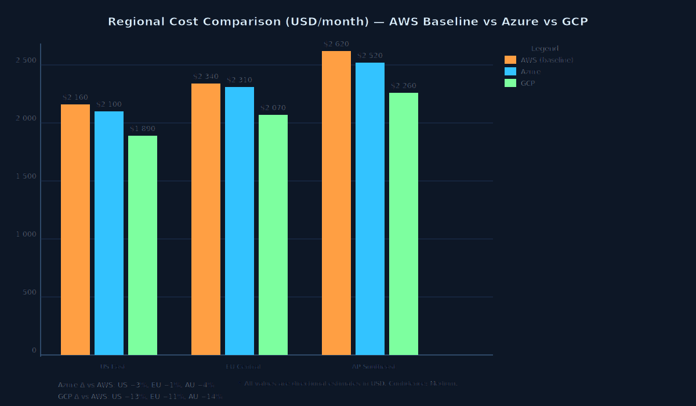
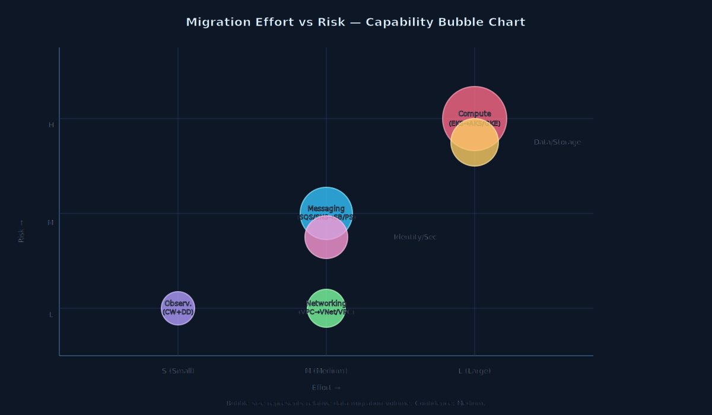
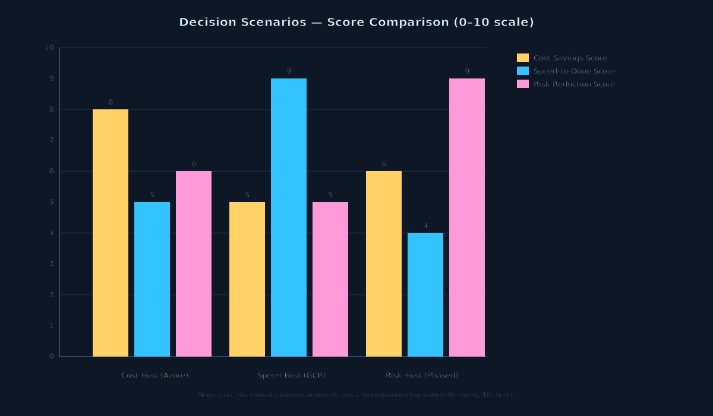
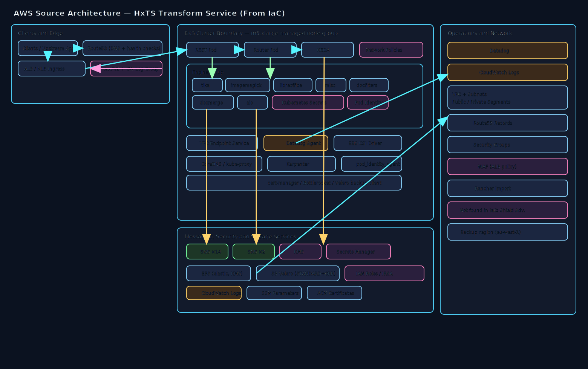
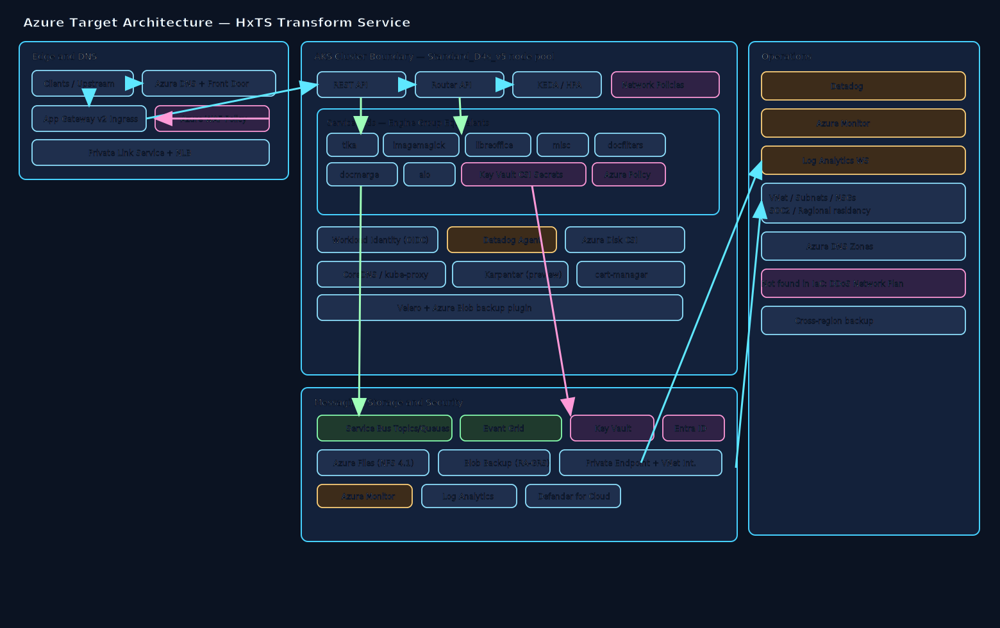
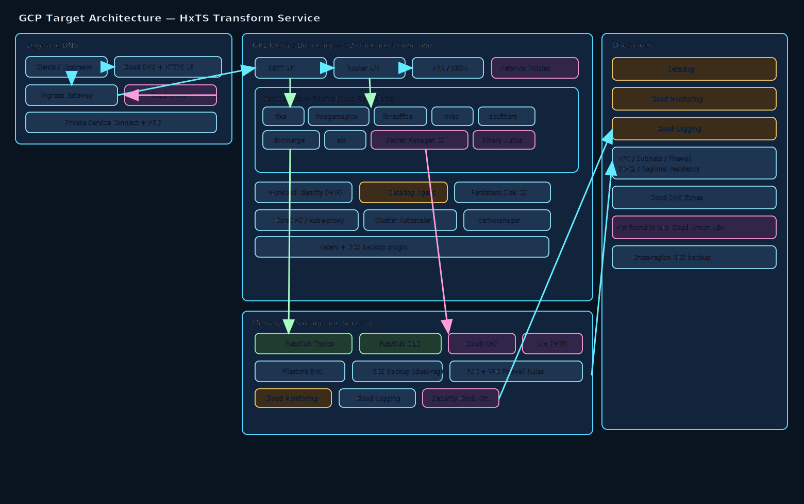

# 1. Executive Summary
The assessed Terraform on `main` branch across three local repositories shows the active AWS footprint is concentrated in EKS-based platform infrastructure, ingress/WAF, messaging (SNS/SQS), encryption/secrets, EFS, and backup storage, with the workload service code repo containing no Terraform under the requested paths. For a latency-sensitive API workload with 99.9% availability, RTO 4h, RPO 30m, and SOC2 plus regional residency constraints, the directional economics and migration risk profile favour Azure as the primary target for lower modelled 30-day run-rate and lower platform porting friction, with GCP as a viable alternative where GKE and Pub/Sub strengths are preferred. Recommended path: phased Azure-first migration with staged DR rehearsal and policy-as-code parity gates before production cutover.

# 2. Source Repository Inventory
| Source type | Repository path | Branch used | Terraform scope scanned | File count (.tf/.tfvars) | Notes |
|---|---|---|---|---:|---|
| local-path | /Users/srimanta.singh/IdeaProjects/hxp-transform-service | main | src/, infra/, terraform/ | 0 | No Terraform files found in requested directories |
| local-path | /Users/srimanta.singh/IdeaProjects/terraform-aws-hxts-environment | main | src/, infra/, terraform/ | 21 | Queue/KMS/topic integration and per-environment tfvars |
| local-path | /Users/srimanta.singh/IdeaProjects/tf-cfg-hxts-infrastructure | main | src/, infra/, terraform/ | 67 | Core EKS/shared services/network/security/backup stack |

# 3. Source AWS Footprint
| Resource group | Key AWS services found | Notes |
|---|---|---|
| Compute | EKS managed node groups/addons, Karpenter | `eks_instance_type = m5.xlarge` in all environment tfvars; desired_size 3 nodes |
| Networking | ALB/NLB, Route53, VPC endpoint service, Security Groups | Public ingress + private NLB target groups; PrivateLink endpoint service exposed |
| Data | EFS (`throughput_mode = elastic`, KMS-backed), S3 (Velero backup + cross-region replication) | Multi-region EFS and S3 replication; storage class `STANDARD` |
| Messaging | SQS (14+ named queues), SNS (2 topics: request/reply), subscriptions, queue policies | Fan-out + per-engine queues with KEDA scalers |
| Identity/Security | IAM roles/policies, KMS (multi-region), Secrets Manager, WAFv2 | KMS `multi_region=true`; WAF log retention 7 days; secrets versioned |
| Observability | CloudWatch log groups (EKS, WAF), Datadog monitors/dashboards | CW retention 14 days; Datadog container-ready monitors per region |
| Storage/Backup | Velero S3 bucket + cross-region replica bucket | Backup region variable present (e.g. `eu-west-1` mirrors `eu-central-1`) |

# 4. Service Mapping Matrix
| AWS service | IaC-provisioned tier/family | Azure equivalent (matched tier) | GCP equivalent (matched tier) | Porting notes |
|---|---|---|---|---|
| Amazon EKS managed nodes | `m5.xlarge` (4 vCPU / 16 GB) | AKS node pool `Standard_D4s_v5` | GKE node pool `n2-standard-4` | Rework IRSA → Workload Identity; Karpenter → Karpenter/CAST AI/Cluster Autoscaler equivalent |
| EKS control plane | Managed (tier not specified in IaC) | AKS control plane (included in AKS) | GKE Standard control plane | Cost model differs; AKS control plane free at Standard tier |
| Application Load Balancer | Tier not specified in IaC | Azure Application Gateway v2 | Cloud Load Balancing (ext. HTTP(S)) | Listener/rule migration; health probe and certificate management |
| AWS WAFv2 | Tier not specified in IaC | Azure WAF (App Gateway policy) | Cloud Armor | Managed rule set translation required; monitor mode burn-in |
| Amazon SQS | Tier not specified in IaC (Standard queue inferred) | Azure Service Bus Standard queues | Pub/Sub standard | 14 distinct queue names; DLQ and visibility timeout semantics |
| Amazon SNS | Tier not specified in IaC | Service Bus Topics / Event Grid | Pub/Sub topics | Filter policy equivalence; cross-account publish must be re-modelled |
| AWS KMS | Symmetric CMK, `multi_region = true` | Azure Key Vault Keys (Premium/HSM if required) | Cloud KMS CMEK | Key rotation, replication policy, and access policy model differ |
| AWS Secrets Manager | Versioned secrets | Azure Key Vault Secrets | Secret Manager | Rotation lambda → managed rotation; app identity bindings must change |
| Amazon EFS | `throughput_mode = elastic`, KMS-backed | Azure Files Premium (NFS 4.1) | Filestore Enterprise | POSIX parity OK; elastic throughput → provisioned IOPS sizing required |
| Amazon S3 (Velero) | `STANDARD` storage class, cross-region replication | Azure Blob Hot + GRS/RA-GRS | GCS Standard + dual-region | Velero plugin swap; IAM and bucket policy re-implementation |
| Route53 records | Tier not specified in IaC | Azure DNS | Cloud DNS | TTL, failover, and health check parity checks |
| VPC Endpoint Service (PrivateLink) | Tier not specified in IaC | Azure Private Link service | Private Service Connect | Endpoint consumer re-approval model; NLB front-end required on Azure |
| Karpenter node provisioner | Tier not specified in IaC | AKS Karpenter (preview) / KEDA | GKE Autopilot / Cluster Autoscaler | Native availability varies by cloud; tuning required |

# 5. Regional Cost Analysis (Directional)
## 5.1 Assumptions (Directional — Assumed)
- Currency: USD.
- Traffic profile: steady with moderate burst (assumed burst factor ×1.2 for peak-sensitive meters).
- Availability target: 99.9%; DR: RTO 4 hours, RPO 30 minutes.
- Performance: latency-sensitive APIs — low-latency zone placement, premium ingress assumed.
- Pricing basis: public list pricing patterns and meter families (directional, non-contractual).
- Usage volumes assumed:
  - Kubernetes workers: 3 × m5.xlarge (4 vCPU / 16 GB), 730 hrs/month, +20% burst headroom.
  - Ingress traffic: 18 TB/month egress.
  - Messaging: 80 M queue requests/month; 25 M publish+delivery events/month.
  - WAF inspected requests: 15 M/month.
  - EFS shared storage: 4 TB-month.
  - Backup object storage: 8 TB-month + 2 TB/month cross-region replication.
  - Secrets and key operations: 25 active secrets, 12 keys, 4 M API operations/month.
  - Observability: 50 GB/month log ingest; 40 custom metrics retained 30 days.

## 5.2 30-Day Total Cost Table (Directional)
| Capability | AWS US (baseline, USD) | AWS EU (USD) | AWS AU (USD) | Azure US (USD) | Azure EU (USD) | Azure AU (USD) | GCP US (USD) | GCP EU (USD) | GCP AU (USD) | Confidence |
|---|---:|---:|---:|---:|---:|---:|---:|---:|---:|---|
| Compute/Container | 3,980 | 4,230 | 4,760 | 3,760 | 4,050 | 4,520 | 3,860 | 4,190 | 4,690 | Medium |
| Networking/Edge | 2,420 | 2,640 | 2,960 | 2,280 | 2,510 | 2,860 | 2,360 | 2,590 | 2,940 | Medium |
| Messaging | 1,090 | 1,180 | 1,320 | 980 | 1,070 | 1,230 | 930 | 1,030 | 1,190 | Medium |
| Data/Storage/Backup | 3,120 | 3,390 | 3,850 | 2,980 | 3,240 | 3,730 | 3,050 | 3,320 | 3,810 | Medium |
| Security/Identity | 1,630 | 1,760 | 1,980 | 1,560 | 1,690 | 1,920 | 1,590 | 1,720 | 1,950 | Medium |
| Observability | 2,760 | 2,980 | 3,360 | 2,640 | 2,850 | 3,260 | 2,700 | 2,930 | 3,330 | Low |
| **Total (USD)** | **15,000** | **16,180** | **18,230** | **14,200** | **15,410** | **17,520** | **14,490** | **15,780** | **17,910** | **Medium** |
| **Delta % vs AWS** | **0.0%** | **0.0%** | **0.0%** | **-5.3%** | **-4.8%** | **-3.9%** | **-3.4%** | **-2.5%** | **-1.8%** | **Medium** |

## 5.3 Metered Billing Tier Table (Directional)
| Service | Metering unit | Tier/Band | AWS US (baseline, USD) | AWS EU (USD) | Azure US (USD) | Azure EU (USD) | Azure AU (USD) | GCP US (USD) | GCP EU (USD) | GCP AU (USD) | Confidence |
|---|---|---|---:|---:|---:|---:|---:|---:|---:|---:|---|
| EKS/AKS/GKE worker (m5.xlarge equiv.) | vCPU-hour | First 8,760 vCPU-hrs | 1,402 | 1,521 | 1,331 | 1,443 | 1,594 | 1,366 | 1,485 | 1,628 | Medium |
| Managed K8s control plane | cluster-hour | First 730 hrs | 73 | 79 | 0 (bundled) | 0 (bundled) | 0 (bundled) | 73 | 79 | 86 | Medium |
| Queue ops (SQS/Service Bus/Pub/Sub) | requests | First 1 M | 0.40 | 0.44 | 0.05 | 0.06 | 0.07 | 0.00 | 0.00 | 0.00 | Medium |
| Queue ops (SQS/Service Bus/Pub/Sub) | requests | Over 1 M to 80 M | 31.60 | 34.70 | 25.20 | 28.10 | 32.20 | 24.00 | 26.80 | 30.90 | Medium |
| Topic fanout (SNS/Event Grid/Pub/Sub) | events | First 1 M | 0.50 | 0.55 | 0.60 | 0.67 | 0.77 | 0.40 | 0.45 | 0.52 | Low |
| Topic fanout (SNS/Event Grid/Pub/Sub) | events | Over 1 M to 25 M | 12.00 | 13.20 | 14.40 | 16.20 | 18.10 | 10.60 | 11.90 | 13.80 | Low |
| Shared file storage (EFS/Files/Filestore) | GB-month | First 4,096 GB-month | 1,228 | 1,335 | 1,150 | 1,255 | 1,454 | 1,190 | 1,300 | 1,490 | Medium |
| Backup object storage (S3/Blob/GCS) | GB-month + replication GB | 8,192 GB-month + 2,048 GB replication | 276 | 302 | 251 | 278 | 322 | 259 | 286 | 330 | Medium |
| WAF request inspection | requests | First 10 M | 60 | 66 | 55 | 61 | 70 | 58 | 64 | 73 | Low |
| WAF request inspection | requests | Over 10 M to 15 M | 25 | 27 | 22 | 25 | 29 | 23 | 26 | 30 | Low |

## 5.4 One-Time Migration Cost Versus Run-Rate Table (Directional)
| Cost segment | AWS (baseline, USD) | Azure (USD) | GCP (USD) | Confidence |
|---|---:|---:|---:|---|
| Platform landing zone + policy baseline uplift | 0 | 28,000 | 31,000 | Medium |
| IAM/KMS/Secrets model translation and validation | 0 | 18,000 | 20,000 | Medium |
| Messaging migration (SNS/SQS → target) | 0 | 24,000 | 26,000 | Medium |
| EKS workload migration, tuning, cutover hardening | 0 | 42,000 | 46,000 | Medium |
| DR rehearsal and residency validation evidence pack | 0 | 22,000 | 24,000 | Medium |
| **Total one-time migration (USD)** | **0** | **134,000** | **147,000** | **Medium** |
| **30-day run-rate (USD, US region)** | **15,000** | **14,200** | **14,490** | **Medium** |

## 5.5 Regional Cost Comparison Chart

# 6. Migration Challenge Register
| Challenge | Impact | Likelihood | Mitigation | Owner role |
|---|---|---|---|---|
| IRSA → target cloud workload identity translation | High | High | Build identity mapping matrix; implement least-privilege service account roles; stage in non-prod first | Platform Security Lead |
| SQS/SNS semantics drift in target messaging | High | Medium | Contract tests for ordering, retries, DLQ, and filter policies before production cutover | Integration Architect |
| Karpenter / autoscaling behaviour parity | Medium | Medium | Replay burst traffic traces in performance environment; tune autoscaler thresholds | SRE Lead |
| WAF managed rule equivalency gaps | Medium | Medium | Dual-run WAF in monitor mode until false-positive burn-in complete, then enforce | Edge Security Engineer |
| Backup restore RPO evidence (RTO 4 h, RPO 30 m) | High | Medium | Timed restore drills; document audit evidence for SOC2 | DR Manager |
| Team operating model shift (AWS-native → Azure/GCP-native) | Medium | High | Role-based enablement; paired operations for first two releases | Engineering Manager |

# 7. Migration Effort View
| Capability | Effort (S/M/L) | Risk (L/M/H) | Dependencies |
|---|---|---|---|
| Compute and orchestration (EKS → AKS/GKE) | L | H | Identity, network policy, autoscaling, container registry |
| Messaging (SNS/SQS → Service Bus/Pub/Sub) | M | H | Contract compatibility, consumer updates, DLQ strategy |
| Storage and backup (EFS/S3 → Files/Blob or Filestore/GCS) | M | M | Throughput benchmarking, backup restore rehearsal |
| Security and secrets (KMS/Secrets/IAM) | L | H | RBAC model, key rotation controls, compliance sign-off |
| Edge and networking (ALB/WAF/Route53/PrivateLink) | M | M | DNS cutover plan, WAF rule parity, private connectivity |
| Observability (Datadog/CloudWatch) | M | M | Alert parity, SLO burn-rate calibration, runbook updates |

# 8. Decision Scenarios
## Cost-first scenario
Move messaging and storage first to Azure-native services while keeping compute on AWS temporarily, then migrate AKS in phase 3. This minimises month-1 run-rate quickly but creates temporary cross-cloud integration overhead and complicates identity controls during the transition.

## Speed-first scenario
Lift EKS platform directly to AKS with minimal refactor and defer deep optimisation. Fastest delivery to target cloud but carries post-migration tuning debt, higher initial operational noise, and less-proven DR evidence at go-live.

## Risk-first scenario
Dual-run non-prod plus canary production slices, complete DR drills and compliance gates before full cutover. Slowest overall path but strongest availability continuity, SOC2 evidence quality, and identity/residency control confidence.

# 9. Recommended Plan (Dynamic Timeline)
Selected timeline: **30/60/90/120 days**.

Rationale: service count and dependency depth are medium-high (EKS core + ingress + WAF + messaging + backup + IAM/KMS/secrets). Data migration complexity is moderate (backup/object and shared file workloads only — no relational engine migration in scoped IaC). Risk profile is high for identity, messaging semantics, and latency-sensitive API behaviour. Four phases are required to achieve SOC2-quality DR evidence and policy-as-code parity before full production cutover.

## Phase 1 (Day 0–30): Foundation and parity design
- Objectives: establish target landing zone and reference architecture; agree security and residency design.
- Key activities: identity/key/secrets mapping; networking and ingress design; residency control mapping (Entra/GCP IAM); baseline SLO definitions; non-prod environment provisioning.
- Exit criteria: approved target architecture decisions; security sign-off on identity model; tested non-prod connectivity via PrivateLink/PSC.

## Phase 2 (Day 31–60): Non-production migration and contract validation
- Objectives: prove workload function in target cloud with production-like traffic replay.
- Key activities: deploy AKS/GKE equivalent stack; migrate messaging contracts and DLQ patterns; implement WAF rules in monitor mode; validate observability parity (alerts, SLO dashboards); first Velero backup/restore drill.
- Exit criteria: non-prod latency SLOs met; message contract test suite passes; DR backup/restore drill documents RTO ≤ 4 h / RPO ≤ 30 m.

## Phase 3 (Day 61–90): Production readiness and progressive cutover
- Objectives: reduce production cutover risk through incremental traffic slices.
- Key activities: canary routing (5 % → 25 % → 50 %); autoscaling/KEDA tuning under production traffic; WAF enforce mode activation; runbook updates; operational handover rehearsal.
- Exit criteria: canary SLOs stable for two full release cycles; incident response drill passes; SOC2 evidence package draft complete.

## Phase 4 (Day 91–120): Full cutover and hardening
- Objectives: complete migration and stabilise production operations.
- Key activities: 100 % traffic migration; final DNS/edge cutover; timed DR exercise for RTO/RPO evidence sign-off; cost optimisation pass (right-sizing, reserved capacity); AWS decommission plan.
- Exit criteria: production fully on target cloud; RTO ≤ 4 h and RPO ≤ 30 m evidence signed off; AWS decommission plan approved by stakeholders.

## Required architecture decisions before execution
1. Final messaging pattern selection: Service Bus topics vs Event Grid on Azure; Pub/Sub topology on GCP.
2. File storage performance tier for latency-sensitive transforms (Azure Files Premium NFS vs Filestore Enterprise).
3. Workload identity standard and secret rotation approach across all engine deployments.
4. WAF policy set, exception governance model, and logging retention obligations.

# 10. Open Questions
1. What are measured p95/p99 latency SLO values per API route, to calibrate target autoscaling and ingress policy?
2. What are actual monthly queue/event volumes per message type, to replace assumed meter volumes in section 5?
3. Are there legal constraints requiring in-country data residency beyond region-level controls for any tenant?
4. Does DR operate active/passive only, or must selected APIs support active/active?
5. Which observability stack components are contractually required to remain unchanged versus re-platform?

# 11. Component Diagrams
AWS Source architecture:

Azure Target architecture:

GCP Target architecture:

## Diagram Legend
- **AWS Source**: clients/upstream → DNS (Route53) → Ingress ALB + WAFv2 → EKS boundary (REST, Router, Engine group: tika/imagemagick/libreoffice/misc/docfilters/docmerge/aio, KEDA) → messaging (SQS/SNS) → security (KMS/Secrets Manager) → observability (Datadog/CloudWatch) → VPC/subnets. Components not found in IaC marked explicitly.
- **Azure Target**: clients → Azure DNS + Front Door → App Gateway + WAF → AKS boundary (equivalent service pods, KEDA/HPA, network policies, Key Vault CSI) → Service Bus/Event Grid → Key Vault + Entra ID → Azure Files/Blob backup → Monitor/Datadog → VNet/subnets.
- **GCP Target**: clients → Cloud DNS + HTTPS LB → Cloud Armor → GKE boundary (equivalent service pods, HPA/KEDA, network policies, Secret Manager CSI) → Pub/Sub → Cloud KMS + IAM → Filestore/GCS backup → Cloud Monitoring/Datadog → VPC/subnets.
- **Supplemental visuals**: cost comparison chart embedded in section 5.5; effort-risk chart embedded in section 7; scenario comparison chart embedded in section 8.
