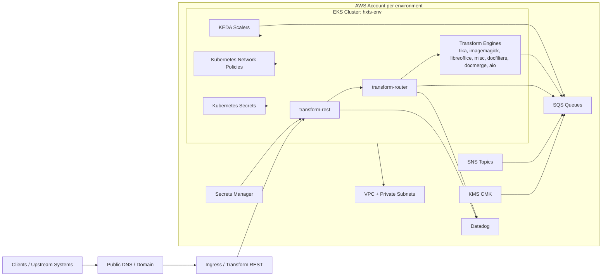
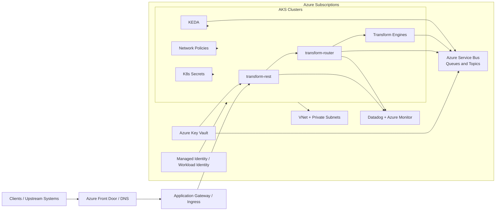
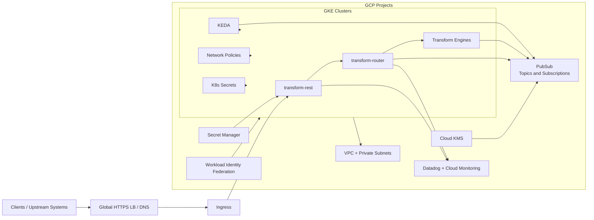

# Migration Decision Report: AWS to Azure/GCP

## 1. Executive Summary
This assessment reviews the Terraform/OpenTofu footprint under `input/**/src/*.tf` for all environments (dev, staging, prod, prod-eu, sandbox) and provides a 24-month migration decision across Azure and GCP. The current platform is a Kubernetes-based transformation stack on AWS (EKS), with queue-driven asynchronous processing (SQS/SNS), KMS encryption, IAM-role-based access, Helm-managed application releases, KEDA autoscaling, and Datadog monitoring.

Given the assumptions (steady/moderate burst traffic, 99.9% availability, RTO 4h, RPO 30m, SOC2 + data residency, latency-sensitive APIs), the recommended approach is **Azure-first migration** with a **targeted GCP pilot** for cost/performance benchmarking after stabilization.

## 2. Source AWS Footprint
| Resource Group | Key AWS Services Found | Notes |
|---|---|---|
| Compute & Orchestration | EKS, Helm provider, Kubernetes provider | HxTS and KEDA deployed via Helm; namespace-scoped policies and secrets |
| Messaging | SQS, SNS, SQS queue policies | Request/reply and engine-specific queue topology; batch and non-batch variants |
| Security & Identity | KMS, IAM policy documents, IAM roles, Secrets Manager, Vault provider | SQS encrypted with KMS CMK; IDP secret pulled from Secrets Manager |
| Networking | VPC, private subnets, AWS IP ranges, Kubernetes egress network policy | Explicit egress controls for DNS/AWS services/private CIDRs |
| Observability | Datadog provider, Datadog monitors | Service health and log alert monitors for transform-rest |
| Autoscaling | KEDA Helm release + queue-to-pod mapping logic | Queue URL/length/name dynamically mapped to scaler values |

Environment overlays found in tfvars:
- dev: us-east-1
- staging: us-east-1
- prod: us-east-1
- prod-eu: eu-central-1
- sandbox: us-east-1

## 3. Service Mapping Matrix
| AWS Service | Azure Equivalent | GCP Equivalent | Porting Notes |
|---|---|---|---|
| EKS | AKS | GKE | Helm and Kubernetes objects are largely portable; ingress/network policy testing required |
| SQS | Service Bus Queues | Pub/Sub | Queue semantics differ; ordering/retry/dead-letter parity must be validated |
| SNS | Event Grid / Service Bus Topics | Pub/Sub Topics | Subscription filter behavior needs translation |
| KMS | Key Vault (keys) | Cloud KMS | Policy model and key lifecycle controls differ |
| Secrets Manager | Key Vault (secrets) | Secret Manager | Straightforward migration with app config rewiring |
| IAM role patterns | Managed Identity + Workload Identity | Workload Identity Federation | Security boundary and RBAC mapping is a key risk area |
| VPC/Subnets | VNet/Subnets | VPC/Subnets | Mostly conceptual parity; route/security policy conversion needed |
| Datadog integration | Keep Datadog (+ optional Azure Monitor) | Keep Datadog (+ optional Cloud Monitoring) | Keep Datadog through migration to reduce telemetry drift |

## 4. Regional Cost Analysis (Directional)
Assumptions used for directional sizing:
- 5 environments active during transition.
- Queue-heavy asynchronous workload with multiple engine services.
- 24-month horizon with phased migration and temporary dual-run overhead.
- Unknown exact utilization values in IaC treated as assumptions and marked medium confidence.

### Estimated steady-state monthly run-rate (USD)
| Capability | Azure US | Azure EU | Azure AU | GCP US | GCP EU | GCP AU | Confidence |
|---|---:|---:|---:|---:|---:|---:|---|
| Kubernetes platform + node pools | 14,000 | 15,400 | 16,800 | 12,900 | 14,200 | 15,600 | Medium |
| Messaging platform | 2,400 | 2,600 | 2,900 | 2,000 | 2,200 | 2,500 | Medium |
| Security (keys/secrets/identity ops) | 1,200 | 1,300 | 1,450 | 1,050 | 1,150 | 1,300 | Medium |
| Networking / egress / LB | 2,000 | 2,200 | 2,500 | 1,900 | 2,100 | 2,400 | Low |
| Observability integration | 1,100 | 1,200 | 1,350 | 1,100 | 1,200 | 1,350 | Medium |
| **Estimated monthly total** | **20,700** | **22,700** | **25,000** | **18,950** | **20,850** | **23,150** | **Medium** |

### One-time migration cost estimate (USD)
| Item | Azure | GCP | Confidence |
|---|---:|---:|---|
| Platform foundation + landing zone | 120,000 | 125,000 | Medium |
| Kubernetes migration + validation | 140,000 | 145,000 | Medium |
| Messaging refactor/mapping | 110,000 | 120,000 | Medium |
| Security/identity remapping | 85,000 | 95,000 | Medium |
| DR drills + cutover readiness | 90,000 | 95,000 | Medium |
| **Total one-time estimate** | **545,000** | **580,000** | **Medium** |

## 5. Migration Challenge Register
| Challenge | Impact | Likelihood | Mitigation | Owner Role |
|---|---|---|---|---|
| SQS/SNS semantic drift in target platform | High | High | Build compatibility test harness; migrate queue families in waves | Platform Architect |
| Identity model remap (IAM -> target identities) | High | Medium | Federated identity rollout with least-privilege reviews and staged gates | Security Architect |
| Network policy and egress control translation | Medium | Medium | Recreate policy intent and validate with pre-prod traffic replay | Platform Engineer |
| Latency regression for API paths | High | Medium | Define SLO gates and progressive traffic shifts with rollback | SRE Lead |
| SOC2 + residency evidence continuity | High | Medium | Parallel compliance workstream and control mapping from day 1 | Compliance Lead |
| Multi-environment release coordination | Medium | Medium | Promotion gates and rollback playbooks per environment wave | Release Manager |

## 6. Migration Effort View
| Capability | Effort (S/M/L) | Risk (L/M/H) | Dependencies |
|---|---|---|---|
| Kubernetes platform migration | M | M | Cluster design, ingress, storage class mapping |
| Messaging migration | L | H | Queue behavior parity and producer/consumer validation |
| Security and identity migration | M | H | Workload identity, RBAC/policy remapping |
| Network/policy migration | M | M | VPC/VNet mapping and egress controls |
| Observability migration | S | M | Alert/dashboard parity and telemetry baselines |
| DR implementation and validation | M | H | Backup/restore automation and failover rehearsal |
| Compliance execution | M | H | SOC2 controls and residency evidence packs |

## 7. Decision Scenarios
### Cost-first
- Prefer **GCP** for lower directional run-rate.
- Tradeoff: higher implementation risk on messaging semantics and platform behavior parity.

### Speed-first
- Prefer **Azure** due stronger operational similarity to current EKS/Helm/Kubernetes model.
- Lower time-to-first-production wave and simpler runbook transition.

### Risk-first
- **Azure-first phased migration**, maintain Datadog continuity, and add a bounded GCP pilot after stabilization.
- Minimizes production risk while preserving optionality.

## 8. Recommended Plan (30/60/90)
### 30 Days
- Baseline queue throughput, latency, and cost by environment.
- Finalize target architecture and compliance control mapping.
- Define acceptance gates for availability, latency, RTO, and RPO.

### 60 Days
- Build non-prod target platform and migrate core Kubernetes workloads.
- Implement identity federation and queue compatibility harness.
- Execute first full integration rehearsal in staging-equivalent environment.

### 90 Days
- Run full DR rehearsal (RTO 4h / RPO 30m validation).
- Complete wave readiness review for production migration.
- Execute phased rollout: sandbox -> dev -> staging -> prod-eu -> prod.

## 9. Open Questions
- Exact CPU/memory/storage utilization per environment is not explicit in IaC.
- Peak per-queue throughput and backlog profiles are not explicit in IaC.
- Current backup/restore orchestration and DR runbooks are not present in scope files.
- Endpoint-level latency SLOs (p95/p99 per critical path) are not present in scope files.
- Production change window and rollback SLA constraints are not present in scope files.

## 10. Component Diagrams
### AWS Source Component Diagram

### Azure Target Component Diagram

### GCP Target Component Diagram
