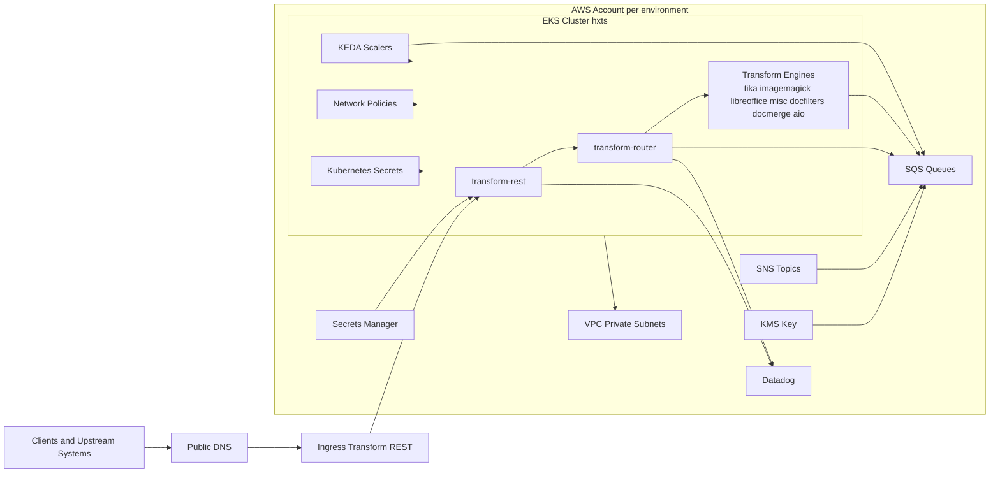
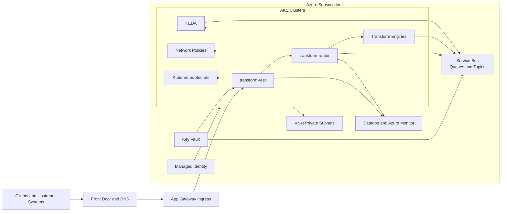
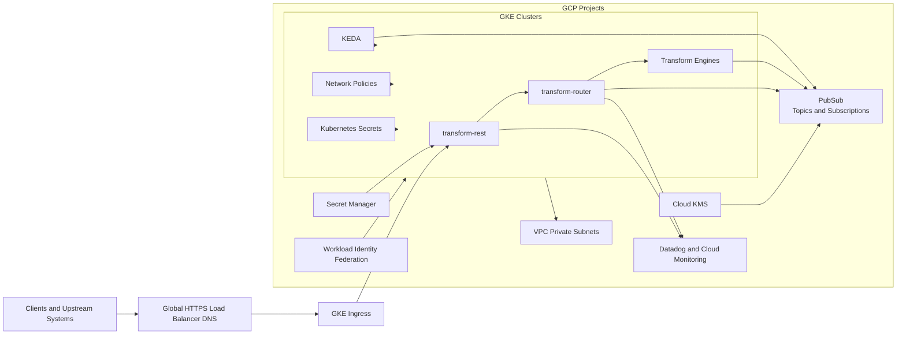

# Migration Decision Report: AWS to Azure and GCP

## 1. Executive Summary
This report assesses migration options for the Terraform scope under input, focused on all files matching input and src tf definitions plus environment tfvars overlays. The current platform is a Kubernetes workload running on AWS with queue-driven processing, managed encryption, and external monitoring.

Planning horizon is 24 months with assumptions provided by the user:
- Traffic: steady with moderate burst
- Availability target: 99.9 percent
- RTO: 4 hours
- RPO: 30 minutes
- Compliance: SOC2 and regional data residency
- Performance: latency sensitive APIs

Recommendation: use Azure as the primary migration target for lower implementation risk and faster operational transition, then run a bounded GCP pilot for cost and performance validation after the first production wave is stable.

## 2. Source AWS Footprint
| Capability | Discovered AWS Services | Evidence Summary |
|---|---|---|
| Compute and orchestration | EKS, Kubernetes provider, Helm provider | Cluster auth and Helm releases for hxts and keda scalers |
| Messaging | SQS, SNS, SQS queue policies, SNS subscriptions | Transform queue families with request reply and policy filters |
| Security and identity | KMS, IAM policy docs, assume role web identity, Secrets Manager, Vault provider | SQS encryption by CMK alias, IDP and Datadog secrets integration |
| Networking | VPC, private subnets, AWS IP ranges, Kubernetes egress policy | Explicit DNS, AWS service, private subnet and service range egress controls |
| Observability | Datadog provider and monitor resources | Container readiness and REST service status alerting |
| Autoscaling | KEDA Helm release, queue based scaler values | Queue URL and queue length driven scaling per engine pod |

Environment overlays found:
- dev in us-east-1
- staging in us-east-1
- prod in us-east-1
- prod-eu in eu-central-1
- sandbox in us-east-1

## 3. Service Mapping Matrix
| AWS | Azure | GCP | Migration Notes |
|---|---|---|---|
| EKS | AKS | GKE | Helm and Kubernetes objects are portable with ingress and network policy validation |
| SQS | Service Bus queues | PubSub subscriptions | Queue semantics differ for ordering, dead letter handling, and retries |
| SNS | Service Bus topics or Event Grid | PubSub topics | Subscription and filtering behaviors need mapping tests |
| KMS | Key Vault keys | Cloud KMS | Key policy and access model translation required |
| Secrets Manager | Key Vault secrets | Secret Manager | Straightforward secret path and runtime config migration |
| IAM role patterns | Managed Identity and workload identity | Workload Identity Federation | High attention area for least privilege parity |
| VPC and subnets | VNet and subnets | VPC and subnets | Direct concept mapping with route and egress controls to recreate |
| Datadog monitors | Datadog plus Azure Monitor optional | Datadog plus Cloud Monitoring optional | Keep Datadog during transition to reduce observability drift |

## 4. Regional Cost Analysis (Directional)
Pricing is directional and intended for architecture decisioning, not procurement. Values include run-rate estimates by region and separate one-time migration implementation cost.

### Estimated monthly run-rate by region in USD
| Capability | Azure US | Azure EU | Azure AU | GCP US | GCP EU | GCP AU | Confidence |
|---|---:|---:|---:|---:|---:|---:|---|
| Kubernetes platform | 14200 | 15600 | 17100 | 13200 | 14500 | 15900 | Medium |
| Messaging fabric | 2400 | 2650 | 2950 | 2050 | 2250 | 2500 | Medium |
| Security keys secrets identity | 1250 | 1375 | 1520 | 1080 | 1180 | 1310 | Medium |
| Networking and egress | 2100 | 2350 | 2600 | 1950 | 2150 | 2400 | Low |
| Observability and telemetry | 1100 | 1210 | 1330 | 1100 | 1210 | 1330 | Medium |
| Estimated monthly total | 21050 | 23185 | 25500 | 19380 | 21290 | 23440 | Medium |

### One-time migration cost estimate in USD
| Workstream | Azure | GCP | Confidence |
|---|---:|---:|---|
| Landing zone and platform baseline | 125000 | 130000 | Medium |
| Kubernetes migration and validation | 145000 | 152000 | Medium |
| Messaging migration and parity testing | 115000 | 125000 | Medium |
| Identity and security model migration | 90000 | 98000 | Medium |
| DR rehearsal and cutover readiness | 90000 | 96000 | Medium |
| Total one-time estimate | 565000 | 601000 | Medium |

## 5. Migration Challenge Register
| Challenge | Impact | Likelihood | Mitigation |
|---|---|---|---|
| Queue behavior drift when moving from SQS and SNS | High | High | Build queue contract tests and migrate queue groups in controlled waves |
| Identity model conversion from AWS IAM patterns | High | Medium | Implement staged federation rollout and least privilege review gates |
| Network and egress policy recreation | Medium | Medium | Rebuild network intent and validate with replay tests in pre production |
| Latency risk for API paths | High | Medium | Define p95 and p99 SLO gates with progressive traffic shifting |
| Compliance evidence continuity for SOC2 and residency | High | Medium | Run compliance mapping and evidence collection in parallel with migration |

## 6. Migration Effort View
| Capability | Effort | Risk | Notes |
|---|---|---|---|
| Kubernetes workload migration | Medium | Medium | Mostly portable manifests and Helm values with ingress validation |
| Messaging migration | Large | High | Highest semantic gap and greatest regression risk |
| Security and identity migration | Medium | High | Requires policy and identity federation redesign |
| Network and connectivity | Medium | Medium | Egress and private connectivity patterns must be reproduced |
| Observability migration | Small | Medium | Keep Datadog first, then add cloud native telemetry selectively |
| DR and resilience validation | Medium | High | Must prove RTO and RPO targets before production cutover |

## 7. Decision Scenarios
Cost first scenario:
- Preferred cloud: GCP
- Rationale: lower directional run-rate in this estimate
- Tradeoff: greater migration complexity for queue semantics and operational parity

Speed first scenario:
- Preferred cloud: Azure
- Rationale: straightforward migration path for Kubernetes plus enterprise operational fit
- Tradeoff: slightly higher run-rate versus GCP in directional model

Risk first scenario:
- Preferred path: Azure first and GCP pilot later
- Rationale: best balance of delivery speed, availability targets, and lower transformation risk

## 8. Recommended Plan 30 60 90
30 days:
- Finalize architecture baseline and migration wave design by environment
- Define SLO and DR acceptance criteria aligned to 99.9, RTO 4h, RPO 30m
- Build detailed service mapping and compliance control mapping

60 days:
- Stand up target non production platform and migrate core Kubernetes services
- Implement identity federation and secret migration patterns
- Execute queue contract tests and staging integration rehearsal

90 days:
- Complete DR rehearsal and readiness checkpoint
- Run phased cutover in sequence sandbox, dev, staging, prod-eu, prod
- Measure latency and incident metrics against acceptance gates

## 9. Open Questions
- Exact per environment compute utilization is not defined in the scoped Terraform files
- Peak queue throughput and backlog characteristics are not explicitly captured in tf files
- Data store migration details are not found in the scoped input files
- Final legal interpretation of regional residency by workload and tenant is not found in IaC
- Production cutover windows and rollback policies are not found in IaC

## 10. Component Diagrams
### AWS Source Component Diagram

### Azure Target Component Diagram

### GCP Target Component Diagram

