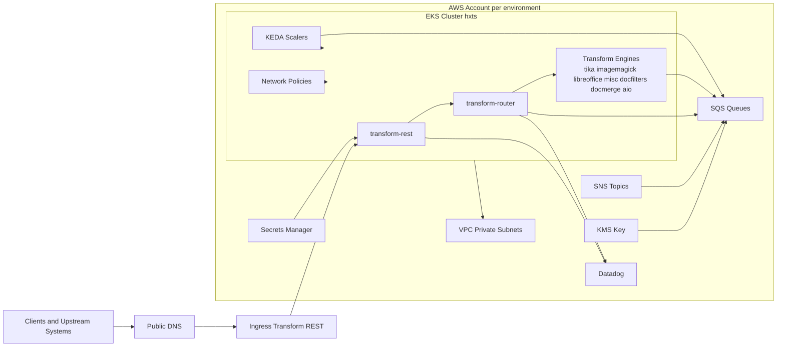
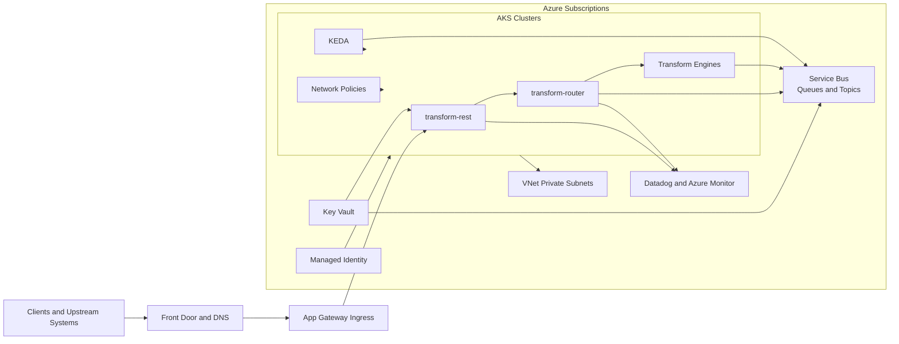
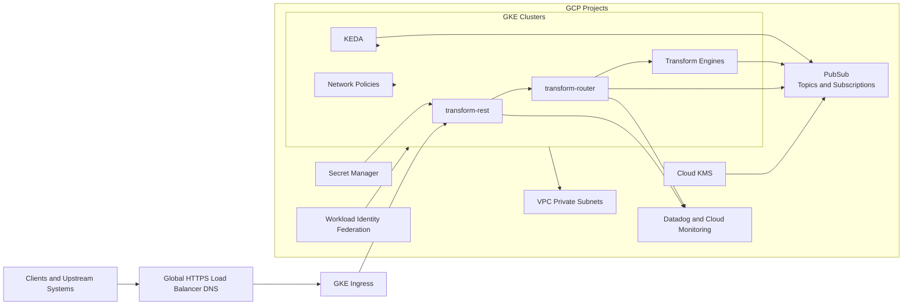

# Migration Decision Report: AWS to Azure and GCP

## 1. Executive Summary
This assessment covers Terraform under input and all discovered environment overlays, plus underlying service code under input that integrates with AWS messaging and identity patterns. The platform is an AWS-hosted, Kubernetes-based transform system with queue-driven orchestration and per-environment overlays.

Planning horizon is 24 months with the provided assumptions:
- Traffic profile: steady with moderate burst
- Availability target: 99.9 percent
- RTO: 4 hours
- RPO: 30 minutes
- Compliance: SOC2 and regional data residency
- Performance: latency sensitive APIs

Recommendation: adopt an Azure-first migration path for lower implementation risk and faster transition, then run a scoped GCP pilot after production stabilization to validate potential run-rate savings.

## 2. Source AWS Footprint
| Capability | AWS Services and Patterns Found | Evidence from IaC and Code |
|---|---|---|
| Compute and orchestration | EKS, Helm, Kubernetes provider | Terraform providers wire Helm and Kubernetes to EKS cluster auth |
| Messaging | SQS queues, SNS topics, SNS to SQS subscriptions, queue policies | Terraform creates queue families and subscriptions; router code uses SQS and SNS helpers and supports sns-sqs protocol |
| Security and identity | KMS CMK, IAM role patterns, web identity assume role, Secrets Manager, IRSA-style service accounts | Terraform defines KMS policies and role assumptions; docs reference IRSA-linked service accounts and OIDC clients |
| Networking | VPC, private subnets, AWS IP range egress controls, ingress through ALB per docs | Terraform network policy allows constrained egress to DNS, AWS services, and private ranges |
| Observability | Datadog provider and monitors, meter registry in router messaging config | Terraform monitor resources and code metrics counters/gauges confirm telemetry dependencies |
| Autoscaling | KEDA scaled objects driven by queue depth | Terraform keda_scalers chart builds queue URL and queueLength mappings by pod |
| Runtime integration behavior | Protocol switching and reply routing behavior | Router code handles both SNS envelopes and direct SQS messages with replyTo-based routing rules |

All environments in scope were identified from tfvars:
- dev in us-east-1
- staging in us-east-1
- prod in us-east-1
- prod-eu in eu-central-1
- sandbox in us-east-1

## 3. Service Mapping Matrix
| AWS Source | Azure Target | GCP Target | Migration Notes |
|---|---|---|---|
| EKS | AKS | GKE | Helm and Kubernetes manifests are portable with ingress and policy adaptation |
| SQS | Service Bus Queues | PubSub subscriptions or pull consumers | Queue semantic mapping needed for visibility timeout, retries, and ordering behaviors |
| SNS | Service Bus Topics or Event Grid | PubSub Topics | Filter policy behavior and delivery semantics must be validated |
| KMS | Key Vault keys | Cloud KMS | Key policies and identity bindings require redesign |
| Secrets Manager | Key Vault secrets | Secret Manager | Secret naming and access paths need refactor and rollout plan |
| IAM roles and OIDC assumptions | Managed Identity plus workload identity | Workload Identity Federation | High-risk area due to authz boundary and token flow differences |
| VPC and subnet model | VNet and subnet model | VPC and subnet model | Direct conceptual mapping with platform-specific policy expression |
| Datadog monitors | Datadog plus Azure Monitor optional | Datadog plus Cloud Monitoring optional | Keep Datadog initially to reduce observability drift |
| SNS SQS protocol behavior in code | Service Bus topic and queue workflow | PubSub topic and subscription workflow | Code-level dispatcher and listener behavior must be remapped and regression tested |

## 4. Regional Cost Analysis (Directional)
Pricing values are directional estimates intended for architecture comparison and planning.

### Estimated monthly run-rate by region in USD
| Capability | Azure US | Azure EU | Azure AU | GCP US | GCP EU | GCP AU | Confidence |
|---|---:|---:|---:|---:|---:|---:|---|
| Kubernetes platform and ingress | 14300 | 15750 | 17300 | 13350 | 14650 | 16050 | Medium |
| Messaging fabric | 2450 | 2700 | 3000 | 2100 | 2300 | 2550 | Medium |
| Security keys secrets identity | 1280 | 1410 | 1560 | 1110 | 1220 | 1360 | Medium |
| Networking and egress | 2150 | 2380 | 2650 | 1980 | 2180 | 2430 | Low |
| Observability telemetry | 1120 | 1240 | 1360 | 1120 | 1240 | 1360 | Medium |
| Estimated monthly total | 21300 | 23480 | 25870 | 19660 | 21590 | 23750 | Medium |

### One-time migration cost estimate in USD
| Workstream | Azure | GCP | Confidence |
|---|---:|---:|---|
| Landing zone and platform baseline | 130000 | 135000 | Medium |
| Kubernetes workload migration | 150000 | 158000 | Medium |
| Messaging and protocol remap | 125000 | 138000 | Medium |
| Security and identity transition | 95000 | 104000 | Medium |
| DR readiness and rehearsals | 90000 | 98000 | Medium |
| Total one-time estimate | 590000 | 633000 | Medium |

## 5. Migration Challenge Register
| Challenge | Impact | Likelihood | Mitigation |
|---|---|---|---|
| SNS and SQS behavior encoded in router listeners and sender paths | High | High | Build protocol compatibility tests and migrate messaging in controlled waves |
| Code paths that auto-create topics and queues in runtime config | Medium | Medium | Replace with declarative platform provisioning and disable runtime creates in target |
| Identity transition from IAM and OIDC assumptions to target identity model | High | Medium | Implement staged identity federation with policy parity checks |
| KEDA autoscaling tuned to SQS queue depth | Medium | Medium | Re-tune autoscaling triggers for Service Bus or PubSub metrics |
| Latency-sensitive API with async fan-out | High | Medium | Enforce p95 and p99 SLO gates during staged traffic migration |
| Compliance evidence continuity across regions | High | Medium | Start SOC2 and residency control mapping in parallel with platform build |

## 6. Migration Effort View
| Capability | Effort | Risk | Notes |
|---|---|---|---|
| Kubernetes platform migration | Medium | Medium | Helm portability is good, but ingress and policy behavior need validation |
| Messaging and dispatcher migration | Large | High | Runtime code explicitly couples to SNS and SQS semantics |
| Security and identity migration | Medium | High | Role and token assumptions differ materially between clouds |
| Network and egress controls | Medium | Medium | Existing egress policy intent must be preserved |
| Observability migration | Small | Medium | Datadog continuity reduces migration complexity |
| DR and resilience validation | Medium | High | Must prove RTO and RPO in rehearsed failover scenarios |

## 7. Decision Scenarios
Cost-first scenario:
- Preferred cloud: GCP
- Rationale: lower directional run-rate in this estimate
- Tradeoff: more code-level messaging adaptation and integration risk

Speed-first scenario:
- Preferred cloud: Azure
- Rationale: smoother enterprise platform transition and strong managed Kubernetes alignment
- Tradeoff: higher directional run-rate than GCP in this model

Risk-first scenario:
- Preferred path: Azure first, then targeted GCP pilot
- Rationale: balances delivery speed, availability goals, and controlled modernization risk

## 8. Recommended Plan (30/60/90)
30 days:
- Baseline current throughput, queue depth, retry behavior, and API latency by environment
- Complete AWS-to-target mapping for messaging and identity flows seen in router code
- Define migration acceptance gates for 99.9 availability, RTO 4h, RPO 30m

60 days:
- Build target non-production platform and migrate core workloads
- Implement target messaging adapters for code paths currently using SNS and SQS
- Execute integration rehearsal with synthetic and replay traffic

90 days:
- Complete full DR drill against RTO and RPO targets
- Execute phased rollout sequence sandbox then dev then staging then prod-eu then prod
- Run post-cutover latency and reliability validation against SLOs

## 9. Open Questions
- Exact per-environment utilization and peak queue burst profiles are not explicit in scoped Terraform
- Not all persistent data path details were found in scoped IaC and code artifacts
- Runtime timeout and retry tuning impact under target messaging services requires benchmark validation
- Regulatory interpretation for regional data residency by message path needs final legal sign-off
- Production maintenance windows and rollback SLAs are not explicitly captured in scoped files

## 10. Component Diagrams
### AWS Source Component Diagram

### Azure Target Component Diagram

### GCP Target Component Diagram

