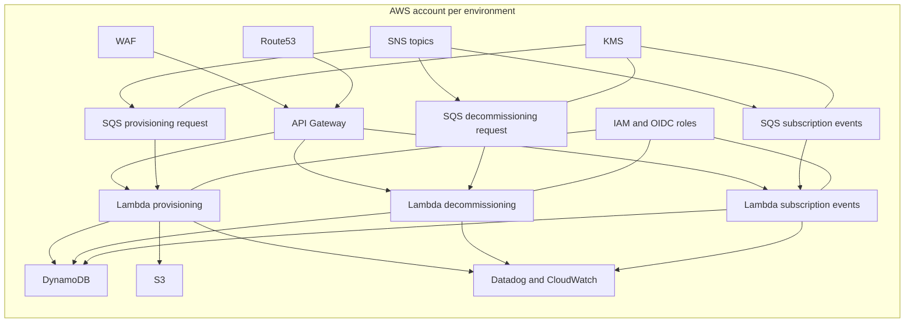
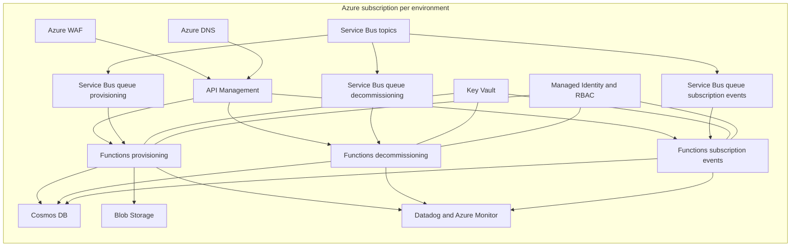
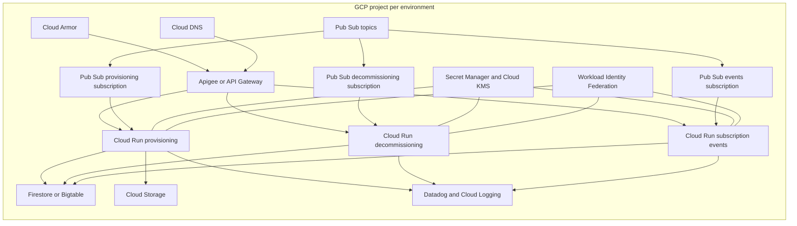

# 1. Executive Summary

Terraform evidence discovered from HylandExperience/tf-config-cicgov-infrastructure, HylandExperience/spacelift-stack-config-cicgov, and HylandExperience/cicgov on main branch shows an AWS-centric platform using API Gateway, Lambda container workloads, SQS and SNS messaging, DynamoDB-oriented data patterns, IAM role federation via Spacelift, KMS encryption, Route53, WAF, and Datadog integrations. For the requested 2-month planning horizon and assumptions (steady with moderate burst traffic, 99.9% availability, RTO 4h, RPO 30m, SOC2 plus regional residency, latency-sensitive APIs), the most cost-effective near-term decision is Azure-first for migration speed and execution risk control, with strict cost guards from day 1 and a narrow GCP benchmark lane only for high-confidence savings opportunities.

Recommended path: Azure-first cost-controlled migration with optional selective GCP benchmarking.

# 2. Source Repository Inventory

| Repository                                       | Branch | Scope searched           | Observed Terraform footprint in requested paths                                                                                         | Notes                                                                             |
| ------------------------------------------------ | ------ | ------------------------ | --------------------------------------------------------------------------------------------------------------------------------------- | --------------------------------------------------------------------------------- |
| HylandExperience/tf-config-cicgov-infrastructure | main   | src/, infra/, terraform/ | Strong presence in src/ (api_gateway, aws_roles, datastores, global_resources, networking, shared_infrastructure) plus tfvars under src | No direct infra/ or top-level terraform/ evidence surfaced in accessible snippets |
| HylandExperience/spacelift-stack-config-cicgov   | main   | src/, infra/, terraform/ | Strong presence in src/ for Spacelift stacks, contexts, policies, and source_root routing                                               | Acts as orchestration/control-plane IaC for workloads                             |
| HylandExperience/cicgov                          | main   | src/, infra/, terraform/ | Terraform discovered under deployment/terraform/api_infrastructure, including queue and lambda modules                                  | src/ and infra/ directories did not show Terraform snippets in fetched evidence   |

# 3. Source AWS Footprint

| Resource group        | Key AWS services found                                                                   | Notes                                                                                |
| --------------------- | ---------------------------------------------------------------------------------------- | ------------------------------------------------------------------------------------ |
| Compute               | AWS Lambda (container image based), ECR image URI references                             | Provisioning, decommissioning, and subscription-events lambdas with shared VPC model |
| Networking            | VPC data sources, private and database subnets, security groups, VPC-linked API patterns | Shared VPC pattern across environments                                               |
| Data                  | DynamoDB patterns, S3 access controls, SSM, Secrets Manager                              | DynamoDB-related schemas/configs and S3 usage visible in app and infra references    |
| Messaging             | SQS queues, SNS subscriptions, EventBridge schedule rules                                | Queue-per-workflow model with SNS fan-in and Lambda queue triggers                   |
| Identity and Security | IAM role and policy documents, OIDC assume-role, KMS keys, WAFv2, ACM, Route53           | High IAM policy granularity and workspace-scoped role model                          |
| Observability         | CloudWatch logs, Firehose references, Datadog modules/variables                          | Datadog integrated at infra and lambda-runtime levels                                |
| Storage               | S3 bucket modules and policies                                                           | Logging bucket and encrypted storage controls observed                               |

# 4. Service Mapping Matrix

| AWS service                   | Azure equivalent                                         | GCP equivalent                                    | Porting notes                                                                   |
| ----------------------------- | -------------------------------------------------------- | ------------------------------------------------- | ------------------------------------------------------------------------------- |
| API Gateway                   | Azure API Management                                     | Apigee X or API Gateway                           | Validate latency overhead and policy translation for sensitive APIs             |
| Lambda container workloads    | Azure Functions with container support or Container Apps | Cloud Run Functions or Cloud Run                  | Container artifact reuse is feasible; trigger and IAM model rewiring needed     |
| SQS                           | Azure Service Bus queues                                 | Pub/Sub subscriptions                             | Retry, dead-letter, and visibility behavior needs contract testing              |
| SNS                           | Azure Service Bus topics                                 | Pub/Sub topics                                    | Subscription filtering rules require redesign and replay validation             |
| EventBridge schedules         | Event Grid with timer-driven Functions or Logic Apps     | Eventarc with Cloud Scheduler                     | Scheduler migration is low complexity                                           |
| DynamoDB                      | Cosmos DB NoSQL                                          | Firestore or Bigtable depending on access pattern | Highest data migration risk area due to schema and throughput model differences |
| IAM plus OIDC role assumption | Entra ID plus Managed Identity plus RBAC                 | IAM plus Workload Identity Federation             | Security model redesign is required for least privilege parity                  |
| KMS                           | Key Vault and Managed HSM                                | Cloud KMS                                         | Key policy and envelope encryption flow must be revalidated                     |
| Route53                       | Azure DNS                                                | Cloud DNS                                         | Low risk with staged TTL and cutover controls                                   |
| WAFv2                         | Azure WAF                                                | Cloud Armor                                       | Rule set behavior differs; tune SQLi and RFI and false positives                |
| CloudWatch Logs               | Azure Monitor and Log Analytics                          | Cloud Logging                                     | Keep Datadog during transition to reduce operational risk                       |
| Secrets Manager and SSM       | Key Vault and App Configuration                          | Secret Manager and parameter alternatives         | Naming and retrieval conventions should be standardized early                   |

# 5. Regional Cost Analysis (Directional)

Pricing below is directional only, not a vendor quote.

Assumptions and unit economics used:

- Horizon is 2 months, focused on migration waves with temporary dual-run overhead.
- Workload profile inferred from IaC: 3 lambda worker services, API gateway edge, 3 queue workflows, shared data and security services.
- Traffic remains steady with moderate burst and 99.9% target.
- DR objective modeled as warm standby with automation sufficient for RTO 4h and RPO 30m.
- Regional uplift multipliers from US baseline: EU +8%, AU +18%.
- Cost-effective plans apply immediate controls: right-size runtime memory, queue polling bounds, log retention controls, and reserved/commit options where safe.

| Capability                     | Azure US monthly | Azure EU monthly | Azure AU monthly | GCP US monthly | GCP EU monthly | GCP AU monthly | Confidence |
| ------------------------------ | ---------------: | ---------------: | ---------------: | -------------: | -------------: | -------------: | ---------- |
| Compute and API runtime        |           11,600 |           12,528 |           13,688 |         11,100 |         11,988 |         13,098 | Medium     |
| Messaging and eventing         |            3,800 |            4,104 |            4,484 |          3,500 |          3,780 |          4,130 | Medium     |
| Data and storage               |           15,200 |           16,416 |           17,936 |         14,900 |         16,092 |         17,582 | Low-Medium |
| Security and identity services |            2,500 |            2,700 |            2,950 |          2,400 |          2,592 |          2,832 | Medium     |
| Observability and logging      |            5,200 |            5,616 |            6,136 |          5,000 |          5,400 |          5,900 | Medium     |
| Network and edge               |            7,900 |            8,532 |            9,322 |          7,600 |          8,208 |          8,968 | Medium     |
| Estimated run-rate total       |           46,200 |           49,896 |           54,516 |         44,500 |         48,060 |         52,510 | Medium     |

2-month directional run-rate totals:

- Azure US: 92,400
- Azure EU: 99,792
- Azure AU: 109,032
- GCP US: 89,000
- GCP EU: 96,120
- GCP AU: 105,020

One-time migration cost for 2-month execution window (directional):

- Azure-first execution: 420,000 to 610,000
- GCP-first execution: 470,000 to 680,000
- Confidence: Medium

# 6. Migration Challenge Register

| Challenge                                               | Impact | Likelihood | Mitigation                                                                           | Owner role               |
| ------------------------------------------------------- | ------ | ---------- | ------------------------------------------------------------------------------------ | ------------------------ |
| DynamoDB access-pattern translation                     | High   | High       | Build table-level access inventory and run shadow traffic validation before cutover  | Data Architect           |
| IAM and role sprawl migration from Spacelift OIDC model | High   | High       | Create role-to-workload matrix and enforce least-privilege baselines in landing zone | Cloud Security Architect |
| Queue and topic semantic parity                         | High   | Medium     | Build replay harness for retries, ordering, dead-letter, and filter policies         | Integration Architect    |
| API gateway and WAF policy equivalence                  | High   | Medium     | Run policy replay tests with latency budgets and false-positive tuning               | Platform Architect       |
| Compliance evidence continuity for SOC2 and residency   | High   | Medium     | Define control mapping and automated evidence capture before wave-1 cutover          | GRC Lead                 |
| Operational retraining and runbook maturity             | Medium | Medium     | Targeted enablement plus gamedays and incident drills in non-prod                    | SRE Manager              |
| Cost drift during dual-run period                       | Medium | High       | FinOps guardrails: budgets, alerts, rightsizing cadence, and resource TTLs           | FinOps Lead              |

# 7. Migration Effort View

| Capability              | Effort (S/M/L) | Risk (L/M/H) | Dependencies                                                           |
| ----------------------- | -------------- | ------------ | ---------------------------------------------------------------------- |
| Compute migration       | M              | M            | Container runtime parity, identity federation, VNet or VPC integration |
| Networking and edge     | M              | M            | DNS strategy, ingress controls, private connectivity                   |
| Data migration          | L              | H            | Data model mapping, consistency validation, migration tooling          |
| Messaging migration     | M              | M            | Topic and queue behavior parity tests                                  |
| Identity and security   | L              | H            | RBAC redesign, key management migration, policy governance             |
| Observability migration | M              | M            | Log schema continuity, SLO dashboards, alert parity                    |
| Storage migration       | S              | L            | Encryption and lifecycle policy mapping                                |

# 8. Decision Scenarios

Cost-first scenario:

- Target cloud: GCP for lower directional run-rate.
- Approach: move queue-heavy stateless workers first, defer high-risk data remap.
- Main tradeoff: higher execution complexity and identity/model adaptation risk in 2-month window.

Speed-first scenario:

- Target cloud: Azure.
- Approach: migrate API and worker path with minimal platform redesign, keep Datadog and existing operational patterns.
- Main tradeoff: slightly higher monthly run-rate than GCP in some regions.

Risk-first scenario:

- Target path: Azure-first with strict cost controls and a narrow GCP benchmark lane.
- Approach: preserve stability for latency-sensitive APIs and prioritize compliance continuity.
- Main tradeoff: temporary dual-platform overhead.

Cost-effective plan recommendations:

1. Prioritize stateless worker and API components first; postpone deep data platform transformation until telemetry confirms savings.
2. Enforce budget alerts and daily cost anomaly detection from day 1 of migration.
3. Keep a single observability plane during transition to avoid duplicate tooling spend.
4. Use environment TTL and auto-stop in non-prod to reduce burn during 2-month execution.
5. Commit only stable baseline capacity after 4 to 6 weeks of observed usage.

# 9. Recommended Plan (30/60/90)

30 days:

- Finalize Azure-first target architecture and low-regret cost guardrails.
- Implement landing-zone controls for SOC2 and residency.
- Build workload inventory and migration wave order focused on stateless API and queue consumers.
- Define success gates for latency, availability, RTO, and RPO.

60 days:

- Execute migration of first production-representative API plus queue worker path.
- Validate DR objectives with controlled failover tests.
- Run side-by-side cost and performance benchmarks for one optional GCP pilot workload.
- Decide go or no-go for broader second-cloud expansion using measured results.

90 days:

- Out-of-horizon stabilization checkpoint for governance and optimization.
- Finalize long-term platform direction based on 60-day evidence.
- If approved, start phase-2 expansion or optimization wave.

Required architecture decisions before execution:

- NoSQL target strategy for DynamoDB-equivalent workloads.
- API management standard and policy model.
- Identity federation authority and workload trust model.
- DR topology and failover automation ownership model.

# 10. Open Questions

1. Exact DynamoDB table cardinality, read/write peaks, and hot partition behavior are not found in IaC.
2. Explicit p95 and p99 SLO targets per latency-sensitive endpoint are not found in IaC.
3. Full backup and restore automation details for all data stores are not found in IaC.
4. Definitive residency matrix by dataset and telemetry class is not found in IaC.
5. Any mandatory private connectivity requirement to external enterprise systems is not found in IaC.

# 11. Component Diagrams

AWS Source Component Diagram

Azure Target Component Diagram

GCP Target Component Diagram

Report artifact: [Reports/multi-cloud-migration-report-20260414-121500-utc.md](Reports/multi-cloud-migration-report-20260414-121500-utc.md)
