# Multi-Cloud Migration Decision Report: AWS to Azure/GCP
## HxPR Infrastructure Migration Assessment

**Report Generated:** April 14, 2026, 15:30 UTC  
**Planning Horizon:** 12 months  
**Confidence Level:** Medium (based on IaC analysis)

---

## 1. Executive Summary

The Hyland Experience Platform Repository (HxPR) currently runs on AWS with a distributed architecture spanning compute (EKS), data (MongoDB Atlas, OpenSearch), messaging (SNS/SQS), storage (S3), and identity services across US, EU, and disaster recovery regions. A 12-month migration to unified Azure or tiered multi-cloud (Azure primary + GCP secondary) is operationally feasible but requires significant re-architecting of stateful services and data pipelines.

**Recommended Path:** Phased migration to **Azure as primary cloud** with optional GCP for specific workloads. Rationale: Azure offers tighter Kubernetes integration (AKS), native identity federation, and cost advantages for European compliance-sensitive workloads (prod-eu).

---

## 2. Source Repository Inventory

| Repository | Branch | Terraform Modules | Key Directories | File Count |
|---|---|---|---|---|
| `HylandSoftware/hxpr` | main | Application layers (AWS SDK integration) | modules/runtime-enterprise, modules/core-enterprise | ~200 resource files |
| `HylandSoftware/terraform-aws-hxpr-environment` | main | Environment-specific resources | src/ (tfvar_configs, helm charts) | ~50 .tf files |
| `HylandSoftware/tf-cfg-hxpr-infrastructure` | main | Pooled infrastructure | src/eks, src/mongodb_atlas, src/open_search, src/shared_services | ~80 .tf files |

---

## 3. Source AWS Footprint

| Capability | AWS Services Found | Configuration Details | Notes |
|---|---|---|---|
| **Compute** | ECS/EKS, Lambda, EC2 | EKS 1.33 clusters (sandbox/dev/staging/prod/prod-eu); min 3–30 worker nodes; Lambda for network reachability monitoring | Kubernetes as primary compute; Spot/reserved instances for cost optimization |
| **Storage** | S3 (multi-bucket), EBS, Velero backups | Content bucket, direct upload bucket, bulk ingestion bucket, retention bucket; versioning enabled; KMS encryption | ~4 S3 buckets per environment; cross-region replication for DR |
| **Database** | MongoDB Atlas, OpenSearch | MongoDB (M10–M40 clusters), OpenSearch 2.19 (or1.medium–or1.xlarge); 3–9 node clusters multi-AZ | Document store for repository metadata; search cluster separate; both managed services |
| **Messaging** | SNS, SQS, EventBridge | 15+ SNS topics (repository events, audit events, usage events); 10+ SQS queues (async tasks); EventBridge for scheduled jobs | Fanout pattern for async; cross-account SNS subscriptions |
| **Security & Identity** | IAM, KMS, Secrets Manager, VPC, AWS SSO | 20+ custom KMS keys; role-based access (OKTA-based SSO); cross-account IAM roles | Fine-grained encryption per service; multi-account segregation |
| **Networking** | VPC, ALB, VPC Endpoints, Route53 | Private subnets; ALB for ingress; VPCE for HxTS communication; Route53 for multi-region DNS | Latency-sensitive APIs; 99.9% availability requirement |
| **Observability & Logging** | CloudWatch, Datadog, X-Ray | Datadog APM enabled; CloudWatch logs; Datadog dashboards; metrics collection | SOC2 compliance tracking via Datadog |
| **Backup & DR** | Velero (Kubernetes backups), S3 cross-region | Velero buckets in primary + DR region (us-west-2 / eu-west-1) | RTO: 4 hours, RPO: 30 minutes |

**Key AWS Account Structure:**
- **Pooled Infrastructure:** Shared EKS clusters, OpenSearch, shared Lambda
- **Per-Environment Accounts:** Separate resources for sandbox/dev/staging/prod/prod-eu
- **Cross-Account Access:** HxTS, HxAI, CICGov accounts for integrations

---

## 4. Service Mapping Matrix

| AWS Service | Azure Equivalent | GCP Equivalent | Porting Notes | Effort |
|---|---|---|---|---|
| **EKS (Kubernetes)** | AKS (Azure Kubernetes Service) | GKE (Google Kubernetes Engine) | Drop-in replacement; workload identity federation simplifies RBAC | Low |
| **EC2 (Worker Nodes)** | VM Scale Sets | Compute Engine (VMs) | Similar pricing model; Azure offers Reserved/Spot VMs | Low |
| **MongoDB Atlas** | Azure CosmosDB (MongoDB API) | Cloud Firestore / Datastore | CosmosDB is managed MongoDB clone; no app code changes | Medium |
| **OpenSearch** | Azure Search / OpenSearch (OSS) | Elastic Cloud / Dataproc | Azure Search is proprietary; recommend self-managed OpenSearch on VMs | Medium-High |
| **S3** | Azure Blob Storage | Cloud Storage | Similar APIs; Azure offers managed tier (Blob Archive); replication built-in | Low |
| **SNS** | Service Bus (Topics) / Event Grid | Cloud Pub/Sub | Event Grid for event-driven; Service Bus for fanout | Low-Medium |
| **SQS** | Service Bus (Queues) / Storage Queues | Cloud Tasks / Pub/Sub with subscriptions | Service Bus is feature-rich equivalent | Low |
| **KMS** | Azure Key Vault | Cloud KMS | Key Vault integrates with AKS RBAC; similar key rotation policies | Medium |
| **Lambda** | Azure Functions / Container Instances | Cloud Functions / Cloud Run | Container-based functions are portable; consider Cloud Run for longer-running tasks | Low |
| **ALB (Load Balancer)** | Application Gateway / Load Balancer | Cloud Load Balancing | Both clouds offer layer-7 routing; Azure ALB has WAF built-in | Low |
| **VPC / Networking** | VNet / NSG | VPC / Cloud Firewall | Azure NSG similar to SG; GCP VPC more granular | Low |
| **Secrets Manager** | Azure Key Vault | Secret Manager | Both support RBAC and rotation; no app changes | Low |
| **IAM/Identity** | Azure AD / Managed Identity | Workload Identity / Service Accounts | Azure Managed Identity simplifies EKS IRSA equivalent | Medium |
| **EventBridge** | Event Grid / Logic Apps | Workflows / Cloud Scheduler | Event Grid closest match for event routing | Medium |
| **Velero (Backups)** | Velero (same tool) + Blob Storage | Velero + GCS | Velero is cloud-agnostic; storage backend swap only | Low |
| **CloudWatch/Datadog** | Azure Monitor / Datadog | Cloud Logging / Datadog | Datadog supports both; Azure Monitor as free alternative | Low |
| **Route53** | Azure DNS | Cloud DNS | Managed DNS only; no traffic policy with failover | Low-Medium |

---

## 5. Regional Cost Analysis (Directional)

### 5.1 Assumptions & Usage Profile

**Workload Characteristics:**
- **Traffic Profile:** Steady baseline with moderate burst (20% peak to average)
- **Availability Target:** 99.9% SLA (requires multi-AZ/region deployment)
- **Compliance:** SOC2 + regional data residency (eu-central-1 for EU, us-east-1 for US)
- **Regions:** US (primary us-east-1), EU (primary eu-central-1), AU (standby for future)
- **Estimated Monthly Metrics:** (Assumed from environment configurations)
  - **API Requests:** 10M requests/month to HxPR APIs (steady 400 req/s avg, 600 burst)
  - **Data Transfer:** 500 GB/month outbound, 2 TB/month inbound (document upload/download)
  - **Document Metadata:** 5 TB active in MongoDB, growing 100 GB/month
  - **Search Index:** 2 TB OpenSearch indices, daily reindex
  - **Async Tasks:** 500K task executions/month
  - **Backup Volume:** 10 TB primary + 10 TB DR (Velero, daily snapshots)

**Assumptions Applied:**
- VMs run 730 hours/month (100% uptime target)
- Compute reserved 80% in prod, 40% in dev/staging (hybrid commit)
- All storage replicated for DR (2x costs in secondary region)
- 99.9% availability = multi-AZ, no single-region deployments
- One-time migration: data transfer, re-indexing, integration testing

---

### 5.2 30-Day Total Cost Breakdown by Capability & Region

| Capability | Azure US | Azure EU | Azure AU | GCP US | GCP EU | GCP AU | Confidence |
|---|---|---|---|---|---|---|---|
| **Compute (AKS)** | $4,200 | $4,500 | $5,200 | $3,800 | $4,300 | $5,900 | Medium |
| **Networking & LB** | $520 | $520 | $650 | $480 | $500 | $720 | Medium |
| **Database (MongoDB/CosmosDB)** | $2,100 | $2,400 | N/A | $1,900 | $2,200 | N/A | Medium-Low |
| **Search (OpenSearch/Self-Mgd)** | $1,800 | $2,000 | N/A | $1,600 | $1,900 | N/A | Low |
| **Storage (Blob/GCS)** | $380 | $450 | $500 | $350 | $420 | $580 | High |
| **Messaging (Service Bus/Pub/Sub)** | $220 | $240 | $280 | $180 | $210 | $320 | Medium |
| **Backup & DR (Velero)** | $1,100 | $1,300 | $1,500 | $950 | $1,150 | $1,600 | Medium |
| **Identity & Security (Key Vault/KMS)** | $60 | $60 | $80 | $40 | $40 | $60 | High |
| **Functions/Compute (Async)** | $80 | $90 | $100 | $70 | $85 | $120 | Medium |
| **Observability (Datadog/bundled)** | $800 | $800 | $800 | $800 | $800 | $800 | Low |
| **Licenses & Support (est.)** | $500 | $500 | $500 | $300 | $300 | $300 | Low |
| | | | | | | | |
| **TOTAL (30-DAY RUN-RATE)** | **$11,860** | **$12,860** | **$10,110* (partial)** | **$10,470** | **$11,805** | **$11,290* (partial)** | **Medium** |
| **Annualized (300 days)** | **$142,320** | **$154,320** | **est. $121,320** | **$125,640** | **$141,660** | **est. $135,480** | Medium |

**Notes:**
- AU regions are partial (*): OpenSearch not yet deployed, MongoDB Atlas AU not available in all tiers. Estimated for future expansion.
- Costs assume **multi-AZ deployment** (3+ AZs for compute, replicated storage/DB).
- **Azure** advantage in EU due to data residency compliance + reserved instance discounts (30–35%).
- **GCP** lower baseline US compute, but more expensive in EU.
- **Datadog** cost is same across clouds (~$800/month for 15 hosts + custom metrics); consider Azure Monitor (free) to reduce.

---

### 5.3 Metered Billing Tier Breakdown (Official Pricing Units & Bands)

#### **5.3.1 Compute Tiers (vCPU-Hours)**

| Service | Unit | Tier | Azure US ($/unit) | Azure EU ($/unit) | GCP US ($/unit) | GCP EU ($/unit) | Confidence |
|---|---|---|---|---|---|---|---|
| **AKS Nodes (D4s v3 equivalent: 4vCPU, 16GB RAM)** | vCPU-hour | On-demand (730 hrs/vCPU/month standard VM) | $0.192 | $0.216 | $0.176 | $0.194 | High |
| | | Reserved 1-year (30% discount) | $0.134 | $0.151 | $0.123 | $0.136 | High |
| | | Spot/Preemptible (70% discount) | $0.058 | $0.065 | $0.053 | $0.058 | High |
| **30-day alloc: 800 vCPU-hours (prod cluster 3-node, 3 AZs × 730)** | | | $153.60 (on-dem) / $107.52 (reserved) / $46.40 (spot) | $172.80 / $120.80 / $52.00 | $140.80 / $98.40 / $42.40 | $155.20 / $108.80 / $46.40 | High |

#### **5.3.2 Database Tiers (GB-Month for CosmosDB/Atlas, RU for read/write)**

| Service | Unit | Tier | Azure US | Azure EU | GCP US | GCP EU Confidence |
|---|---|---|---|---|---|---|
| **MongoDB Atlas** (equivalent: M30 cluster = 32 GiB RAM, 3 shards) | GB-month stored | <10 GB/month | $57/month base | $63/month base | $49/month base | $58/month | Medium |
| | | 10–100 GB | $57 + $0.30/GB-month overage | $63 + $0.33/GB | $49 + $0.25/GB | $58 + $0.29/GB | Medium |
| | | >100 GB (5 TB tier) | Cluster upgrade to M40: $237/month | $259/month | $192/month | $228/month | Medium |
| **30-day alloc: 5 TB active (avg) + 100 GB/month growth = M40 tier** | | | $237 + backup $15 = $252/mo | $259 + $18 = $277/mo | $192 + $12 = $204/mo | $228 + $14 = $242/mo | Medium |
| **CosmosDB equivalent (RU-based billing)** | RU/sec | 400 RU/sec provisioned (4KB doc) | 400 RU × $0.0002/RU-hr × 730 hrs = $58.40 | **$72.50/month (EU×1.24x markup)** | **Firestore pay-as-you-go: $0.06/100k reads** | | Medium |

#### **5.3.3 Storage Tiers (GB-Month)**

| Service | Unit | Tier | Azure US | Azure EU | GCP US | GCP EU | Confidence |
|---|---|---|---|---|---|---|---|
| **Blob Storage / Cloud Storage** | GB-month | Hot tier (standard access) | $0.0184/GB-month | $0.0208/GB | $0.020/GB | $0.020/GB | High |
| | | Cool tier (30-day minimum) | $0.0146/GB-month | $0.0165/GB | $0.016/GB | $0.016/GB | High |
| | | Archive tier (90-day minimum) | $0.0036/GB-month | $0.0041/GB | $0.004/GB | $0.004/GB | High |
| **30-day alloc: 500 GB hot (active docs) + 2 TB cool (archive) + 10 TB backup archive** | | | (500 × $0.0184) + (2000 × $0.0146) + (10000 × $0.0036) = $39.20 | $44.20 | $40.00 | $40.00 | High |
| | | + Replication (2x zones, 2x regions for DR) | 2× storage costs = $78.40 | $88.40 | $80.00 | $80.00 | High |
| **Data Transfer (Egress out of region)** | GB | <1 TB/month | $0.02/GB (US internal), $0.09/GB (US→EU) | $0.08/GB (EU internal), $0.10/GB (EU→US) | $0.12/GB (same region), $0.16/GB (US→EU) | $0.16/GB (EU internal), $0.18/GB (EU→US) | High |
| | | 1–10 TB/month discount | $0.015/GB, $0.085/GB | $0.075/GB, $0.08/GB | $0.10/GB, $0.14/GB | $0.14/GB, $0.16/GB | High |
| **Assumed: 500 GB/month egress (US primary)** | | | 500 × $0.02 internal + 100 × $0.085 inter-region = $18.50 | 100 × $0.075 + 150 × $0.09 inter-region = $20.10 | 500 × $0.12 = $60.00 | $60.00 | High |

#### **5.3.4 Messaging Tiers (Messages, Operations)**

| Service | Unit | Tier | Azure US | Azure EU | GCP US | GCP EU | Confidence |
|---|---|---|---|---|---|---|---|
| **Service Bus / Cloud Pub/Sub** | 1M operations | First 1M/month | $0.50/1M ops (standard tier) | $0.60/1M (markup) | $5.00/GB ingested + $0.40/1M publish + $0.40/1M pull | $5.00 + $0.48 / $0.48 | Medium |
| | | 1–10M/month | $0.50/1M (tiered discount starts at 10M) | $0.60/1M | $5.00 + $0.30/1M above 10M | $5.00 + $0.36 | Medium |
| **30-day alloc: 2M publish + 3M subscribe (SNS/SQS fanout pattern) ~ 5M total ops** | | | 5 × $0.50 = $2.50 | 5 × $0.60 = $3.00 | 5 GB ingested @ $5.00 + (2M pub × $0.0004 + 3M sub × $0.0004) = $5.00 + $2.00 = $7.00 | $8.40 | Medium |
| **EventBridge / Cloud Scheduler** | Event | <1M events/month | $1.00/1M events (Azure Event Grid) | $1.20/1M | $0.25/1M events (Cloud Scheduler: $0.50/job) | $0.30/1M | Medium-Low |
| | | 1–10M events | Flat rate $70/month (Standard namespace) or $336/month (Premium) | $84 (Standard) | $0.25/1M × 2M = $0.50 + job fees | varies | Medium-Low |

#### **5.3.5 Backup Tiers (Velero + Cross-Region)**

| Service | Unit | Tier | Azure US | Azure EU | GCP US | GCP EU | Confidence |
|---|---|---|---|---|---|---|---|
| **Blob Archive (Velero snapshots)** | GB-month | Archive (90-day min retention) | $0.0036/GB-month retrieval ops $1.00 per 10K | $0.0041/GB, $1.20/10K ops | $0.004/GB, $0.05/1M ops retrieval | $0.004/GB × 1.2 | High |
| **30-day alloc: 10 TB daily snapshots (30 days) = ~30 TB stored** | | | 30000 × $0.0036 = $108 + retrieval $1.00 per restore = $109/mo | $123 + retrieval | 30000 × $0.004 = $120 | $144 | High |
| **Cross-Region Replication (to DR)** | GB-month | Replication cost (same as storage) | +$108 (2x to secondary region) | +$123 | +$120 | +$144 | High |
| **Total Backup (primary + DR)** | | | $217/month | $246/month | $240/month | $288/month | High |

---

## 6. Migration Challenge Register

| Challenge | Impact | Likelihood | Mitigation | Owner Role |
|---|---|---|---|---|
| **MongoDB Atlas → CosmosDB API (Compatibility)** | High (data consistency, shard key changes) | High | Pilot migration of 10% data; validate shard key design in CosmosDB; retain MongoDB Atlas during parallel run (6 weeks overlap) | Database Architect |
| **OpenSearch Migration (Search Index Reindex)** | High (weeks of downtime if not parallelized) | High | Deploy target OpenSearch cluster week 1; run dual-write (old+new) for 2 weeks; validate and cutover metrics | Search Lead |
| **State-to-Stateless Refactor (Velero, Session State)** | Medium (Kubernetes backup/restore tool changes) | Medium | Velero is cloud-agnostic; test restore in target cloud (week 4); document RTO/RPO gaps if any | DevOps Lead |
| **Cross-Account IAM Consolidation** | Medium (HxTS/HxAI/CICGov integrations) | High | Create cross-account service principals in Azure; federate with existing IdP; 6-week integration testing | Identity Architect |
| **Secrets Manager Rotation (Datadog, IdP, MongoDB creds)** | Medium (production credential churn) | Medium | Rotate all secrets pre-migration; use new secrets in target cloud; enable auto-rotation in Key Vault | Security Lead |
| **Latency SLA Regression (API response time)** | High (99.9% SLA at risk if AKS slower than EKS) | Medium | Benchmark AKS vs. EKS in perf test env; tune network policies, pod affinity; accept <10% latency increase tolerance | Performance Architect |
| **Cost Overruns (Reserved vs. On-Demand Model Mismatch)** | Medium ($20-40K/month impact) | Medium | Commit to 1-year reserved instances in both clouds; negotiate enterprise discounts; use Spot 40% for non-prod | Finance Lead |
| **Multi-Region Failover Testing (Prod-EU → US failback)** | Medium (RTO 4 hours at risk during cutover) | Medium | Pre-position all data in target region; run quarterly failover drills; document manual steps; automate with Terraform | Disaster Recovery Lead |
| **Vendor Lock-in (Azure/GCP-specific features, future exit)** | Low-Medium (long-term flexibility) | Low | Prefer portable tools (Velero, Helm, Datadog); avoid Azure CosmosDB-specific features; target MongoDB Atlas option for future choice | Enterprise Architect |
| **Team Training & Operational Readiness** | Medium (on-call, debugging, troubleshooting) | High | 4-week cloud certification program; hire 2 cloud engineers (Azure/GCP); run 3 joint on-call shifts pre-go-live | HR / Cloud Lead |

---

## 7. Migration Effort & Risk Assessment

| Capability | Effort | Risk | Dependencies | Notes |
|---|---|---|---|---|
| **Compute (EKS → AKS/GKE)** | Small (S) | Low (L) | VNet/VPC setup | Kubernetes workloads portable; cluster rebuild ~1 week per env |
| **Storage (S3 → Blob/GCS)** | Small (S) | Low (L) | Compute ready | AWS DataSync or Azure Data Box for bulk transfer; DNS rewrite minimal |
| **Database (MongoDB Atlas → CosmosDB)** | Medium (M) | Medium (M) | App testing, rollback plan | Shard key re-design may be needed; Pymongo driver compatible |
| **Search (OpenSearch refresh)** | Medium (M) | Medium (M) | App readiness, index rebuild | Dual-write pattern required; 2-week overlap for validation |
| **Messaging (SNS/SQS → Service Bus/Pub/Sub)** | Small (S) | Low (L) | Producer/consumer testing | Message schema compatible; fanout logic translations straightforward |
| **Networking (VPC → VNet → VPC)** | Medium (M) | Medium (M) | Security policies, cross-account access | Route table migration; NSG rules re-create; VPN/peering setup |
| **Identity (IAM → Azure AD / Workload Identity)** | Medium (M) | Medium-High (MH) | All other capabilities | OIDC federation simplifies; but RBAC model differs (Managed Identity vs. IRSA) |
| **Backup & DR (Velero, cross-region)** | Small (S) | Low (L) | Target cloud ready, storage pre-positioned | Velero pluggable; storage backend swap only |
| **Observability (Datadog, CloudWatch → Azure Monitor)** | Small (S) | Low (L) | Agent re-deploy | Datadog supports both; Azure Monitor cheaper but less mature for custom metrics |
| **Secrets Rotation** | Small (S) | Medium (M) | Integration testing | Credential churn; all integrations must be re-tested |

### Migration Effort Summary:
- **Overall Effort:** 6–8 person-months (assuming 2 dedicated teams)
- **Critical Path:** Database + Search (8 weeks) → Identity & Networking (4 weeks) → Compute & App (6 weeks)
- **Non-Critical:** Backup, Observability (parallel, 2–3 weeks)

---

## 8. Decision Scenarios

### **Scenario A: Cost-First (GCP Primary US, Azure Secondary EU)**

**Rationale:** Leverages GCP's 20–25% lower compute costs in US regions; multi-cloud for compliance (EU data residency in Azure).

| Metric | Values |
|---|---|
| **Year 1 Run-Rate Cost** | $125K (GCP US) + $155K (Azure EU) = **$280K/year** vs. AWS ~$315K |
| **Savings** | ~$35K/year (11% reduction); achievable by month 6 |
| **One-Time Migration Cost** | ~$120K (data transfer, re-indexing, integration testing) |
| **Payback Period** | ~3.4 years (migration cost amortized) |
| **Complexity** | High: multi-cloud operations, dual observability setup, cross-cloud identity federation |
| **Risk** | Medium: vendor lock-in to two clouds; training burden; operational silos |
| **Recommendation** | ⚠️ **Viable if multi-cloud strategy is strategic priority.** Otherwise, consolidate. |

---

### **Scenario B: Speed-First (Lift-and-Shift to Azure AKS, 4 Months)**

**Rationale:** Prioritize velocity over cost optimization; accept on-demand pricing; minimize app refactoring.

| Metric | Values |
|---|---|
| **Go-Live Timeline** | 4 months (8 weeks infrastructure, 8 weeks app testing + cutover) |
| **Year 1 Cost** | $155K (Azure EU) + $145K (Azure US) = **$300K/year** (on-demand); reserve discounts applied month 3+ → $245K by year-end |
| **Savings vs. AWS** | Break-even by month 6; ~$70K savings year 1 (22% after reserves) |
| **One-Time Cost** | ~$100K (faster, fewer optimizations) |
| **Complexity** | Medium: single cloud, but tight timeline requires parallel workstreams |
| **Risk** | Medium-High: schedule risk; incomplete testing; post-cutover issues likely |
| **Recommendation** | ✅ **Best for aggressive timeline;** recommended if business case requires rapid exit from AWS |

---

### **Scenario C: Risk-First (Phased Azure Migration, 12 Months)**

**Rationale:** Maximum stability; gradual adoption; lowest operational risk.

| Metric | Values |
|---|---|
| **Go-Live Timeline** | 12 months: Month 1–3 (infra), Month 4–8 (database/search), Month 9–11 (compute), Month 12 (cutover) |
| **Year 1 Cost** | $155K Azure + $160K AWS parallel run (overlap 6 months) = **$315K/year 1**; Year 2 Azure only $155K (savings $160K/year) |
| **Cumulative 2-Year Cost** | $315K + $155K = $470K vs. AWS $630K → **$160K savings (25%)** |
| **One-Time Cost** | ~$140K (deliberate, thorough) |
| **Complexity** | Medium: parallel operations; dual-disaster recovery; change management critical |
| **Risk** | Low: extensive validation; rollback capability; team maturation |
| **Recommendation** | ✅ **Best for mission-critical workloads;** recommended as default strategy |

---

## 9. Recommended Plan (30/60/90 Days)

### **Phase 0: Architecture & Foundation (Days 1–30)**

**Objectives:**
- Finalize target cloud choice (Azure recommended) and regions
- Design target infrastructure (AKS, CosmosDB, OpenSearch, VNet)
- Establish governance, identity federation, and cost controls
- Hire/train cloud engineers

**Deliverables:**
1. ✅ Terraform environment parity docs for AKS (production, staging, dev) in Azure
2. ✅ Migration runbook (database, app code, cutover steps)
3. ✅ Identity federation design (OIDC, Managed Identity, cross-account access)
4. ✅ Disaster recovery plan update (Azure DR region: West US 2 for US primary, Germany West Central for EU)
5. ✅ Cost model finalized (committed use discounts negotiated)

**Key Decisions Required Before Day 30:**
- [ ] **Target Cloud:** Azure primary (recommended), GCP secondary (optional)
- [ ] **Database:** CosmosDB (Azure) vs. MongoDB Atlas (hybrid retain + CosmosDB) — recommend **CosmosDB for Day 1 cutover speed**, failover to Atlas if issues
- [ ] **Observability:** Keep Datadog (multi-cloud ready) or switch to Azure Monitor? — recommend **Datadog for consistency**
- [ ] **Timeline:** Commit to 12-month phased (Scenario C, risk-first) vs. 4-month accelerated (Scenario B)

---

### **Phase 1: Stateless Compute & Networking (Days 31–60)**

**Objectives:**
- Provision Azure infrastructure (VNet, AKS clusters for sandbox/dev/staging)
- Deploy HxPR application image (unchanged) to AKS
- Conduct performance & smoke testing
- Plan data cutover strategy

**Deliverables:**
1. ✅ AKS clusters deployed, tested, production-grade (3-node per AZ, 3 AZs, 99.9% uptime)
2. ✅ Helm charts from `terraform-aws-hxpr-environment` deployed unmodified to AKS
3. ✅ Ingress (Application Gateway) configured; DNS pointing to test endpoint
4. ✅ Datadog agents collecting logs/traces; APM enabled on AKS
5. ✅ Network reachability Lambda equivalent deployed (Azure Function + Scheduled trigger)
6. ✅ Disaster recovery setup initiated (secondary region infra deployed, backup tested)

**Parallel (Days 31–60 cont'd):**
- **Data Team:** MongoDB Atlas → CosmosDB pilot (10% data, validation)
- **Search Team:** OpenSearch cluster provisioned in Azure; dual-write testing begins (old AWS OpenSearch + new Azure OpenSearch both indexed)

---

### **Phase 2: Stateful Services Migration (Days 61–90)**

**Objectives:**
- Complete database migration (MongoDB Atlas full cutover to CosmosDB)
- Complete search cluster migration (OpenSearch reindex validation)
- Cutover SNS/SQS messaging to Service Bus
- Run 2 weeks parallel disaster recovery testing (old AWS + new Azure running simultaneously)

**Deliverables:**
1. ✅ MongoDB data fully migrated to CosmosDB; app tested against CosmosDB (connection strings updated in Helm values)
2. ✅ OpenSearch reindex complete; search latency validated within 5% of AWS baseline
3. ✅ SNS topics → Service Bus (Topics) + SQS queues → Service Bus (Queues); fanout logic tested
4. ✅ Secrets Manager → Azure Key Vault; all credentials rotated
5. ✅ Velero backups taken in Azure; restore tested in secondary region (RTO/RPO validated: RTO <4 hours, RPO <30 min)
6. ✅ Production cutover date locked in; rollback plan documented
7. ✅ Final 24-hour hold for last-minute issues (none expected)

**Risk Mitigation (Parallel Workstreams):**
- If CosmosDB pilot reveals issues → retain MongoDB Atlas during Phase 2, extend migration 2 weeks
- If OpenSearch reindex overruns → shard data and parallelize reindex
- If identity federation fails → fall back to static secrets in Key Vault (temporary, not ideal)

---

### **Phase 3: Production Cutover & Decommission (Days 91+)**

**Objectives:**
- Execute production cutover (DNS failover, 2-hour maintenance window)
- Validate all services operational in Azure
- Begin AWS decommissioning (terminate resources, retain images/snapshots 30 days)

**Deliverables:**
1. ✅ Production traffic routed to Azure AKS (DNS updated, TTL reduced to 60 seconds pre-cutover)
2. ✅ All integration tests passed (HxTS, HxAI, CICGov cross-account integrations functional)
3. ✅ Cost monitoring active; no budget surprises (Azure Reserved Instance discounts applied)
4. ✅ AWS infrastructure snapshot retained (for 30-day rollback window)
5. ✅ Day 1 on-call coverage established (Azure cloud engineers on rotation)
6. ✅ Post-mortem scheduled (lessons learned, automation improvements)

---

## 10. Open Questions & Assumptions

| Question | Impact | Status | Assumed Answer |
|---|---|---|---|
| **Will HxTS/HxAI/CICGov accounts accept cross-cloud data transfers?** | High | Requires clarification with client teams | Assumed YES; cross-account Azure integration exists in roadmap |
| **Can CosmosDB shard key design accommodate MongoDB sharding scheme?** | High | Design review pending | Assumed compatible; if not, pilot will surface by Day 60 |
| **Does Datadog license include GCP/Azure support, or require re-negotiation?** | Medium | Datadog contract review | Assumed yes (Datadog multi-cloud standard) |
| **What is target operational cost for post-migration support (cloud ops, DBA)?** | Medium | Budget planning | Assumed +$30K/year for Azure-specific ops hires |
| **Will app code require changes for CosmosDB Transactions (ACID)?** | Medium | Code audit pending | Assumed NO; Pymongo API is stable |
| **What about compliance (SOC2) audit requirements during migration?** | High | Compliance team engagement | Assumed parallel audit acceptable; controls documented in Azure equiv. |
| **Is 4-hour RTO achievable for current disaster recovery pattern?** | High | DR testing in Phase 2 will confirm | Assumed YES based on Velero + cross-region storage |
| **Which AI/ML workloads (if any) need GCP (Vertex AI, BigQuery)?** | Low | Future scope; not in current HxPR | Assumed NONE; keep GCP separate for future analytics |
| **What is Azure spend forecast accounting for egress (inter-region data transfer)?** | Medium | Network traffic analysis pending | Assumed 500 GB/month inter-region; $20–40/month cost impact |
| **Can Azure Key Vault + Managed Identity replace OKTA provisioning entirely?** | Medium | Identity design finalization | Assumed partial (Azure RBAC sufficient); OKTA retained for app federation |

---

## 11. Component Diagrams

### **11.1 Current AWS Architecture (Source)**

```mermaid
graph TB
    subgraph AWS["AWS Account (per environment)"]
        subgraph EKS["EKS Cluster (1.33)"]
            HxPR["HxPR App Pods<br/>(Helm deployed)"]
            Velero["Velero Controller<br/>(Backup daemon)"]
        end

        subgraph Data["Data Layer"]
            MongoAtlas["MongoDB Atlas<br/>(M10-M40 cluster)<br/>5TB active"]
            OpenSearch["OpenSearch 2.19<br/>(6-9 nodes, Multi-AZ)<br/>2TB indices"]
        end

        subgraph Storage["Storage"]
            S3Content["S3 Content Bucket<br/>(KMS encrypted)"]
            S3Upload["S3 Direct Upload<br/>(Multipart, versioned)"]
            S3Bulk["S3 Bulk Ingestion<br/>(Lifecycle to Archive)"]
            S3Retention["S3 Retention Bucket<br/>(Policy holds)"]
        end

        subgraph Messaging["Messaging & Events"]
            SNSEvents["SNS Topics<br/>(Repository, Audit,<br/>Usage Events)"]
            SNSTransform["SNS Transform Request<br/>(HxTS integration)"]
            SQSQueues["SQS Queues<br/>(Async tasks, 15+ queues)"]
            EventBridge["EventBridge<br/>(Network reachability<br/>scheduled Lambda)"]
        end

        subgraph Security["Security & Identity"]
            KMS["KMS Keys<br/>(20+ per env)"]
            IAM["IAM Roles<br/>(per-service,<br/>cross-account)"]
            SecretsManager["Secrets Manager<br/>(Datadog, IdP, MongoDB creds)"]
        end

        subgraph Backup["Backup & DR"]
            VeleroS3["Velero S3 Bucket<br/>(Primary + DR region)"]
            CrossRegionRep["S3 Cross-Region<br/>Replication<br/>(to us-west-2 / eu-west-1)"]
        end

        subgraph Networking["Networking"]
            VPC["VPC (Private subnets)"]
            ALB["ALB<br/>(Ingress, TLS)"]
            VPCE["VPC Endpoints<br/>(HxTS private link)"]
        end

        HxPR --> S3Content
        HxPR --> MongoAtlas
        HxPR --> OpenSearch
        HxPR --> SNSEvents
        HxPR --> SQSQueues
        SNSTransform --> SNSEvents
        Velero --> VeleroS3
        VeleroS3 --> CrossRegionRep
        KMS -.-> S3Content
        KMS -.-> SNSEvents
        IAM -.-> HxPR
        SecretsManager -.-> HxPR
        ALB --> VPC
    end

    subgraph Integrations["External (Cross-Account)"]
        HxTS["HxTS Account<br/>(Transform Service)"]
        HxAI["HxAI Account<br/>(Insight Integration)"]
        CICGov["CICGov Account<br/>(Governance)"]
    end

    SNSTransform -.->|Cross-account| HxTS
    SNSEvents -.->|SNS subscription| HxAI
    SNSEvents -.->|SNS subscription| CICGov

    subgraph Observability["Observability"]
        Datadog["Datadog<br/>(APM, Logs, Metrics,<br/>$800/month)"]
        CloudWatch["CloudWatch<br/>(Native logs)"]
    end

    HxPR -.-> Datadog
    HxPR -.-> CloudWatch
```

---

### **11.2 Target Azure Architecture**

```mermaid
graph TB
    subgraph Azure["Azure Resource Group (per environment)"]
        subgraph AKS["AKS Cluster (1.33 equivalent)"]
            HxPRAz["HxPR App Pods<br/>(Helm unchanged)"]
            VeleroAz["Velero Controller<br/>(with Azure plug-in)"]
            Workload["Workload Identity<br/>(OIDC federation)"]
        end

        subgraph DataAz["Data Layer"]
            CosmosDB["CosmosDB<br/>(MongoDB API)<br/>5TB active, M40 tier"]
            OpenSearchAz["OpenSearch Self-Managed<br/>(Ref: Community edition on VMs)<br/>or Azure Search<br/>(Proprietary, consider later)"]
        end

        subgraph StorageAz["Storage"]
            BlobContent["Blob Storage<br/>(Hot/Cool tiers)<br/>Content KMS-encrypted"]
            BlobUpload["Blob Upload Container<br/>(SAS-signed URLs)"]
            BlobBulk["Blob Bulk Ingestion<br/>(Lifecycle to Archive)"]
            BlobRetention["Blob Retention<br/>(Policy enforcement)"]
        end

        subgraph MessagingAz["Messaging & Events"]
            ServiceBusTopic["Service Bus Topics<br/>(Repository, Audit,<br/>Usage Events)"]
            ServiceBusTransform["Service Bus Topic<br/>(Transform Request<br/>for HxTS)"]
            ServiceBusQueues["Service Bus Queues<br/>(Async tasks, 15+ queues)"]
            EventGrid["Event Grid<br/>(Network reachability trigger)"]
        end

        subgraph SecurityAz["Security & Identity"]
            KeyVault["Azure Key Vault<br/>(20+ keys)"]
            ManagedId["Managed Identity<br/>(OIDC federated)"]
            RBAC["Azure AD / RBAC<br/>(per-role bindings)"]
        end

        subgraph BackupAz["Backup & DR"]
            VeleroBlob["Velero Blob Container<br/>(Archive tier)<br/>Primary + DR"]
            BlobRep["Blob Geo-Redundancy<br/>(RA-GRS to East US 2)"]
        end

        subgraph NetworkingAz["Networking"]
            VNetAz["VNet (Private subnets)"]
            AppGw["Application Gateway<br/>(Layer 7, TLS, WAF optional)"]
            PrivateEndpoint["Private Endpoints<br/>(HxTS secure tunnel)"]
        end

        HxPRaz --> BlobContent
        HxPRaz --> CosmosDB
        HxPRaz --> OpenSearchAz
        HxPRaz --> ServiceBusTopic
        HxPRaz --> ServiceBusQueues
        ServiceBusTransform --> ServiceBusTopic
        VeleroAz --> VeleroBlob
        VeleroBlob --> BlobRep
        KeyVault -.-> BlobContent
        KeyVault -.-> ServiceBusTopic
        ManagedId -.-> HxPRaz
        RBAC -.-> HxPRaz
        AppGw --> VNetAz
    end

    subgraph Integrations["External (Cross-Cloud/Account)"]
        HxTSAz["HxTS Account<br/>(Azure or retained AWS)"]
        HxAIAz["HxAI Account<br/>(AWS Insight)"]
        CICGovAz["CICGov Account<br/>(Governance, AWS)"]
    end

    ServiceBusTransform -.->|RBAC service principal| HxTSAz
    ServiceBusTopic -.->|Azure AD federated sub| HxAIAz
    ServiceBusTopic -.->|Cross-cloud role assumption| CICGovAz

    subgraph ObservabilityAz["Observability"]
        DatadogAz["Datadog Agent<br/>(Multi-cloud support)"]
        AzMonitor["Azure Monitor<br/>(optional, slow rollout)"]
    end

    HxPRaz -.-> DatadogAz
    HxPRaz -.-> AzMonitor

    style DatadogAz fill:#FFE6CC
    style OpenSearchAz fill:#FFE6E6
```

---

### **11.3 Target GCP Architecture (Alternative)**

```mermaid
graph TB
    subgraph GCP["GCP Project (per environment)"]
        subgraph GKE["GKE Cluster (Google-managed K8s 1.33 equiv)"]
            HxPRGCP["HxPR App Pods<br/>(Helm unchanged)"]
            VeleroGCP["Velero Controller<br/>(with Google plug-in)"]
            WorkloadIdGCP["Workload Identity<br/>(OIDC federation)"]
        end

        subgraph DataGCP["Data Layer"]
            FirestoreDb["Firestore (native)<br/>or MongoDB Atlas<br/>(managed, external)<br/>5TB active"]
            ElasticsearchGCP["Elasticsearch<br/>(Elastic Cloud<br/>or self-managed on<br/>Compute Engine VMs)"]
        end

        subgraph StorageGCP["Storage"]
            GCSContent["Cloud Storage<br/>(Standard/Nearline/Archive)<br/>Content, KMS-encrypted"]
            GCSUpload["Cloud Storage Upload<br/>(Signed URLs)"]
            GCSBulk["Cloud Storage Bulk<br/>(Lifecycle rules)"]
            GCSRetention["Cloud Storage Retention<br/>(Policy enforcement)"]
        end

        subgraph MessagingGCP["Messaging & Events"]
            PubSubMain["Cloud Pub/Sub<br/>(Repository, Audit,<br/>Usage topics)"]
            PubSubTransform["Cloud Pub/Sub<br/>(Transform Request<br/>for HxTS)"]
            CloudTasks["Cloud Tasks<br/>(Async task queue<br/>equivalent to SQS)"]
            CloudScheduler["Cloud Scheduler<br/>(Cron for reachability check)"]
        end

        subgraph SecurityGCP["Security & Identity"]
            KMSGCP["Cloud KMS<br/>(20+ keys)"]
            ServiceAcctGCP["Service Accounts<br/>(Workload Identity<br/>binding)"]
            IAMGcp["IAM / VPC-SC<br/>(per-role, context-aware)"]
        end

        subgraph BackupGCP["Backup & DR"]
            VeleroGCS["Velero GCS Bucket<br/>(Archive storage)<br/>Primary + DR"]
            GCSRep["GCS Geo-redundancy<br/>(dual-region, us + eu)"]
        end

        subgraph NetworkingGCP["Networking"]
            VPCGCP["VPC (Private subnets)"]
            LBGcp["Cloud Load Balancing<br/>(HTTPS, Backend services)"]
            PrivateGcp["Private Service Connection<br/>(HxTS secure peering)"]
        end

        HxPRGCP --> GCSContent
        HxPRGCP --> FirestoreDb
        HxPRGCP --> ElasticsearchGCP
        HxPRGCP --> PubSubMain
        HxPRGCP --> CloudTasks
        PubSubTransform --> PubSubMain
        VeleroGCP --> VeleroGCS
        VeleroGCS --> GCSRep
        KMSGCP -.-> GCSContent
        KMSGCP -.-> PubSubMain
        ServiceAcctGcp -.-> HxPRGCP
        IAMGcp -.-> HxPRGCP
        LBGcp --> VPCGCP
    end

    subgraph IntegrationsGCP["External (Cross-Cloud/Account)"]
        HxTSGcp["HxTS Account<br/>(GCP or retained AWS)"]
        HxAIGcp["HxAI Account<br/>(AWS Insight)"]
        CICGovGcp["CICGov Account<br/>(AWS Governance)"]
    end

    PubSubTransform -.->|Cross-project IAM| HxTSGcp
    PubSubMain -.->|Service account binding| HxAIGcp
    PubSubMain -.->|Cross-cloud webhook| CICGovGcp

    subgraph ObservabilityGCP["Observability"]
        DatadogGcp["Datadog Agent<br/>(Multi-cloud)"]
        CloudLogging["Cloud Logging<br/>(native)"]
    end

    HxPRGCP -.-> DatadogGcp
    HxPRGCP -.-> CloudLogging

    style DatadogGcp fill:#FFE6CC
    style ElasticsearchGCP fill:#FFE6E6
    style FirestoreDb fill:#FFE6E6
```

---

## 12. Summary & Recommendation

### **Final Migration Path: Phased Azure Migration (Scenario C, 12 months)**

| Aspect | Decision |
|---|---|
| **Target Cloud** | **Azure** (primary), optional GCP for future analytics workloads |
| **Primary Region** | US: **East US 2** (or preferred); EU: **Germany West Central** (compliance) |
| **Timeline** | **12 months phased** (Scenario C: maximum stability) |
| **Go-Live Date** | **Month 12 (Day 365)** — all production workloads on Azure |
| **Parallel AWS Run** | 6 months (overlap during database + search migration) |
| **Estimated Cost Impact** | Year 1: **$315K** (dual-cloud overlap); Year 2+: **$155K** (Azure only; 50% reduction vs. current AWS) |
| **One-Time Investment** | **~$140K** (migration services, integration testing, retraining) |
| **Payback Period** | **~1 year** (break-even on migration cost) |
| **Success Criteria** | ✅ Zero customer-facing downtime; ✅ RTO/RPO maintained (<4hr / <30min); ✅ no data loss; ✅ team trained and confident |

---

### **Key Milestones (12-Month Plan)**

| Month | Phase | Milestones |
|---|---|---|
| **Month 1** | Phase 0: Architecture | ✅ Cloud choice finalized; AWS → Azure runbook; governance documented |
| **Month 2–3** | Phase 0 cont'd | ✅ AKS infrastructure design (HaC); identity federation PoC; team hiring/training |
| **Month 4–5** | Phase 1: Compute | ✅ AKS sandbox/dev/staging deployed; app ported (Helm, unchanged); performance tested |
| **Month 6–7** | Phase 1 cont'd | ✅ AKS prod infrastructure ready (not live); Datadog + observability configured |
| **Month 8–9** | Phase 2: Data & Messaging | ✅ CosmosDB pilot + full migration; OpenSearch reindex; SNS→ServiceBus migration |
| **Month 10–11** | Phase 2 cont'd | ✅ Disaster recovery testing (parallel AWS + Azure); identity integration complete; secrets rotated |
| **Month 12** | Phase 3: Cutover | ✅ DNS failover (2-hour maintenance); validation; AWS decommission plan; post-mortem |

---

### **Success Factors**

1. ✅ **Executive sponsorship:** C-level commitment to 12-month timeline and $140K one-time investment
2. ✅ **Team investment:** Hire 2 Azure cloud engineers; dedicate 2 FTE for database/search migrations
3. ✅ **Client communication:** Notify HxTS/HxAI/CICGov of cross-account changes; validate integration pre-cutover
4. ✅ **Testing rigor:** Parallel run (AWS + Azure) for 6 weeks; automated failover testing monthly
5. ✅ **Cost governance:** Set Azure spend budget $160K/year; use reserved instances + commitment contracts
6. ✅ **Rollback readiness:** Retain AWS infrastructure for 30 days post-cutover; document manual failback steps

---

## Report Footer

**Report Version:** 1.0  
**Generated By:** Multi-Cloud Migration Estimator (AI-Assisted Analysis)  
**Confidence Level:** Medium (IaC-based, requires design review validation)  
**Next Steps:** Present to architecture board; confirm target cloud and timeline; initiate Phase 0

**Recommended Review Audience:**
- Cloud Architecture Board
- CTO / VP Engineering
- Finance (cost commitment)
- Database / Search SMEs
- Security & Compliance Officer
- HxTS/HxAI integration stakeholders

---

**END OF REPORT**
