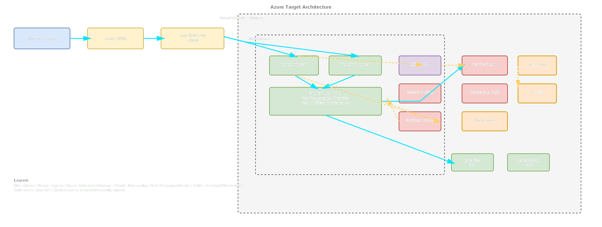

# Multi-Cloud Migration Decision Report

## 1. Executive Summary
The three repositories on `main` indicate a queue-driven, Kubernetes-centric HxTS platform running on AWS with EKS (v1.33), Karpenter (1.10.0), KEDA queue autoscaling, SQS/SNS messaging, ALB/WAF/Route53 ingress, ACM certificates, EFS shared storage, KMS encryption, and Datadog observability. For a 24-month horizon and your assumptions (steady/moderate burst, 99.9% availability, RTO 4h, RPO 30m, SOC2 plus residency, latency-sensitive APIs), Azure remains the recommended primary path due to migration-risk reduction in identity and operational controls, with GCP retained as a cost-first benchmark option.

Recommended path: Azure-first phased migration with parallel GCP benchmark in pilot.

## 2. Source Repository Inventory
| Repository | Branch | Scope | File count (directional) | Notes |
|---|---|---|---|---|
| HylandSoftware/hxp-transform-service | main | `src/`, `infra/`, `terraform/` | 0 Terraform modules in scoped folders | Strong AWS architecture and messaging behavior signals from docs and code; infra references point to infra repos. |
| HylandSoftware/terraform-aws-hxts-environment | main | `src/`, `infra/`, `terraform/` | ~25–35 TF/tfvars | Terraform root module for per-env deploys; SQS queue model, KMS, Helm releases, KEDA wiring, network policies. |
| HylandSoftware/tf-cfg-hxts-infrastructure | main | `src/`, `infra/`, `terraform/` | ~50–70 TF/tfvars | EKS base/add-ons, shared services (ALB/WAF/SNS), cert-manager, Velero, EFS, KMS, Route53/ACM. |

Assumed: counts are directional due to snippet-based remote discovery.

## 3. Source AWS Footprint
| Resource group | Key AWS services found | Notes |
|---|---|---|
| Compute | EKS, EC2 node groups, Karpenter | EKS cluster lifecycle and autoscaling are IaC-managed. |
| Networking | VPC, private/public subnets, ALB, private NLB, WAFv2, Route53 | Public edge into private cluster path is explicit. |
| Data | EFS, EBS, S3 | EFS for shared temp/file paths; S3 for backup and Velero flows. |
| Messaging | SQS, SNS | Queue-driven request/reply and scaler signals are central to architecture. |
| Identity/Security | IAM, IRSA/OIDC, KMS, Secrets Manager | Key and secret controls are deeply integrated into app and infra. |
| Observability | Datadog, CloudWatch | Datadog agent and monitors are first-class operational dependencies. |
| Storage | EFS + Velero storage buckets | Cross-region backup pattern visible in Velero configuration. |

## 4. Service Mapping Matrix
| AWS service | Azure equivalent | GCP equivalent | Porting notes |
|---|---|---|---|
| EKS | AKS | GKE | Platform parity is strong; workload identity and policy mapping are main effort. |
| Karpenter + node groups | AKS autoscaler/Node Autoprovision | GKE autoscaler + node pools | Capacity policy behavior must be retuned per cloud. |
| SQS | Service Bus queues | Pub/Sub subscriptions / Cloud Tasks | Retry, visibility, DLQ semantics need replay-based contract validation. |
| SNS | Service Bus topics | Pub/Sub topics | Filter-policy behavior and fan-out model must be remapped carefully. |
| ALB + WAFv2 | App Gateway/Front Door + WAF | HTTPS LB + Cloud Armor | Rule tuning and upload endpoint exclusions need staged validation. |
| Route53 | Azure DNS | Cloud DNS | DNS migration is straightforward with controlled TTL/cutover. |
| ACM | Key Vault certs | Certificate Manager | Cert lifecycle changes are operational, low app impact. |
| EFS | Azure Files/ANF | Filestore | Latency-sensitive workloads require pre-cutover benchmark gates. |
| S3 | Blob Storage | Cloud Storage | Backup/replication and Velero backend migration needed. |
| KMS | Key Vault keys/HSM | Cloud KMS | Key policy and key hierarchy redesign is a high-risk workstream. |
| Secrets Manager | Key Vault secrets | Secret Manager | Injection and rotation workflows need migration. |
| Datadog + CloudWatch | Azure Monitor + Datadog | Cloud Operations + Datadog | Retaining Datadog lowers operational retraining risk. |

## 5. Regional Cost Analysis (Directional)
| Capability | Azure US | Azure EU | Azure AU | GCP US | GCP EU | GCP AU | Confidence |
|---|---:|---:|---:|---:|---:|---:|---|
| Compute | 25,000 | 27,500 | 29,800 | 24,200 | 26,300 | 29,100 | Medium |
| Networking + Edge | 4,800 | 5,300 | 5,900 | 4,500 | 5,000 | 5,700 | Low |
| Messaging | 3,200 | 3,450 | 3,900 | 2,900 | 3,250 | 3,700 | Medium |
| Data + Storage | 6,900 | 7,400 | 8,100 | 6,400 | 6,900 | 7,800 | Medium |
| Security + Identity | 1,450 | 1,600 | 1,750 | 1,300 | 1,500 | 1,680 | Low |
| Observability | 5,200 | 5,600 | 6,000 | 5,100 | 5,500 | 5,900 | Medium |
| Total monthly directional | 46,550 | 50,850 | 55,450 | 44,400 | 48,450 | 53,880 | Medium |

Assumptions and unit economics used:
- Traffic profile: steady with moderate burst.
- Availability target: 99.9%.
- RTO/RPO: 4h/30m.
- Compliance: SOC2 + regional residency.
- Performance: latency-sensitive APIs.
- Costs are directional estimates (run-rate), not contractual quotes.

One-time migration cost (separate from run-rate):
- Azure-first: USD 1.8M–2.6M.
- GCP-first: USD 2.0M–2.9M.
- Confidence: Medium.

## 6. Migration Challenge Register
| Challenge | Impact | Likelihood | Mitigation | Owner role |
|---|---|---|---|---|
| Messaging semantic gap (SQS/SNS to target) | High | High | Compatibility adapter, replay harness, dual-run burn-in | Platform Architect |
| IRSA/OIDC to target workload identity | High | High | Early identity ADR + policy-as-code baseline | Security Architect |
| EFS equivalence and latency risk | High | Medium | IO benchmarking and canary validation on target storage | App Performance Lead |
| WAF parity and edge policy drift | Medium | Medium | Canary route rollout, rule tuning, false-positive monitoring | Network Security Lead |
| DR model rebuild (Velero/backups) | High | Medium | Restore drills and region failover game days | DR Lead |
| Team operational retraining | Medium | High | Structured enablement and shadow on-call period | Platform Manager |

## 7. Migration Effort View
| Capability | Effort (S/M/L) | Risk (L/M/H) | Dependencies |
|---|---|---|---|
| Compute platform | L | M | Cluster baseline, autoscaler policy, ingress decisions |
| Messaging | L | H | Contract tests, filtering semantics, DLQ behavior |
| Networking/edge | M | M | DNS cutover sequencing, WAF policy mapping |
| Data/storage | M | H | EFS replacement benchmark, backup redesign |
| Identity/security | L | H | Workload identity and key policy migration |
| Observability | M | M | Datadog continuity and SLO alert parity |
| CI/CD governance | M | M | IaC pipeline updates and control gates |

Migration difficulty rationale (Low/Medium/High):
- Compute: High.
- Networking: Medium.
- Data: High.
- Messaging: High.
- Identity/Security: High.
- Observability: Medium.
- Storage: High.

## 8. Decision Scenarios
Cost-first scenario:
- Prefer GCP.
- Lowest directional run-rate.
- Higher migration complexity in messaging/identity translation.

Speed-first scenario:
- Prefer Azure.
- Faster enterprise operational landing.
- Slightly higher run-rate in modeled regions.

Risk-first scenario:
- Prefer Azure phased dual-run.
- Better migration safety for queue-driven patterns and ops continuity.
- Temporary dual-cloud cost overhead.

## 9. Recommended Plan (30/60/90)
30 days:
- Lock ADRs: identity, messaging, storage, DR.
- Build Azure/GCP benchmark landing zones.
- Implement queue replay + latency validation harness.

60 days:
- Pilot AKS and GKE with one engine flow.
- Validate DR objectives with restore drill.
- Select target based on measured latency/risk.

90 days:
- Execute wave-1 production migration (lower-criticality envs first).
- Enforce production readiness and rollback gates.
- Plan wave-2 for staging/prod.

Required architecture decisions before execution:
- Final workload identity model.
- Messaging abstraction and DLQ contract.
- Storage acceptance criteria for latency-sensitive paths.
- Regional DR topology and residency controls.

## 10. Open Questions
- What peak queue throughput and backlog SLOs are required per engine?
- Are there strict country-level residency constraints beyond US/EU/AU?
- Is active-active required for any production flows?
- Which flows require strict ordering guarantees?
- What is the maximum allowed cutover window per environment?

## 11. Component Diagrams
Draw.io artifact path:
- [Reports/multi-cloud-migration-diagrams-20260414-180500-utc.drawio](multi-cloud-migration-diagrams-20260414-180500-utc.drawio)

SVG file paths:
- AWS Source: [Reports/multi-cloud-migration-diagrams-FIXED-aws-source.svg](multi-cloud-migration-diagrams-FIXED-aws-source.svg)
- Azure Target: [Reports/multi-cloud-migration-diagrams-FIXED-azure-target.svg](multi-cloud-migration-diagrams-FIXED-azure-target.svg)
- GCP Target: [Reports/multi-cloud-migration-diagrams-FIXED-gcp-target.svg](multi-cloud-migration-diagrams-FIXED-gcp-target.svg)

Embedded diagrams:

Legend of major component groups (audit detail):
- AWS Source: clients/upstream, DNS/domain, ingress, VPC/subnets, EKS boundary, REST/router/engine group, KEDA, network policies, Kubernetes secrets, SQS, SNS, KMS, Secrets Manager, Datadog, and key request/messaging/scaling/security/observability flows.
- Azure Target: equivalent client-edge-network-cluster-pod topology with Service Bus queues/topics, Workload Identity, Key Vault, Azure Files/Blob backup, and observability flows.
- GCP Target: equivalent client-edge-network-cluster-pod topology with Pub/Sub subscriptions/topics, Workload Identity + Secret Manager + Cloud KMS, Filestore/GCS backup, and observability flows.

Page mapping:
- AWS Source: source architecture.
- Azure Target: recommended target architecture.
- GCP Target: alternative target architecture.

Note: Mermaid is intentionally not embedded in the report.
