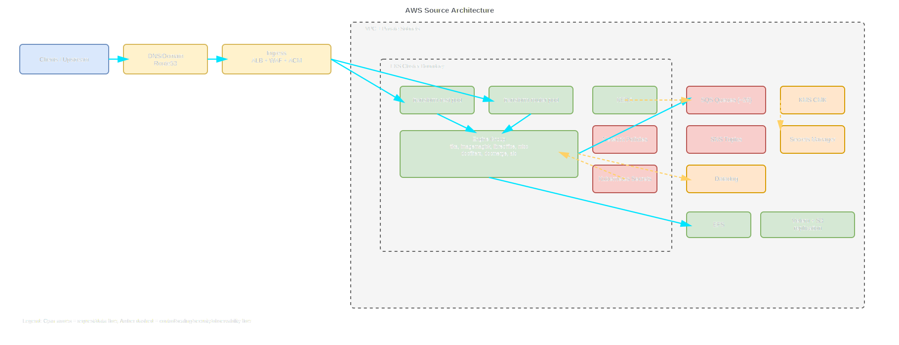
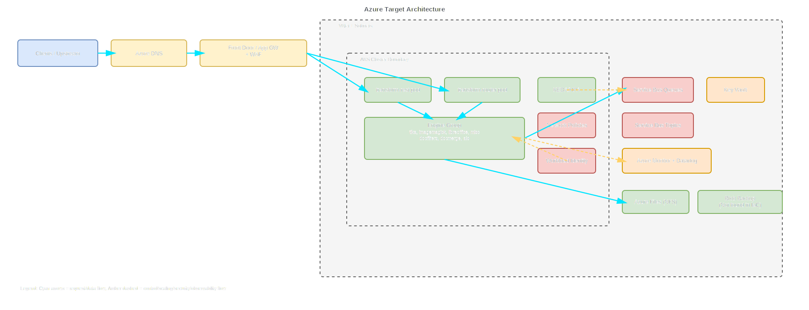

# Multi-Cloud Migration Decision Report (Directional)

## 1. Executive Summary
The analyzed AWS footprint is a queue-driven document transformation platform centered on EKS (Kubernetes 1.33), per-environment SQS queue sets, SNS request/reply topics, KEDA-based autoscaling, ALB/WAF ingress, KMS-backed encryption, EFS shared storage, and Datadog observability. Directional analysis across US/EU/AU indicates both Azure and GCP are viable, with GCP showing slightly lower projected run-rate for messaging+compute-heavy steady workloads, while Azure offers lower migration friction for identity/governance transition patterns commonly used in enterprise landing zones. Recommended path: phased Azure-first migration with a bounded GCP cost benchmark pilot in parallel for queue+autoscaling workloads before committing long-term platform standardization.

Recommended path: **Azure-first phased migration with GCP benchmark lane**.

## 2. Source Repository Inventory
| Repository | Branch | Scope Searched | File Count in Scope | Notes |
|---|---|---|---|---|
| HylandSoftware/hxp-transform-service | main | src/, infra/, terraform/ + architecture docs and helm references | Not fully enumerated via snippet API | Application and deployment docs confirm SQS/SNS messaging, queue-based scaling behavior, Datadog integration, EKS deployment model. |
| HylandSoftware/terraform-aws-hxts-environment | main | src/, infra/, terraform/ (.tf/.tfvars/helm) | Not fully enumerated via snippet API | Terraform root for per-environment queues, KMS key, Helm releases (`hxts`, `keda_scalers`), engine queue topology and scaling parameters. |
| HylandSoftware/tf-cfg-hxts-infrastructure | main | src/, infra/, terraform/ (.tf/.tfvars) | Not fully enumerated via snippet API | EKS base/add-ons/shared services: Karpenter 1.10.0, ALB/WAF/Route53/ACM, EFS, Velero backup replication, IAM/IRSA patterns. |

## 3. Source AWS Footprint
| Resource Group | Key AWS Services Found | Notes |
|---|---|---|
| Compute | EKS 1.33, Karpenter, EC2 m5.xlarge node pools | EKS cluster with autoscaled nodes; Karpenter provisioner present in infra config. |
| Networking | VPC private/public subnets, ALB, Route53, WAFv2, ACM | Public ingress routed via ALB+WAF with Route53 records and ACM certificates. |
| Data | EFS, S3 (Velero backup buckets/replication), EBS (encrypted) | Shared file path via EFS; DR backup through Velero bucket replication. |
| Messaging | SQS (approx. 28 queues/environment), SNS request/reply topics | Queue-per-engine + batch queue topology; SNS->SQS subscription policies and environment routing. |
| Identity/Security | IAM roles, IRSA/service-account role patterns, KMS, Secrets Manager, network policies | KMS rotation enabled; queue/topic and storage encryption present; Kubernetes network policy enabled. |
| Observability | Datadog, CloudWatch (WAF logging) | Datadog agents and tags in Helm/Terraform; WAF CloudWatch logging configured. |
| Storage | EFS CSI, S3 backup replication | EFS for temporary/shared workload exchange; S3 replication for DR posture. |

## 4. Service Mapping Matrix
| AWS Service | Azure Equivalent | GCP Equivalent | Porting Notes |
|---|---|---|---|
| EKS | AKS | GKE | Workload manifests/Helm portable; cluster policy, ingress class, and identity wiring differ. |
| Karpenter | AKS Node Auto Provisioning / Cluster Autoscaler | GKE Cluster Autoscaler + node auto-provisioning | Behavior parity achievable but tuning and quotas differ by cloud. |
| SQS | Service Bus Queues | Pub/Sub Subscriptions | SQS semantics vs Pub/Sub acknowledgment/retry model need replay testing. |
| SNS | Service Bus Topics | Pub/Sub Topics | Topic fan-out and filtering require redesign of message attributes/filters. |
| Route53 | Azure DNS | Cloud DNS | DNS migration straightforward; staged cutover with TTL reduction recommended. |
| ALB | Application Gateway / Front Door | HTTPS Load Balancer | Path-based routing mostly portable; rewrite and health-probe behavior differs. |
| WAFv2 | WAF on App Gateway/Front Door | Cloud Armor | Managed rule set parity requires control testing for false positives. |
| ACM | Key Vault Certificates / managed certs | Certificate Manager | Lifecycle/renewal workflows change by platform control plane. |
| KMS | Key Vault Keys | Cloud KMS | Crypto policy translation required (rotation, grants, app identity bindings). |
| Secrets Manager | Key Vault Secrets | Secret Manager | Secret retrieval integration changes with workload identity model. |
| EFS | Azure Files (NFS) / ANF | Filestore | Latency/throughput benchmarks needed for temporary file-heavy transforms. |
| Datadog + CloudWatch | Azure Monitor + Datadog | Cloud Operations + Datadog | Log schema mostly portable; alerting and SLO dashboards need re-baselining. |
| Velero S3 backup replication | Azure Backup + Blob replication | Backup for GKE + GCS replication | DR tooling can be retained conceptually but backend object services differ. |

## 5. Regional Cost Analysis (Directional)

Directional monthly run-rate estimates (USD, steady with moderate burst) for platform capabilities:

| Capability | Azure US | Azure EU | Azure AU | GCP US | GCP EU | GCP AU | Confidence |
|---|---:|---:|---:|---:|---:|---:|---|
| Kubernetes Compute (cluster + nodes + autoscaling headroom) | 34,000 | 36,500 | 41,000 | 32,500 | 35,000 | 40,500 | Medium |
| Messaging (queues/topics + request/reply traffic) | 6,500 | 7,000 | 7,800 | 5,800 | 6,300 | 7,400 | Medium |
| Storage + Backup (shared fs + object backup/replication) | 8,900 | 9,400 | 10,700 | 8,200 | 8,900 | 10,300 | Medium |
| Networking + Edge (LB/WAF/DNS/egress) | 10,800 | 11,400 | 12,600 | 10,100 | 10,900 | 12,300 | Medium |
| Observability + Security tooling | 7,200 | 7,300 | 7,900 | 7,000 | 7,200 | 7,800 | Medium |
| Platform Ops/Control Plane overhead | 4,200 | 4,400 | 4,800 | 4,000 | 4,200 | 4,700 | Medium |
| **Estimated Monthly Total** | **71,600** | **76,000** | **84,800** | **67,600** | **72,500** | **83,000** | **Medium** |

One-time migration cost (directional, 24-month plan horizon):
- Azure-first path: USD 1.6M to 2.1M (platform rebuild, message contract hardening, migration tooling, validation).
- GCP-first path: USD 1.7M to 2.3M (additional semantic transition/testing effort around messaging and ops controls).

Assumptions and unit economics used:
- Traffic profile assumed steady with moderate burst; baseline queue throughput from current per-engine queue topology.
- Availability target 99.9%, DR target RTO 4h / RPO 30m.
- Multi-environment footprint approximated from sandbox/dev/staging/prod/prod-eu patterns.
- Node shape baseline derived from observed m5.xlarge usage and autoscaling envelopes.
- Messaging unit economics modeled by request/reply topic + multi-queue fan-out patterns.
- Prices are directional public-rate style estimates and not contractual quotes.

## 6. Migration Challenge Register
| Challenge | Impact | Likelihood | Mitigation | Owner Role |
|---|---|---|---|---|
| SQS/SNS semantics to target messaging service mismatch | High | High | Build replay harness and compare ordering/duplication/idempotency behavior per engine queue. | App Architect |
| IRSA-to-workload-identity translation | High | Medium | Define identity ADR first; map service account scopes to target cloud identities. | Security Architect |
| EFS replacement performance risk for temporary file exchange | High | Medium | Benchmark representative transforms on Azure Files/ANF and Filestore before cutover. | Platform Engineer |
| WAF rule portability and false-positive drift | Medium | Medium | Recreate rule sets in pre-prod with synthetic and production-like traffic replay. | Security Engineer |
| DR workflow parity (Velero/S3 replication equivalent) | Medium | Medium | Implement backup/restore game days with RTO/RPO evidence collection. | SRE Lead |
| Operational retraining (AKS/GKE operations, incident playbooks) | Medium | High | Structured enablement and dual-run period with paired ops squads. | Platform Lead |

## 7. Migration Effort View
| Capability | Effort (S/M/L) | Risk (L/M/H) | Dependencies |
|---|---|---|---|
| Compute and orchestration (EKS -> AKS/GKE) | M | M | Landing zone readiness, policy baselines, node autoscaling policy.
|
| Messaging transformation | L | H | Contract tests, idempotency strategy, subscriber behavior equivalence. |
| Identity and security controls | L | H | Workload identity model, key/secrets governance, IAM role decomposition. |
| Storage and data movement | M | M | File-system benchmark results, backup target validation. |
| Networking and ingress edge | M | M | DNS cutover plan, WAF parity, cert lifecycle migration. |
| Observability and SRE operations | M | M | Dashboard and alert parity, incident runbook updates. |
| Compliance and residency controls | M | M | Regional data boundaries, audit evidence mapping. |

## 8. Decision Scenarios

### Cost-first scenario
Primary target: GCP.
- Rationale: lower directional monthly run-rate in US/EU with similar architecture shape.
- Trade-off: higher migration uncertainty around messaging semantics and ops adaptation.
- Fit: strongest if cost pressure dominates and migration can tolerate extra validation cycles.

### Speed-first scenario
Primary target: Azure.
- Rationale: lower enterprise migration friction for identity/governance and broad managed service parity.
- Trade-off: slightly higher directional run-rate than GCP in this workload profile.
- Fit: strongest when delivery timeline and program predictability are primary constraints.

### Risk-first scenario
Phased multi-cloud: Azure primary lane + GCP bounded benchmark.
- Rationale: reduce migration risk through staged Azure cutover while preserving commercial leverage and future optionality.
- Trade-off: temporary dual-platform overhead during benchmark phase.
- Fit: preferred for this workload due to messaging and DR complexity.

## 9. Recommended Plan (30/60/90)

### 30 days
- Finalize architecture decisions (ADRs): identity model, messaging semantics, shared file-store strategy, DR design.
- Build migration test harness: queue replay, transform output comparison, latency/SLO baseline.
- Stand up target landing zones (Azure primary; optional GCP benchmark foundation).

### 60 days
- Deploy pilot environment with full request/reply flow (rest/router/engine pods, autoscaling, observability).
- Validate non-functional requirements: 99.9% availability, RTO/RPO drills, residency controls.
- Run controlled shadow traffic and compare correctness/performance against AWS baseline.

### 90 days
- Execute phased production cutover by environment with rollback gates.
- Harden operations: alert parity, on-call runbooks, incident workflows.
- Close benchmark and decide long-term platform standardization (Azure-only or sustained dual-cloud posture).

Required architecture decisions before execution:
- Message contract equivalence and idempotency strategy.
- Workload identity and key/secrets governance model.
- Shared file-store implementation and performance envelope.
- DR implementation proof meeting RTO 4h and RPO 30m.

## 10. Open Questions
- Are there country-specific residency constraints beyond US/EU/AU regions?
- Is active-active required for any production flows or is active-passive sufficient?
- Which transform flows require strict ordering guarantees vs eventual consistency?
- What is the acceptable maintenance/cutover window per environment?
- Are there contractual or strategic constraints that mandate Azure or GCP preference?

## 11. Component Diagrams
Draw.io artifact path:
- [Reports/multi-cloud-migration-diagrams-20260414-193500-utc.drawio](multi-cloud-migration-diagrams-20260414-193500-utc.drawio)

SVG file paths:
- AWS Source: [Reports/multi-cloud-migration-diagrams-20260414-193500-utc-aws-source.svg](multi-cloud-migration-diagrams-20260414-193500-utc-aws-source.svg)
- Azure Target: [Reports/multi-cloud-migration-diagrams-20260414-193500-utc-azure-target.svg](multi-cloud-migration-diagrams-20260414-193500-utc-azure-target.svg)
- GCP Target: [Reports/multi-cloud-migration-diagrams-20260414-193500-utc-gcp-target.svg](multi-cloud-migration-diagrams-20260414-193500-utc-gcp-target.svg)

Embedded diagrams:

Legend and auditable component coverage:
- AWS Source page: clients/upstream, DNS/domain, ingress edge, VPC/subnets, EKS boundary, rest/router/engine group, KEDA, network policies, Kubernetes secrets, SQS, SNS, KMS, Secrets Manager, Datadog, EFS, Velero/S3 replication, and key request/messaging/scaling/observability flows.
- Azure Target page: equivalent client-edge-network-cluster topology, service pods, queue/topic messaging, workload identity, key management, storage/backup placeholders, and observability/control flows.
- GCP Target page: equivalent client-edge-network-cluster topology, service pods, Pub/Sub messaging, workload identity, KMS/secrets, storage/backup placeholders, and observability/control flows.

Page mapping:
- AWS Source: current-state architecture.
- Azure Target: recommended migration target.
- GCP Target: alternative migration target.

Note: Mermaid blocks are intentionally not embedded in this report.
